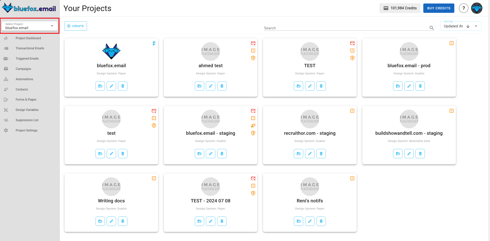

# Projects

In BlueFox Email, you can create projects for each client or brand. For each project, you need to set up at least one sending email address. You can also connect external sending providers if needed.

## What Each Project Includes

Every project in BlueFox Email includes:
- [Transactional emails](./transactional-emails)
- [Triggered emails](./triggered-emails)
- [Campaigns](./campaigns)
- [Automations](./automations)
- [Contacts](./contacts)
- [Forms & Pages](./forms-and-pages)
- [Email Themes](./email-theme-settings)
- [Suppression Lists](./suppression-list)
- [Project settings](./settings)

Each project comes with a subscription preferences page, which you can set up under the [subscriber lists](./contacts) tab.

## Navigating to Projects

You can find the projects section by clicking the drop down icon on the left-hand side.

## Free vs. Premium Projects

Projects are free by default, but they include BlueFox Email's logo and a link to our website in the email footers.

::: tip Upgrade for Whitelabel
Upgrade your project to premium to remove our logo and link from your email footers.
:::

Premium projects have a premium flag:

## Project Warnings

If your project configuration isn't complete, you'll see warnings. Hover over the warning icons for more details. Most issues can be resolved in the project's settings tab.

## Inside a Project

When you enter a project, you'll see a tabbed view with all the project-related sections:

These tabs include:
- [Transactional emails](./transactional-emails)
- [Triggered emails](./triggered-emails)
- [Campaigns](./campaigns)
- [Automations](./automations)
- [Contacts](./contacts)
- [Forms & Pages](./forms-and-pages)
- [Email Themes](./email-theme-settings)
- [Suppression Lists](./suppression-list)
- [Project settings](./settings)

Remember, the subscription preferences page is under the [Forms & Pages](./forms-and-pages) tab.
