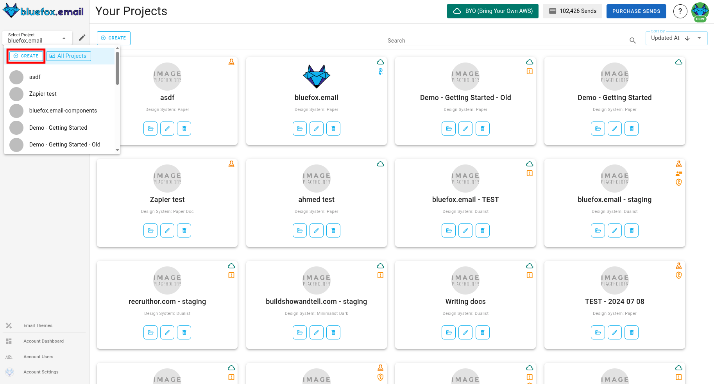
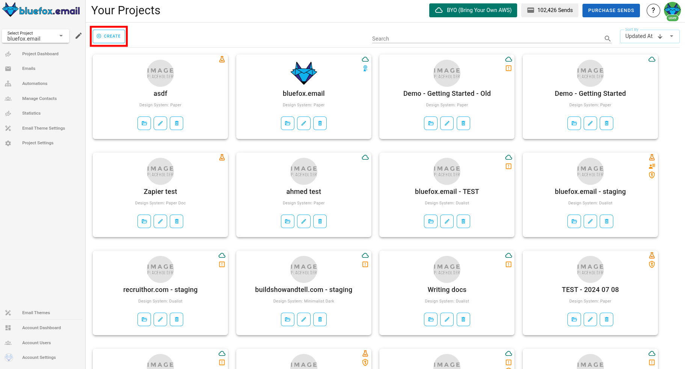
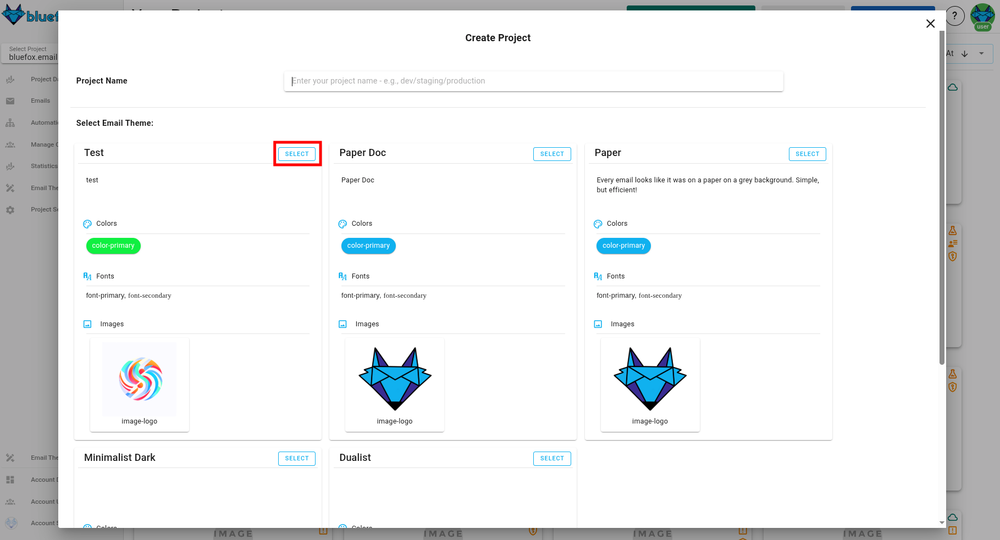
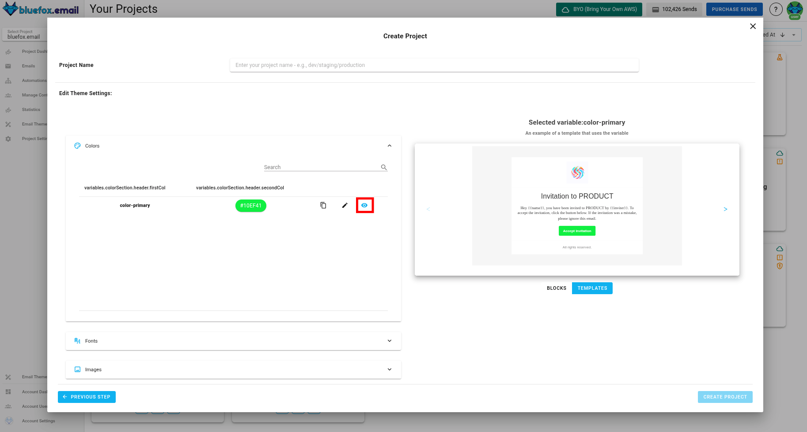
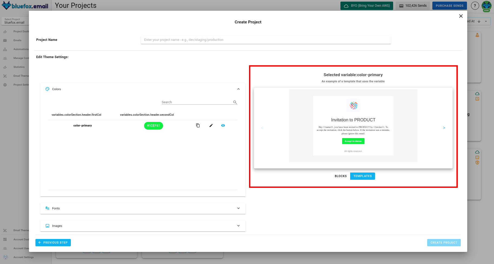

# Creating a New Project

You can create a new project by clicking the drop-down in the top-left corner and then `Create` button.

You can also click on the `Create` button in projects section to create new project.

:::info Note 
A new project is always created in a [Sandbox mode](/docs/projects/delivery-modes#sandbox-mode). You can send emails only to verified email addresses and domains. To lift this restriction, you need to [request production access](/docs/projects/delivery-modes#production-mode).
:::

## Select a Email Theme

After entering your project's name, select an email theme. We offer multiple built-in email themes, or you can [create your own](/docs/email-themes/).

::: warning
If you don't like the email theme you selected, you can come back to this step later.
However, once a project is created with an email theme, it will remain as it is **forever**. If you need a different email theme, create a new project with the desired email theme.
:::

## Set the Email Theme Basics

::: tip Optional Step
You can skip this step and do it later if you prefer.
:::

Each email theme has variables that you can customize, like colors, images, fonts, links, and texts.

You can override the default values for these variables in each project.

### Required and Optional Variables

- **Required variables** (e.g., logo, primary and secondary colors) must be set during project creation.
- **Optional variables** (e.g., neutral colors like dark or light grey) can be set later.

To see examples of how a variable is used, click the eye icon:

You will see where the selected variables appear in blocks and templates on the right-hand side:

## Finalizing Your Project

After clicking the create button, your project will be populated with templates from the email theme, so you don't have to start from scratch. You can add or remove templates anytime.

After you created your project, you need to go to the project's settings page and do the following steps:
- [connect with your AWS account](/docs/projects/settings.html#aws-credentials) (always required)
- [create an API key](/docs/projects/settings.html#api-keys) (optional, only needed if you want to send transactional or triggered emails)
- [add domains to the whitelist](/docs/projects/settings.html#domain-whitelists) (optional, only needed if you want to add or remove subscribers from your frontend)
- [set up bounce and complaint webhooks](/docs/projects/settings.html#bounce-complaint-webhooks) (optional BUT highly recommended)

