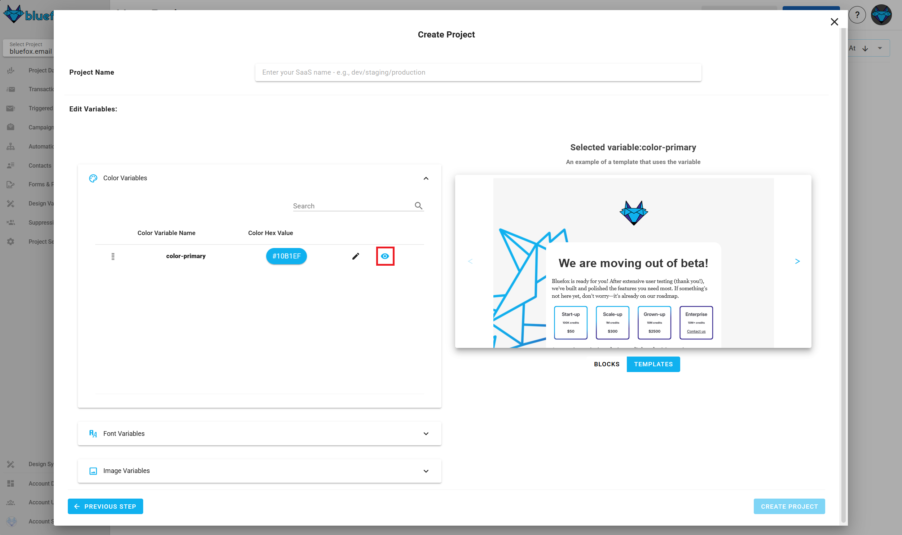
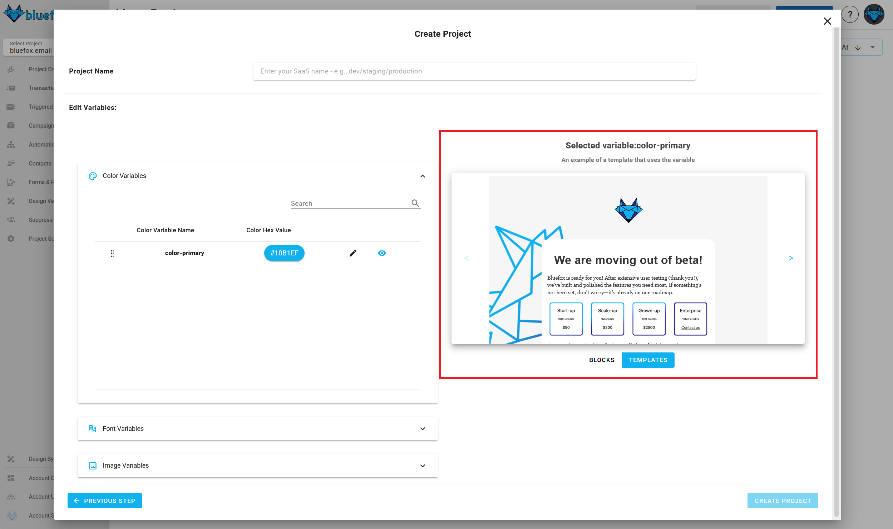

# Creating a New Project

You can create a new project by clicking the `Create` button in the top-left corner of the projects view.

## Select a Design System

After entering your project's name, select a design system. We offer multiple built-in design systems, or you can [create your own](/docs/design-systems/).

::: warning
If you don't like the design system you selected, you can come back to this step later.

However, once a project is created with a design system, it will remain as it is **forever**. If you need a different design system, create a new project with the desired design system.
:::

## Set the Design System Variables

::: tip Optional Step
You can skip this step and do it later if you prefer.
:::

Each design system has variables that you can customize, like colors, images, fonts, links, and texts.

You can override the default values for these variables in each project.

### Required and Optional Variables

- **Required variables** (e.g., logo, primary and secondary colors) must be set during project creation.
- **Optional variables** (e.g., neutral colors like dark or light grey) can be set later.

To see examples of how a variable is used, click the eye icon:

You will see where the selected variables appear in blocks and templates on the right-hand side:

## Finalizing Your Project

After clicking the create button, your project will be populated with templates from the design system, so you don't have to start from scratch. You can add or remove templates anytime.

After you created your project, you need to go to the project's settings page and do the following steps:
- [connect with your AWS account](/docs/projects/settings.html#aws-credentials) (always required)
- [create an API key](/docs/projects/settings.html#api-keys) (optional, only needed if you want to send transactional or triggered emails)
- [add domains to the whitelist](/docs/projects/settings.html#domain-whitelists) (optional, only needed if you want to add or remove subscribers from your frontend)
- [set up bounce and complaint webhooks](/docs/projects/settings.html#bounce-complaint-webhooks) (optional BUT highly recommended)

