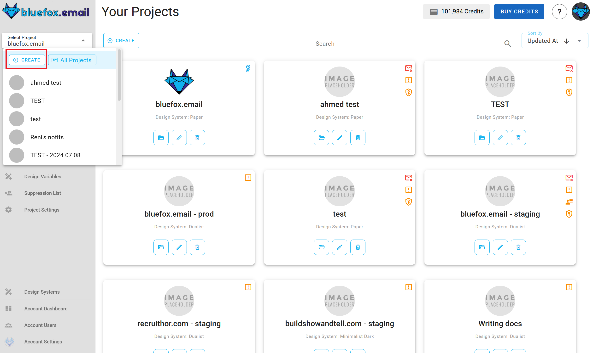
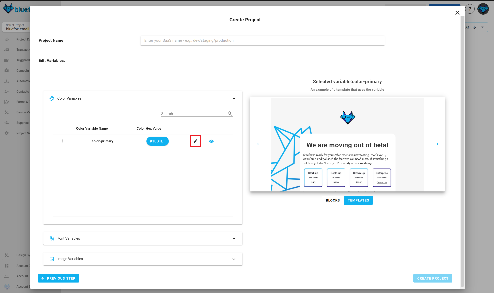

# Creating a new project

You can create a new project by clicking on the `Create` button on the top-left corner of the projects view.

## Select a design system

Once you entered your project's name, you have to select a design system for your project. We offer multiple built-in design systems, but you can also [create your own](/docs/design-systems/).

::: warning
If you don't like the design system you selected, you can come back to this step later.

BUT...

If you have created a project with a design system, then it will stay as it is **forever**. If you need to change the design system of your emails, we suggest to create a new project with another design system.
:::

## Set the design system variables

::: tip Optional step
This is an optional step. You can skip it, and do it later.
:::

Each design system has variables with which you can customize its look and feel. These can be colors, images, font families, links, and texts.

You can override the default values of these variables in each project:

There are **required** design system variables, that you have to set up during project creation. These are for example: logo, primary, secondary colors, etc. **Optional** variables cannot be set up at this step, but you can modify them later on. Some examples for optional variables are neutral colors, such as dark or light grey.

If you want to see examples of a certain variable's usage, click on the eye icon:

You will see the occurences of the selected variables in blocks and templates on the right hand side:

After you click on the create button, your project will be populated with templates from the design system, so you don't have to create them from zero.

You can add or remove templates any time you want.
