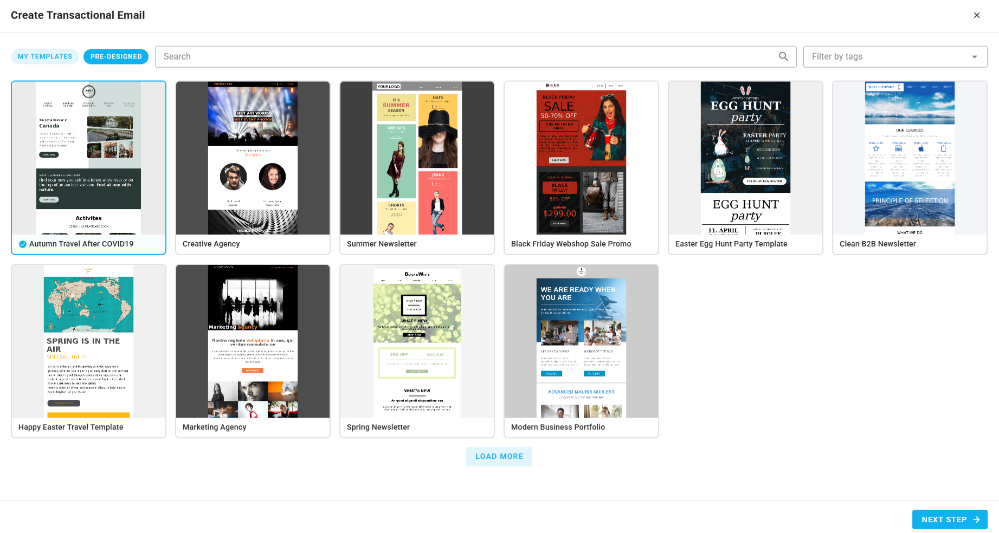

# Pre-designed Templates

Pre-designed templates are professionally built email layouts provided by BlueFox Email. They give you a polished starting point when creating a new transactional email, triggered email, or campaign, no design system setup required.

Unlike [design system templates](/docs/email-themes/templates), which come from your project's own email theme, pre-designed templates are available to all projects out of the box.

## Using Pre-designed Templates

Pre-designed templates appear during the email creation flow, after you choose to start from a template. The option is available wherever you create an email, including transactional emails, triggered emails, campaigns, and automations.

In every case, select a template and click **Next** to continue setting up the email name, subject line, and preview text. The table below shows how to reach pre-designed templates in each flow and where to continue from afterward:

| Where | How to reach it | Continue from |
|-------|-----------------|---------------|
| Transactional email | Select a template category, then switch to pre-designed templates | [Transactional Emails](/docs/projects/transactional-emails#creating-a-transactional-email) |
| Triggered email | Switch to pre-designed templates on the template step | [Triggered Emails](/docs/projects/triggered-emails#creating-a-triggered-email) |
| Campaign | Browse pre-designed templates on the template selection screen | [Campaigns](/docs/projects/campaigns#creating-a-campaign) |
| Automation | In a **Send Email** or **Notify** node, click **Create Email** | [Automations](/docs/projects/automations#send-email-node) |

For example, when creating a transactional email, after selecting a template category from your design system, you can switch to pre-designed templates:

## Editing After Selection

Once you select a pre-designed template and launch the editor, you can modify any part of the email using the [drag-and-drop email builder](/docs/projects/email-builder). The template is just a starting point, all content, layout, and styling is fully editable.
