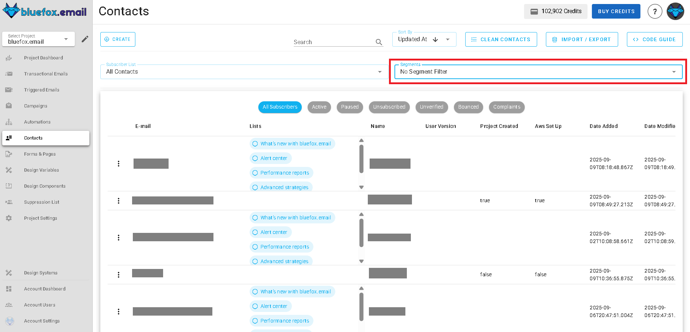
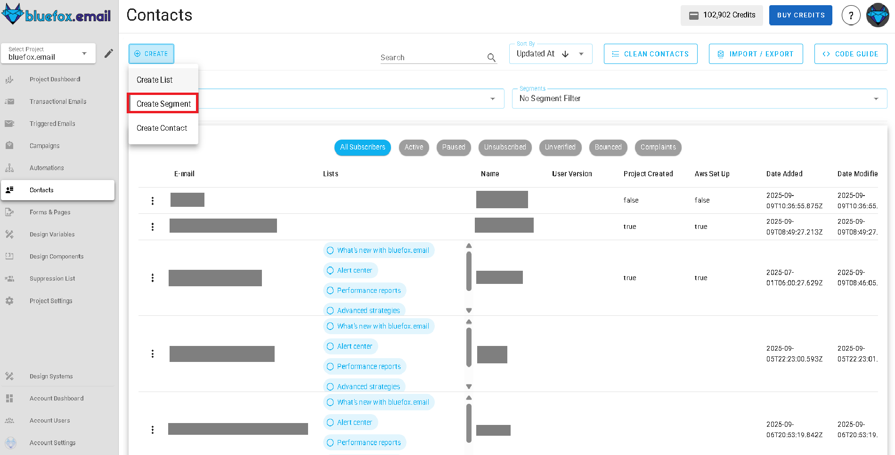
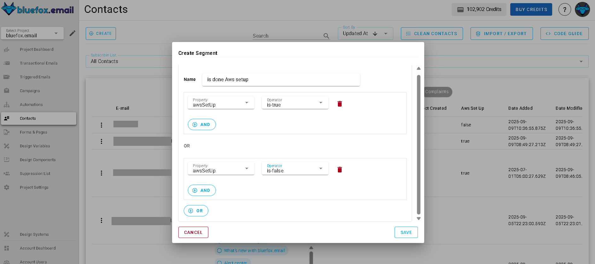
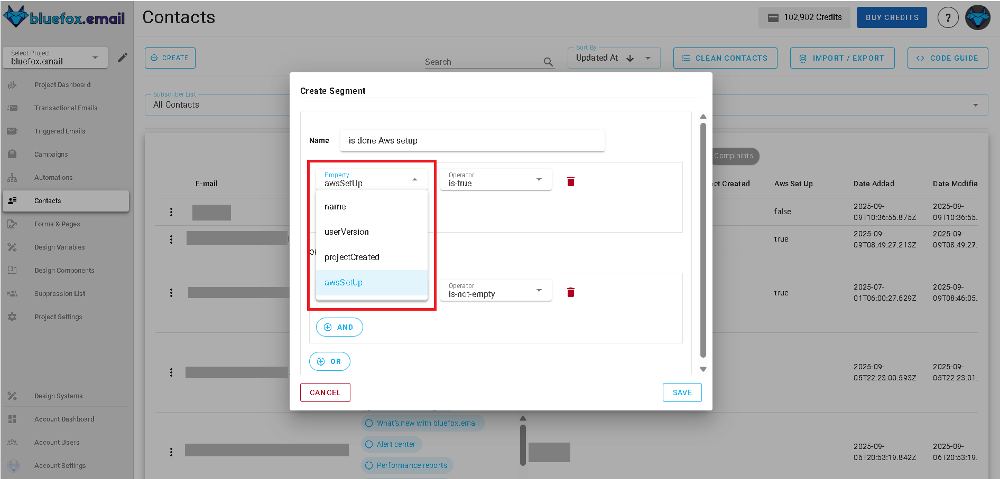
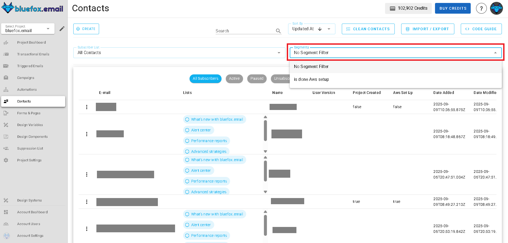
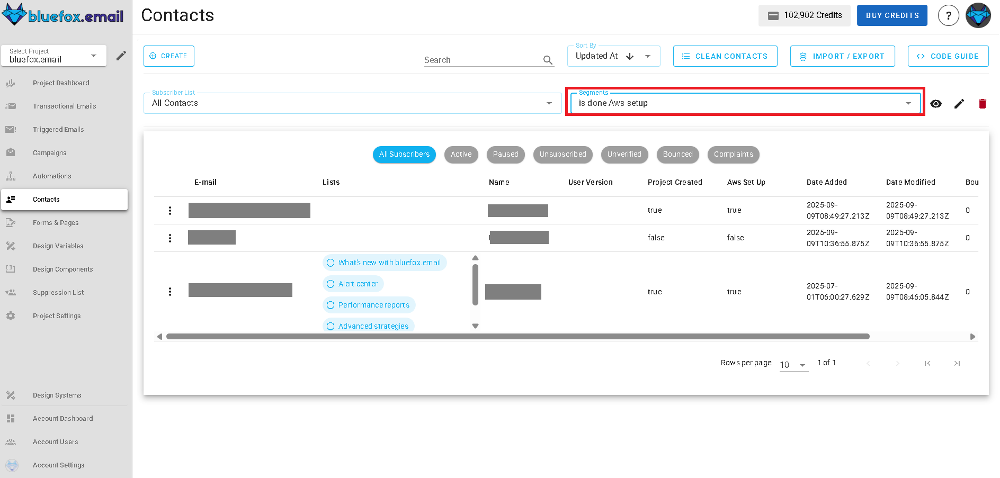
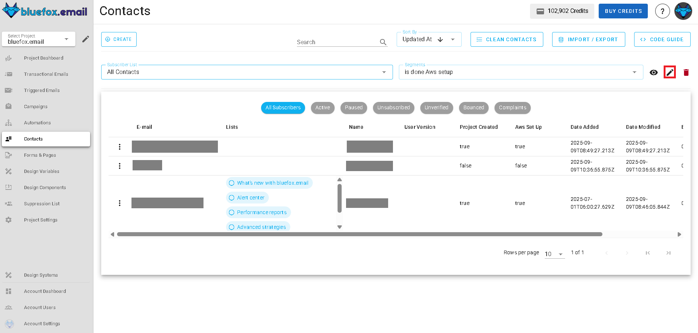
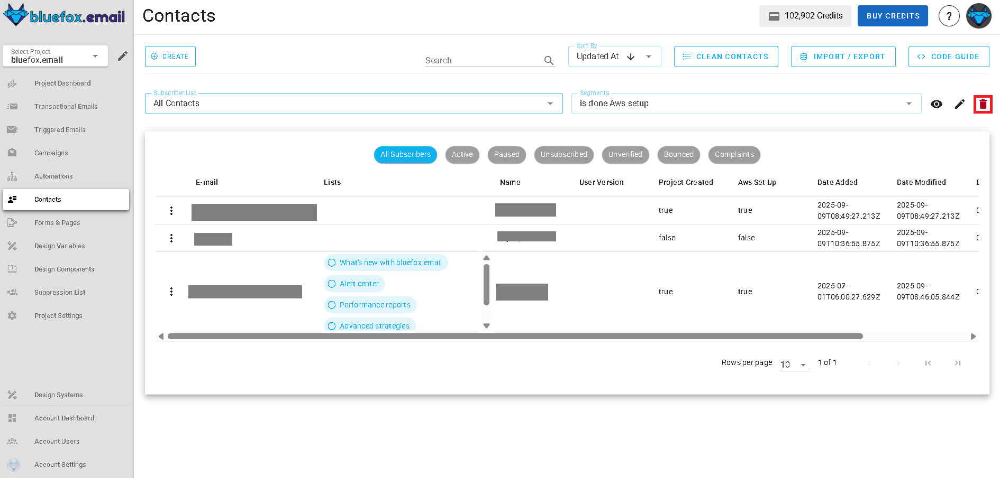

# Segments

Segments allow you to create targeted groups of contacts based on specific conditions and criteria. Instead of sending emails to your entire list, segments help you deliver more relevant and personalized content by filtering contacts based on their properties, behaviors, or characteristics. This precision targeting leads to better engagement rates and more effective email campaigns.

With bluefox.email's segment feature, you can build complex filtering logic using AND/OR conditions, apply segments to any subscription list or all contacts, and seamlessly integrate them into your campaigns and automations for highly targeted messaging.

You can find your project's segments under the **Segments** drop-down menu in [**Contacts**](./contacts.md) section:

## Creating a Segment

To create a new segment, click the **Create** button and then **Create Segment** in the drop-down menu.

When creating a segment, you'll need to:
- **Name**: Give your segment a descriptive name (e.g., "Premium Users", "Recent Signups", "Inactive Subscribers")
- **Conditions**: Define the filtering criteria that contacts must meet to be included in the segment. You can add multiple conditions and group them using AND/OR logic.

## Segment Filtering Logic

Segments use a powerful condition-based filtering system that supports both **AND** and **OR** logic operations. This allows you to create simple or complex targeting rules to precisely identify the contacts you want to reach.

### AND Logic
When conditions are joined with **AND** logic, contacts must meet **all** specified conditions to be included in the segment.

**Example**: Premium users who signed up in the last 30 days
- Condition 1: `projectCreated` is true
- **AND**
- Condition 2: `awsSetup` is true

### OR Logic
When conditions are joined with **OR** logic, contacts need to meet **at least one** of the specified conditions to be included in the segment.

**Example**: Contacts who are either premium users or have made a recent purchase
- Condition 1: `name` equals `BlueFox Email`
- **OR**
- Condition 2: `projectCreated` is true

## Available Filter Conditions

Segments can filter contacts based on various operators applied to contact properties. Here are the available condition types:

### Contact Properties
- **name**
- **userVersion**
- **awsSetup**
- **projectCreated**

### Operators
- **Equals**
- **Does Not Equal**
- **Contains**
- **Does Not Contain**
- **Is Empty**
- **Is Not Empty**
- **Greater Than**
- **Less Than**
- **Greater Than or Equal**
- **Less Than or Equal**

To see your contacts that match the segment conditions, click the **Segments** tab and then choose your segment by its name. This will show you how many contacts currently fit the criteria you've set.

## Segment Application Scope

Segments can be applied to different contact scopes depending on your needs:

### All Contacts
Apply the segment filter to your entire contact database, regardless of list subscriptions. This is useful for:
- Broad behavioral targeting
- Cross-list segmentation
- General contact characteristics

### Specific Subscriber List
Apply the segment only to contacts within a particular subscriber list. This is ideal for:
- List-specific targeting
- Topic-based segmentation
- Maintaining list context while adding precision

## Managing Segments

### Editing Segments
You can modify segment conditions at any time by clicking on the segment name and then the pencil icon beside it. Changes will automatically update which contacts are included in the segment.

### Segment Preview
After saving a segment, you can preview condition logic. This helps you validate your filtering logic.

### Deleting Segments
To delete a segment, click the trash icon next to the segment name. Confirm the deletion when prompted.

:::warning Note: Deleting a segment does not delete the contacts within it; it only removes the segment definition.
:::