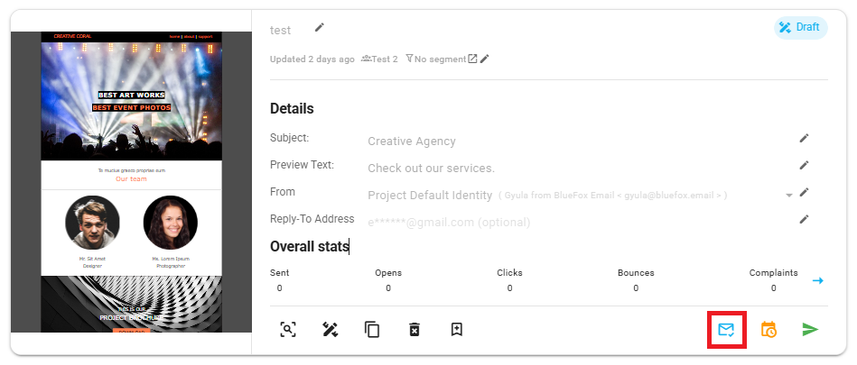
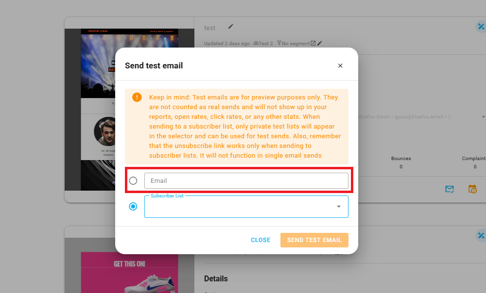
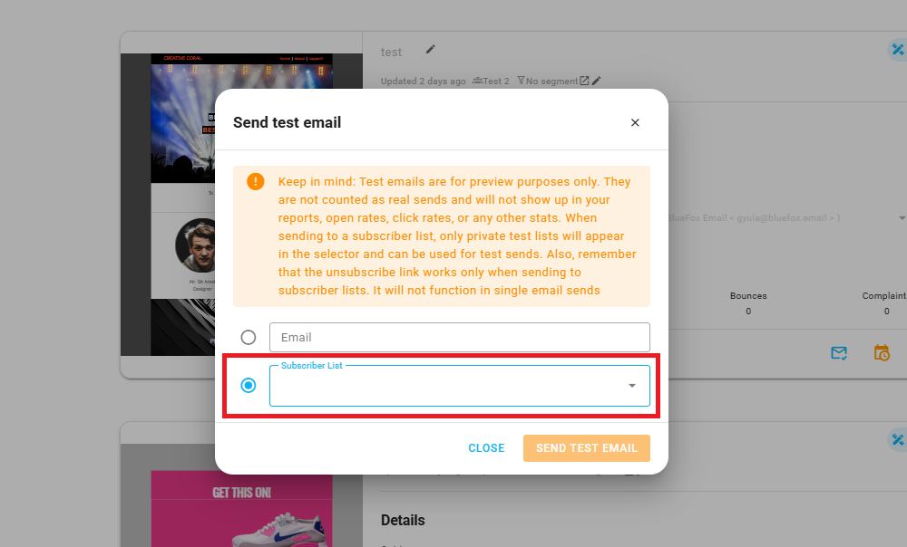

# Send Test Email

Before sending a [campaign](./campaigns.md), [triggered email](./triggered-emails.md), or [transactional email](./transactional-emails.md) to your entire audience, it's important to test it first. The send test email feature allows you to preview how your email will appear and verify that all personalization, links, and formatting are working correctly. You can send test emails to individual email addresses or to an entire private subscriber list, ensuring everything is perfect before hitting send.

## Why Test Emails Matter

Testing your emails before sending them to your full audience helps you:

- **Verify Content**: Ensure all text, images, and formatting display correctly across different email clients.
- **Check Personalization**: Confirm that merge tags and handlebars variables are rendering with actual data.
- **Test Links**: Validate that all links in your email are working and pointing to the correct destinations.
- **Review Layout**: Check how your email looks on different devices and screen sizes.
- **Catch Errors**: Identify and fix any spelling, grammar, or layout issues before they reach your audience.

## Accessing Send Test Email

You can access the send test email feature from your campaign, triggered email, or transactional email card. Look for the **Send Test** button in your email card.

## Sending a Test to an Individual Contact

To send a test email to a specific contact:

1. Click the **Send Test** button on your email card.
2. Select **Email** as the recipient type.
3. Enter the email address to whom you want to send the test email.
4. Click **Send**.

The test email will be sent immediately to the specified email address.

:::warning Keep in mind 
Test emails are for preview purposes only. They are not counted as real sends and will not show up in your reports, open rates, click rates, or any other stats. When sending to a subscriber list, only private test lists will appear in the selector and can be used for test sends. Also, remember that the unsubscribe link works only when sending to subscriber lists. It will not function in single email sends
:::

## Sending a Test to a Subscriber List

To send a test email to an entire subscriber list:

1. Click the **Send Test** button on your email card.
2. Select **Subscriber List** as the recipient type.
3. Choose the subscriber list from the dropdown menu.
4. Click **Send**.

The test email will be sent to all active subscribers in the selected list.

:::warning Keep in mind 
Test emails are for preview purposes only. They are not counted as real sends and will not show up in your reports, open rates, click rates, or any other stats. When sending to a subscriber list, only private test lists will appear in the selector and can be used for test sends. Also, remember that the unsubscribe link works only when sending to subscriber lists. It will not function in single email sends
:::

And thats it! This way you can easily test your emails before sending them to your entire audience.