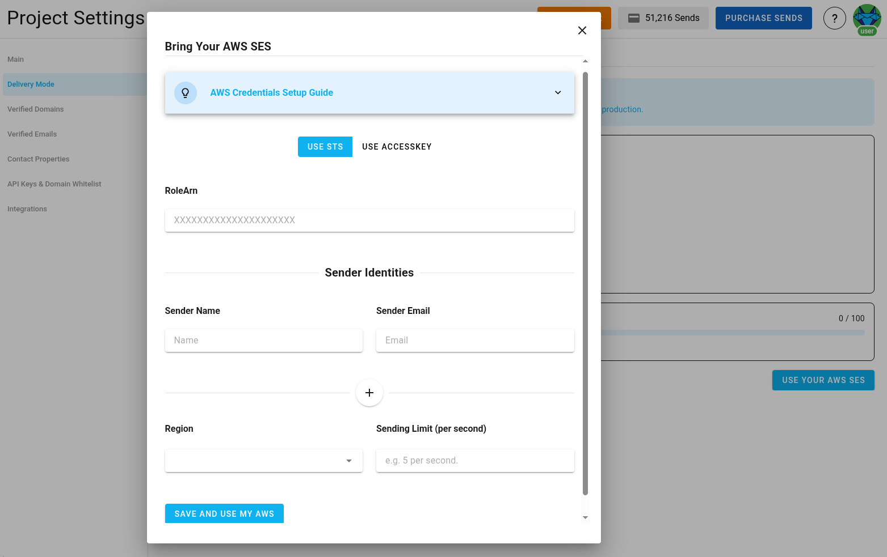
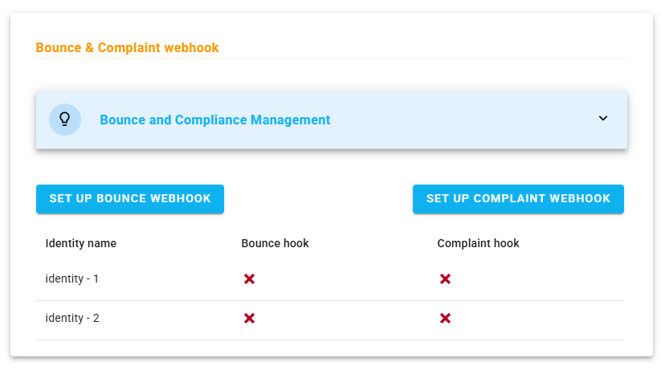
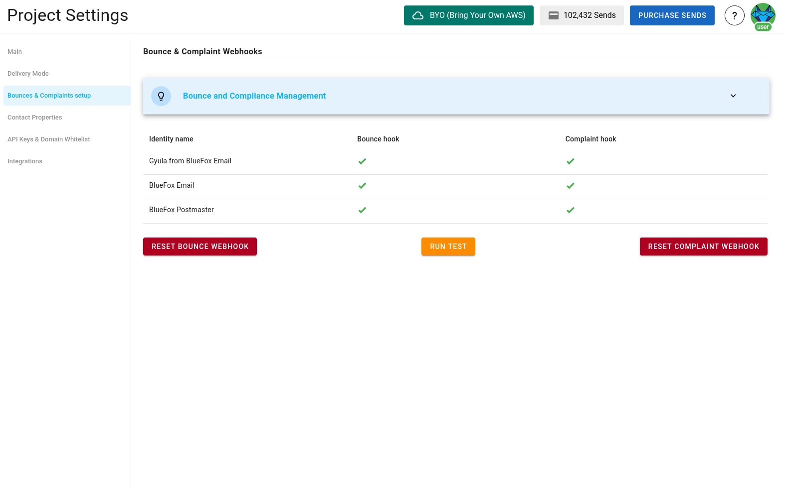
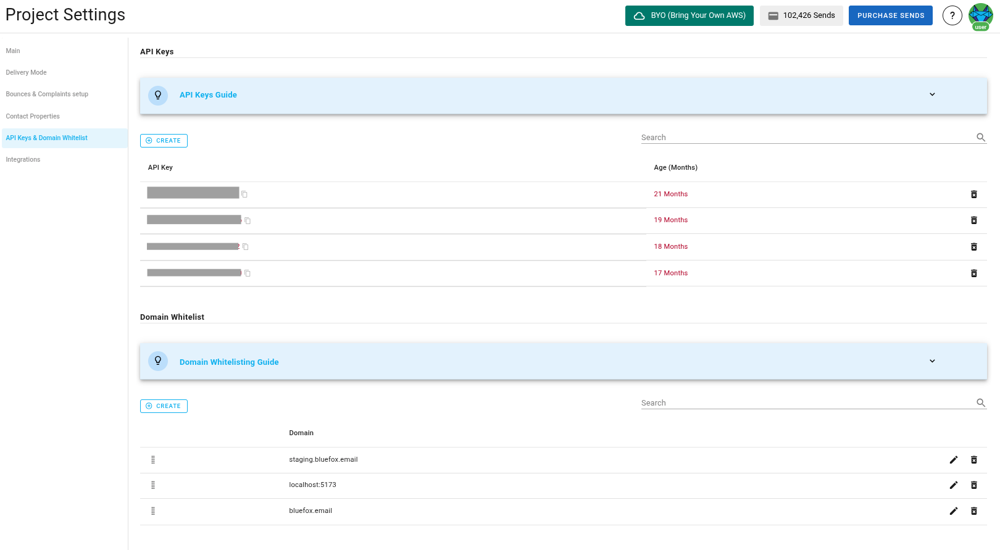

# Project Settings

To enable all the functionality provided by bluefox.email, you need to fill in all the project settings. If you want to use different domains or sending emails for different environments (e.g., staging or production), create separate projects for each environment.

## AWS Credentials

Our platform sends emails using your AWS SES, ensuring high deliverability and preventing spammers from using our platform.

First, set up your AWS `Access Key ID`, `Secret Access Key`, `Sending Email`, `AWS region`, and `sending limit`.



The access key must be able to send emails via SES from the region and the sending email you set up. The sending limit should be lower or equal to the actual AWS SES sending limit.

::: tip Your AWS Credentials Are Secure
We store your credentials encrypted, so even in the very unlikely event of data leakage, attackers won't be able to use your credentials.
:::

## Bounce & Complaint Webhooks

To know the [bounce and complaint numbers](/docs/projects/analytics) of your emails, set up our webhooks in AWS SNS.

To set up the hooks, press the setup buttons:



... and follow the instructions. After finishing, you should see this:



::: tip Upcoming Feature
We plan to introduce processes for bounces and complaints to automatically keep your lists clean. Currently, you need to analyze those numbers and manually keep your lists clean.
:::

## API Keys

To work with our [API](/docs/api/) from the server side, create at least one API key.

Include our API keys in the `Authorization` header of your HTTP requests as a bearer token.

```
Authorization: Bearer <API_KEY>
```


For bounces and complaints, it is added as a query string.

Periodically rotate sensitive info like API keys for security reasons. We use different colors to indicate the age of the API key as a reminder:
- Green: less than a month old
- Yellow: 1-6 months old
- Red: more than 6 months old



::: danger Security Warning
Since an API key is very sensitive information, never use it in your frontend code. Always use it from your backend.
:::

## Domain Whitelists

Some API endpoints also work from the frontend. Add your domains to the whitelist to prevent CORS errors.

For example, if you want to include signup forms on your blog or website without adding a signup route to your backend, directly call our backend from whitelisted domains.


