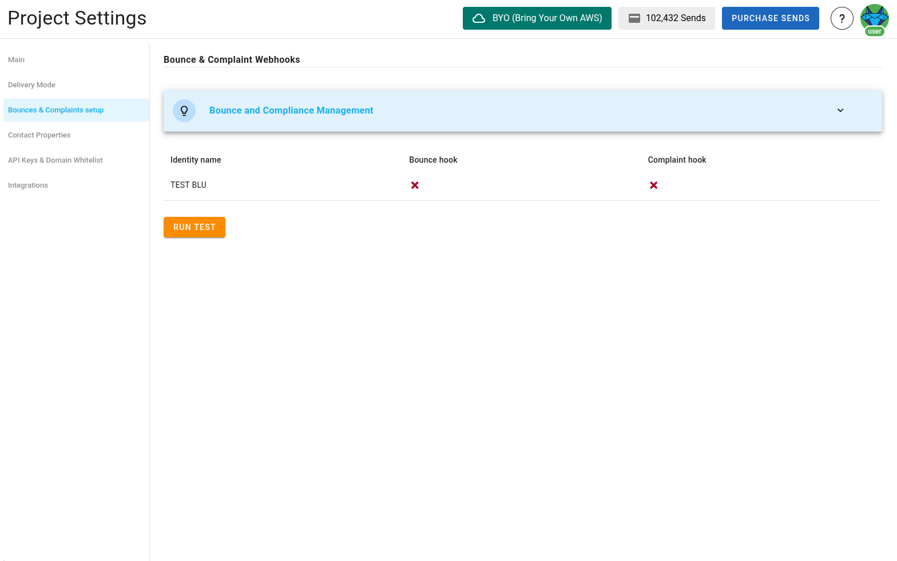
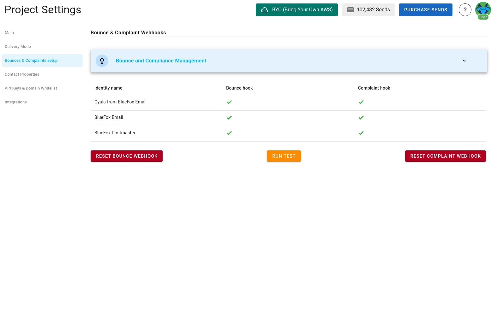
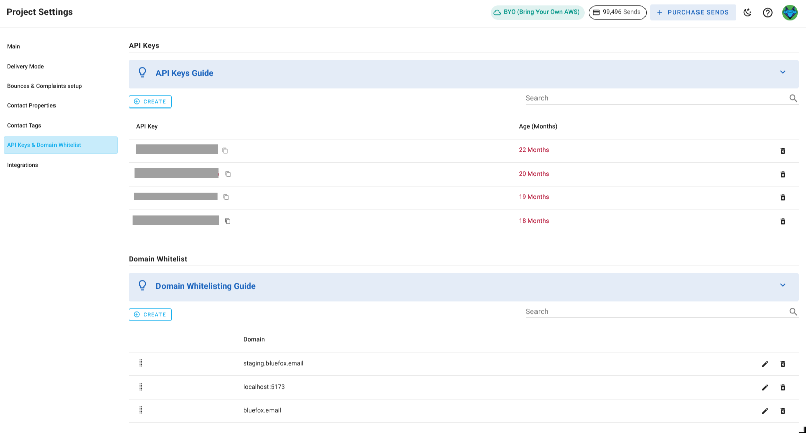
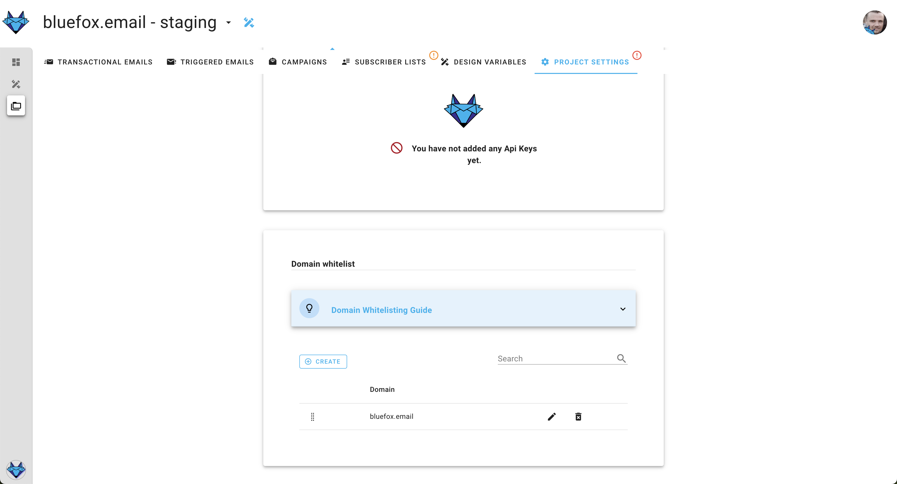

# Project settings

In order to enable all of the functionality provided by bluefox.email, you will have to fill in all of the project settings. If you want to use different domains and/or different sending emails in your environments (eg.: staging or production), we suggest to create separate projects for your environments.

## AWS credentials

As you know, our plaform sends out emails with your AWS SES. It ensures high deliverability and that spammers will not use our platform.

First of all, you will have to set up your AWS `Access Key ID`, your `Secret Access Key`, `Sending Email`, `AWS region` and  the `sending limit`.


The access key has to be able to send emails via SES from the region and the sending email you set up.

The sending limit should be lower or equal than the actual AWS SES sending limit.

::: tip Your AWS credentials are secure with us
We store your credentials encripted, so even in the very unlikely event of data leakage, attackers won't be able to use your credentials.
:::


## Bounce & complaint webhooks

If you want to know the [bounce and complaint numbers](/docs/projects/analytics) of your emails (which you should), you have to set up our webhooks in AWS SNS.

If you want to set up the hooks, just press the set up buttons:



... and follow the instructions. After you finished, you should see this:



::: tip Upcoming feature

We are planning to introduce processes for bounces and complaints, to automatically keep your lists clean, but currently, you will have to analyze those numbers and manually keep your lists clean.

:::


## API keys

In order to work with our [API](/docs/api) from the server side, you will need to create at least one API key.

Our API keys should be included in the `Authorization` header of your HTTP requests as a bearer token.

```
Authorization: Bearer <API_KEY>
```

In case of bounces and complaints, it is added as a query string.

Generally, sensitive info like API keys should be rotated periodically, because of information security reasons. That is why, we use different colors to identicate the age of the API key, as a reminder, that you might wanna rotate:
 - green: less than a month old
 - yellow: 1-6 months old
 - red: more than 6 months old



::: danger Security warning

Since an API key is a very sensitive information, you never ever should use it in your frontend code. Please always use it from your backend.

:::


## Domain whitelists

There are some API endpoints that also work from the frontend. You need to add your domains to the whitelist in order to prevent CORS errors.

For example, if you want to include signup forms in your blog or website, but you don't want to add a signup route to your backend, you can directly call our backend from those domains which are in the whitelist.


