# Project Settings

**Project settings** is where you configure everything that applies to a whole project in BlueFox Email: its logo and [email theme](../email-themes/), how mail is actually sent, the custom contact properties and tags your contacts can carry, the API keys and whitelisted domains your application uses to reach the project, and the definition of an unengaged contact. Every setting on this page is scoped to one project, so two projects in the same account can send from different domains, use different designs, and store completely different contact data.

<Primer>

- **Settings are per project, never account-wide.** For separate environments such as staging and production, create a separate project for each instead of editing one project's settings back and forth. Options that apply to your whole organization live in [Account Settings](../account-settings.md).
- **Clients with Editor access cannot open project settings.** They can do everything else inside the project, including creating and sending emails. Only Admins and Users reach this page. See [Account Users](../account-users.md#client-access-levels) for the full role breakdown.
- **Several actions here cannot be undone.** Switching the email theme permanently discards any theme variables you had overridden, even if you switch back. Deleting a contact property removes it from the contacts table and from the contact create/edit form, deleting a tag unassigns it from every contact that had it, and **Delete project** removes the project outright.
- **Some sections only appear in certain delivery modes.** *Bounces and Complaints Webhooks* is available only when the project uses your own AWS SES account. On BlueFox-managed sending, bounces and complaints are processed automatically. See [Delivery Modes](./delivery-modes.md).
- **API keys belong on your server only.** The domain whitelist authorizes requests coming from a browser; API keys authorize requests coming from your backend. Never ship an API key in frontend code.

<template #next>

[Verify your DNS records](/tools/deliverability/) · [Delivery Modes](/docs/projects/delivery-modes) · [Account Users](/docs/account-users)

</template>

</Primer>

To access the project settings, click on the **Settings** tab. Here, you can use the sub-menu to navigate to different sections of the project settings.

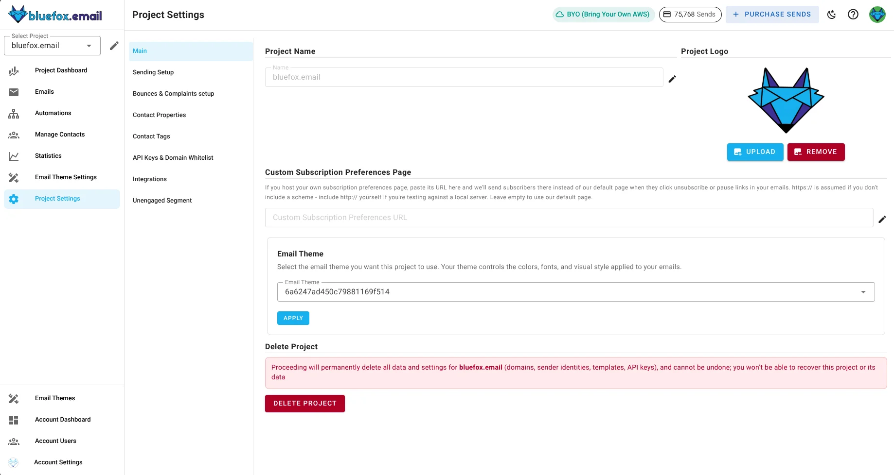

## Main Settings
Users can **add**, **update**, or **remove** a custom logo for their project. This logo will be displayed on the [**subscription preferences page**](./forms-and-pages.md#subscription-preferences-page) and [**double opt-in confirmation page**](./forms-and-pages.md#_7-double-opt-in-customization) success message to provide branding consistency.

To manage the project logo:

- **Add or update**: Click upload, select an image, and save.

- **Remove**: Click remove logo and confirm.
  
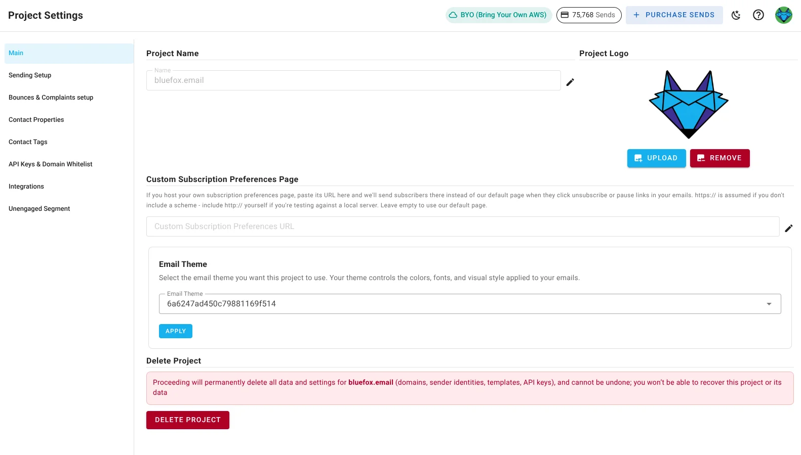

You can also change your email theme of the project in this section. Changing the email theme will update the design of all your emails. Your saved templates and blocks are tied to their original theme, they won't be accessible while on a different theme, but if you switch back, they will be available again. However, any overridden theme variables (such as colors or images) will be permanently lost, even if you switch back, those overriding values will not be restored.

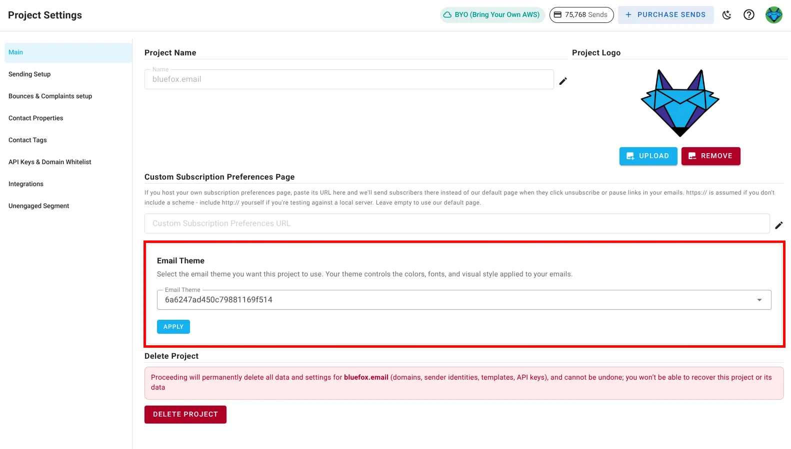

Users can also manage the project name in this section or delete the project entirely by clicking the **Delete project** button.

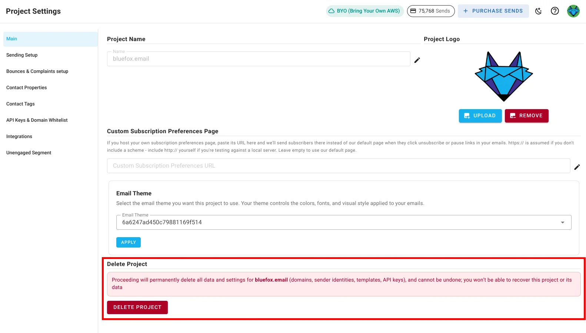


## Sending Setup

The **Sending Setup** section is where you choose how emails are sent from your project. So the default for every new project is **sandbox mode**. In this mode, you can start sending emails immediately but with some limitations. When you're ready for unrestricted sending, you can request to move your project to **production mode**. If you prefer to bring your own AWS SES account, you can do that too. 

For more details, see our [Delivery Modes documentation](/docs/projects/delivery-modes).

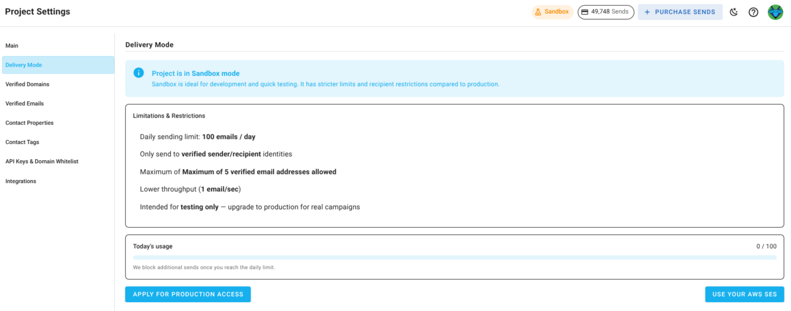


## Bounces and Complaints Webhooks

This feature is only available for projects using **Bring Your Own (BYO) AWS SES**. For other project types, BlueFox Email automatically handles [bounces](/email-sending-concepts/bounces) and [complaints](/email-sending-concepts/complaints).

To effectively manage email bounces and complaints, BlueFox Email provides webhook integration. This allows you to receive real-time notifications about these events, enabling you to take appropriate actions such as updating contact statuses or triggering follow-up processes. For the full list of events BlueFox Email can notify you about, see [Webhooks](/docs/integrations/webhooks).

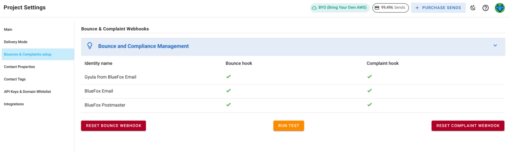

::: warning Keep in mind
If [bounce rate](/email-sending-concepts/bounce-rate) and complaint rates are not kept within acceptable limits, the BlueFox Email team can restrict the project or the whole account. The current thresholds are documented under [Maintaining Production Access](./delivery-modes.md#maintaining-production-access). See also [Account and Project Restrictions](../account-settings.md#account-and-project-restrictions).
:::

## Contact Properties

Contact properties allow users to define custom attributes for contacts at the project level. These properties appear in the **contacts** table and can be filled when adding or editing a contact.

### Add new Property
To add a new property, navigate to **project settings → contact properties**, click **create**, enter the property `name` and `type`, then save. The property will be available in the contact management interface.

Each contact property includes:

- **Property Name**: The user-defined name.

- **API Name**: The system-generated name used when sending or retrieving data via API. 

- **Type**: The data type of the property, which can be **string, boolean, date, or number**.

:::warning CSV Upload Note
 When uploading contacts via CSV, you must use the API Name as the column header.
:::

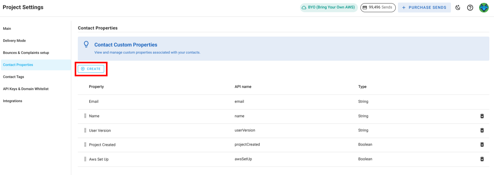

#### Reserved Properties
Some properties are reserved and cannot be created. These include `status`, `pausedUntil`, `email`, `accountId`, `projectId`, `customFields`, `contactId`, `subscriberListId`, `unsubscribeLink`, `pauseSubscriptionLink`.

### Delete Property
To delete a property, go to **project settings → contact properties**, locate the property in the table, and click the delete icon. Confirm the deletion, and the property will be removed from both the contacts table and the contact creation/editing interface.

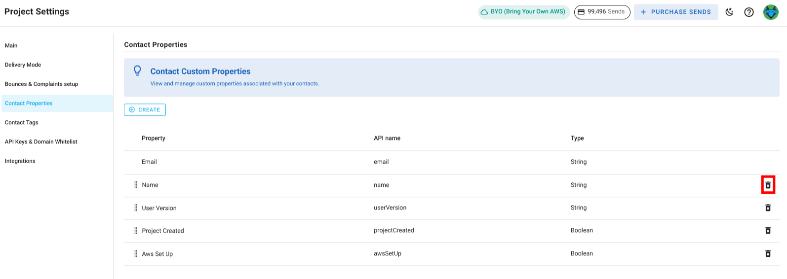

## Contact Tags

Contact tags are labels that you can assign to contacts to help organize them based on specific criteria or characteristics. Tags can be used for various purposes, such as categorizing contacts by interests, behaviors, or demographics, which can then be leveraged for targeted email campaigns and personalized communication.

To manage contact tags, navigate to **project settings → contact tags**. Here you can see a list of all existing tags in the project and you can create new tags or delete existing ones.

To create a new tag, click the **Create** button :
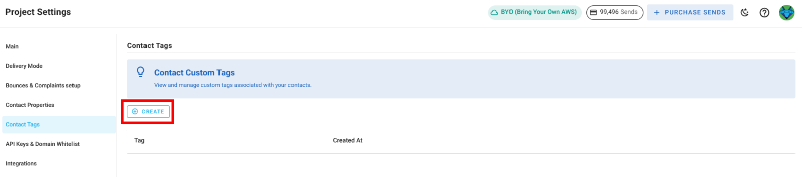

Enter the name of the tag and save it. The new tag will be available for assignment to contacts.
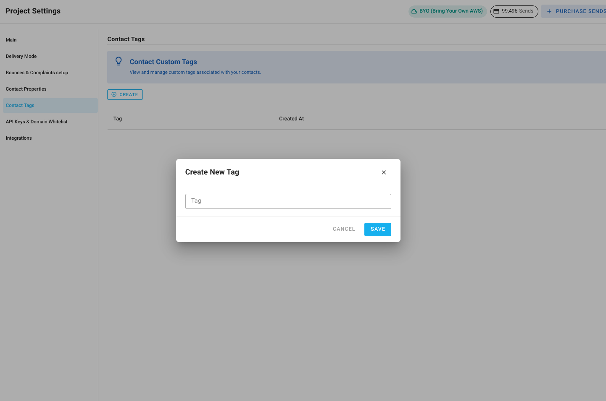

If you want to delete a tag, find it in the list of tags, click the delete icon, and confirm the deletion. The tag will be removed from the project and unassigned from any contacts that had it.

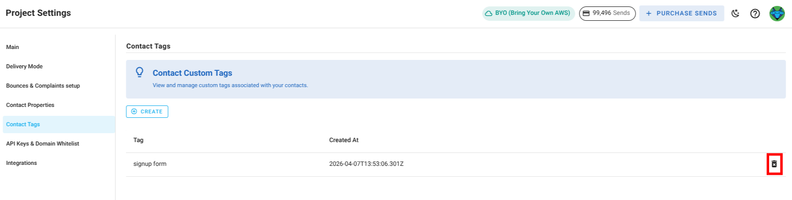

## API Keys and Domain Whitelist

To work with our [API](/docs/api/) from the server side, create at least one API key.

Include our API keys in the `Authorization` header of your HTTP requests as a bearer token.

```
Authorization: Bearer <API_KEY>
```

For bounces and complaints, it is added as a query string.

Periodically rotate sensitive info like API keys for security reasons. We use different colors to indicate the age of the API key as a reminder:
- Green: less than a month old
- Yellow: 1-6 months old
- Red: more than 6 months old

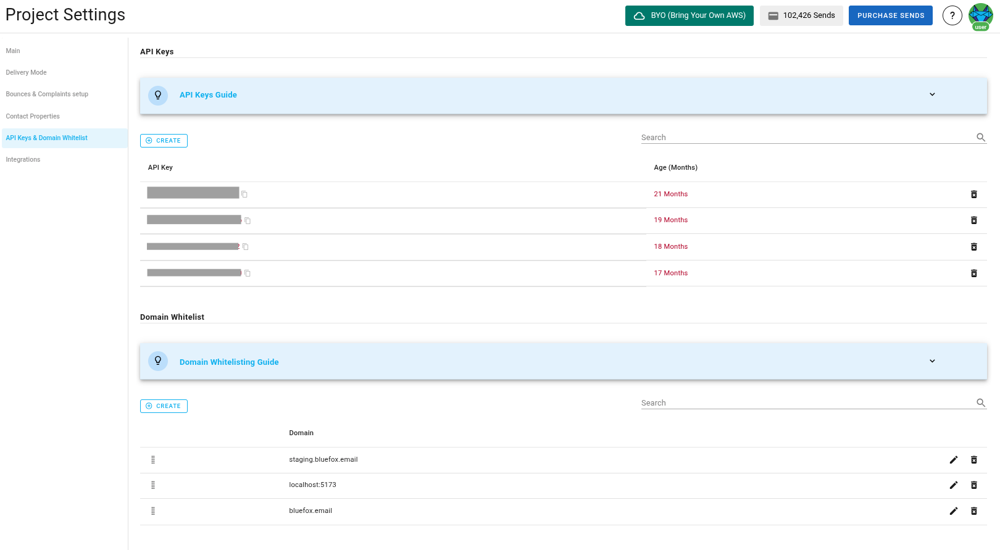

::: danger Security Warning
Since an API key is very sensitive information, never use it in your frontend code. Always use it from your backend.
:::


### Domain Whitelist

The domain whitelist ensures that sign-up requests are only processed from authorized domains, enhancing security during the sign-up process. If your frontend is making requests, you must add its domain to the whitelist to authorize them.

::: info Security Note
  The domain whitelist applies only to frontend requests. If your requests are coming from a backend server, you should use **API keys** instead, as backend requests do not require domain whitelisting.
:::

- **To add a domain**: 
  Navigate to **project settings → domain whitelist**, click **create**, enter the `domain`, and save. This ensures that requests from the frontend are recognized and approved.
  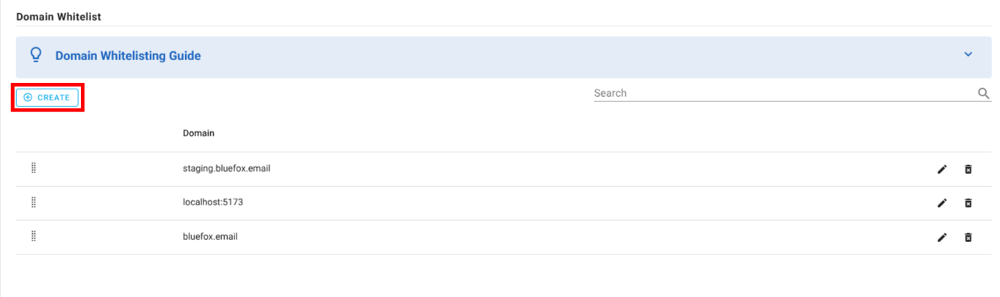

- **To edit an existing domain**:
  Navigate to **project settings → domain whitelist**, locate the domain, and click on the edit icon. Make the necessary changes and save them.
  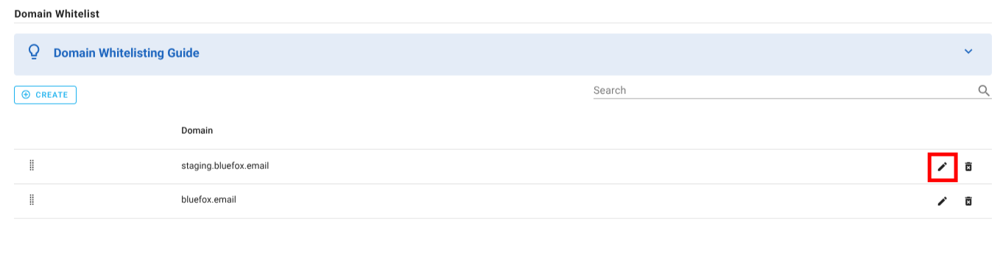

- **To delete a domain**: 
  Navigate to **project settings → domain whitelist**, find it in the domain whitelist, click the delete icon, and confirm the deletion. Once removed, any sign-up requests from that domain will no longer be authorized.
  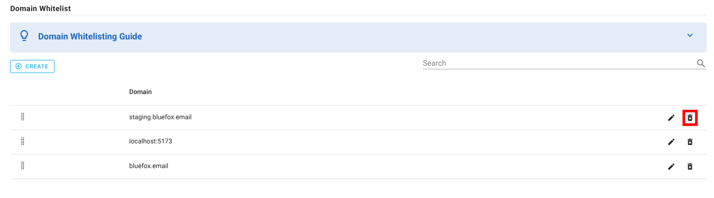

## Integrations

Here you can manage third-party integrations that enhance your project's capabilities. Right now we support the following integrations:

- **Zapier**: Connect your BlueFox Email project with thousands of apps to automate workflows without coding. Set up triggers and actions to streamline your email marketing processes.
- **Webhooks**: Configure webhooks to receive real-time notifications about specific events in your project, such as email deliveries, bounces, or complaints. This allows you to integrate BlueFox Email with your existing systems and automate responses to these events.

### Zapier Integration

You can see your projectID and API key needed for Zapier integration here. Click the **copy** icon by the projectID to copy the value to your clipboard. For API key, click **View API Key** to redirect to the API keys section where you can view, copy or create a new API key. 

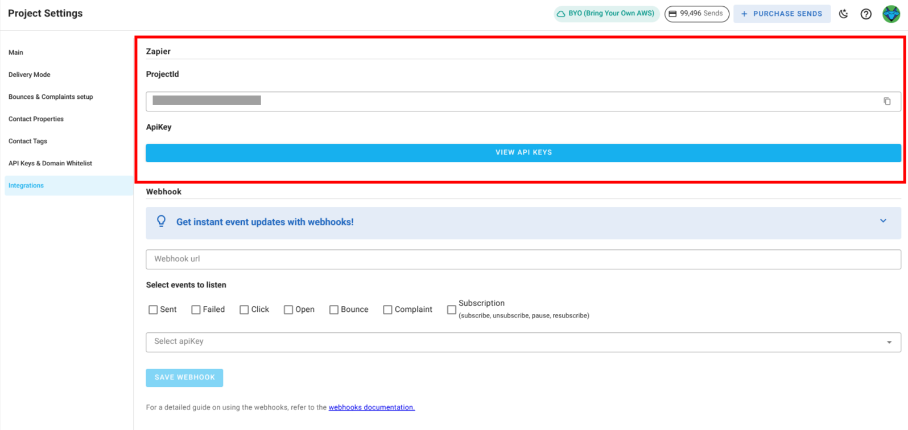

### Webhooks Integration

Webhooks keep you informed in real-time about email events like opens, clicks, bounces, complaints, subscriptions, and more. Easily integrate notifications into your app to monitor email performance and user actions.

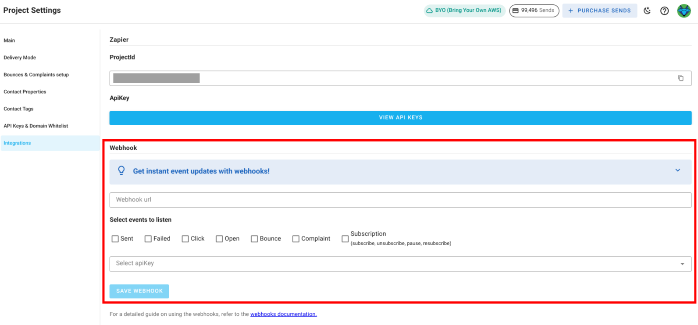

Steps to set up webhooks:

1. **Add Webhook URL**: Enter the URL where you want to receive notifications. Ensure your endpoint is secure and ready to handle incoming requests.
2. **Select Events**: Choose the events you want to be notified about (e.g., open, click, bounce, complaint).
3. **Save and Test**: Save your settings and use the 'Test Webhook' feature to ensure your integration is working correctly.
4. **Start Receiving Notifications**: Once set up, you'll begin receiving real-time updates for the selected events.

## Unengaged Segment

The unengaged segment defines, for the whole project, which contacts count as **unengaged**. It is a single set of conditions, built with the same condition builder used by regular [segments](./segments.md).

The definition on its own does not change who receives your emails. It takes effect when you turn on **Exclude unengaged** on a [campaign](./campaigns.md), a [triggered email](./triggered-emails.md), or a **Notify** node in an [automation](./automations.md#notify-node): every contact matching the definition is skipped for that send.

To find it, choose **Unengaged Segment** in the settings sub-menu. It sits at the end of the sub-menu, after **Integrations**. The section itself is titled **Unengaged Contact Segment**.

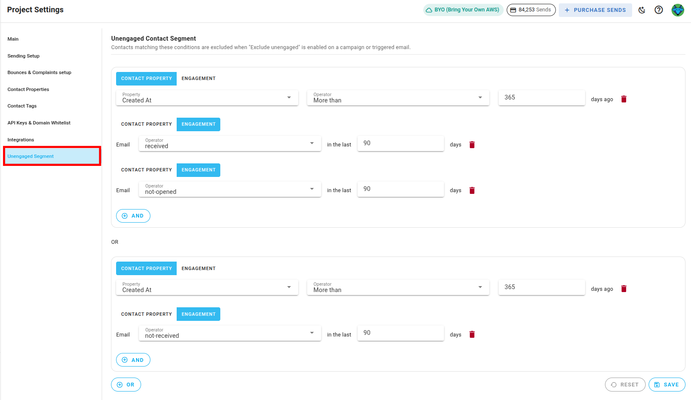

### How the Definition Is Used

Every campaign and triggered email has an **Exclude unengaged** toggle in its header, next to the subscriber list and segment selection. With the toggle on, BlueFox Email compares each contact in the selected list against the project's unengaged segment definition and skips the ones that match.

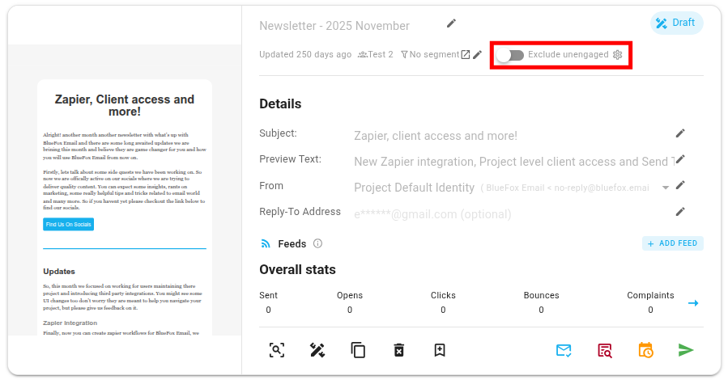

The **Notify** node in [automations](./automations.md#notify-node) offers the same option. Because a Notify node sends to a subscriber list of your choice rather than to the contact flowing through the automation, excluding unengaged contacts there works exactly as it does on a campaign: the list is checked against the project's definition and matching contacts are skipped.

This means:

- You do not have to build or maintain an exclusion list at send time.
- The definition is shared, so every send that opts in uses the same criteria: campaigns, triggered emails, and automation Notify nodes alike.
- The option is per send. Leaving it off sends to the full list regardless of the definition.

### Default Definition

Every project starts with a default definition made of two condition groups joined with **OR** logic. Conditions inside each group are joined with **AND** logic, so a contact only needs to match one complete group to be treated as unengaged.

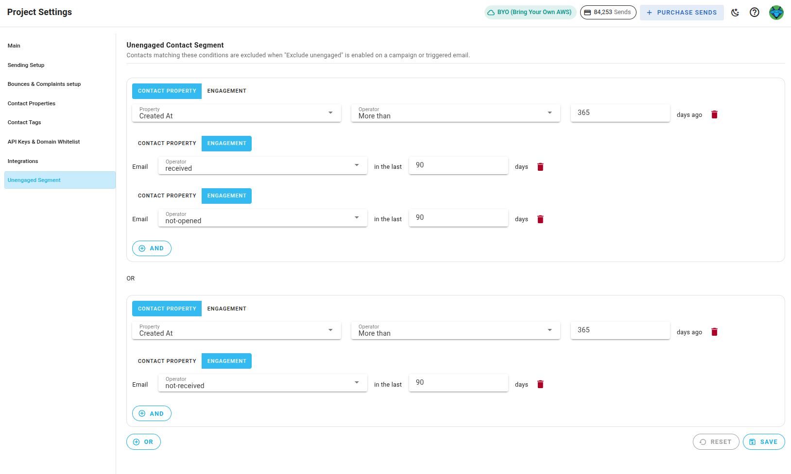

**Group 1**: contacts that are emailed but never open

- Condition 1: `Created At` **More than** `365` days ago
- **AND**
- Condition 2: Email `received` in the last `90` days
- **AND**
- Condition 3: Email `not-opened` in the last `90` days

**OR**

**Group 2**: contacts that are no longer emailed at all

- Condition 1: `Created At` **More than** `365` days ago
- **AND**
- Condition 2: Email `not-received` in the last `90` days

In plain language: a contact is unengaged by default if it has existed for over a year, and either it has been emailed recently without opening anything, or it has not been sent anything in the last 90 days.

### Editing the Definition

You can adjust the definition to your project's own criteria without any developer involvement.

- **Add a condition**: click **AND** at the bottom of a group. Each condition row has its own **CONTACT PROPERTY** and **ENGAGEMENT** tabs, so you choose the condition type per row, then pick the property or engagement operator and the value or number of days.
- **Add a group**: click **OR** at the bottom of the section. Groups are joined with OR logic, so a contact matching any complete group counts as unengaged.
- **Remove a condition**: click the delete icon at the end of the condition row.
- **Save**: click **SAVE** to apply the new definition. It takes effect on the next send that has **Exclude unengaged** turned on.
- **Reset**: click **RESET** to discard your edits and return to the saved definition.

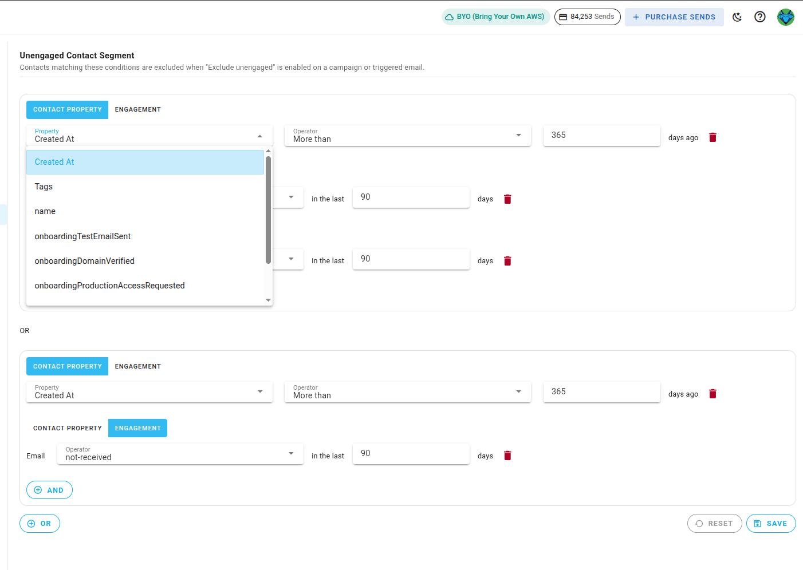

The available conditions and operators are the same ones documented on the [Segments](./segments.md) page.

::: tip Note:
Changing the definition changes who is skipped on every campaign, triggered email, and Notify node that uses **Exclude unengaged**, not just the one you are editing next.
:::

### Relationship to Segments

The unengaged segment reuses the [segment](./segments.md) condition builder, but it is not a regular segment:

- Regular segments are named, created under **Contacts**, and selected individually per campaign or automation.
- The unengaged segment is a single unnamed definition per project, edited here in project settings, and used only by the **Exclude unengaged** option on campaigns, triggered emails, and automation Notify nodes.

If you are new to the condition builder, read [Segments](./segments.md) first. The AND/OR logic, the contact property operators, and the engagement conditions all behave the same way here.
