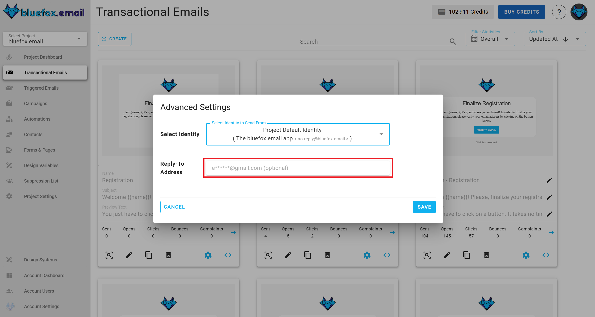

# Project Settings

To enable all the functionality provided by bluefox.email, you need to fill in all the project settings. If you want to use different domains or sending emails for different environments (e.g., staging or production), create separate projects for each environment.

## AWS Credentials

Our platform sends emails using your AWS SES, ensuring high deliverability and preventing spammers from using our platform.

First, set up your AWS `Access Key ID`, `Secret Access Key`, `Sender Identities`, `AWS region`, and `sending limit`.


The access key must be able to send emails via SES from the region and the sender identity you set up. The sending limit should be lower or equal to the actual AWS SES sending limit.

::: tip Your AWS Credentials Are Secure
We store your credentials encrypted, so even in the very unlikely event of data leakage, attackers won't be able to use your credentials.
:::


### Managing Sender Identities

In this section, you can manage the sender names and email addresses that will appear to your recipients. These identities define the sender details used for your emails. By default, emails will use the **default identity**. If you wish to use a specific identity for an email, you can configure it in the **advanced settings** of the email.

- **Adding a new identity**  
  To add a new identity, click the **"add identity"** button and provide the sender name and email address.

  

- **Default identity**  
  When adding identities, the first sender identity is automatically set as the **default identity**.  
  - To change the default identity, click the **"set as default identity"** icon next to any other sender identity.  
  - The default identity is used automatically when no specific sender identity is selected for an email.

  

- **Deleting an identity**  
  If a sender identity is no longer needed, you can delete it by clicking the **trash icon** next to the sender identity.

  


## Advanced Settings

The **Advanced Settings** feature, available in email cards for **Campaign**, **Transactional**, and **Triggered Emails**, allows you to customize key email-sending options, providing flexibility in managing sender identities and reply-to addresses.


### Sender Identity Selection

The **sender identity** field lets you choose the identity used to send the email. By default, the system automatically selects the **default identity**, but you can select another identity from the list of available options.


## Reply-To Email Address

The **reply-to email address** field allows you to specify where replies to your email should be sent.




## Bounce & Complaint Webhooks

To know the [bounce and complaint numbers](/docs/projects/analytics) of your emails, set up our webhooks in AWS SNS.

To set up the hooks, press the setup buttons:


... and follow the instructions. After finishing, you should see this:


The **Identity Name** column displays the identities configured in your project. The green tick marks in the **Bounce Hook** and **Complaint Hook** columns indicate that the webhooks have been successfully set up for each identity. If any webhook fails to configure correctly, you can revisit the setup and re-test.

Additionally, the red **Reset Bounce Webhook** and **Reset Complaint Webhook** buttons allow you to reset and reconfigure the webhooks if needed. This ensures that your setup remains flexible and can be updated whenever required. Once all green ticks are visible, the webhooks are fully operational, confirming that bounce and complaint events will be tracked effectively.

::: tip Upcoming Feature
We plan to introduce processes for bounces and complaints to automatically keep your lists clean. Currently, you need to analyze those numbers and manually keep your lists clean.
:::

## API Keys

To work with our [API](/docs/api/) from the server side, create at least one API key.

Include our API keys in the `Authorization` header of your HTTP requests as a bearer token.

```
Authorization: Bearer <API_KEY>
```


For bounces and complaints, it is added as a query string.

Periodically rotate sensitive info like API keys for security reasons. We use different colors to indicate the age of the API key as a reminder:
- Green: less than a month old
- Yellow: 1-6 months old
- Red: more than 6 months old


::: danger Security Warning
Since an API key is very sensitive information, never use it in your frontend code. Always use it from your backend.
:::
