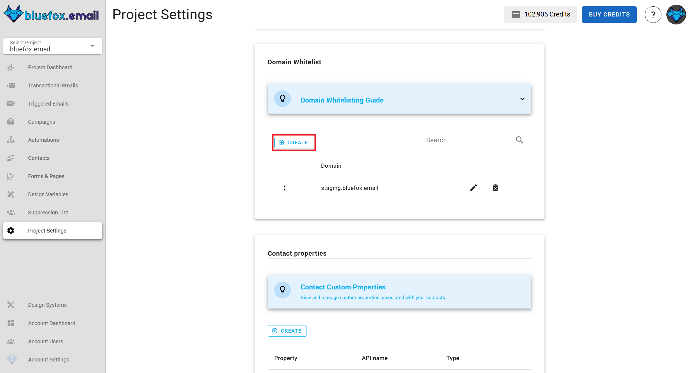

# Project Settings

To enable all the functionality provided by bluefox.email, you need to fill in all the project settings. If you want to use different domains or sending emails for different [delivery modes](./delivery-modes.md) (e.g., staging or production), create separate projects for each environment.

To access the project settings, click on the **Settings** tab. Here, you can use the sub-menu to navigate to different sections of the project settings.


## Main Settings
Users can **add**, **update**, or **remove** a custom logo for their project. This logo will be displayed on the **subscription preferences page** and **double opt-in confirmation page success message** to provide branding consistency.

To manage the project logo:

- **Add or update**: Click upload, select an image, and save.

- **Remove**: Click remove logo and confirm.
  
Users can also manage the project name in this section or delete the project entirely by clicking the **Delete project** button.


## Delivery Modes

Delivery modes determine how emails are sent from your project. So the default for every new project is **sandbox mode**. In this mode, you can start sending emails immediately but with some limitations. When you're ready for unrestricted sending, you can request to move your project to **production mode**. If you prefer to bring your own AWS SES account, you can do that too. 

For more details, see our [Delivery Modes documentation](/docs/projects/delivery-modes.md).


## Bounces and Complaints Webhooks

To effectively manage email bounces and complaints, BlueFox Email provides webhook integration. This allows you to receive real-time notifications about these events, enabling you to take appropriate actions such as updating contact statuses or triggering follow-up processes.


## Advanced Settings

The **Advanced Settings** feature, available in email cards for **Campaign**, **Transactional**, and **Triggered Emails**, allows you to customize key email-sending options, providing flexibility in managing sender identities and reply-to addresses.


### Sender Identity Selection

The **sender identity** field lets you choose the identity used to send the email. By default, the system automatically selects the **default identity**, but you can select another identity from the list of available options.


## Reply-To Email Address

The **reply-to email address** field allows you to specify where replies to your email should be sent.


## Contact Properties

Contact properties allow users to define custom attributes for contacts at the project level. These properties appear in the **contacts** table and can be filled when adding or editing a contact.

### Add new Property
To add a new property, navigate to **project settings → contact properties**, click **create**, enter the property `name` and `type`, then save. The property will be available in the contact management interface.

Each contact property includes:

- **Property Name**: The user-defined name.

- **API Name**: The system-generated name used when sending or retrieving data via API.

- **Type**: The data type of the property, which can be **string, boolean, date, or number**.


#### Reserved Properties
Some properties are reserved and cannot be created. These include `status`, `pausedUntil`, `email`, `accountId`, `projectId`, `customFields`, `contactId`, `subscriberListId`, `unsubscribeLink`, `pauseSubscriptionLink`.

### Delete Property
To delete a property, go to **project settings → contact properties**, locate the property in the table, and click the delete icon. Confirm the deletion, and the property will be removed from both the contacts table and the contact creation/editing interface.


## API Keys and Domain Whitelist

To work with our [API](/docs/api/) from the server side, create at least one API key.

Include our API keys in the `Authorization` header of your HTTP requests as a bearer token.

```
Authorization: Bearer <API_KEY>
```


For bounces and complaints, it is added as a query string.

Periodically rotate sensitive info like API keys for security reasons. We use different colors to indicate the age of the API key as a reminder:
- Green: less than a month old
- Yellow: 1-6 months old
- Red: more than 6 months old


::: danger Security Warning
Since an API key is very sensitive information, never use it in your frontend code. Always use it from your backend.
:::


### Domain Whitelist

The domain whitelist ensures that sign-up requests are only processed from authorized domains, enhancing security during the sign-up process. If your frontend is making requests, you must add its domain to the whitelist to authorize them.

::: info Security Note
  The domain whitelist applies only to frontend requests. If your requests are coming from a backend server, you should use **API keys** instead, as backend requests do not require domain whitelisting.
:::

- **To add a domain**: 
  Navigate to **project settings → domain whitelist**, click **create**, enter the `domain`, and save. This ensures that requests from the frontend are recognized and approved.
  

- **To edit an existing domain**:
  Navigate to **project settings → domain whitelist**, locate the domain, and click on the edit icon. Make the necessary changes and save them.
  

- **To delete a domain**: 
  Navigate to **project settings → domain whitelist**, find it in the domain whitelist, click the delete icon, and confirm the deletion. Once removed, any sign-up requests from that domain will no longer be authorized.
  

## Integrations

Here you can manage third-party integrations that enhance your project's capabilities. Right now we support the following integrations:

- **Zapier**: Connect your bluefox.email project with thousands of apps to automate workflows without coding. Set up triggers and actions to streamline your email marketing processes.
- **Webhooks**: Configure webhooks to receive real-time notifications about specific events in your project, such as email deliveries, bounces, or complaints. This allows you to integrate bluefox.email with your existing systems and automate responses to these events.

### Zapier Integration

You can see your projectID and API key needed for Zapier integration here. Click the **copy** icon by the projectID to copy the value to your clipboard. For API key, click **View API Key** to redirect to the API keys section where you can view, copy or create a new API key. 


### Webhooks Integration

Webhooks keep you informed in real-time about email events like opens, clicks, bounces, complaints, subscriptions, and more. Easily integrate notifications into your app to monitor email performance and user actions.


Steps to set up webhooks:

1. **Add Webhook URL**: Enter the URL where you want to receive notifications. Ensure your endpoint is secure and ready to handle incoming requests.
2. **Select Events**: Choose the events you want to be notified about (e.g., open, click, bounce, complaint).
3. **Save and Test**: Save your settings and use the 'Test Webhook' feature to ensure your integration is working correctly.
4. **Start Receiving Notifications**: Once set up, you'll begin receiving real-time updates for the selected events.
