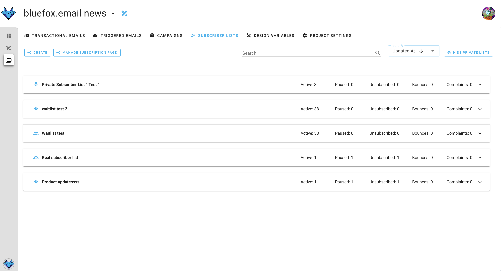
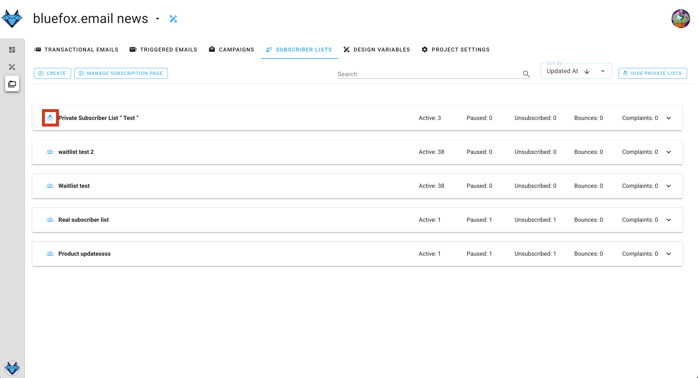
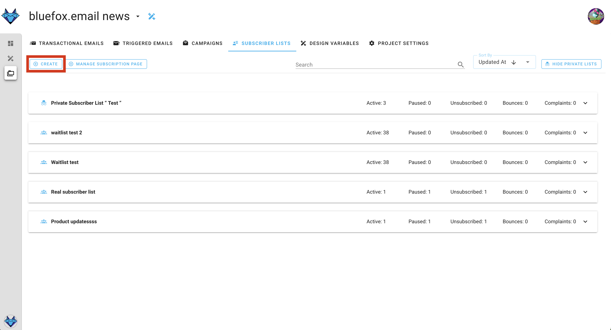
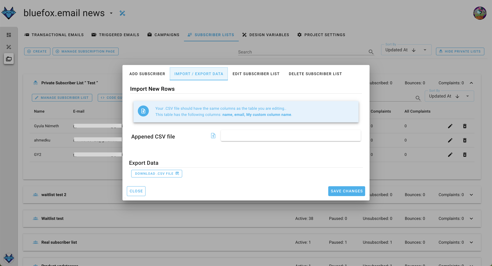
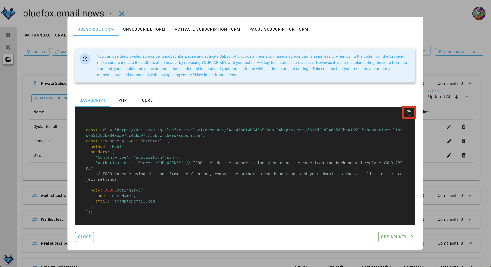

# Subscriber lists (contacts)

In bluefox.email, you can have multiple subscriber lists (or email lists) associated with your project. Each project has separate lists. You can create as many lists as you want. Users will be able to subscribe, unsubscribe, or pause their subscription for each list separately.

You can find your project's subscriber lists under the "Subscriber Lists" tab:

It's a good idea to create separate lists for different topics, like product updates, promotions, tips & tricks, etc.

If your list is public, it will show up on the [subscription preferences](./subscription-preferences-page) page of your users. The subscription preferences page uses the title and description of your lists. Public lists are indicated with the following icon:

Pausing subscription is a great feature because it can significantly reduce the unsubscribe rate.

When you use the `unsubscribeLink` and the `pauseSubscriptionLink` in your emails, they will lead to the subscription preferences page. However, if the user clicks on the second one, the unsubscribe option won't be shown.

As mentioned earlier, you can have public lists, but you can also have private lists. Private lists will not appear on the subscription preferences page and can be used for testing purposes.

To preview the subscription preferences page and upload your logo, click on the following button:

## Creating a Subscriber List

To create a new subscriber list, click on the "Create" button:

In the dialog, you need to enter the name and description of the list. These will appear on the subscription preferences page if the list is public.

You have the option to upload a CSV file. Read more about it in the next section.

## Import CSV, Export CSV

In the previous section, you saw that you can import a CSV while creating your email list. You can also add subscribers to an existing list. Just open a list and click on the "Manage Subscriber List" button:

In the dialog, select the second tab, and you can import new contacts or export the entire list as a CSV file:

The CSV file you import must contain `name` and `email` columns.

## Subscriber statuses

**unverified** You can create your subscribers via an API call with an `unverified` status. This is useful if you implement (and you should) [double opt-in](#implement-double-opt-in). You can change the `unverified` status to `active` when your user verifies their email address.

**active** Only active users will receive your triggered emails or campaigns. If you add a user through the UI (one-by-one or by importing a CSV), they will have an `active` status.

**paused** Users can pause their subscription for a certain amount of time. While paused, they won't receive emails sent to the email they paused.

**unsubscribed** When users unsubscribe from a list, they won't receive emails through that list anymore.

## Subscriber list integration

You can manage subscribers on your list programmatically. We provide code snippets in various programming languages that you can use. Click on the list's "Code guide" button:

Just copy and modify the code in your preferred programming language:

## Implement double opt-in

Keep in mind that you should always implement [double opt-in](/best-practices/double-opt-in), meaning that you only add your users to subscriber lists as active subscribers when they verify their email address!

If you add your users to multiple lists when they sign up for your service:
- Send them a verification email (transactional email) with a unique link.
- If they click on the link (and accept your terms and conditions), you can add them to the subscriber lists as `active` subscribers.

If you just create a newsletter sign-up:
- You can add them to your list as an `unverified` subscriber.
- Send them a verification email (transactional email) with a unique link.
- When they click on it, you can change their status to `active`.
