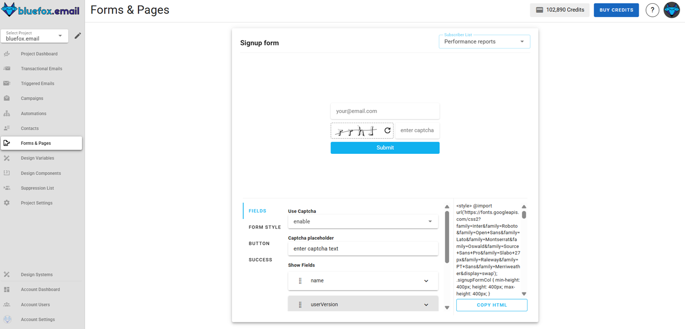

# Subscriber lists (contacts)

In bluefox.email, you can have multiple subscriber lists (or email lists) associated with your project. Each project has separate lists. You can create as many lists as you want. Users will be able to subscribe, unsubscribe, or pause their subscription for each list separately.

You can find your project's subscriber lists under the "Subscriber Lists" tab:

It's a good idea to create separate lists for different topics, like product updates, promotions, tips & tricks, etc.

If your list is public, it will show up on the [subscription preferences](./subscription-preferences-page) page of your users. The subscription preferences page uses the title and description of your lists. Public lists are indicated with the following icon:

Pausing subscription is a great feature because it can significantly reduce the unsubscribe rate.

When you use the `unsubscribeLink` and the `pauseSubscriptionLink` in your emails, they will lead to the subscription preferences page. However, if the user clicks on the second one, the unsubscribe option won't be shown.

As mentioned earlier, you can have public lists, but you can also have private lists. Private lists will not appear on the subscription preferences page and can be used for testing purposes.

::: info
Private lists are subscriber lists that are not visible to users on the subscription preferences page unless they are already subscribed to them. These lists are hidden from general view but become accessible to users who are part of them. This allows for more controlled and targeted management of subscriptions, making private lists ideal for internal use, testing, or exclusive communications.
:::

To preview the subscription preferences page and upload your logo, click on the following button:

## Creating a Subscriber List

To create a new subscriber list, click on the "Create" button:

In the dialog, you need to enter the name and description of the list. These will appear on the subscription preferences page if the list is public.

You have the option to upload a CSV file. Read more about it in the next section.

## Import CSV, Export CSV

In the previous section, you saw that you can import a CSV while creating your email list. You can also add subscribers to an existing list. Just open a list and click on the "Manage Subscriber List" button:

In the dialog, select the second tab, and you can import new contacts or export the entire list as a CSV file:

The CSV file you import must contain `name` and `email` columns.

## Subscriber statuses

**unverified** You can create your subscribers via an API call with an `unverified` status. This is useful if you implement (and you should) [double opt-in](#implement-double-opt-in). You can change the `unverified` status to `active` when your user verifies their email address.

**active** Only active users will receive your triggered emails or campaigns. If you add a user through the UI (one-by-one or by importing a CSV), they will have an `active` status.

**paused** Users can pause their subscription for a certain amount of time. While paused, they won't receive emails sent to the email they paused.

**unsubscribed** When users unsubscribe from a list, they won't receive emails through that list anymore.

## Subscriber list integration

Managing your subscriber list in bluefox.email is simple using our Subscription API. This API allows you to subscribe new users, unsubscribe them, activate or pause their subscriptions, list all subscribers, and fetch details about a specific subscriber. We provide code snippets in various programming languages that you can use. Click on the list's "Code guide" button:

Just copy and modify the code in your preferred programming language:

::: danger Security Warning  
Your **bluefox.email** API key must be included in the `Authorization` header of each request. Avoid sending these requests from your frontend to prevent exposing your API key!  
:::  

For more details and guidance on integrating these endpoints, visit our [API documentation](/docs/api/).  

### Sign-Up Page

The sign-up page in the subscriber list allows users to create a form that subscribers can use to sign up directly from their website. This page provides an easy way to customize the form, generate the necessary HTML code, and integrate it into external sites without the need for backend code.

#### How It Works

Users can customize the sign-up form through the interface, then copy the generated HTML code and paste it into their website. Once implemented, visitors can enter their details and subscribe directly to the subscriber list in Bluefox.email.

::: info Important Note:
To ensure the form functions correctly on your website, you must whitelist your website domain. Navigate to Project Settings → Whitelist and add your domain to the whitelist.
::: 

#### Interface Overview
Below is an example of the sign-up form interface:

#### Customization Options

The sign-up page offers several customization options across three main sections: Form, Button, and Success Message.

##### 1. Form Customization

- **Form Style:** Choose how form fields are arranged:
  - `Column` – Fields are stacked vertically.  
  - `Inline` – Fields are placed in a single line.  
  - `Row` – Fields are placed horizontally.  
- **Name Placeholder:** Text displayed in the name field (e.g., `Enter your name`).  
- **Email Placeholder:** Text displayed in the email field (e.g., `Enter your email`).  
- **Font Style:** Select the font family for the form fields.  

##### 2. Button Customization

- **Button Text:** Customize the text displayed on the submit button (e.g., `Subscribe`).  
- **Button Font:** Choose the font family for the button text.  
- **Button Font Color:** Set the color of the text on the button.  
- **Button Color:** Set the background color of the button.  
- **Button Font Size:** Adjust the size of the text on the button.  

##### 3. Success Message Customization

After a user subscribes successfully, a success message is displayed. You can customize:

- **Success Message Text:** Define the text that appears after successful submission.  
- **Success Message Font:** Choose the font family for the message text.  
- **Success Message Font Color:** Set the color of the success message text.  
- **Success Message Font Size:** Adjust the text size of the success message.  

#### Using the Form

1. Customize the form using the available options.
2. Click Copy HTML to copy the generated code.
3. Save the form customization
4. Paste the code into your website’s HTML.
5. Make sure your website domain is whitelisted.

The form will now capture subscribers' information and automatically add them to your Bluefox.email subscriber list.

## Implement double opt-in

Keep in mind that you should always implement [double opt-in](/email-best-practices-for-saas/double-opt-in), meaning that you only add your users to subscriber lists as active subscribers when they verify their email address!

If you add your users to multiple lists when they sign up for your service:
- Send them a verification email (transactional email) with a unique link.
- If they click on the link (and accept your terms and conditions), you can add them to the subscriber lists as `active` subscribers.

If you just create a newsletter sign-up:
- You can add them to your list as an `unverified` subscriber.
- Send them a verification email (transactional email) with a unique link.
- When they click on it, you can change their status to `active`.

## Subscriber List Statistics  

The **Subscriber List Statistics** section provides insights into the performance of your subscriber lists, including email activity and subscription trends. This allows you to monitor how well your lists are growing and how subscribers interact with your emails.  

### Why Subscriber List Statistics Matter  

Analyzing subscriber list statistics helps you:  

- **Monitor Engagement**: Track how subscribers interact with emails sent to a specific list.  
- **Understand Growth Trends**: Visualize how your list is growing or shrinking over time through subscription and unsubscription data.  
- **Improve Retention**: Identify patterns in subscription pauses or unsubscribes to address issues and reduce churn.  
- **Optimize Targeting**: Use insights into subscriber activity to refine your campaigns and re-engagement efforts.  

### What Subscriber List Statistics Include  

The subscriber list statistics section includes the following key metrics:

Similar to email statistics, this section provides details about the emails sent to this list:  
- **Sent Emails**: Total number of emails sent to the subscriber list.  
- **Opens**: Number of times recipients on this list opened emails.  
- **Unique Opens**: Number of individual subscribers who opened emails (counts only one open per subscriber).  
- **Clicks**: Total number of clicks on links within the emails sent to this list.  
- **Unique Clicks**: Number of individual subscribers who clicked on links (counts only one click per subscriber).  
- **Bounces**: Number of emails that failed to deliver.  
- **Complaints**: Number of complaints (e.g., emails marked as spam).   
- **Subscriptions**: Number of new subscribers added to the list during the selected time interval.  
- **Resubscriptions**: Number of previous subscribers who re-subscribed.  
- **Unsubscribes**: Number of subscribers who opted out during the selected period.  
- **Paused Subscriptions**: Number of subscribers who paused their subscriptions temporarily.  

These metrics provide a comprehensive view of your subscriber list's performance and behavior. By analyzing this data, you can identify trends, address issues, and refine your strategies to grow and retain your subscriber base more effectively.

### How to Access Subscriber List Statistics

You can access the **Subscriber List Statistics** by clicking the arrow icon:

For more information on how to use the **Subscriber List Statistics**, refer to the [Analytics Documentation](/docs/analytics).
