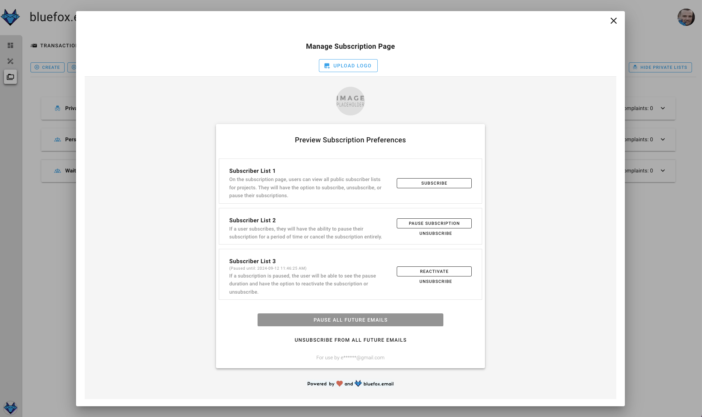
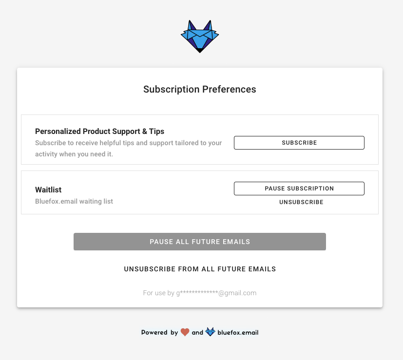
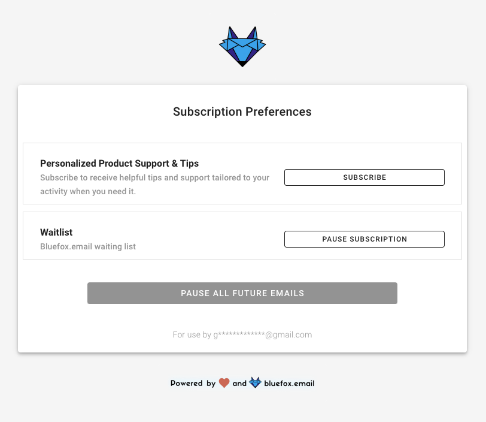

# Subscription Preferences Page

We provide a subscription preferences page where users can manage their subscriptions. On this page, users have the ability to unsubscribe, resubscribe, or pause their subscriptions. In triggered emails and campaigns, we provide two merge tags: `unsubscribeLink` and `pauseSubscriptionLink`. Both links direct users to the manage subscription page, but when using the `pauseSubscriptionLink`, the unsubscribe options are removed from the page.

::: tip
The "pause subscription" feature is an effective way to reduce churn.
:::

You can access the subscription preferences page configuration by clicking the button on the subscriber lists tab:

Each project has one subscription preferences page. On this page, you can set your logo, and all public subscriber lists will be visible to the user. The items listed are subscriber lists, with the title displaying the name of the list. Additionally, the description of each subscriber list is shown, allowing you to provide more context to your users.

As shown above, there are different states in the user-subscriber list relationship: unsubscribed, paused, and subscribed. Based on these states, different actions are available to the user.

Below is an example of a real subscription preferences page after clicking on the `unsubscribeLink`:

Here is the same page after clicking the `pauseSubscriptionLink`:

