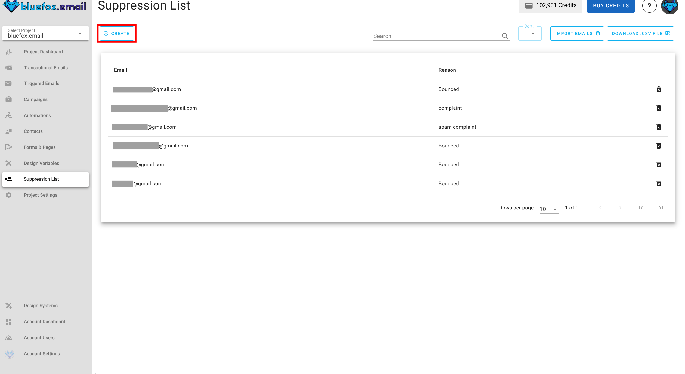
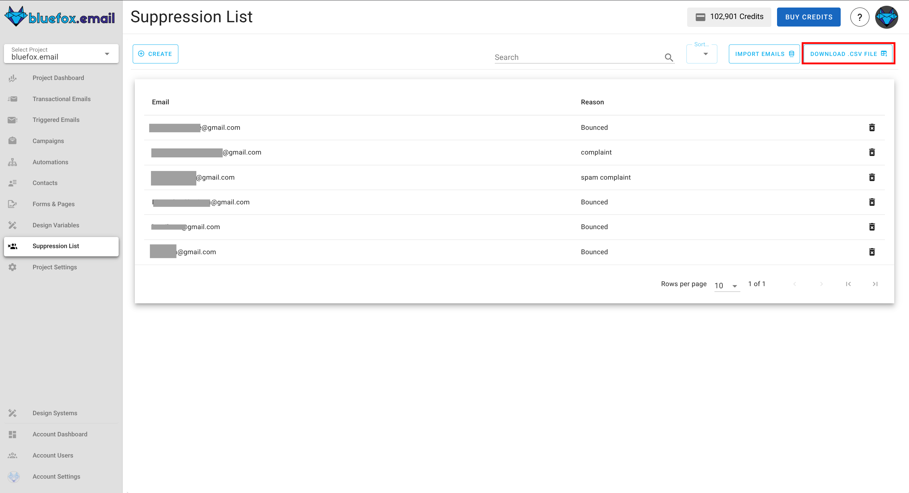

# Suppression Lists

Suppression Lists help you maintain high deliverability and a strong sender reputation by preventing emails from being sent to problematic addresses. This protects your project from high bounce rates, spam complaints, and wasted sending quota.

You can find the Suppression List for your project under the **Suppression Lists** tab:

## Add Email to Suppression List

You can add an email by clicking on the `Create` button at top-left corner.

Type in the email address with a reason for adding it to the suppression list for future reference. 

## Importing Contacts

Importing contacts to your suppression list is essential when you have multiple known problematic email addresses or need to migrate suppression data from another email service. This helps prevent bounces and complaints that could harm your sender reputation.

To import a list of contacts:

1. Click on the `Import Emails` button at the top of the suppression list page
   

2. Upload a CSV file containing the email addresses you want to suppress
   - The CSV file should have an "email" column containing the addresses
   - You can optionally include a "reason" column to document why each address is being suppressed
   
3. Review the import preview to confirm the data is correctly formatted
   
4. Click `Import` to add all the addresses to your suppression list

## Sorting the List

To organize your suppression list, simply click on the `Sort By` option. This helps you quickly find specific entries.

Sorting your list makes it easier to locate addresses or identify when contacts were added to the suppression list.

## Exporting Contacts

Exporting your suppression list creates a backup of your data, lets you analyze addresses in external tools, helps share lists across projects, and supports compliance documentation requirements.

To export your suppression list:

1. Click the `Download .csv File` button at the top of the page

   

2. The system will generate and download a CSV file containing all suppressed email addresses and their associated information.

3. You can open this file in any spreadsheet application for further analysis or use it to import the suppression data into other systems.