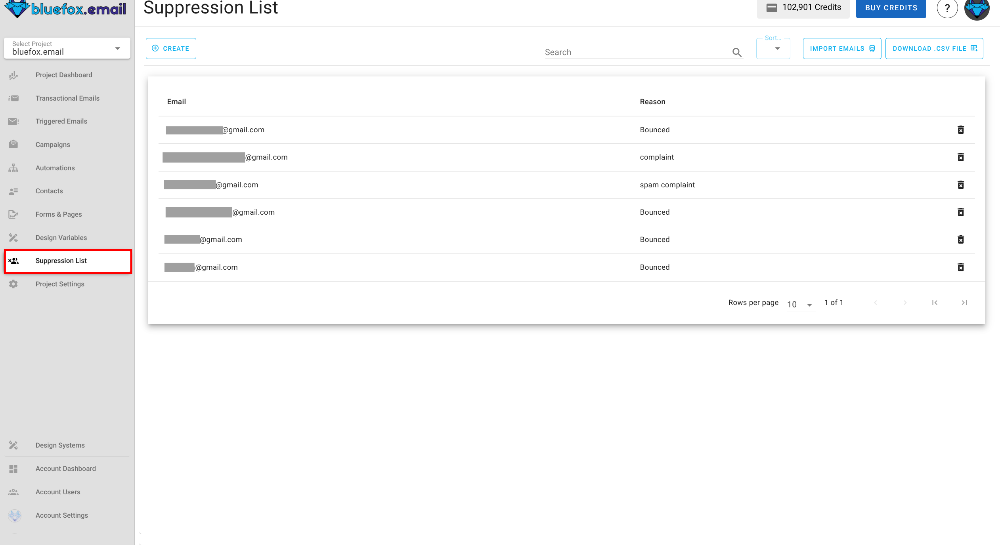
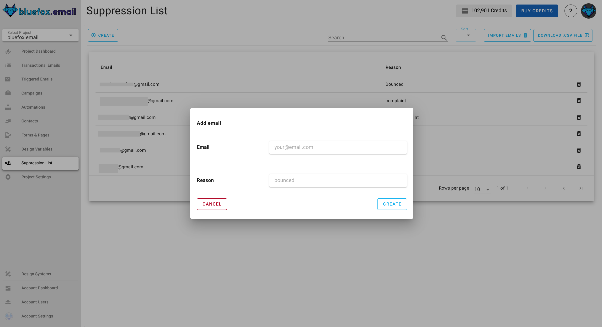
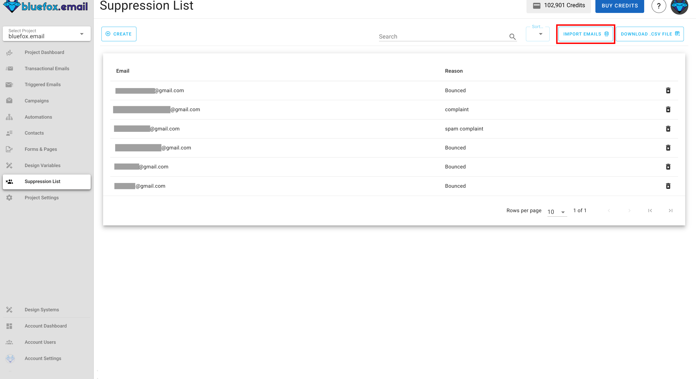
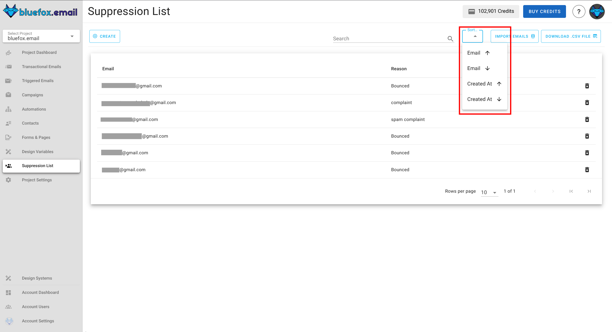

# Suppression Lists

Suppression Lists help you maintain high deliverability and a strong sender reputation by preventing emails from being sent to problematic addresses. This protects your project from high bounce rates, spam complaints, and wasted sending quota.

You can find the Suppression List for your project under the **Suppression Lists** tab:

## Add Contacts

You can add contact by clicking on `Create` button at top-left corner.

Type in email of the contact with reason for adding to the suppression list for future references. 

## Importing Contacts

To import a list of contacts in click on `import emails` button in top.

## Sort the list 
To sort contacts in list, find sorting options by clicking on `Sort` button in top. 

## Export contacts

You can also export your contact lists in a `.csv` file, just click on `Download .csv File` button in top.

