# Transactional Emails

Transactional emails are essential emails needed for basic functions like registration or password resets. For example, if a user wants to register with their email address or reset a forgotten password, an email must be sent.

Users **can't unsubscribe** from transactional emails because they are necessary. Also, **transactional emails are not associated with any subscriber lists**. They are sent directly to specific email addresses.

You can find the transactional emails of a project under the `Transactional Emails` tab.

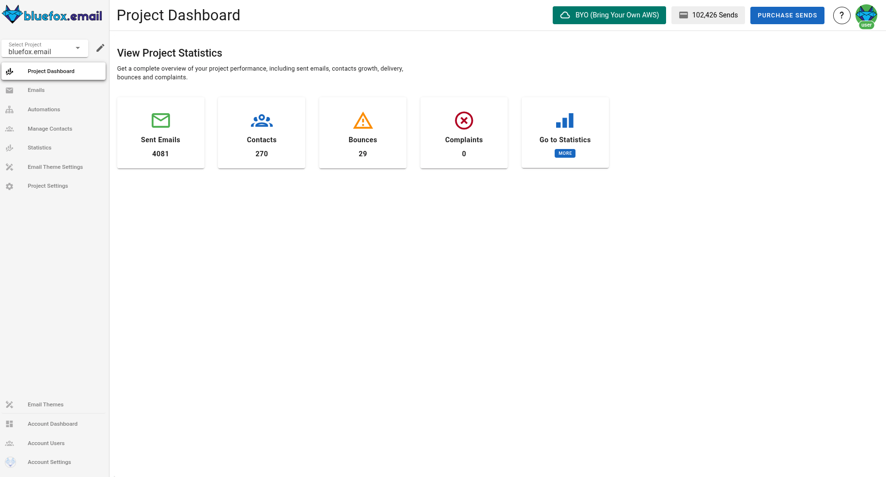

## Creating a Transactional Email

To create a new transactional email, click the `Create` button.

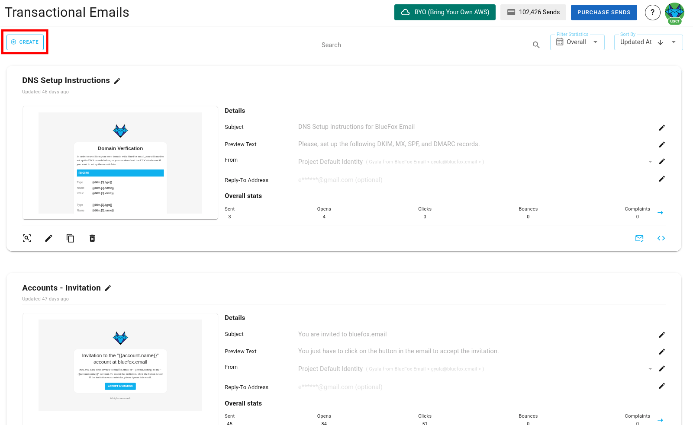

Next, select a template category defined in your project's design system.

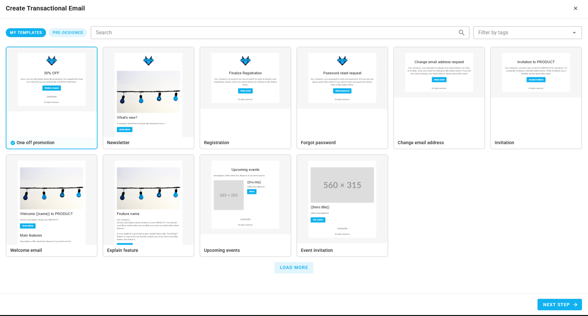

Then, choose a template to start from, also defined in your design system.

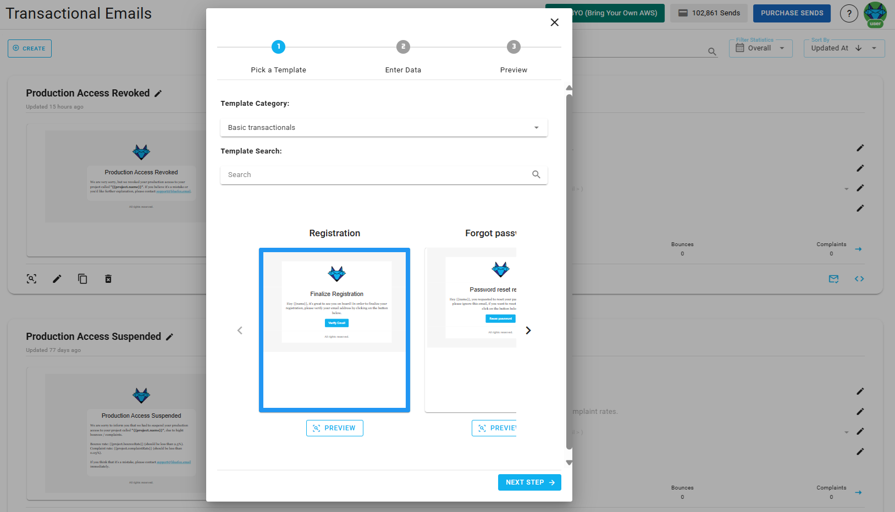

Enter the name, subject line, and preview text for your email. You can [personalize](#transactional-email-personalization) these with [merge tags](#transactional-email-personalization)!

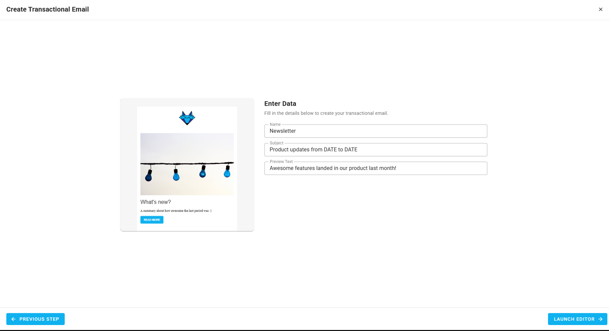

After that, you will see a summary page. Click "Launch Editor".

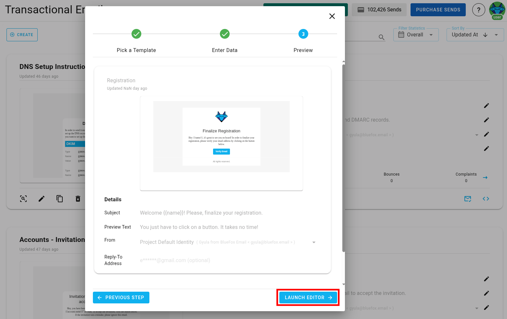

Finally, make changes in the drag-and-drop email editor:


When you're done, click "Save & Close". You can make changes later as well.

## Transactional Email Integration

Every transactional email in bluefox.email has a unique URL for sending the email. Send an HTTP request to this endpoint. You can generate sample code in multiple programming languages by clicking this icon:

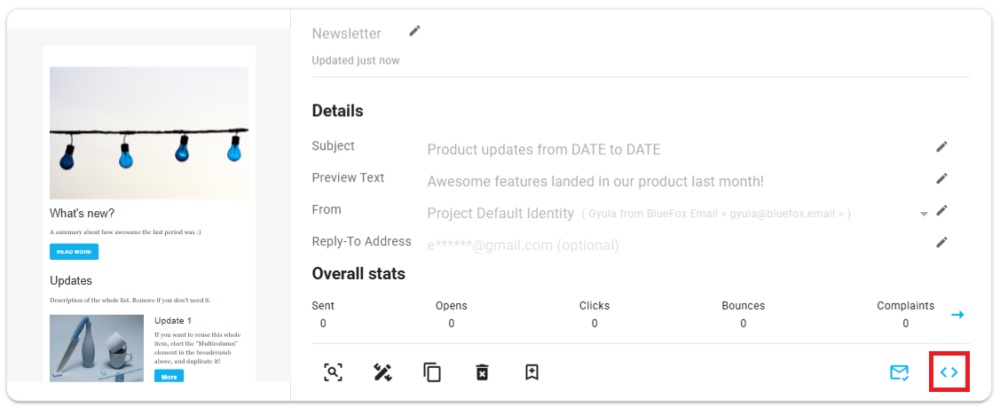

Copy the generated code to use it in your project:

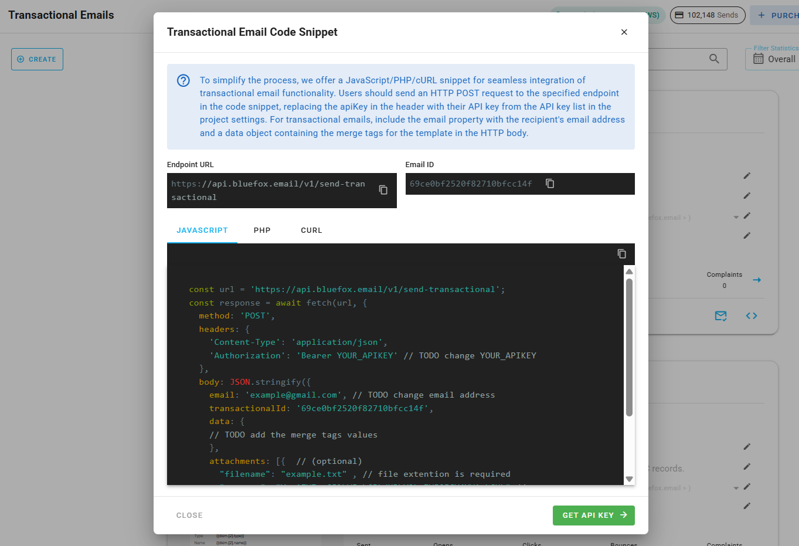

::: danger Security Warning
Your bluefox.email API key is included in the request `Authorization` header. Never send these requests from your frontend!
:::

See our [API docs](/docs/api/) for more details.

## Transactional Email Personalization

You can personalize transactional emails with [handlebars](https://handlebarsjs.com/). The data you send to the transactional email's endpoint determines the available variables. For example, you can send a user's name:

```javascript
await fetch(yourEndpoint, {
    method: 'POST',
    headers: {
        'Content-Type': 'application/json',
        'Authorization': 'Bearer YOUR_API_KEY'
    },
    body: JSON.stringify({
        email: 'joe@doe.com',
        transactionalId: 'EMAIL_ID',
        data: {
            name: 'Joe Doe'
        }
    })
})
```

You can use any handlebars variables in your email while editing. Click on the edit icon on the card:

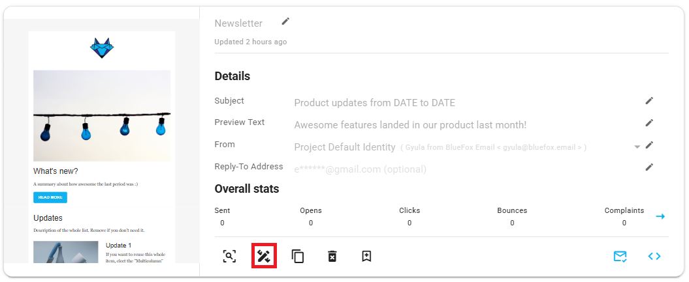

Enter your variables with Handlebars syntax:

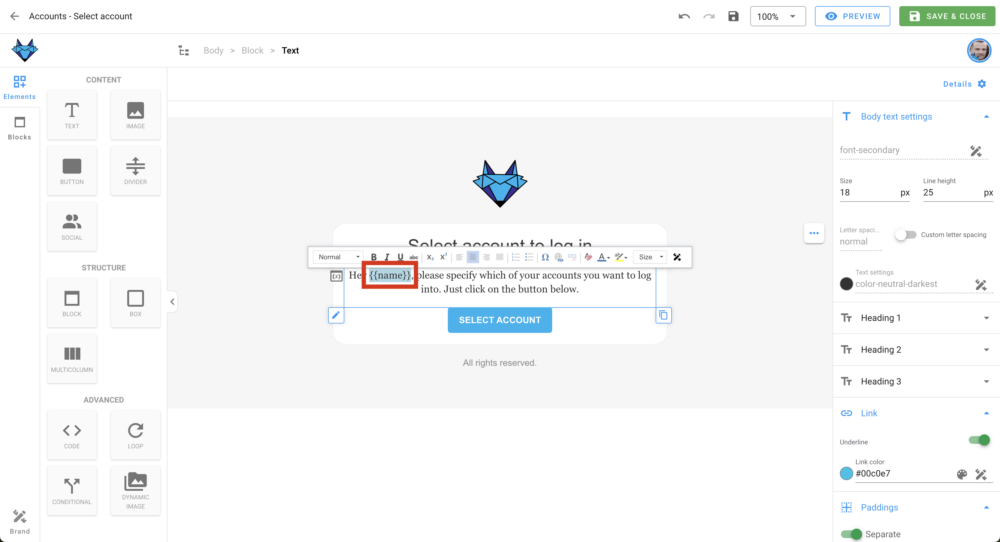

You can also use merge tags in the email's `subject line` and `preview text`!

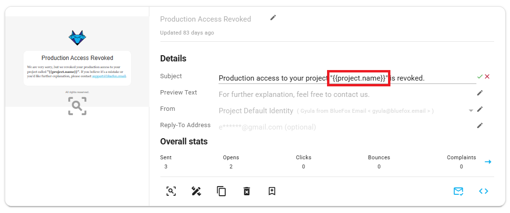

For more details, read our guide on [personalization with merge tags](/docs/personalization) and Handlebars.


## Advanced Settings

The **Advanced Settings** feature allows you to customize key email-sending options, such as configuring sender identities and reply-to addresses. 

You can access the **Advanced Settings** by clicking the gear icon:

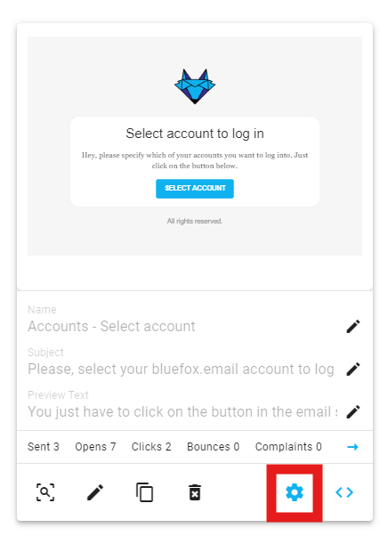

For a detailed guide on using the **Advanced Settings**, refer to the [Advanced Settings Documentation](/docs/projects/settings.html#advanced-settings).

