# Transactional Emails

Transactional emails are essential emails needed for basic functions like registration or password resets. For example, if a user wants to register with their email address or reset a forgotten password, an email must be sent.

Users **can't unsubscribe** from transactional emails because they are necessary. Also, **transactional emails are not associated with any subscriber lists**. They are sent directly to specific email addresses.

You can find the transactional emails of a project under the `Transactional Emails` tab.

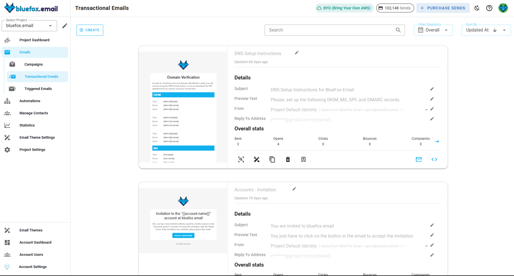

## Creating a Transactional Email

To create a new transactional email, click the `Create` button.

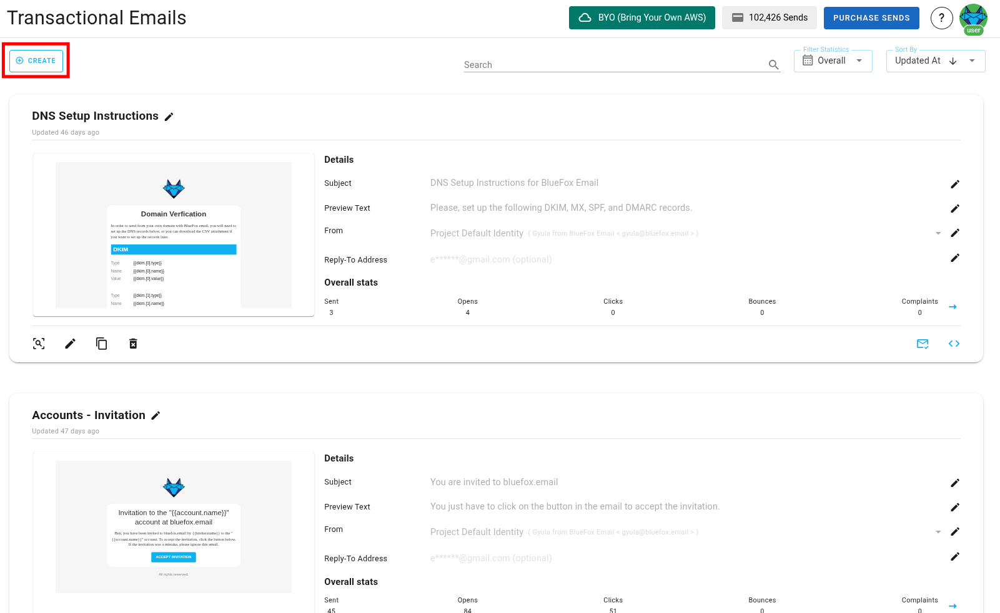

You can either paste a copied design, select a template from your design system, or start from scratch.

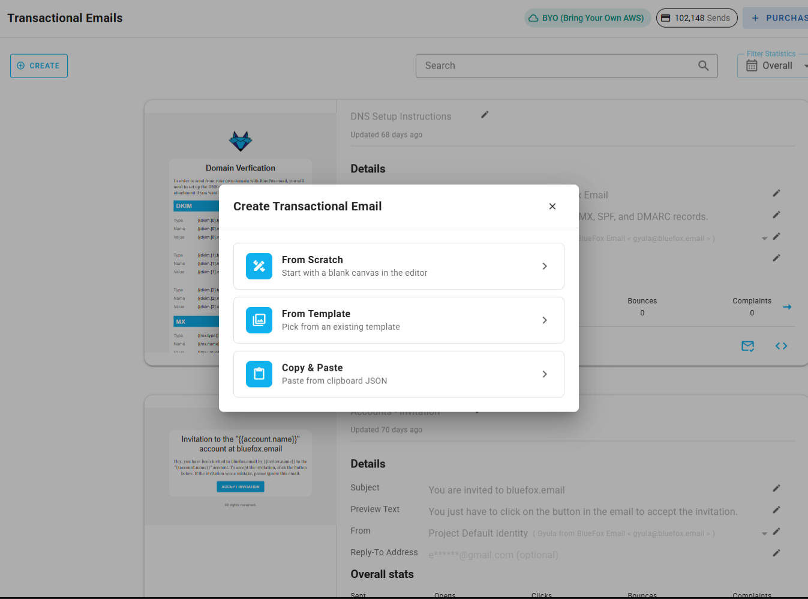

Next (if starting from template), select a template category defined in your project's design system.

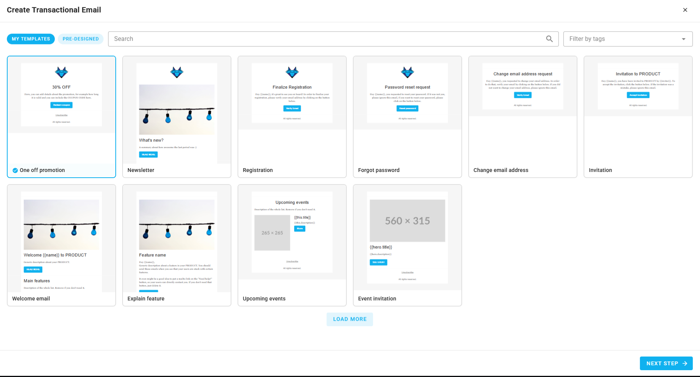

You can also choose a pre-designed template:


Then, choose a template to start from, also defined in your design system. And then click Next.

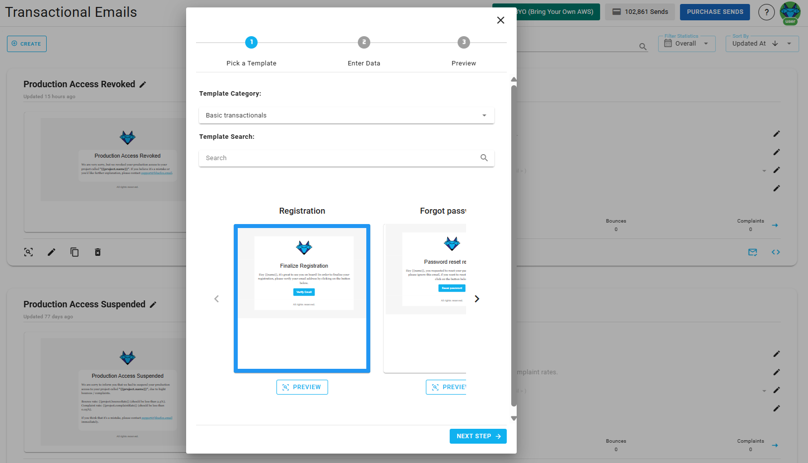

Enter the name, subject line, and preview text for your email. You can [personalize](#transactional-email-personalization) these with [merge tags](#transactional-email-personalization)!

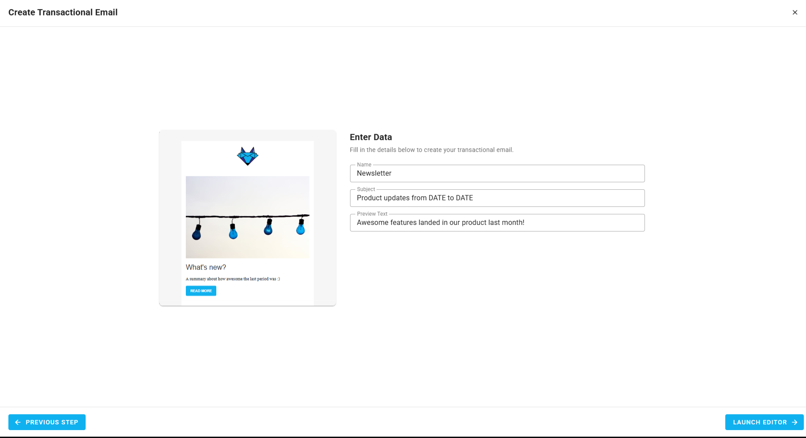

::: info This form will appear as first step if you choose to start from scratch.
:::

After that, you will see a summary page. Click "Launch Editor".

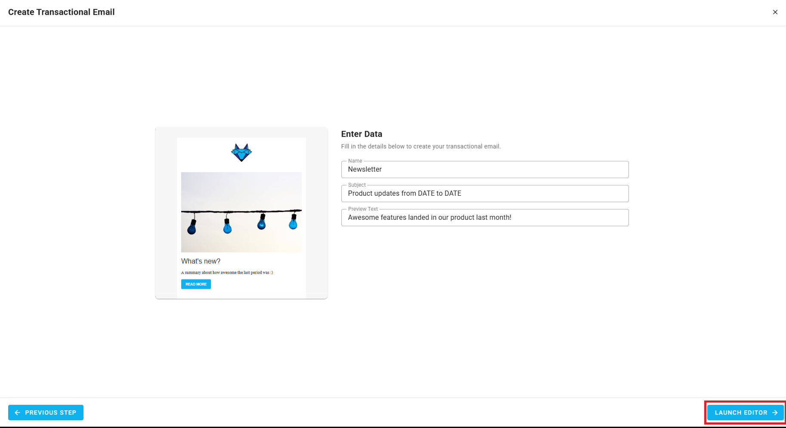

Finally, make changes in the drag-and-drop email editor:

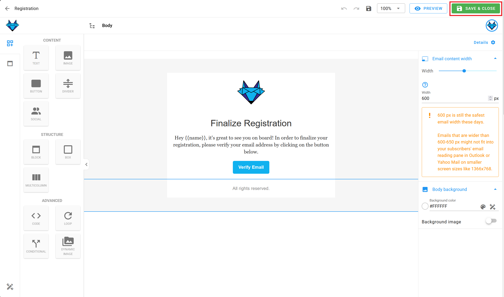

When you're done, click "Save & Close". You can make changes later as well.

## Transactional Email Integration

Every transactional email in bluefox.email has a unique URL for sending the email. Send an HTTP request to this endpoint. You can generate sample code in multiple programming languages by clicking this icon:

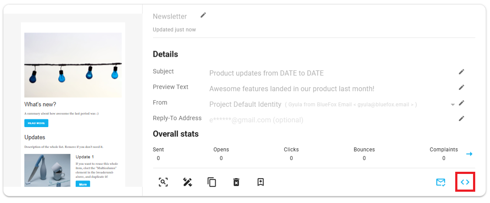

Copy the generated code to use it in your project:

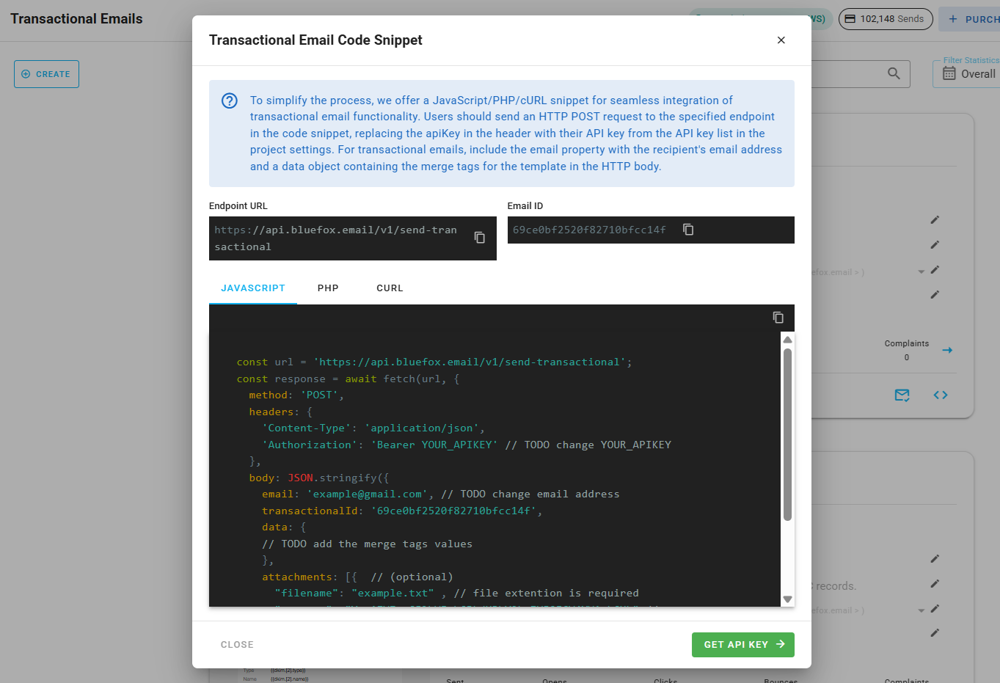

::: danger Security Warning
Your bluefox.email API key is included in the request `Authorization` header. Never send these requests from your frontend!
:::

See our [API docs](/docs/api/) for more details.

## Transactional Email Personalization

You can personalize transactional emails with [handlebars](https://handlebarsjs.com/). The data you send to the transactional email's endpoint determines the available variables. For example, you can send a user's name:

```javascript
await fetch(yourEndpoint, {
    method: 'POST',
    headers: {
        'Content-Type': 'application/json',
        'Authorization': 'Bearer YOUR_API_KEY'
    },
    body: JSON.stringify({
        email: 'joe@doe.com',
        transactionalId: 'EMAIL_ID',
        data: {
            name: 'Joe Doe'
        }
    })
})
```

You can use any handlebars variables in your email while editing. Click on the edit icon on the card:

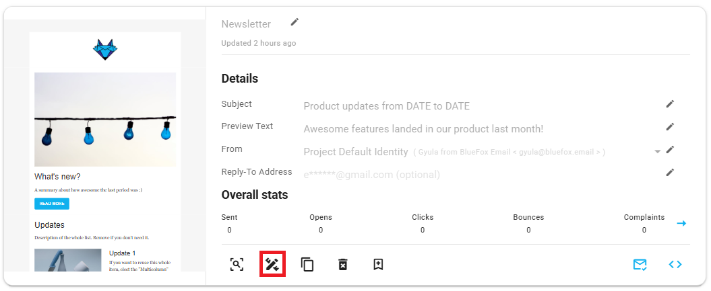

Enter your variables with Handlebars syntax:

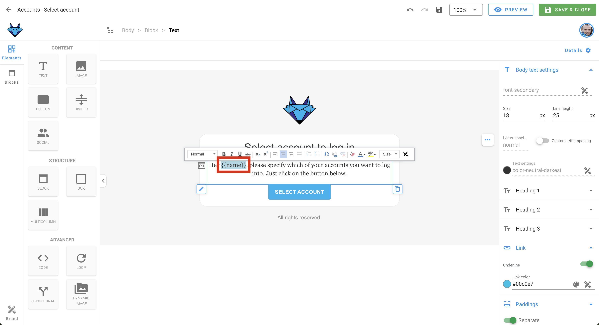

You can also use merge tags in the email's `subject line` and `preview text`!

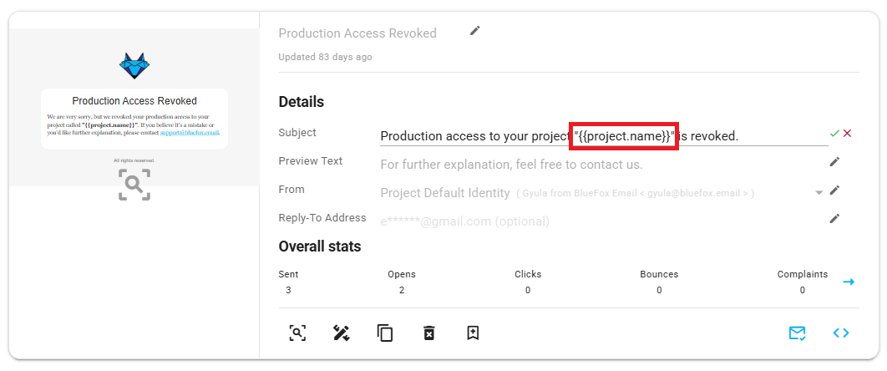

For more details, read our guide on [personalization with merge tags](/docs/email-personalization) and Handlebars.


## Transactional Email Statistics

Transactional emails are crucial for sending automated, one-to-one messages triggered by user actions, such as account registrations, order confirmations, and password resets. Tracking the performance of these emails is essential to ensure their effectiveness and timely delivery.

### Why Transactional Email Statistics Matter

Understanding how your transactional emails perform helps you:

- **Monitor Delivery Success**: Track delivery rates, opens, clicks, and bounces to ensure your emails reach your users.
- **Optimize Engagement**: By analyzing open rates and click-through rates, you can optimize your transactional email content and timing for better user engagement.
- **Identify Issues**: High bounce rates or low open rates could indicate deliverability issues, content problems, or poor list management, allowing you to take corrective action.
- **Improve Customer Experience**: Timely, well-performing transactional emails enhance the overall customer experience, increasing user satisfaction and retention.

### What Transactional Email Statistics Include

The transactional email statistics section includes the following key metrics:

- **Sent Emails**: Total number of transactional emails sent.
- **Opens**: Number of times the transactional emails were opened by recipients.
- **Unique Opens**: Number of individual recipients who opened your transactional emails (counts only one open per recipient).
- **Clicks**: Total number of clicks on links within the emails.
- **Unique Clicks**: Number of individual recipients who clicked on links within your transactional emails (counts only one click per recipient).
- **Bounces**: Number of emails that failed to be delivered.
- **Complaints**: Number of complaints (e.g., marked as spam).

By analyzing these metrics, you can ensure that your transactional email system is functioning properly and making the desired impact on your users.

You can access the **Transactional Email Statistics** by clicking the arrow icon:


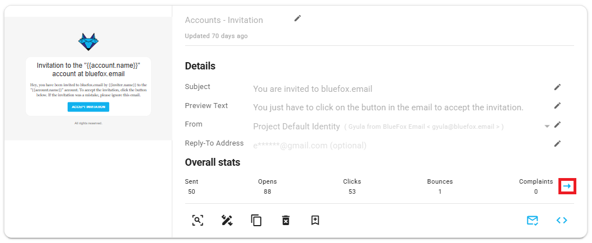

For a detailed guide on using the **Transactional Email Statistics**, refer to the [Analatics Documentation](/docs/analytics).

## Data Feeds

Data feeds allow you to automatically pull in live content from external sources directly into your transactional email. This is useful when your email needs to include up-to-date content (such as recommended articles, product highlights, or status info) without manually updating the template.

::: tip
For a full guide on using feeds inside the template (loops, merge tags, dynamic images, required behavior), see the [Data Feeds documentation](/docs/projects/data-feeds).
:::

Supported feed types:
- **RSS / Atom XML**
- **JSON**

### Adding a Feed

To add a feed, locate the **Feeds** section on your email card, just below the Details section. Click the **+ Add Feed** button.


This will expand a form where you can configure your feed:


Fill in the following fields:

- **Feed URL**: The URL of the feed you want to pull content from.
- **Feed Type**: Select the type of feed — RSS / Atom XML or JSON.
- **Variable Name**: The name you'll use to reference this feed's data inside your email template using Handlebars syntax.
- **Max Items**: The maximum number of items to pull in from the feed (defaults to 5).

You can also check the **Required** checkbox if the feed must be available for the email to send.

Once you've filled in the details, click **Preview** to verify the feed is working correctly, then click **Save** to store your configuration.

::: tip
You can add multiple feeds to a single transactional email by clicking **+ Add Feed** again after saving the first one.
:::

## Editing Details of a Transactional Email

You can edit every key detail of the transactional email like subject, preview text, from identity, etc. by clicking the edit icon on the email card:

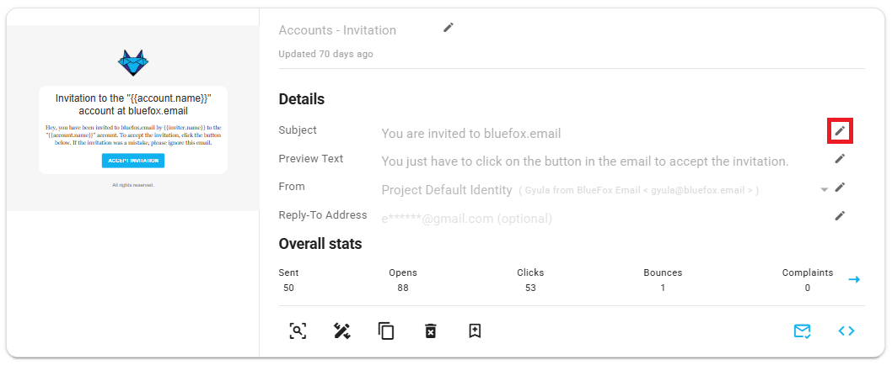

After you finish editing just click the save icon and your changes will be saved or if you want to discard them just click the close icon respectively.

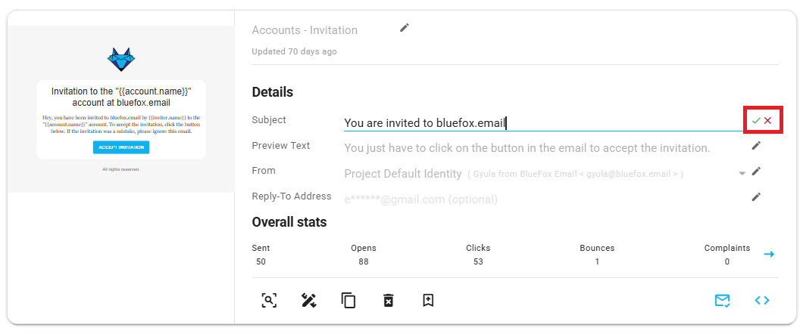

## Advanced Settings

The **Advanced Settings** in transactional email cards allows you to customize key email-sending options, providing flexibility in managing sender identities and reply-to addresses.

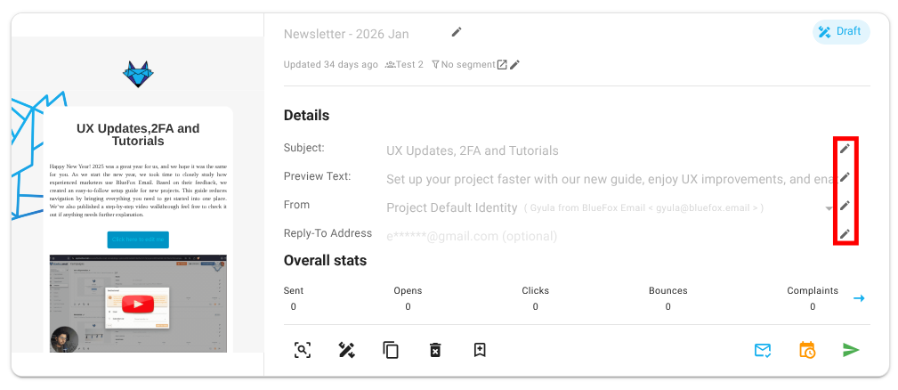

### Sender Identity Selection

The **sender identity** field lets you choose the identity used to send the email. By default, the system automatically selects the **default identity**, but you can select another identity from the list of available options.

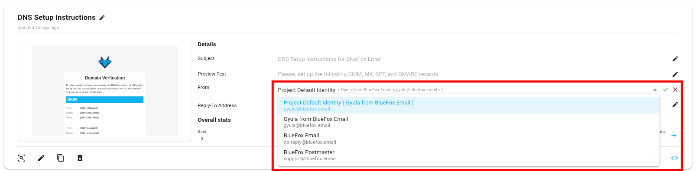

### Reply-To Email Address

The **reply-to email address** field allows you to specify where replies to your email should be sent.

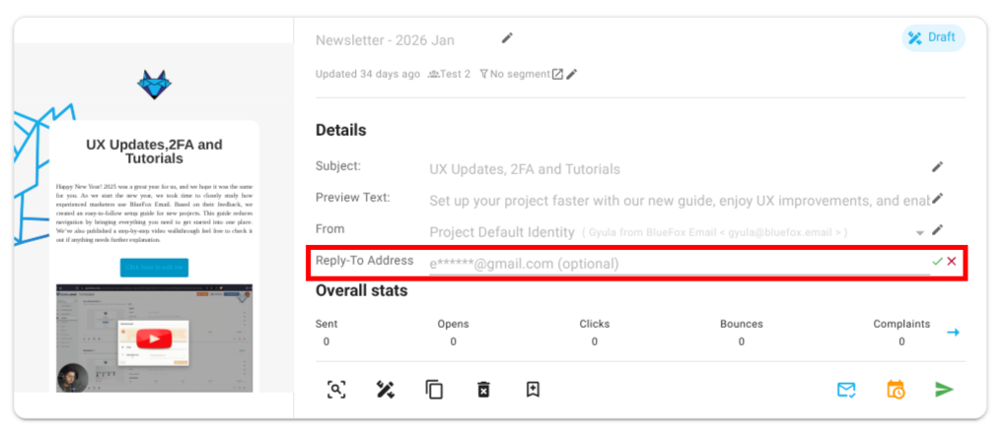
