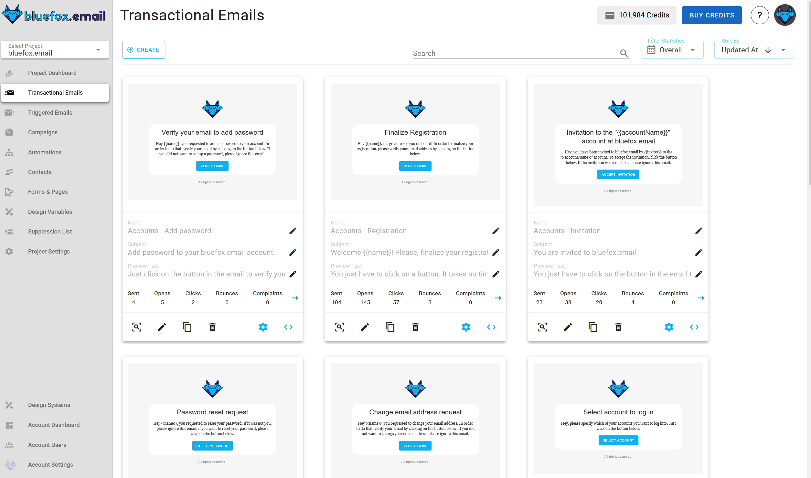
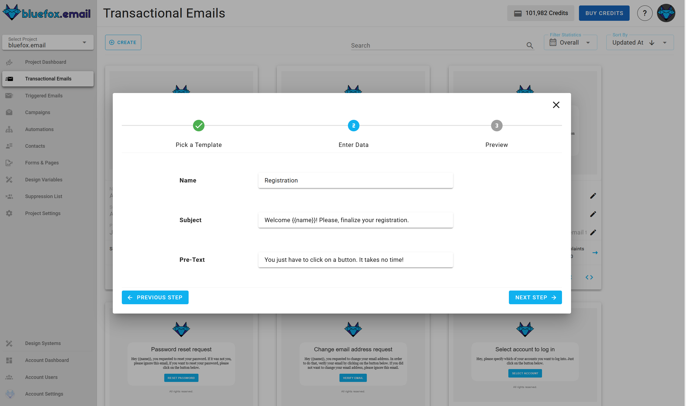
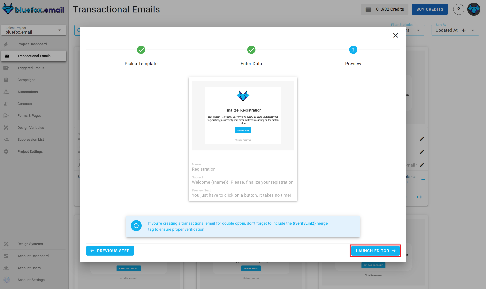
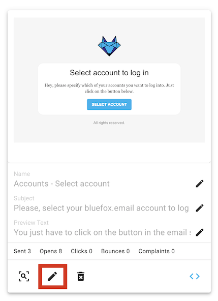
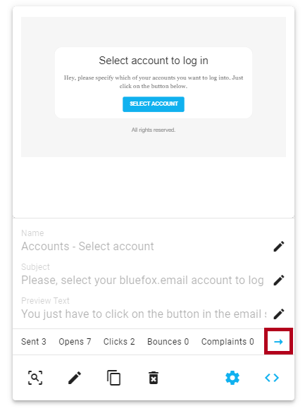

# Transactional Emails

Transactional emails are essential emails needed for basic functions like registration or password resets. For example, if a user wants to register with their email address or reset a forgotten password, an email must be sent.

Users **can't unsubscribe** from transactional emails because they are necessary. Also, **transactional emails are not associated with any subscriber lists**. They are sent directly to specific email addresses.

You can find the transactional emails of a project under the `Transactional Emails` tab.



## Creating a Transactional Email

To create a new transactional email, click the `Create` button.


Next, select a template category defined in your project's design system.


Then, choose a template to start from, also defined in your design system.


Enter the name, subject line, and preview text for your email. You can [personalize](#transactional-email-personalization) these with [merge tags](#transactional-email-personalization)!



After that, you will see a summary page. Click "Launch Editor".



Finally, make changes in the drag-and-drop email editor:


When you're done, click "Save & Close". You can make changes later as well.

## Transactional Email Integration

Every transactional email in bluefox.email has a unique URL for sending the email. Send an HTTP request to this endpoint. You can generate sample code in multiple programming languages by clicking this icon:


Copy the generated code to use it in your project:


::: danger Security Warning
Your bluefox.email API key is included in the request `Authorization` header. Never send these requests from your frontend!
:::

See our [API docs](/docs/api/) for more details.

## Transactional Email Personalization

You can personalize transactional emails with [handlebars](https://handlebarsjs.com/). The data you send to the transactional email's endpoint determines the available variables. For example, you can send a user's name:

```javascript
await fetch(yourEndpoint, {
    method: 'POST',
    headers: {
        'Content-Type': 'application/json',
        'Authorization': 'Bearer YOUR_API_KEY'
    },
    body: JSON.stringify({
        email: 'joe@doe.com',
        transactionalId: 'EMAIL_ID',
        data: {
            name: 'Joe Doe'
        }
    })
})
```

You can use any handlebars variables in your email while editing. Click on the edit icon on the card:



Enter your variables with Handlebars syntax:


You can also use merge tags in the email's `subject line` and `preview text`!


For more details, read our guide on [personalization with merge tags](/docs/email-personalization) and Handlebars.


## Transactional Email Statistics

Transactional emails are crucial for sending automated, one-to-one messages triggered by user actions, such as account registrations, order confirmations, and password resets. Tracking the performance of these emails is essential to ensure their effectiveness and timely delivery.

### Why Transactional Email Statistics Matter

Understanding how your transactional emails perform helps you:

- **Monitor Delivery Success**: Track delivery rates, opens, clicks, and bounces to ensure your emails reach your users.
- **Optimize Engagement**: By analyzing open rates and click-through rates, you can optimize your transactional email content and timing for better user engagement.
- **Identify Issues**: High bounce rates or low open rates could indicate deliverability issues, content problems, or poor list management, allowing you to take corrective action.
- **Improve Customer Experience**: Timely, well-performing transactional emails enhance the overall customer experience, increasing user satisfaction and retention.

### What Transactional Email Statistics Include

The transactional email statistics section includes the following key metrics:

- **Sent Emails**: Total number of transactional emails sent.
- **Opens**: Number of times the transactional emails were opened by recipients.
- **Unique Opens**: Number of individual recipients who opened your transactional emails (counts only one open per recipient).
- **Clicks**: Total number of clicks on links within the emails.
- **Unique Clicks**: Number of individual recipients who clicked on links within your transactional emails (counts only one click per recipient).
- **Bounces**: Number of emails that failed to be delivered.
- **Complaints**: Number of complaints (e.g., marked as spam).

By analyzing these metrics, you can ensure that your transactional email system is functioning properly and making the desired impact on your users.

You can access the **Transactional Email Statistics** by clicking the arrow icon:




For a detailed guide on using the **Transactional Email Statistics**, refer to the [Analatics Documentation](/docs/analytics).


## Advanced Settings

The **Advanced Settings** feature allows you to customize key email-sending options, such as configuring sender identities and reply-to addresses. 

You can access the **Advanced Settings** by clicking the gear icon:


For a detailed guide on using the **Advanced Settings**, refer to the [Advanced Settings Documentation](/docs/projects/settings.html#advanced-settings).

