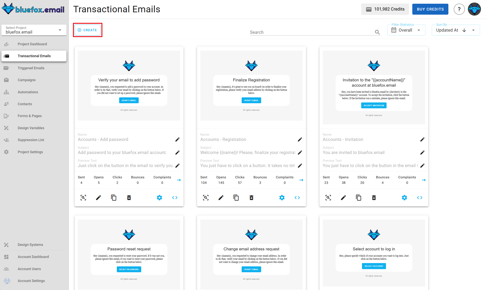
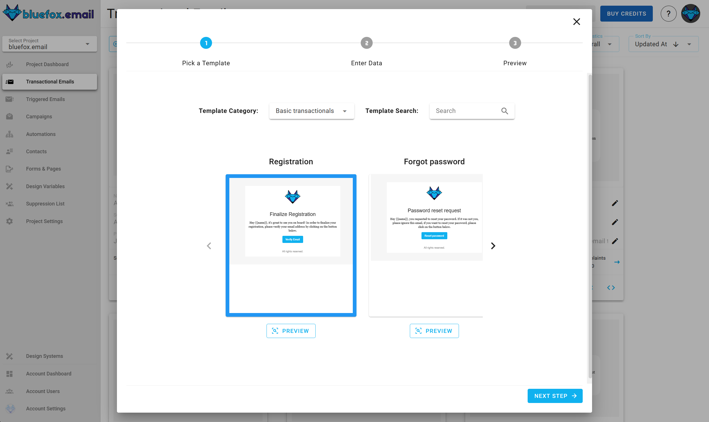
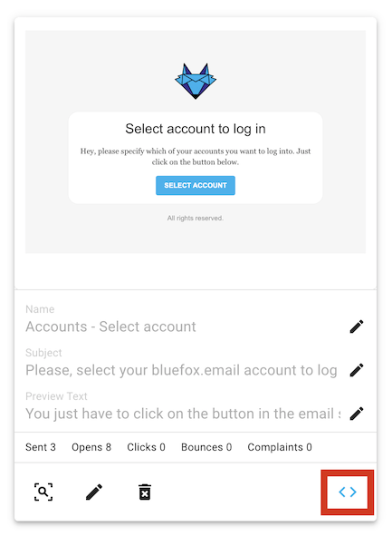
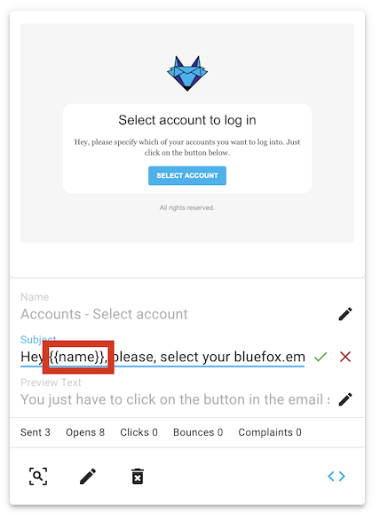

# Transactional emails

Transactional emails are emails that are needed to be sent in order for some basic functionality to work. For example, registration or forgot password emails. If a user want's to register with their email address or they forgot their password, and want to reset it, then sending an email to that person is a must.

That is why users **can't unsubscribe** from transactional emails. Another consequence is, that **transactional emails are not associated with any subscriber lists**. They are directly sent to a specific email address, not to a list nor a subset of a list.

You can find the transactional emails of a project under the `Transactional Emails` tab.


## Creating a transactional email

In order to create a new transactional email, press the `Create` button.


Then, select a template category. These template categories are defined in your project's design system.


After that, you will have to select a template to start from. These templates are also defined in your project's design system.



Enter it's name, subject line, and preview text. Note that you can [personalize](/docs/personalization) your subject line and preview text with [merge tags](/docs/personalization)!


After that, you will see a summary page, press "Launch Editor".


Finally, make changes in the drag 'n' drop email editor:

And press "Save & Close" when you are done. You can make changes later as well.

## Transactional email integration

Every transactional email in bluefox.email has a unique URL, with which you can send that email. You just have to send an HTTP request to that endpoint. A sample code is generated in multiple programming languages if you click on the following icon:



And then you can copy the code to use it in your project:


::: danger Security warning
Keep in mind that one of your bluefox.email API keys is included in the request `Authorization` header. That is why you should never send these requests from your frontend!
:::

Please, see our [API docs](/docs/api/) for more details.

## Transactional email personalization

You can personalize your transactional emails with [handlebars](https://handlebarsjs.com/). The data available is dependent on what you send to the transactional email's endpoint. You can include any custom data on the data field of the request body. For example, you can send your user's name to our endpoint:

```javascript
await fetch(yourEndpoint, {
    method: 'POST',
    headers: {
        'Content-Type': 'application/json',
        'Authorization': 'Bearer YOUR_API_KEY'
    },
    body: JSON.stringify({
        email: 'joe@doe.com',
        data: {
            name: 'Joe Doe'
        }
    })
})
```

You can use any handlebars variables in your email, while editing. Click on the edit icon on the card:


And enter your variables with Handlebars syntax:


And you can use merge tags in the email's `subject line` and `preview text` as well!



For more, read our full-fledged guide about [personalization with merge tags](/docs/personalization) and Handlebars.
