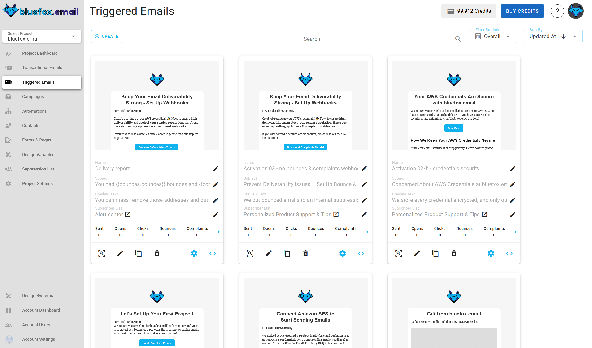
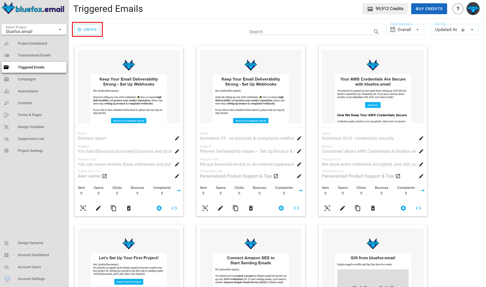
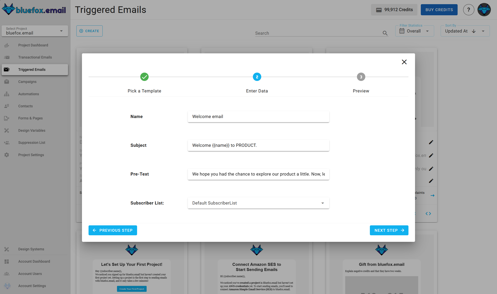
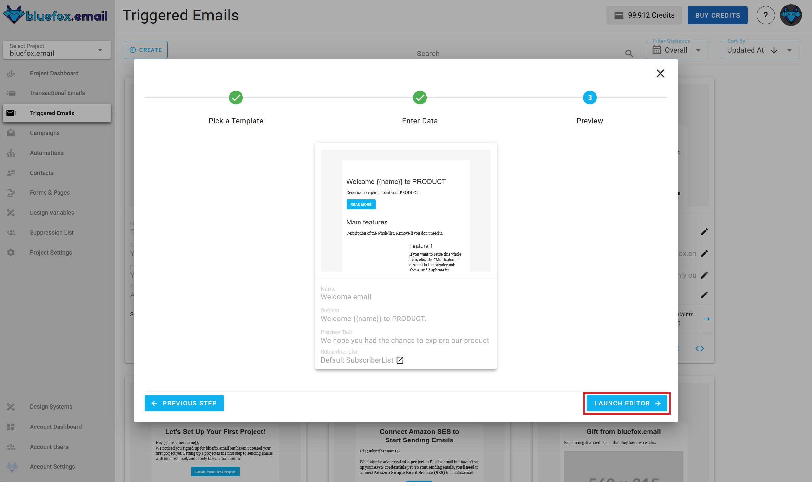
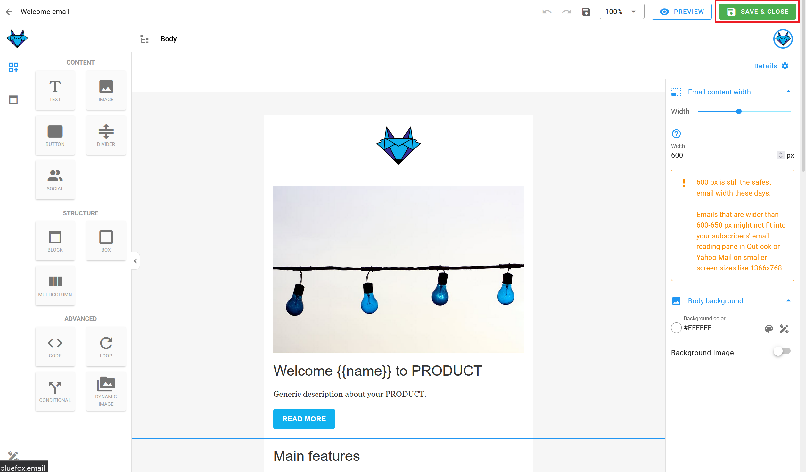
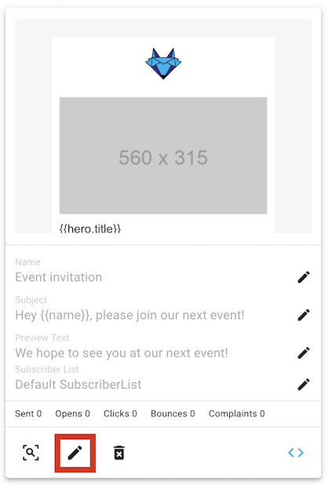

# Triggered Emails

Triggered emails are similar to transactional emails because they are also triggered from your backend (or a cron job). However, they are different because they are tied to a subscriber list. You can send triggered emails to the entire list or to specific email addresses. The emails will only be sent to the `active` subscribers on that list. If someone has unsubscribed, paused their subscription, or is not on the list, the email won't be sent.

For example, event notifications or weekly digest emails should be implemented using triggered emails. Users can `unsubscribe` from these emails or `pause their subscription`, which might significantly reduce unsubscribe rates. This is why an unsubscribe link is required in these emails. A pause subscription link is not required but is recommended.

If you want to create email automations, use triggered emails. For instance, you can implement onboarding sequences: a user signs up, you send a welcome email, a day later, a link to a tutorial, and three days later, another one. You can also send emails based on user behavior, such as sending a targeted email if a user hasn't completed an important action in your app.

You can find the triggered emails of a project under the `Triggered Emails` tab.



## Creating a Triggered Email

To create a new triggered email, press the `Create` button.



Next, select a template category defined in your project's design system:


Then, choose a template to start with:


Enter its name, subject line, and preview text:



The next step is to select a subscriber list:


After that, you will see a summary page. Click "Launch Editor".



Finally, make changes in the drag-and-drop email editor:



When you're done, click "Save & Close". You can make changes later as well.

## Triggered Email Integration

Every triggered email in bluefox.email has a unique URL for sending the email. Send an HTTP request to this endpoint. You can generate sample code in multiple programming languages by clicking this icon:


Copy the generated code to use it in your project:


::: tip Keep in Mind!
1) You can send a triggered email to multiple recipients by sending an array of email addresses in the `emails` field of the data property in the request body.
2) Recipients can unsubscribe from triggered emails or pause their subscriptions. Providing an unsubscribe link is mandatory, so ensure you include an `unsubscribeLink` in your email.
:::

::: danger Security Warning
Your bluefox.email API key is included in the request `Authorization` header. Never send these requests from your frontend!
:::

Please see our [API docs](/docs/api/) for more details.

## Triggered Email Personalization

You can personalize triggered emails with [handlebars](https://handlebarsjs.com/). The data you send to the triggered email's endpoint determines the available variables. For example, you can send the hero unit's title and description:


```javascript
await fetch(yourEndpoint, {
    method: 'POST',
    headers: {
        'Content-Type': 'application/json',
        'Authorization': 'Bearer YOUR_API_KEY'
    },
    body: JSON.stringify({
        emails: ['joe@doe.com', 'jane@doe.com'],
        data: {
            hero: {
              title: "Bluefox is GREAT",
              description: "You can send transactional emails, triggered emails, newsletters and promotional emails with the same software!!!"
            }
        }
    })
})
```

Since triggered emails are sent to a subscriber list, subscriber data, an unsubscribe link, and a pause subscription link are also included. You can use the following merge tags:
```
{{subscriber.name}}
{{subscriber.email}}
{{ubsubscribeLink}}
{{pauseSubscriptionLink}}
```

You can use any Handlebars variables in your email while editing. To do this, click on the edit icon on the card:



Enter your variables using Handlebars syntax:


You can also use merge tags in the email's `subject line` and `preview text`!


For more details on how to personalize your emails with merge tags and Handlebars, check out our [personalization guide](/docs/personalization).

