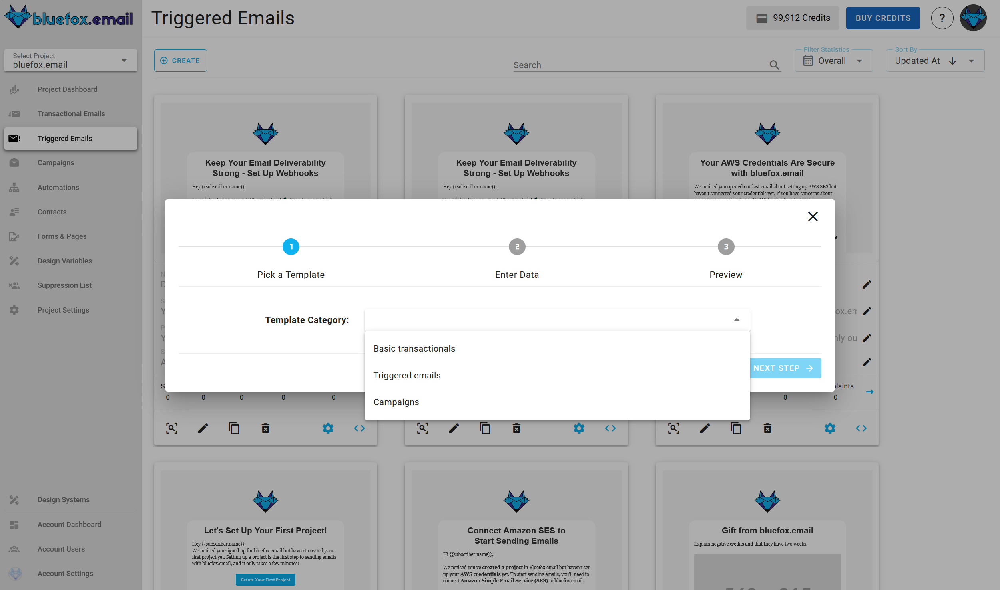
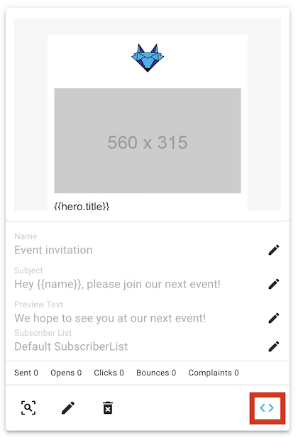
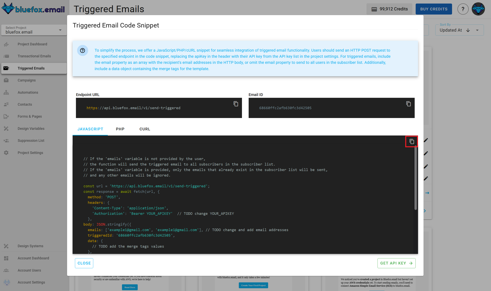
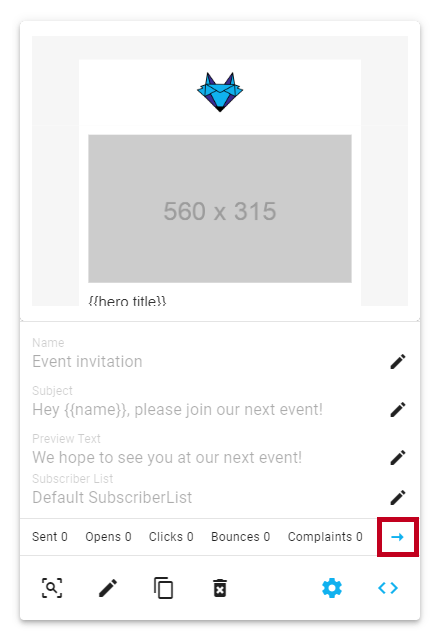

# Triggered Emails

Triggered emails are similar to transactional emails because they are also triggered from your backend (or a cron job). However, they are different because they are tied to a subscriber list. You can send triggered emails to the entire list or to specific email addresses. The emails will only be sent to the `active` subscribers on that list. If someone has unsubscribed, paused their subscription, or is not on the list, the email won't be sent.

For example, event notifications or weekly digest emails should be implemented using triggered emails. Users can `unsubscribe` from these emails or `pause their subscription`, which might significantly reduce unsubscribe rates. This is why an unsubscribe link is required in these emails. A pause subscription link is not required but is recommended.

If you want to create email automations, use triggered emails. For instance, you can implement onboarding sequences: a user signs up, you send a welcome email, a day later, a link to a tutorial, and three days later, another one. You can also send emails based on user behavior, such as sending a targeted email if a user hasn't completed an important action in your app.

You can find the triggered emails of a project under the `Triggered Emails` tab.


## Creating a Triggered Email

To create a new triggered email, press the `Create` button.


Next, select a template category defined in your project's design system:



Then, choose a template to start with (also defined in your project's design system):


Enter its name, subject line, preview text, and select a subscriber list:


After that, you will see a summary page. Click "Launch Editor".


Finally, make changes in the drag-and-drop email editor:


When you're done, click "Save & Close". You can make changes later as well.

## Triggered Email Integration

Every triggered email in bluefox.email has a unique URL for sending the email. Send an HTTP request to this endpoint. You can generate sample code in multiple programming languages by clicking this icon:



Copy the generated code to use it in your project:



::: tip Keep in Mind!
1) You can send a triggered email to multiple recipients by sending an array of email addresses in the `emails` field of the data property in the request body.
2) Recipients can unsubscribe from triggered emails or pause their subscriptions. Providing an unsubscribe link is mandatory, so ensure you include an `unsubscribeLink` in your email.
:::

::: danger Security Warning
Your bluefox.email API key is included in the request `Authorization` header. Never send these requests from your frontend!
:::

Please see our [API docs](/docs/api/) for more details.

## Triggered Email Personalization

You can personalize triggered emails with [handlebars](https://handlebarsjs.com/). The data you send to the triggered email's endpoint determines the available variables. For example, you can send the hero unit's title and description:


```javascript
await fetch(yourEndpoint, {
    method: 'POST',
    headers: {
        'Content-Type': 'application/json',
        'Authorization': 'Bearer YOUR_API_KEY'
    },
    body: JSON.stringify({
        emails: ['joe@doe.com', 'jane@doe.com'],
        triggeredId: 'EMAIL_ID',
        data: {
            hero: {
              title: "Bluefox is GREAT",
              description: "You can send transactional emails, triggered emails, newsletters and promotional emails with the same software!!!"
            }
        }
    })
})
```

Since triggered emails are sent to a subscriber list, subscriber data, an unsubscribe link, and a pause subscription link are also included. You can use the following merge tags:
```
{{subscriber.name}}
{{subscriber.email}}
{{unsubscribeLink}}
{{pauseSubscriptionLink}}
```

You can use any Handlebars variables in your email while editing. To do this, click on the edit icon on the card:


Enter your variables using Handlebars syntax:


You can also use merge tags in the email's `subject line` and `preview text`!


For more details on how to personalize your emails with merge tags and Handlebars, check out our [personalization guide](/docs/personalization).


## Triggered Email Statistics

Triggered emails are automated messages sent in response to specific user actions, such as password resets, account verification, or abandoned cart reminders. Monitoring the performance of these emails is essential to ensure timely delivery, optimal engagement, and proper subscriber management.


### Why Triggered Email Statistics Matter

Understanding how your triggered emails perform helps you:

- **Ensure Timely Delivery**: Track delivery rates to make sure the triggered emails are sent when needed.
- **Improve User Engagement**: Analyzing open rates and click-through rates lets you optimize email content and timing, ensuring recipients engage with your emails.
- **Detect Issues**: High bounce rates or low open rates can indicate problems with email deliverability or content, allowing you to fix issues early. Additionally, triggered emails can have actions like pausing or unsubscribing users, so it's important to monitor these metrics to understand why certain subscribers are no longer receiving emails.
- **Manage Subscriber Behavior**: Subscriber actions such as pausing, unsubscribing, resubscribing, or subscribing again to email lists need to be tracked to maintain clean and effective lists.
- **Enhance Customer Experience**: Effective triggered emails improve user satisfaction by delivering relevant and timely content that enhances the user experience.

### What Triggered Email Statistics Include

The triggered email statistics section includes the following key metrics:

- **Sent Emails**: Total number of sent emails.
- **Opens**: Number of times email were opened by recipients.
- **Unique Opens**: Number of individual recipients who opened your emails (counts only one open per recipient).
- **Clicks**: Total number of clicks on links within the emails.
- **Unique Clicks**: Number of individual recipients who clicked on links within your emails (counts only one click per recipient).
- **Bounces**: Number of emails that failed to be delivered.
- **Complaints**: Number of complaints (e.g., marked as spam).
- **Unsubscribes**: Number of recipients who unsubscribed from receiving further emails.
- **Paused Subscriptions**: Number of recipients who paused their subscription.
- **Resubscribes**: Number of recipients who resubscribed to receive emails after previously unsubscribing.
- **Subscribed**: Number of recipients who subscribed to receive emails.

By analyzing these metrics, you can ensure that your triggered emails are performing effectively, reaching the right audience, and making adjustments to your email strategy when necessary.

### How to Access Triggered Email Stats

You can access the **Triggered Email Statistics** by clicking the arrow icon:



For more information on using the **Triggered Email Statistics**, refer to the [Analytics Documentation](/docs/analytics).


## Advanced Settings

The **Advanced Settings** feature allows you to customize key email-sending options, such as configuring sender identities and reply-to addresses. 

You can access the **Advanced Settings** by clicking the gear icon:


For a detailed guide on using the **Advanced Settings**, refer to the [Advanced Settings Documentation](/docs/projects/settings.html#advanced-settings).


