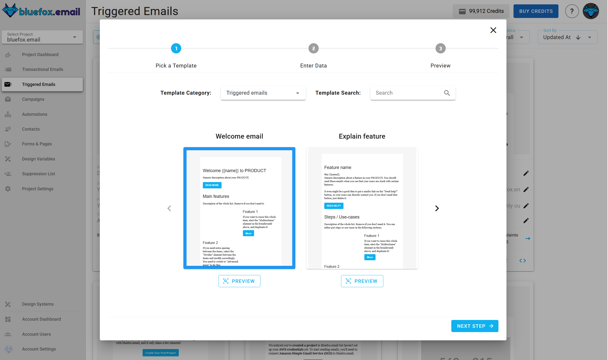
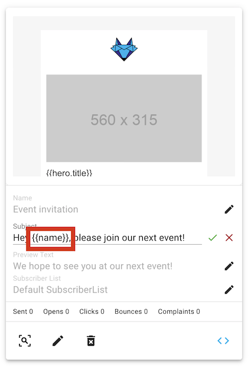

# Triggered emails

Triggered emails are similar to transactional emails in the sense, that they are also triggered from your backend (or your cron job), but it's very different, because it is tied to a subscriber list. You can send triggered emails to the whole list, or only to certain email addresses. The emails will only sent to the `active` subscribers on that list. (So if someone unsubscribed or paused their subscription, or not on the list, the email won't be sent.)

For example, an event notification email or a weekly digest email should be implemented by triggered emails. The point is that users can `ubsubscribe` from these emails or they can even `pause their subscription` for a while, which might decrease unsubscribe rate radically. This is why an unsubscribe link is required in these emails. A pause subscription link is not required, but advised.

If you wish to create email automations, those should also be implemented by triggered emails. For example, you can implement on-boarding sequences: a user signs up, you send a welcome email, a day later a link to a tutorial, 3 days later another one. But it might be even a better idea, to send the emails based on user-behavior, not just a simple sequence. So, for example, if you see that your user did not do an important action in your app, you can send a targeted email that only explains that action and its importance.

You can find the triggered emails of a project under the `Triggered emails` tab.


## Creating a triggered email

In order to create a new triggered email, press the `Create` button.


Next, select a template category defined in your project's design system:


After that, you will have to select a template to start from:



Enter it's name, subject line, and preview text:


The next step is to select a subscriber list:


After that, you will see a summary page. Click "Launch Editor".


Finally, make changes in the drag 'n' drop email editor:


When you're done, click "Save & Close". You can make changes later as well.


## Triggered email integration

Every triggered email in bluefox.email has a unique URL for sending the email. Send an HTTP request to this endpoint. You can generate sample code in multiple programming languages by clicking this icon:


Copy the generated code to use it in your project:


::: tip Keep in mind!
1) You can send a triggered email to multiple recipients. Just send an array of email addresses on the `emails` field on the data property on the request body.
2) Recipients can unsubscribe from triggered emails, or pause their subscriptions. Providing an unsubscribe link is obligatory, so you must have an `unsubscribeLink` in your email.
:::

::: danger Security warning
Your bluefox.email API key is included in the request `Authorization` header. Never send these requests from your frontend!
:::

Please, see our [API docs](/docs/api/) for more details.

## Triggered email personalization

You can personalize transactional emails with [handlebars](https://handlebarsjs.com/). The data you send to the transactional email's endpoint determines the available variables. For example, you can send a the hero unit's title and description:

```javascript
await fetch(yourEndpoint, {
    method: 'POST',
    headers: {
        'Content-Type': 'application/json',
        'Authorization': 'Bearer YOUR_API_KEY'
    },
    body: JSON.stringify({
        emails: ['joe@doe.com', 'jane@doe.com'],
        data: {
            hero: {
              title: "Bluefox is GREAT",
              description: "You can send transactional emails, triggered emails, newsletters and promotional emails with the same software!!!"
            }
        }
    })
})
```

Since triggered emails are sent to a subscriber list, subscriber data, unsubscribe link, and pause subscription link are also included. You can use the following merge tags:
```
{{subscriber.name}}
{{subscriber.email}}
{{ubsubscribeLink}}
{{pauseSubscriptionLink}}
```

You can use any handlebars variables in your email while editing. Click on the edit icon on the card:


Enter your variables with Handlebars syntax:


And you can use merge tags in the email's `subject line` and `preview text` as well!


