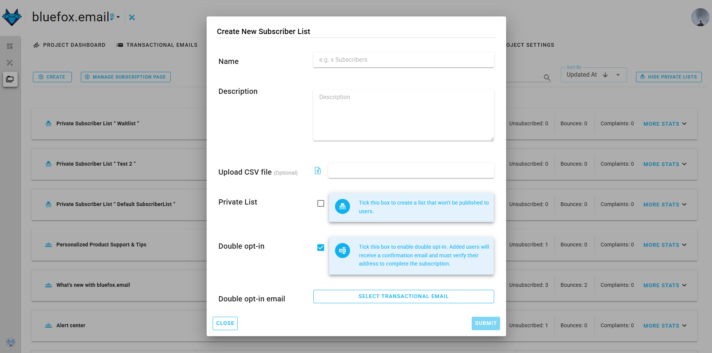
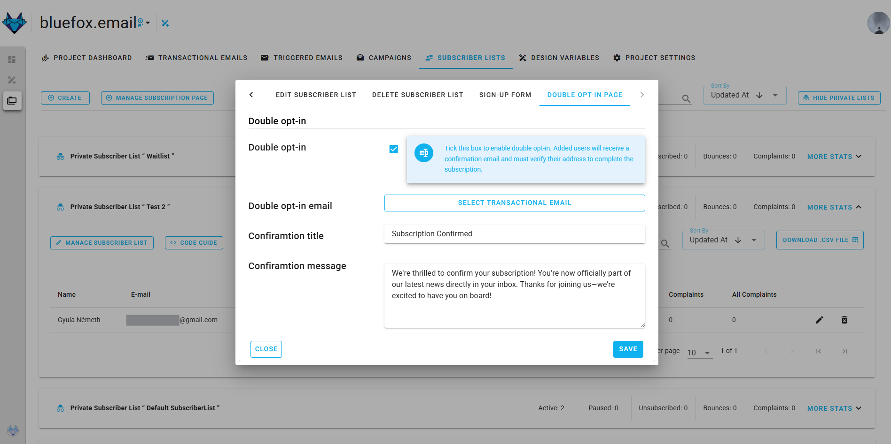

# What is Double Opt-In?

**Double opt-in** is a process often used in email marketing and online registrations to ensure that individuals genuinely want to receive communications or access certain services. It adds an extra layer of confirmation to verify the user's intent. Here's how it typically works:

1. **Initial Sign-Up**: The user fills out a form with their email address and sometimes other information to sign up for a newsletter, service, or account.

2. **Confirmation Email**: After submitting the form, the user receives an email asking them to confirm their subscription or registration. This email usually contains a unique link that the user must click to verify their email address and complete the sign-up process.

3. **Final Confirmation**: Once the user clicks the confirmation link, they are officially added to the mailing list or granted access to the service. Until this step is completed, the user is not fully subscribed or registered.

## Benefits of Double Opt-In

- **Reduces Spam**: Ensures that only people who genuinely want to subscribe are added to the list, reducing the likelihood of spam complaints.
- **Improves Email Deliverability**: Helps maintain a clean email list by ensuring that all addresses are valid and belong to people who are actually interested.
- **Compliance with Regulations**: Helps businesses comply with data protection laws like GDPR (General Data Protection Regulation) in Europe, which require clear and explicit consent before sending marketing communications.

Overall, double opt-in provides a more secure and user-friendly way to manage subscriptions and communications.

## Activating Double Opt-In

You can activate double opt-in while creating or managing a subscriber list.

### 1. Activate During Subscriber List Creation

- Go to the **Subscriber Lists** section.
- Click the **Create New List** button.
- Fill in the required fields.
- Check the box for **Double Opt-In**.
- Select the **Double Opt-In Email** from the available transactional emails.

::: info Important
The selected email must include the ``verifyLink`` merge tag to generate the confirmation link.
:::

- Click **Create** to finalize the list with double opt-in enabled.

### 2. Activate from Manage Subscriber List

- Go to **Subscriber Lists** and select the list you want to manage.
- Open the **Double Opt-In** tab.
- Check the **Activate Double Opt-In** box.
- Select the **Double Opt-In Email** with the ``verifyLink`` merge tag.
- Click **Save** to apply the changes.

---

## Customizing the Confirmation Message

Once double opt-in is activated, you can customize the message shown to subscribers after they confirm their email:

- Go to the **Double Opt-In** tab.
- Enter the **Confirmation Title** (e.g., "Thank You for Confirming!").
- Enter the **Confirmation Message** to greet your subscribers.
- Click **Save**.

