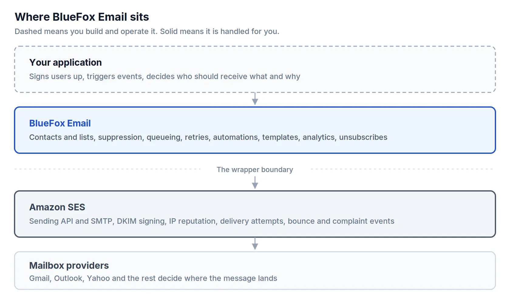
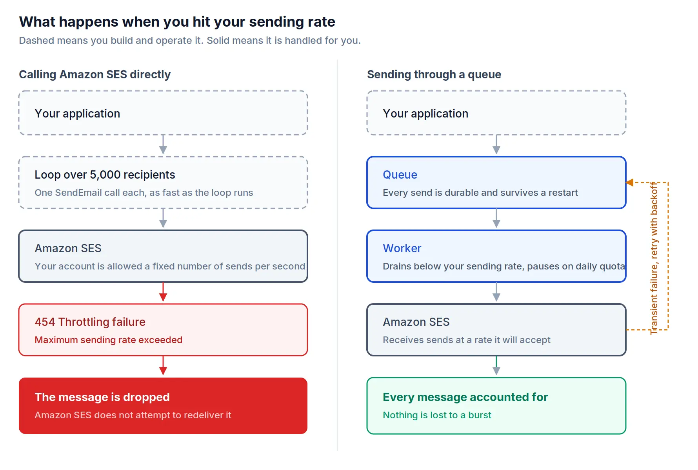
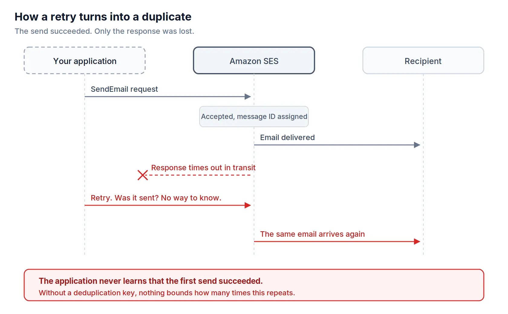
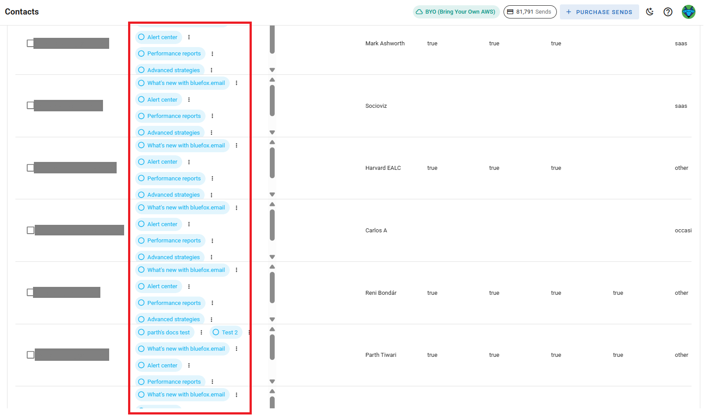
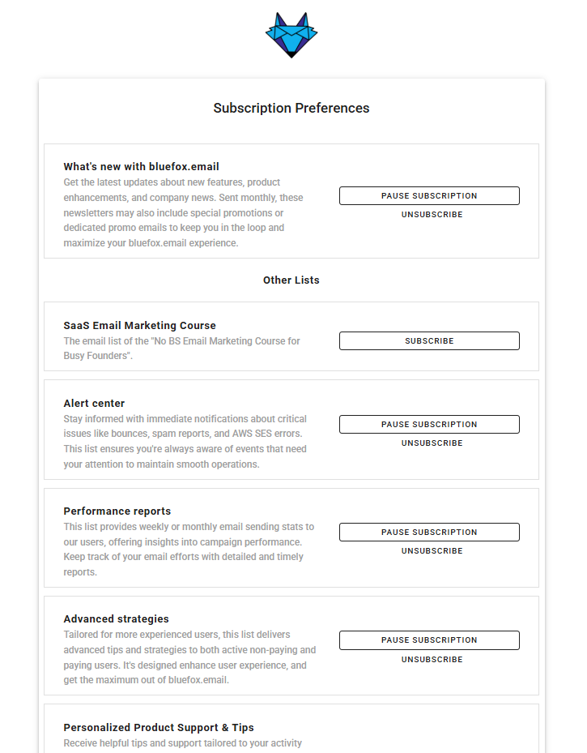
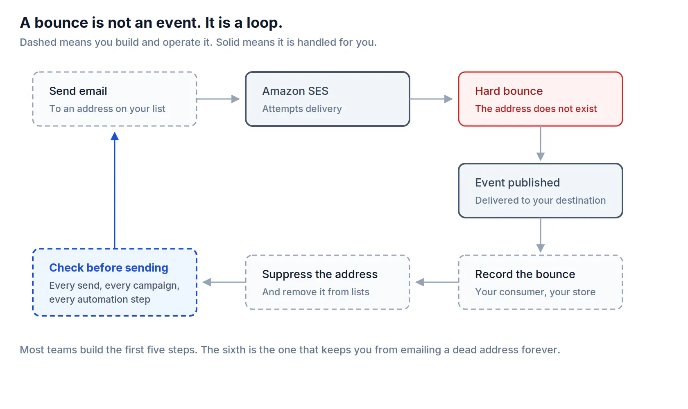
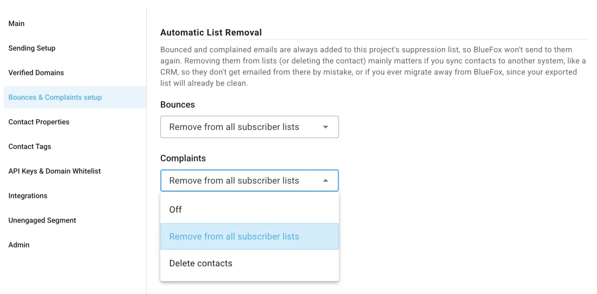
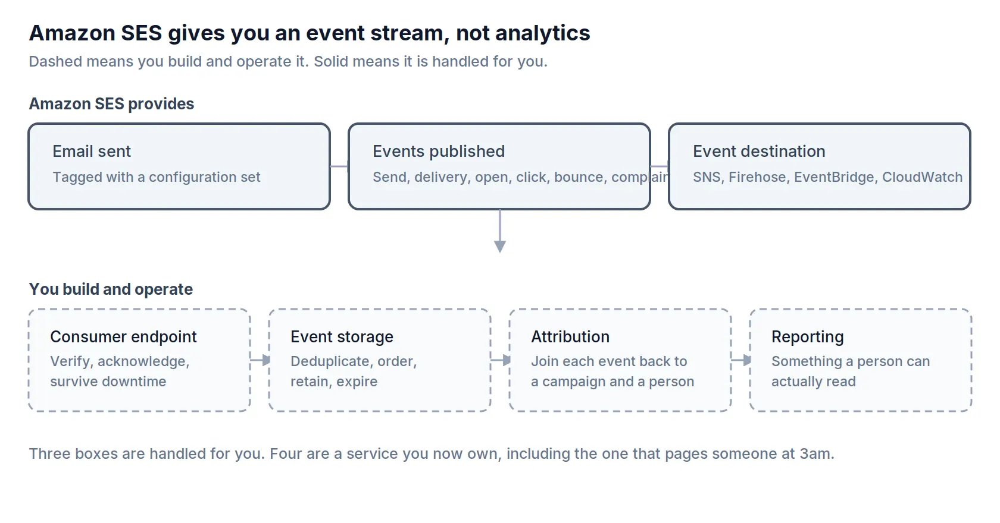
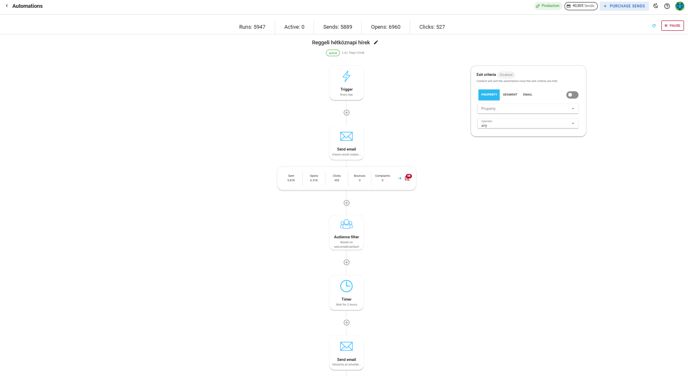
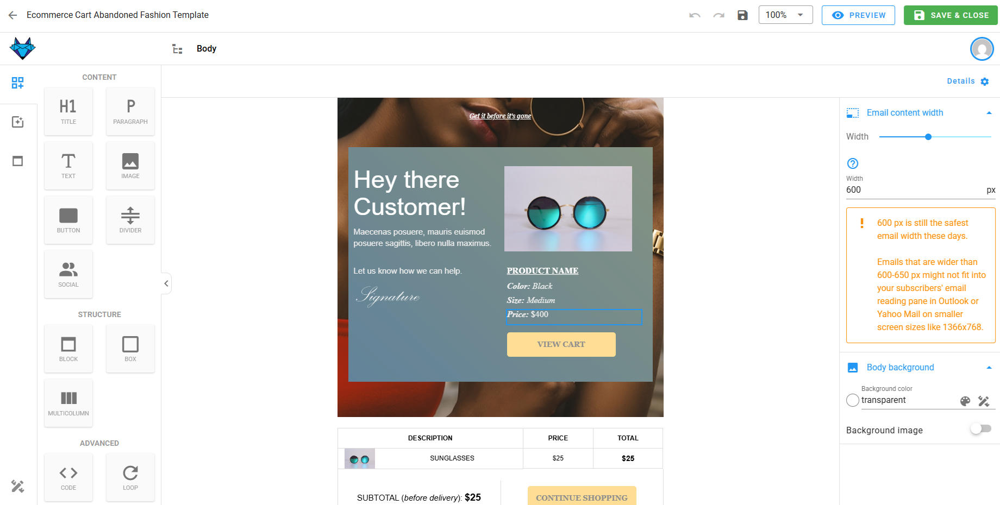

# BlueFox Email Is an Amazon SES Wrapper

*Every email we send goes through Amazon SES. This article is about the part that happens before it gets there.*

:::tip TL;DR

| Amazon SES gives you | You build the rest |
|---|---|
| A sending API and an SMTP interface | Queueing, rate limiting, scheduling |
| DKIM signing and IP reputation | Deduplication so a retry does not send twice |
| An account-level suppression list | Contact lists, segments, subscription preferences |
| Bounce and complaint events | A consumer, a store, and a suppression check before every send |
| An event stream | Anything a person can actually read |
| Templates with replacement values | A way for a non-developer to change one |

Amazon SES is a very good sending layer. It was never meant to be everything else.

:::

## Yes, BlueFox Email is an Amazon SES wrapper

We are not going to argue with the label.

BlueFox Email does not operate its own mail transfer agents or its own IP reputation. When you press send, the message is eventually handed to Amazon SES, and SES delivers it. If that is your definition of a wrapper, then yes, that is what we are.

The interesting question is not whether there is a layer. It is what that layer contains, and whether you would rather build it yourself.

This article answers that honestly. For some of you the answer will be that you should skip us and call SES directly, and we say so plainly near the end. For the rest, this is a fairly complete inventory of the work involved, based on what Amazon documents publicly.

## Why Amazon SES stops where it does

It helps to know why the gap exists, because it is not an oversight.

Amazon built AWS to serve Amazon. The company wanted to sell books everywhere, then everything everywhere, and that required infrastructure it could not buy. SES was one piece of it: a way to send order confirmations, shipping notices and password resets quickly and reliably, at a scale very few companies needed at the time.

Having built it, Amazon opened it to the public. The infrastructure already existed, and there was clearly a business in renting it out.

But notice what Amazon itself needed from email. Transactional messages, triggered by events in a system, in enormous volume. What Amazon did not need was a marketing team building a nurture sequence, or a designer changing the header of a receipt without filing a ticket. Amazon's own email problems were engineering problems, so SES was built as an engineering tool.

That is why SES looks the way it does. Not because Amazon failed to finish it, but because it was finished for a different job. Treating SES as an incomplete marketing platform misreads what it is. It is an excellent SMTP layer, and that is a legitimate business on its own.

## What Amazon SES actually gives you

Before describing the gap, it is worth being accurate about what is already there, because a lot of writing on this subject understates it.

Out of the box, SES gives you:

* a sending API and an SMTP interface, in multiple AWS Regions
* DKIM key management and signing, plus the DNS records for SPF and DMARC
* shared IP pools, with dedicated and managed dedicated IPs available
* an account-level suppression list that records bounces and complaints
* configuration sets and event publishing to [SNS](/aws-concepts/sns), Amazon Data Firehose, EventBridge and CloudWatch
* email templates with replacement values
* basic contact lists with topics
* Virtual Deliverability Manager, a paid add-on with deliverability dashboards and recommendations

That is a real feature set. If somebody tells you SES is just an SMTP relay, they have not read the documentation.

The gap is not in the sending. It is in everything between "I have a list of people" and "the right message reached each of them exactly once, at the right time."

## Sending queues and rate limits

This is the hardest part, and the one that is most consistently underestimated.

**What email needs.** Your sending is bursty and the service you are sending through is not. A campaign to twenty thousand people arrives as one instruction and has to leave as twenty thousand individual messages, paced to something SES will accept, and it has to finish even if your server restarts halfway through.

**What building it involves.** SES enforces two limits per Region: a [maximum sending rate](/aws-concepts/ses-sending-rate) in emails per second, and a daily quota over a rolling 24 hour window. New accounts start in the sandbox at one email per second and 200 emails per 24 hours. Both limits count recipients rather than messages, so a message with 30 recipients spends 30 of your quota.

Here is the part that matters. When you exceed either limit, SES does not hold the message for you. The AWS documentation is unambiguous: SES drops the message and does not attempt to redeliver it. Through the API you get a `Throttling` error with the message "Maximum sending rate exceeded", and through SMTP you get `454 Throttling failure` after the DATA command.

A dropped message is not a delayed message. Nobody receives it, and unless you wrote something down before the call, you no longer know who was supposed to.

The usual first answer is that the AWS SDKs retry automatically. They do, and it is not enough. SDK retries are sized for an occasional collision, not for a loop that is running an order of magnitude faster than your allowed rate. A sustained burst exhausts the retry budget and then starts failing, which is exactly the situation a campaign creates.

So you need a real queue, and a real queue means:

* every intended send is written down durably before you call SES, not after
* a worker drains it at a rate below your sending limit
* rate errors back off with jitter, while daily quota exhaustion pauses instead of retrying, because retrying does not create capacity
* the whole thing resumes correctly after a deploy, a crash or a scale-down event
* you can see what is in the queue, and stop a send that should not have gone out

The last two are what separate a queue from a rate limiter, and they are usually the ones added after the first incident rather than before it.

**What BlueFox does.** Every [transactional email, triggered email, campaign and automation email](/posts/transactional-triggered-campaign-or-automation-understanding-email-types) goes through our queue. Your application makes one call and is done. We pace the send, handle transient failures, and survive our own restarts without losing your messages.

New BlueFox projects also start in a [sandbox](/docs/projects/delivery-modes), limited to one email per second and 100 emails per day. Moving to production means verifying your domain and requesting access, and keeping that access requires holding your bounce rate below 2.5% and your complaint rate below 0.05%. That is a warm-up mechanism rather than an obstacle, and we monitor both continuously so you find out before a provider does.

## Retries, and the email that sends twice

**What email needs.** Every message should arrive exactly once. Not zero times, and very much not fifty times.

**What building it involves.** The failure is not exotic. You call SES, SES accepts the message and starts delivering it, and then the response is lost on its way back to you. Your call times out. From where your code is standing, a timeout and a rejection look identical, and there is no safe default: retry and you may duplicate, do not retry and you may drop.

The reason this becomes fifty emails rather than two is that the retry usually lives inside a job runner that has its own retry policy, which lives inside a worker that gets restarted, which pulls from a queue that redelivers unacknowledged work. Each layer is individually reasonable. Together they multiply.

Fixing it means giving every intended send a stable identity before the first attempt, recording the outcome atomically with the send, and making the retry path check that record rather than assume. It is not conceptually difficult. It is just work that nobody scopes, because the naive version appears to function perfectly until the first time it does not.

**What BlueFox does.** We deduplicate at the point of enqueue, so a repeated request for the same intended send does not become a second email. This is also honest ground for us: we have dealt with this class of problem directly, which is the main reason we take it seriously. If it can catch a team that works on email every day, it can catch a team that works on email twice a year.

## Contacts, lists, and subscriptions

**What email needs.** People join lists, leave them, join a different one, want the product updates but not the newsletter, and change their mind again in six months. That state has to be correct at the moment of every send.

**What building it involves.** SES does have list management, and it is genuinely useful for narrow cases, but the constraints are sharper than most people expect. Only one contact list is allowed per AWS account. A list can have at most 20 topics. There is no console interface for contacts, so everything happens through the API v2.

Then there is throughput. Every SES API action except the send operations is throttled at one request per second. `ListContacts` is one of those actions. Paginating a contact list of any size takes real time before a single message has been sent.

There is also a behaviour worth knowing about in advance:

:::warning Unsubscribes arrive as bounces

If you send to a contact who has unsubscribed on your SES contact list, SES issues a bounce event for that message. It stops the send, which is the correct outcome, but it means your unsubscribes and your genuine delivery failures land in the same metric unless you separate them yourself.

:::

Most teams conclude fairly quickly that the contact list belongs in their own database. That is a defensible decision, and it is also the moment you have signed up to build subscription preferences, per-list opt-in state, a preferences page, [double opt-in](/posts/how-to-build-a-high-quality-email-list-in-bluefox-email), form protection, and import and export.

**What BlueFox does.** [Contacts](/docs/projects/contacts) live in your project with multiple subscriber lists, [segments](/docs/projects/segments), and per-contact attributes.

Recipients get a hosted [subscription preferences page](/posts/what-bluefox-email-does-for-deliverability-and-what-you-need-to-do#unsubscribe-support) where they can manage individual lists, pause all email temporarily, or unsubscribe from everything. [Signup forms](/docs/projects/forms-and-pages) support double opt-in and Cloudflare Turnstile. We add the `List-Unsubscribe` and `List-Unsubscribe-Post` headers from [RFC 8058](https://www.rfc-editor.org/rfc/rfc8058) so mailbox providers can show a one-click unsubscribe button.

## Bounces, complaints, and suppression

**What email needs.** A hard bounce or a complaint has to change what happens on your next send. Not eventually. Next time.

**What building it involves.** SES gives you real machinery here. There is an account-level suppression list, it records bounces and complaints, and you can add and remove addresses through the API v2 or the console. There is also a global suppression list that SES manages across all customers.

What SES does not do is close the loop back into your application. The bounce event is published to a destination you configure. From there it is yours.

You need an endpoint that receives the notification, verifies it, acknowledges it, and does not lose events while it is being deployed. You need to record the bounce against the right contact, which means you kept enough context at send time to know who it was. You need to distinguish a hard bounce from a transient one so you do not suppress somebody over a full mailbox. And you need the check before the next send, on every campaign and every automation step, because a suppression list nobody reads is just a table.

Teams usually build the first five steps. The sixth is the one that gets skipped, and it is the only one the recipient notices.

**What BlueFox does.** We process bounce and complaint events and record them in your analytics. Bounced and complained addresses are always added to your project's [suppression list](/docs/projects/suppression-list) automatically, regardless of any other setting, and we check that list as part of sending.

You can additionally configure whether the contact is left alone, removed from all subscriber lists, or deleted from the project entirely.

The suppression list can be imported and exported, which matters when you arrive from another platform and when you leave for one.

If you are running [BYO Amazon SES](/byo-amazon-ses-pricing), the SNS wiring is the one piece you still own, and we provide a CloudFormation script to automate it. The [full walkthrough](/posts/how-to-handle-bounces-and-complaints-with-aws-ses-and-sns) is a good measure of how much is involved even with the script.

## Analytics and event data

**What email needs.** Somebody wants to know how last Tuesday's campaign performed, and they want to know it without writing a query.

**What building it involves.** SES publishes a genuinely rich event stream. Sends, deliveries, opens, clicks, bounces, complaints, delivery delays, rejects, rendering failures and subscription changes, routed to SNS, Firehose, EventBridge, CloudWatch or Pinpoint, with up to ten event destinations per configuration set.

An event stream is not analytics. It is the raw material for analytics.

Between the stream and a number somebody can read, you build a consumer, a store, deduplication, retention, and attribution that joins each event back to a specific campaign and a specific person. That last one is the expensive part, and it has to be designed at send time, not at reporting time. Then you build the interface.

Two smaller details. Open and click tracking rewrites your links, and unless you configure a custom tracking domain, recipients see an AWS-owned domain in your emails. And SES's own deeper deliverability reporting comes through Virtual Deliverability Manager, which is a paid add-on charged per message on top of your sending cost.

**What BlueFox does.** [Analytics](/docs/projects/dashboard) for sends, bounces, complaints, opens and clicks are attached to each email, with digest emails so you are not required to watch a dashboard.

We also add [Google Postmaster Tools feedback identifiers](/docs/google-postmaster-tools-identifiers) to outgoing mail, so a Gmail spam-rate warning can be traced back to the specific campaign, template or automation step that caused it. That is a gap [worth understanding on its own](/posts/gmail-spam-complaints-google-postmaster-tools).

## Automations

**What email needs.** Somebody signs up, and three days later they get the second email in the sequence, unless they already converted, in which case they get a different one.

**What building it involves.** SES has no concept of "send this in three days." There is no scheduler, no delay step, no branch. So the flow lives in your application, and there are two costs that are easy to miss when you write the first version.

The first is visibility. When the sequence is expressed as code paths and database flags, there is no place to look to answer "what has this person received, and what is queued for them next." You reconstruct it from logs, one support ticket at a time.

The second is the change cost. A marketer asks to move an email from day three to day five. That is a code change, which means a pull request, a review, a QA pass and a release. The change itself is trivial and the process around it is not, so the request gets deferred, and the sequence stays wrong for another month.

Separating the flow from the application code is what fixes both. The flow becomes something you can look at and something you can edit, and your application goes back to reporting facts: this person signed up, this person upgraded.

**What BlueFox does.** Automations are defined outside your codebase, with delays, conditions and branches, and each step is a real email you can inspect.

Changing the timing is a change to the automation, not a deploy. Your application keeps doing what it is good at, which is telling us what happened.

## Email templates and who owns the HTML

**What email needs.** Emails that look consistent, and a way to change one without involving an engineer.

**What building it involves.** Keeping transactional HTML in your repository is a completely reasonable choice. It is versioned, it is reviewable, it sits next to the code that sends it. If you are an indie hacker, or the developer and the marketer are the same person, this is arguably the right answer and you should not let anyone talk you out of it.

It stops working when those are two different people. A marketer who wants every email to share a header cannot enforce that through pull requests they are not able to open. Templates drift, one gets updated and three do not, and eventually somebody rebuilds the same layout for the fourth time because finding the existing one was harder.

SES does have templates, with replacement values and a 500 KB limit, up to 20,000 per Region. What SES does not have is an editor a non-developer can safely use, or a preview, or a review step.

**What BlueFox does.** Templates live in a visual editor with shared structure, so the person who owns the words can change them and the emails still look like they came from the same company.

If you would rather keep the HTML in your repository, our API accepts that too. This is a workflow question, not a capability question, and the right answer depends on who is doing the work.

## When you should use Amazon SES directly

We would rather say this than have you find out after subscribing.

Call SES directly if most of the following are true:

* you send transactional email only, with no campaigns and no sequences
* your volume is low and steady enough that bursts never approach your sending rate
* you have a small number of templates that change rarely
* the people who write the emails are the people who deploy the code
* nobody outside engineering needs to see the numbers

In that situation SES plus a decent queue library is a few days of work, it will be reliable, and a layer on top of it is overhead you do not need. Plenty of good products send email exactly this way.

The calculation changes when a non-developer needs to send something, when a sequence needs a delay, or when the first campaign turns one instruction into twenty thousand messages. Those are the points where the work described above stops being theoretical.

## What a wrapper actually is

A wrapper is what we call a layer once the thing underneath it has become boring.

Amazon SES made sending boring, in the best sense. It is reliable, it is cheap, it is well documented, and almost nobody should be building their own mail transfer agents in 2026. We are not competing with that, we are standing on it, and we say so on our pricing page rather than hiding it.

What is not boring yet is everything in this article. Queues that do not lose messages. Retries that do not duplicate. Suppression that is actually checked. Automations you can look at. Templates a marketer can edit. That is the layer, and it is where our engineering time goes.

So yes, BlueFox Email is an Amazon SES wrapper. We would rather you knew exactly what is inside the wrapper before you decide whether you want it.

If you want to keep your own SES account and use BlueFox for the rest, that is BYO Amazon SES, and it is our cheapest option. If you would rather not think about SES at all, we run that too. Either way, the sending is Amazon's. The rest is ours.