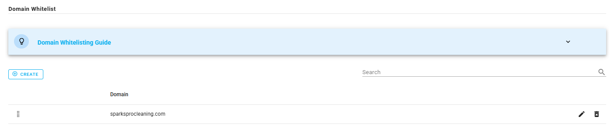
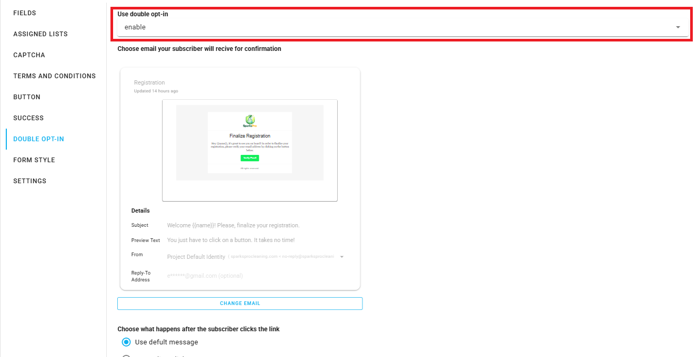

# Collecting Contacts in BlueFox Email

Building a quality email list is the foundation of successful email marketing. This guide walks you through the various methods for collecting contacts in BlueFox Email, from simple signup forms to advanced API integrations, while ensuring you maintain permission-based marketing standards that protect your deliverability and sender reputation.

## Why Permission-Based Marketing Matters

Before diving into the mechanics of collecting contacts, let's establish one fundamental principle: **quality always beats quantity** when it comes to email lists.

Every contact in your database should have explicitly consented to receive emails from you. This isn't just about following the law, it's about protecting your sender reputation and ensuring your emails actually reach inboxes.

Email service providers like Gmail, Outlook, and Yahoo closely monitor engagement signals. Sending emails to people who didn't ask for them leads to:
- High bounce rates
- Spam complaints
- Poor inbox placement
- Damaged sender reputation
- Potential account suspension

BlueFox Email is built with a deliverability-first approach, not a volume-driven one. We provide tools that make it easy to collect contacts the right way, ensuring your emails actually reach inboxes and drive results.

### Levels of Consent: From Good Enough to Best

When collecting contacts, there are different levels of consent you can implement. Here's how they rank from good enough to best:

**Good Enough: Terms and Conditions**  
Your website's terms and conditions mention that users who sign up may receive marketing emails. While this provides legal coverage, it's the weakest form of consent and often leads to lower engagement.

**Better: Checkbox Confirmation**  
During signup, users check a box explicitly agreeing to receive emails. This is clearer than buried terms and conditions and shows more intentional consent.

**Best: Multi-List Selection**  
Users can select exactly which types of emails they want to receive by choosing specific subscriber lists. This provides the strongest consent and typically yields the highest engagement rates. BlueFox Email will soon support multi-list signup, allowing subscribers to choose their preferences upfront.

:::tip
The clearer you are about what users are signing up for, the better your engagement rates will be. Always communicate:
- What kind of content they'll receive
- How often you'll send emails
- Which lists they're subscribing to
:::

Now let's explore the different methods for collecting contacts in BlueFox Email.

## Step 1: Collecting Contacts Using Signup Forms
<!-- 
<video width="800" height="450" loops muted autoplay controls playsinline>
  <source src="./collecting-contacts-with-bluefox-email/signup-forms.mp4" type="video/mp4" />
</video> -->

Signup forms are the primary method for collecting contacts, especially if you're running a website or landing page. They're perfect for non-technical users and don't require any coding knowledge.

Let's use our example brand, **SparksPro Cleaning**, to demonstrate how to set up and use signup forms effectively.

### Common Use Cases

Signup forms work great for:
- **Newsletter subscriptions** – Visitors sign up to receive regular updates, tips, or promotions
- **Lead magnets** – Offer a free guide, checklist, or discount in exchange for an email address
- **Service inquiries** – Collect contacts from quote requests or service bookings
- **Event registrations** – Gather attendees for webinars or in-person events

### Creating Your First Signup Form

To create a signup form, navigate to your project's **Forms & Pages** scroll down to the **Signup Form** section and fromt the dropdown, select the subscriber list you want contacts to be added to.

<!--  -->

You can customize your form to match your brand:
- Include custom fields (name, phone number, company, etc.) that you have in your contact properties
- Manage form styles like form style (rows or columns), colors, fonts, and more
- Button's text, font and colour
- Customize the success message

For SparksPro Cleaning, we'll create a form for their "Cleaning Tips Newsletter" that collects email addresses and first names from visitors interested in home cleaning advice.

<!--  -->

### Adding Custom Fields

If you want to collect additional information beyond email addresses, you can add custom fields to your forms. First, define these fields in **Project Settings** → **Custom Contact Properties**, then add them to your signup form.

<!--  -->

### Multi-List Signup (Coming Soon)

BlueFox Email will soon support multi-list signup forms, allowing subscribers to select which specific lists they want to join during signup. This feature will provide:
- Explicit consent for each list
- Better segmentation from the start
- Higher engagement rates (people get only what they want)
- Clearer subscription preferences

For example, SparksPro Cleaning could let subscribers choose between "Weekly Cleaning Tips," "Monthly Promotions," or "New Service Announcements."

### Embedding Forms on Your Website

Once your form is ready, you can embed it on your website by just copying the provided HTML code snippet and pasting it into your site's code. This allows you to collect contacts directly from your website without needing any third-party tools.

For detailed setup instructions, check out our [Forms & Pages documentation](/docs/projects/forms-and-pages.md).

## Step 2: Setting Up Domain Whitelisting

<!-- <video width="800" height="450" loops muted autoplay controls playsinline>
  <source src="./collecting-contacts-with-bluefox-email/domain-whitelisting.mp4" type="video/mp4" />
</video> -->

Before your forms can accept submissions from your website, it's important to configure domain whitelisting. This security feature ensures that only authorized domains can add contacts to your project.

### Configuring Domain Whitelist

Navigate to **Project Settings** then **API Keys & Domain Whitelist**. Here you can add a domain that is allowed to:
- Use embedded signup forms
- Call your public API endpoints

For SparksPro Cleaning, we'll whitelist `sparksprocleaning.com` so forms on website can collect contacts.

<!--  -->

:::tip
Domain whitelisting applies to embedded forms and public API usage. It's not required to create forms, but it is required for those forms to accept submissions from your website.
:::

## Step 3: Enabling Double Opt-In

<!-- <video width="800" height="450" loops muted autoplay controls playsinline>
  <source src="./collecting-contacts-with-bluefox-email/double-opt-in.mp4" type="video/mp4" />
</video> -->

Double opt-in is a confirmation-based signup flow that requires subscribers to verify their email address before being added to your list. Here's how it works:

1. User submits your signup form
2. They receive a confirmation email
3. They click the confirmation link
4. They're added to your subscriber list

### Why Use Double Opt-In?

While double opt-in adds an extra step to the signup process, it provides significant benefits that strengthen your explicit consent and improve list quality.

**Ensures Valid Email Addresses**  
Only real, working email addresses make it to your list. No typos, no fake addresses.

**Confirms Intentional Signups**
People who complete double opt-in genuinely want to hear from you, leading to much higher engagement rates.

**Reduces Bounces and Complaints**  
Since you're only emailing people who actively confirmed, you'll see fewer bounces and spam complaints, which directly improves your deliverability.

**Strengthens Consent**  
Double opt-in provides the strongest possible proof that someone wants to receive your emails, which is valuable for compliance and deliverability.

To enable double opt-in, go to your form settings and toggle the **Double Opt-In** option in **Forms & Pages**.

<!--  -->

:::tip
Double opt-in slightly reduces signup conversion rates but dramatically improves list quality and engagement. For most businesses, this tradeoff is absolutely worth it.
:::

## Step 4: Adding Captcha Protection

<!-- <video width="800" height="450" loops muted autoplay controls playsinline>
  <source src="./collecting-contacts-with-bluefox-email/captcha-protection.mp4" type="video/mp4" />
</video> -->

Captcha protection helps prevent bots and automated scripts from flooding your signup forms with fake or malicious email addresses.

### How Captcha Protects Your Lists

When captcha is enabled, users must complete a simple verification (entering the visible code) before submitting the form. This:
- Blocks automated bot submissions
- Prevents spam attacks
- Protects your list quality
- Maintains your sender reputation

Captcha is especially important for public-facing signup forms that are accessible to anyone on the internet. It positions captcha as complementary to double opt-in rather than adding friction.

### Enabling Captcha

In your form settings, enable the **Captcha Protection** option in **Forms & Pages**, Signup Form.

<!--  -->

## Step 5: Importing Contacts via CSV

<!-- <video width="800" height="450" loops muted autoplay controls playsinline>
  <source src="./collecting-contacts-with-bluefox-email/csv-import.mp4" type="video/mp4" />
</video> -->

If you're migrating from another email platform or have an existing database of contacts, CSV import is the quickest way to add them to BlueFox Email.

### When to Use CSV Import

CSV import is ideal for:
- **Initial database setup** when starting with BlueFox Email
- **One-time migration** from platforms like Mailchimp, SendGrid, or Brevo
- **Bulk uploads** from webshops, CRMs (like HubSpot), or popup providers (like OptinMonster or Optin Monk)
- **Offline contact collection** from events, conferences, or in-person signups

:::warning Critical: Consent is Required
Only import contacts who have already consented to receive emails from you. Importing purchased lists or contacts without permission will:
- Result in high bounce and complaint rates
- Damage your sender reputation
- Risk account suspension
- Violate email marketing regulations

CSV import is a starting step for initial setup, not an ongoing collection method.
:::

### Preparing Your CSV File

Your CSV file must include an email column, but you can also include additional fields like:
- First name
- Last name
- Company
- Phone number
- Any custom fields you've defined

Before importing, make sure you've added any custom contact properties in **Project Settings** then **Contact Properties**.

<!--  -->

### Importing Your Contacts

Navigate to the **Contacts** section and click **Import Contacts**. Upload your CSV file and map the columns to your contact fields.

<!--  -->

Here's what to watch for:
- Match your CSV headers to the API names shown in BlueFox Email
- Select which subscriber list(s) the contacts should be added to
- Review the preview before confirming the import

For SparksPro Cleaning, we're importing their existing customer database from a previous email platform, ensuring all contacts previously consented to marketing emails and match clear subscription intent.

### Multi-Source Integrations

Many businesses collect contacts across multiple platforms. Common sources include:
- **Webshops and e-commerce platforms** (Shopify, WooCommerce)
- **CRMs** (HubSpot, Salesforce, Pipedrive)
- **Popup providers** (OptinMonster, Optin Monk, Sumo)
- **Event platforms** (Eventbrite, Meetup)

You can export contacts from these platforms and import them into BlueFox Email via CSV. For detailed migration guides (such as Mailchimp → BlueFox Email or other platform-specific walkthroughs), check our dedicated migration articles.

:::tip
CSV import is great for getting started, but it's not ideal for ongoing synchronization. If you need real-time contact syncing across multiple systems, consider using the API (covered next).
:::

## Step 6: Synchronizing Contacts via API

<!-- <video width="800" height="450" loops muted autoplay controls playsinline>
  <source src="./collecting-contacts-with-bluefox-email/api-sync.mp4" type="video/mp4" />
</video> -->

For technical users and businesses with custom applications, BlueFox Email provides a powerful API for synchronizing contacts across multiple systems.

### When to Use API Synchronization

APIs are ideal for:
- **Web applications** that need to automatically add users to email lists
- **Multi-system environments** where contact data lives in multiple places

:::warning API is for Synchronization, Not Blind Collection
The API should be used to **synchronize** contacts that have already provided consent, not to blindly collect or add contacts. Always ensure:
- Contacts have clear subscription intent
- Consent was obtained (either per list or via terms and conditions)
- You're syncing data, not scraping or harvesting

Explicitly refer back to the explicit consent principles covered earlier.
:::

### Common API Scenarios

**Scenario 1: User Signs Up on Your Website**  
When a user creates an account on SparksPro Cleaning's website and opts in to marketing emails, your application calls the BlueFox Email API to add them to the appropriate subscriber list.

**Scenario 2: CRM to BlueFox Email Sync**  
When a lead becomes a customer in your CRM, automatically add them to a "Customers" list in BlueFox Email for targeted campaigns.

**Scenario 3: Custom Fields Update**  
When a customer updates their preferences or profile in your application, sync those changes to their BlueFox Email contact record.

### Getting Started with the API

To use the API, you'll need:
1. An API key from **Project Settings** → **API Keys & Domain Whitelist**
2. Your project ID
3. Basic API knowledge (or a developer on your team)

BlueFox Email provides comprehensive API documentation for:
- Adding and updating contacts
- Managing subscriber lists
- Handling unsubscribes
- Custom field synchronization

Check out our [Contacts Management API](/docs/api/contacts-management.md) and [List Management API](/docs/api/subscriber-list-management.md) documentation for detailed technical guides. We avoid duplicating technical API documentation here, use those resources for implementation details.

### Advanced Synchronization Scenarios

For more complex setups, you might need advanced synchronization capabilities:

**Bidirectional Synchronization**  
Ensure changes in either system reflect in the other:
- When someone unsubscribes in BlueFox Email, update their preferences in your CRM or application
- When someone opts out in your application, make sure they're unsubscribed in BlueFox Email

This ensures multi-system consistency and respects user preferences everywhere.

**Bulk Contact Updates**  
Efficiently update thousands of contacts at once when you need to:
- Sync custom field values across your entire database
- Update subscriber list memberships in bulk
- Maintain field synchronization across systems

**Custom Workflows**  
Build advanced flows such as:
- Custom double opt-in confirmation handling
- Custom redirect behavior after form submission
- Custom subscription preferences pages with your own branding

These advanced topics are clearly positioned as separate subjects with dedicated, focused articles. If you need help with complex integrations, our support team and documentation are here to help.

## Key Takeaways: Building a Quality List

As you build your contact list in BlueFox Email, remember these essential principles:

**Quality Over Quantity**  
A small list of engaged subscribers is infinitely more valuable than a large list of uninterested contacts. Focus on attracting people who genuinely want to hear from you. This is what positions BlueFox Email as deliverability-first, not volume-driven.

**Explicit Consent is Non-Negotiable**  
Every contact should have explicitly opted in to receive your emails. This protects your deliverability, maintains compliance, and builds trust. Remember the levels: from good enough (terms and conditions) to better (checkbox) to best (multi-list selection).

**Clear List Communication**  
Make sure subscribers understand what they're signing up for. Be transparent about:
- What content they'll receive
- Which lists they're joining
- How often you'll send emails

**Layer Your Protection**  
For public forms, combine multiple safeguards:
- Clear consent mechanisms
- Double opt-in confirmation
- Captcha protection
- Domain whitelisting

**Respect Unsubscribes**  
When someone unsubscribes, honor it immediately and across all your systems. It's not just good practice, it's the law.

BlueFox Email is designed to be flexible, scalable, and responsible. Our tools help you collect high-quality contacts while protecting your sender reputation and ensuring your emails actually reach inboxes.

Ready to start building your list? Head over to your [BlueFox Email dashboard](https://app.bluefox.email) and create your first signup form today!
