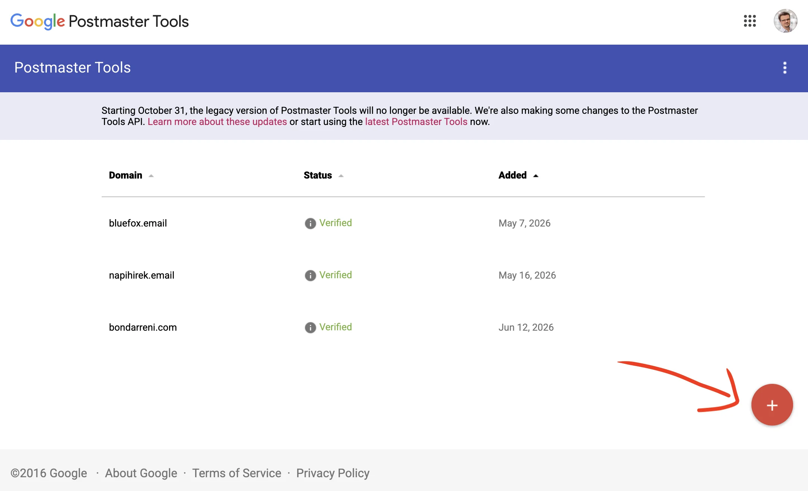
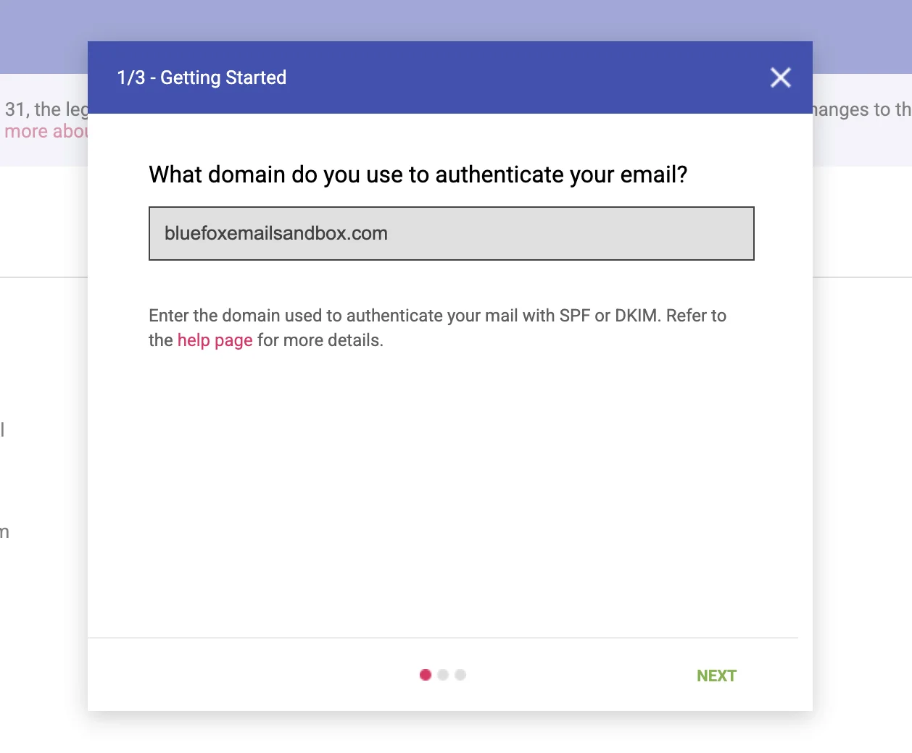
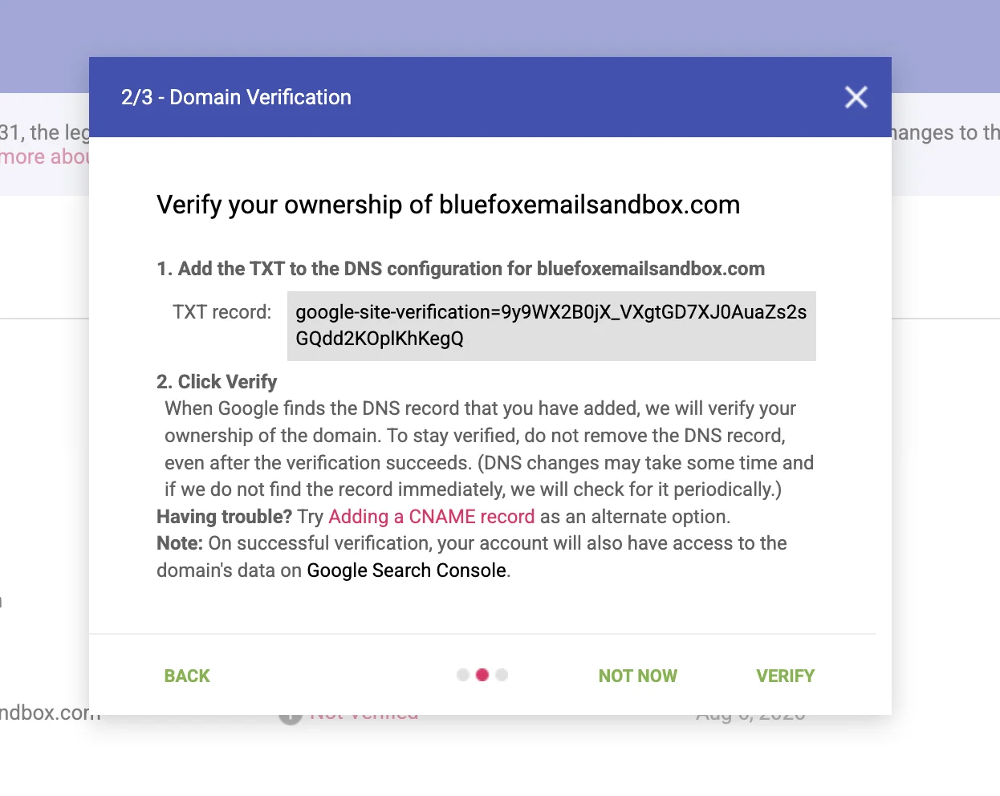
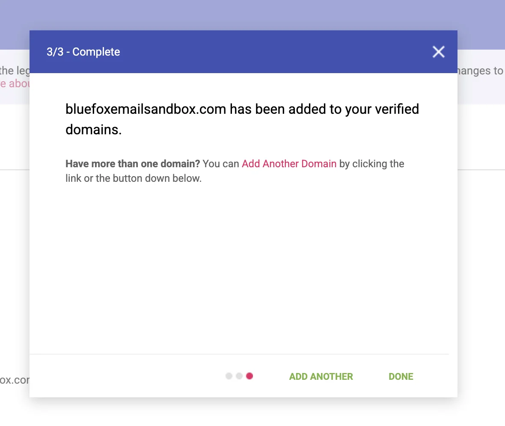

# Zero Spam Complaints? Gmail May Tell a Different Story

*[Google Postmaster Tools](https://postmaster.google.com) can reveal spam complaints your own email analytics never see.*

You send a campaign and check the results.

Delivery looks healthy. There are few bounces, and BlueFox Email shows no unusual increase in spam complaints.

Then you open Google Postmaster Tools and see that Gmail users have been marking your messages as spam.

How can both reports be correct?

The answer is that Gmail handles spam complaints differently from many other mailbox providers.

This is a follow-up to [What BlueFox Email Does for Deliverability, and What You Need to Do](/posts/what-bluefox-email-does-for-deliverability-and-what-you-need-to-do), which covers bounce and complaint processing, suppression and Postmaster Tools more broadly. Here we go deeper on this one specific gap.

## Gmail does not report individual complaints

When some mailbox providers receive a spam complaint, they report it to the sending infrastructure.

BlueFox can then:

* record the complaint;
* identify the recipient;
* add the address to the [suppression list](/docs/projects/suppression-list);
* prevent further messages from being sent to it.

Gmail does not provide this recipient-level complaint information to any email service provider (ESP).

When a Gmail user clicks **Report spam**:

* BlueFox does not receive an individual complaint event;
* the complaint does not appear in BlueFox analytics;
* the recipient cannot automatically be added to the suppression list;
* Gmail may still use the complaint when evaluating your reputation.

This means that seeing zero complaints in your email analytics does not necessarily mean that nobody reported your messages as spam.

It only means that no complaint events were reported to the platform.

## What Google Postmaster Tools shows

Google Postmaster Tools provides Gmail’s own view of your authenticated sending activity.

Among other deliverability signals, it can show the rate at which Gmail users manually report your messages as spam.

This information is aggregate. Google does not reveal the email addresses of the people who complained.

BlueFox and Postmaster Tools therefore answer different questions:

| BlueFox Email                             | Google Postmaster Tools                              |
| ----------------------------------------- | ---------------------------------------------------- |
| What happened during sending?             | How does Gmail see your traffic?                     |
| Which reported complaints did we receive? | How often did Gmail users report your messages?      |
| Which recipients were suppressed?         | Is a particular sending stream producing complaints? |
| How did a campaign perform?               | Are Gmail-specific deliverability signals changing?  |

The two systems complement each other. One does not replace the other.

Postmaster Tools data only covers messages sent to personal Gmail accounts ending in `@gmail.com` or `@googlemail.com`. It also does not include spam complaints from Google Workspace users using custom domain addresses, and these reports are not surfaced in Postmaster Tools or the Feedback Loop.

## How to add your domain to Google Postmaster Tools

Setting up Postmaster Tools only takes a few steps.

You will need a Google account and access to the DNS records of your sending domain.

### 1. Add your sending domain

Open [Google Postmaster Tools](https://postmaster.google.com), sign in and press the highlighted plus button.

Enter the domain used to authenticate your outgoing email. To receive Feedback Loop data later on, that domain needs to be signed with [DKIM](/email-sending-concepts/dkim) or published in your [SPF](/email-sending-concepts/spf) record. For BlueFox users, this should be one of your own verified sending domains, not the shared `bluefoxemailsandbox.com` domain.

Google recommends adding and verifying the primary domain before adding individual subdomains. Add a subdomain separately when you want to monitor its data independently.

### 2. Add the verification record to your DNS

Google will give you a TXT record that proves you control the domain.

Copy the record, open the DNS settings at your domain or DNS provider, and add it as a new TXT record.

### 3. Verify the domain

Return to Postmaster Tools and select **Verify**.

Verification normally happens quickly, although Google says it can take up to ten minutes for the status to update. Postmaster Tools will not display information for the domain until verification is complete.

Once the domain is verified and Google has enough Gmail traffic to report, you can open its dashboards and review spam rate, authentication, delivery errors and Feedback Loop data.

## Identifying the email that caused the problem

An overall Gmail spam rate can tell you that something is wrong, but you also need to know which email caused it.

Google’s Feedback Loop can associate aggregate spam complaints with identifiers included in outgoing messages.

BlueFox adds identifiers for:

* the account and project;
* campaigns;
* transactional email templates;
* triggered emails;
* individual email steps inside automations.

If Google has enough traffic and complaint data, Postmaster Tools may display one of these identifiers in its Feedback Loop dashboard.

You can then search for the identifier in BlueFox to find the corresponding email and investigate the audience, content and sending behaviour behind it.

The Feedback Loop still does not reveal which recipients complained. Its purpose is to identify the **source of the problem**, not the individual users involved.

For the complete identifier format and instructions for locating the corresponding email, see the [Google Postmaster Tools feedback identifiers documentation](/docs/google-postmaster-tools-identifiers).

## Why might Postmaster Tools show no data?

An empty dashboard does not necessarily mean that something is incorrectly configured.

Google only displays data when there is enough traffic to protect Gmail users’ privacy and produce meaningful aggregate results.

You may see no Feedback Loop information when:

* your Gmail sending volume is low;
* a campaign or template has too few recipients;
* there are too few distinct spam reports;
* the domain has not been added and verified;
* Google has not processed the data yet.

Small transactional streams and individual automation emails may never produce enough volume to appear separately.

Postmaster Tools is also Gmail-specific. Other mailbox providers vary in what they expose: many, including Outlook and Yahoo, at least offer some form of feedback loop or postmaster page, but others offer nothing comparable. iCloud Mail is a notable example. It has no feedback loop for spam complaints and no Postmaster Tools-style dashboard at all, only a direct abuse-desk contact for deliverability issues. Many smaller or privately operated mailbox providers are similar: no complaint reporting and no self-service dashboard of any kind.

## What to investigate when Gmail’s spam rate increases

Because Gmail does not reveal individual complainants, you cannot solve the problem simply by removing the people who clicked the spam button.

You need to look for the underlying pattern.

Check:

* how the recipients joined your list;
* whether they expected this type of email;
* whether an older or inactive segment was included;
* whether your sending volume or frequency recently increased;
* whether the sender name was immediately recognisable;
* whether the subject line accurately described the message;
* whether the email was relevant to the selected audience;
* whether unsubscribing was easy.

A rising spam rate is usually a symptom of an audience, expectation or relevance problem.

The solution is not to bypass Gmail’s filtering. It is to send fewer unwanted messages.

## Use BlueFox and Postmaster Tools together

BlueFox provides operational information about sends, bounces, complaints, suppressions, unsubscribes, opens and clicks.

Google Postmaster Tools provides Gmail-specific information about how Google evaluates your authenticated traffic.

A low complaint count in BlueFox does not prove that Gmail users are satisfied. At the same time, a Gmail spam-rate warning does not identify the individual recipients who complained.

Used together, the two tools provide a more complete picture:

* Postmaster Tools tells you that Gmail sees a problem.
* The Feedback Loop helps identify the affected sending source.
* BlueFox lets you inspect the corresponding campaign, template or automation email.

That gives you a practical starting point for finding and fixing the real cause.

To trace a Feedback Loop warning back to the exact campaign, automation email, triggered email or transactional email responsible, see how [BlueFox structures its Feedback-ID identifiers](/docs/google-postmaster-tools-identifiers).
