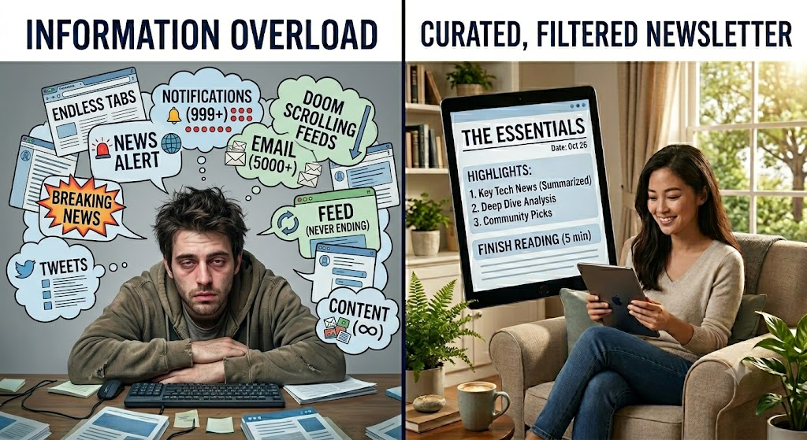
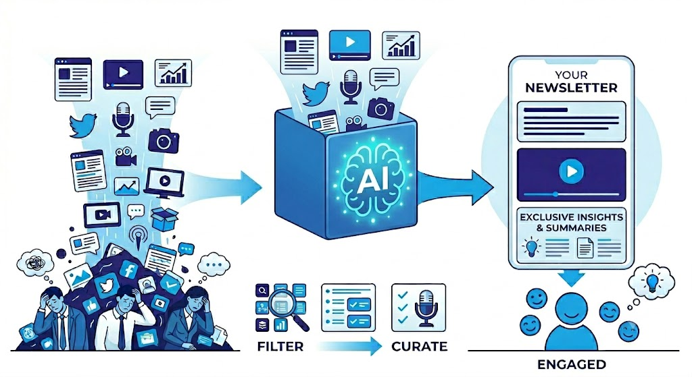
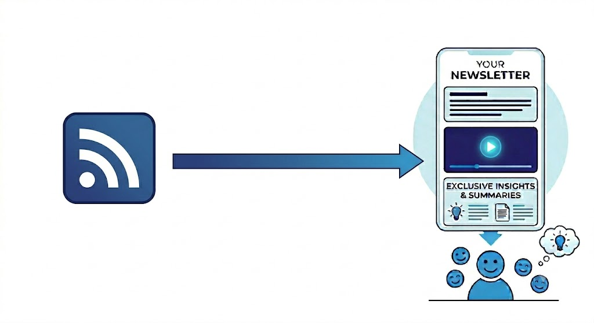
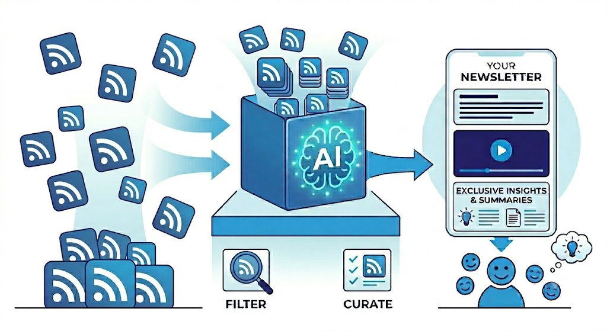
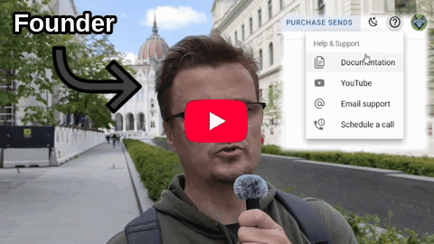
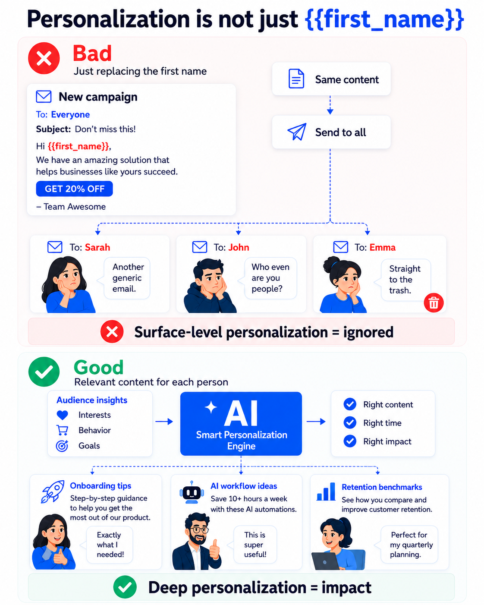

# How Marketers Can Use AI-Powered Newsletters to Turn Scattered Content Into an Owned Audience

Publishing useful content consistently is one of the hardest parts of marketing. Not because there is nothing to say, but because assembling, summarizing, and distributing it week after week takes more time than most teams have.

AI-powered newsletters change that. Not by writing everything for you, but by handling the parts that eat your time: monitoring sources, summarizing articles, organizing a draft, suggesting subject lines. You keep the editorial judgment. The system does the groundwork.

That shift has two real benefits for marketers.

The first is time. Instead of building each newsletter from scratch, you build a system that runs it. The marketer's job moves from execution to oversight, which is more scalable and more interesting.

The second is audience ownership. Social media reach is borrowed. Algorithm changes, platform rules, and shifting feeds can cut your visibility overnight. Email is different. Every subscriber is a direct channel you control. An automated newsletter gives you a reason to show up in that channel consistently, without burning out your team or your budget.

Done well, it is also a positioning strategy. The company that consistently surfaces the most useful signal in a noisy space becomes the trusted filter for its audience. That is a durable competitive advantage.

## The real problem is not lack of content

RSS feeds. YouTube videos. Blog posts. Social media updates. Product announcements. Industry reports. Podcast episodes. Webinars.

There is useful content everywhere, but the problem is that it is scattered everywhere too.

Your audience does not have time to follow ten blogs, five YouTube channels, three newsletters, a few LinkedIn creators, and every company in your market.

Most people are already drowning in content, and they do not need more noise. They need someone to **filter** things for them. This AI-generated meme below illustrates very, very well, how people are suffering from information overload, and that the ones who manage to escape it (but stay informed at the same time) are the happy ones.

Most companies do not have a content problem. Actually, the opposite is true. There is too much content.

There are blog posts, YouTube videos, podcasts, social media updates, product announcements, research reports, tutorials, case studies, webinars, changelogs, and industry news published every day.

Some of this content comes from your own company. But most of it does not, and that is the important part.

If you only build a newsletter from your own blog posts and your own videos, that can still be useful. It helps you distribute your own content better.

But it is also limited. Your company is just one source, but the whole internet is much bigger than that.

There are experts, publications, creators, partners, communities, competitors, analysts, and customers publishing useful things all the time. Your audience probably does not have time to follow all of them.

So the opportunity is not only to repurpose your own content.

The bigger opportunity is to **become the filter.**

You can use third-party sources as raw material and turn them into a useful, branded newsletter for your audience.

That could mean collecting:

* articles from trusted industry blogs
* videos from selected YouTube channels
* updates from product and platform blogs
* reports from research companies
* podcast episodes
* social media posts and discussions
* your own company updates
* customer stories and examples

Without automation, this is a lot of manual work.

Someone has to check the sources, open the links, read or skim everything, decide what matters, write the summaries, organize the newsletter, and send it.

That is exactly where AI-powered newsletters become interesting.

AI can help collect, summarize, group, filter, and prepare the content automatically. So instead of manually creating every newsletter from scratch, marketers can build a system.

The system watches the right sources, AI prepares the digest, then the company sends a useful newsletter under its own brand.

The audience gets a filtered version of what matters.

That is much more powerful than only sending updates from your own blog.

## Email is still an owned channel

Social media is useful, but it is not really yours.

You can spend months building an audience, and then the platform changes the rules. Your reach drops. The algorithm changes. Your posts stop showing up. Or your best content simply disappears after a few hours.

Email is different.

When someone subscribes to your newsletter, you have a direct channel to them. This is why automated newsletters are not only about saving time. They are also about audience ownership.

Of course, this does not mean you can send anything you want and expect people to care. You still have to earn attention. You still have to be useful. But at least you are not completely dependent on a social media algorithm.

Email also has its own gatekeepers. Spam filters can block you before you ever reach the inbox. And now AI-powered email summaries are adding another layer between your message and the reader's full attention.

But here is the thing: none of that matters much if your subscribers actually want to hear from you. When you consistently provide value, people look for your emails. They move them out of promotions tabs. They add you to their contacts. No spam filter or AI summary will stop someone from reading an email they were looking forward to.

You can use RSS feeds, YouTube videos, blogs, and selected social content as inputs. Then you use email as the distribution channel.

The content may come from many different places. The relationship happens in the inbox.

That is the important part.

## What AI can actually help with

AI is useful in this workflow because preparing a newsletter manually can be annoying.

You have to check sources, open links, skim articles, review videos, write summaries, organize sections, create a subject line, format everything, and then finally send the email.

If you do this every week, it becomes a lot.

AI can help with the repetitive parts.

For example, it can:

* summarize long articles
* turn YouTube video descriptions into short blurbs
* group content by topic
* detect similar stories
* rewrite summaries in your brand voice
* create section introductions
* suggest subject lines
* personalize content for different segments
* prepare a first draft of the newsletter

The important thing is that AI is helping with preparation, not replacing editorial judgment.

It can do the heavy lifting.

You still decide what deserves attention.

## Autonomous or semi-autonomous?

Once AI is helping with content preparation, the next question is how much of the workflow you want to automate.

There is no single correct answer.

Different newsletters need different levels of oversight.

For many companies, the best starting point is a human-in-the-loop workflow:

1. The system collects content from selected sources.
2. AI prepares summaries and organizes the draft.
3. A marketer reviews, edits, and approves the issue.
4. The newsletter is sent.

This approach saves time while keeping quality under control.

As the process becomes more predictable, you can automate more of it.

For example, you might define rules such as:

* only use trusted sources
* ignore duplicate stories
* include no more than five links
* always include the original source
* summarize, but do not copy full articles
* group items by topic
* use a consistent tone
* send only when there is enough high-quality content
* ask for approval if confidence is low

With clear rules, some newsletters can become largely autonomous.

The marketer is no longer manually assembling every issue.

Instead, the marketer is designing and improving the system that produces it.

That is where automation becomes truly scalable.

## RSS is a great starting point

RSS is not trendy. That is partly why it is useful.

It is simple, open, and predictable. Many blogs, publications, podcasts, and news sites still provide RSS feeds. You can pull new items from those feeds and use them as the raw material for a newsletter.

For an automated newsletter, RSS is probably the easiest place to start. We previously publihed a [tutorial about how you can turn a single RSS into a newsletter](/posts/how-to-create-a-newsletter-from-rss-and-send-it-automatically), but you can do much more than that. That article explains a rather simple process, illustrated by the image below.

You can collect many things from 3rd party RSS feeds as well:

* article titles
* links
* descriptions
* authors
* publish dates
* images, depending on the feed
* podcast episodes
* blog updates

For marketers, this is useful because you can build a newsletter around trusted sources.

For example, a marketing agency could follow a few industry publications, a few platform blogs, a few customer-relevant sources, and the client’s own blog. This process needs filtering and curation. Using AI is perfect for that.

Then it could send a weekly digest to clients or prospects.

Not everything needs to be written from scratch.

Sometimes the value is in finding the right things and explaining why they matter.

One practical detail to keep in mind is that RSS feeds are not always structured the same way. Some feeds include images in different tags or properties, while others place large chunks of HTML inside the description field. A few provide clean summaries, while others include almost the entire article. If you are automating newsletter creation, you need to account for these differences by cleaning, normalizing, and extracting the content you actually want to use.

## YouTube can make the newsletter richer

YouTube is also a strong content source. A company can include its own videos, such as tutorials, product demos, webinars, interviews, or customer stories, or it can curate useful videos from other trusted channels.

But again, the important thing is context.

Do not just write:

> New video: “Email Marketing Tips for 2026”

That is not very useful.

Write something like:

> This video is worth watching if you are trying to improve your onboarding emails. It shows three simple ways to reduce drop-off after signup.

That small explanation makes a big difference.

AI can help write these summaries, and it can often generate them automatically from video subtitles or transcripts without you having to write the summary yourself. This makes it much easier to include relevant video content in a newsletter at scale.

But the newsletter should still feel like someone made a decision.

Why is this video included?

Who is it useful for?

What should the reader pay attention to?

That is what makes the newsletter feel curated instead of automated.

One interesting detail that many marketers do not realize is that YouTube channels also publish RSS feeds, even though YouTube does not really advertise this feature.

For example, our YouTube channel is:

https://www.youtube.com/@bluefox-email-official

And the corresponding RSS feed is:

https://www.youtube.com/feeds/videos.xml?channel_id=UC2iqBlA8iowoqZmD2bRVeHw

This feed automatically publishes new videos from the channel, making it easy to include fresh YouTube content in your newsletter workflow without manually checking for updates. Like a blog RSS feed, it can be monitored by your automation system and used as a reliable content source for curated email digests.

Instead of building a completely separate integration, you can pull new videos using the same RSS-based approach discussed earlier for blogs, podcasts, and news sites.

That makes it much easier to include video content in automated newsletters. New videos appear in the feed, the system detects them, AI can generate summaries or descriptions, and the content can be added to the next newsletter issue automatically.

In practice, this means your newsletter can combine blog posts, industry news, podcast episodes, and YouTube videos using the same underlying technology.

That simplicity is one of the reasons RSS remains so useful for content aggregation and newsletter automation.

You can also make newsletters more engaging by turning YouTube videos into animated GIF previews with a play button overlay that links to the full video. It gives subscribers a visual cue that there's video content to watch and encourages clicks to the full video, since email clients generally don't support embedded video playback. If you sign up for BlueFox Email, you can see examples of this approach in our onboarding emails, like the one below:

## Social media is useful, but trickier

Social media content can be very valuable, especially for fresh conversations, opinions, examples, and trends.

But it is also harder to automate reliably.

Different platforms have different API rules, permissions, limits, and restrictions. Some content is not easy to pull. Some platforms are much more closed than RSS. Some integrations require app review or business accounts.

There are also multiple technical approaches.

One option is using official APIs, but that can become expensive or restrictive depending on the platform. For example, access to large amounts of content on X can be costly, which makes some newsletter workflows difficult to justify.

Another option is using headless browsers to read and extract content from social posts. In some cases, this can help when official APIs are limited or when you want to pull content directly from publicly available pages. A headless browser can load the page, extract the text, and make it available for summarization, topic detection, or newsletter snippets. This means you can summarize a post, quote key points, or create a short newsletter blurb without relying entirely on platform integrations.

The same approach can also be used to capture social posts visually. Some teams generate screenshots of posts and include those screenshots in newsletters while linking back to the original content. This can help preserve the original look and context of a post, especially when visual presentation matters. You can also use gradient backgrounds behind social posts to spice it up a little bit. Check the example below.

However, neither approach is always reliable. Social media pages change frequently, platforms update how content is rendered, and automated traffic may be blocked or rate-limited. Social media embed systems can also break unexpectedly, particularly on platforms like Instagram. Because of that, content extraction and screenshots are usually best treated as supplemental options rather than the foundation of an automated newsletter workflow.

So I would not start with “let’s automate every social platform.”

That usually becomes complicated.

A more practical approach is:

Start with RSS. Once that works, add YouTube. Then, when it makes sense and the technical requirements are manageable, you can bring in social content as well.

Your own blog posts and product updates can also appear in the newsletter, but the newsletter should not be about you. It should be about the topic your audience cares about. When your own content is relevant to that topic, it becomes a natural part of the curated experience instead of feeling like self-promotion.

This keeps the first version simple enough to actually ship.

If you reach to this level, you will achieve what we showed on an image previously. You can curate from every channel online in an automated way.

## Third-party content does not mean stealing content

There is one important point here.

Using third-party content as newsletter input does not mean copying entire articles or pretending the content is yours.

That is not the goal.

The goal is **curation**.

You link to the original source. You mention where the content came from. You summarize it in your own words. You explain why it matters to your audience. In many cases, this is actually good for the original publisher too, because you are sending interested readers back to them.

A good curated newsletter should feel like a guide, not a scraper.

That difference matters.

## Automated newsletters are useful for lead nurturing

Not everyone who joins your email list is ready to buy. Some people are just learning, some are comparing options. Some are interested, but not urgent for them. Others might have subscribed because the content looked useful.

An automated newsletter gives you a reason to keep showing up without constantly selling.

If every email is a sales email, people stop paying attention. But if the newsletter is **genuinely useful**, you can stay in touch for months.

Then, when the timing is better, your company is already familiar.

You can still include calls to action, of course.

For example:

* read a related guide
* download a worksheet
* register for a webinar
* try the product
* book a demo
* reply with a question
* check out a new feature

But the main value of the newsletter should be the **content**. The sales angle should feel like the natural next step, not the whole point.

## It can also help existing customers with personalized content

Automated newsletters are not only useful for prospects. They can be even more powerful for existing customers, because you already know something about how those customers behave.

And no, personalization is not about replacing the `#first_name#` merge tag. Not every subscriber cares about the same topics.

A founder may care about growth. A marketer may care about campaign examples. A developer may care about APIs and technical updates. An existing customer may care about tutorials and product improvements.

So instead of sending the same generic update to everyone, you can curate content based on what people are actually doing.

For example, imagine a customer is actively building onboarding sequences. The system could automatically collect and recommend:

* articles about onboarding best practices
* case studies about activation and retention
* videos explaining onboarding strategies
* examples from other companies
* relevant product features related to onboarding
* expert opinions and industry research

A different subscriber interested in AI automation and workflow optimization could receive curated tutorials, case studies, tool updates, and practical examples that match those interests.

So you can change parts of the newsletter based on subscriber interests:

* SaaS subscribers get SaaS examples
* ecommerce subscribers get ecommerce examples
* agencies get client campaign ideas
* developers get technical updates
* customers get product education

The whole newsletter does not need to be different. Even changing one or two content blocks can make the email feel much more relevant. This is where automation, segmentation, and personalization become really useful together.

If you run a SaaS product, you have an advantage here. You already collect behavioral data about your users. You know who has tried which features, who is active, and who has not logged in for a while. That data is a signal. If someone just started using automations in your product, that is a cue to send them content about automation best practices, examples, and tips. You are not guessing what they care about, you know.

One important practical note: personalizing content at the individual user level with AI sounds great, but it adds up fast in terms of cost and complexity. A more sustainable approach is to classify your subscribers into a small number of segments, then prepare tailored content for each segment. You get most of the relevance benefit without the overhead of generating a unique newsletter for every single person.

The newsletter is no longer just broadcasting company news. It becomes a personalized learning and discovery channel that helps customers solve the problems they are working on right now. That creates more relevance, more engagement, and often a better customer experience because the content feels timely instead of generic.

## Agencies can use this for clients too

This can be especially interesting for marketing agencies. In fact, it can become a strong retainer service.

Many clients want to stay visible to prospects and customers, but they do not have the time or internal resources to consistently create and send newsletters. An agency can manage the entire process and provide ongoing value every month.

An agency could create automated newsletters for different clients or industries.

For example:

* ecommerce trends for ecommerce clients
* local market updates for real estate clients
* platform updates for paid ads clients
* security and compliance updates for B2B clients
* industry news for niche professional services

The agency does not have to write every issue from scratch.

It can build a source list, create a newsletter structure, use AI to prepare summaries, and review the final version before sending.

That creates **ongoing value** for clients.

It also creates a recurring service that is easier to maintain than constantly producing entirely new content from scratch. Once the system is set up, the agency can focus on quality control, strategy, and optimization rather than repetitive manual work.

It also gives the agency a reason to stay in the client’s inbox every week or month.

## A simple format works best

The newsletter does not need to be complicated.

Actually, it is usually better if it is simple.

A good structure could look like this:

**Intro**

A short note about what this issue is about.

**Top story**

The most important item, with a short explanation.

**Useful reads**

Three to five curated articles.

**Videos worth watching**

One or two relevant YouTube videos.

**Company update**

A product update, event, case study, or announcement.

**Call to action**

One useful next step.

This is only an example, not a template you have to follow exactly.

You can remove sections, add new ones, combine parts, or organize the newsletter differently depending on your audience and goals. Some newsletters may focus almost entirely on curated content. Others may be mostly product updates, educational content, or industry news.

The important thing is not the exact structure. It is making the newsletter easy to scan and useful to read. The reader should be able to quickly understand what is included and decide what they want to open.

A newsletter that feels like homework will not work.

## What to avoid

Automated newsletters can be useful, but they can also become bad very quickly.

Here are the main things to avoid.

**Do not send too much.**

Just because you can send more often does not mean you should.

**Do not include too many links.**

Five good links are better than twenty random ones. Filtering is the core skill: the goal is not to send everything the system finds, but to cut down to what is worth this specific subscriber's attention. A newsletter with three well-chosen pieces, each with a clear reason to read them, is more valuable than a digest of twenty links with no context. For each item, include a short explanation of why it matters to the reader: what the article argues, why the timing is relevant, what they will get out of watching the video. That context is what turns a link into a recommendation. AI is especially useful here: it can summarize and cut, not just add more.

**Do not trust AI blindly.**

AI can summarize badly, miss context, or make everything sound the same. The more responsibility you want to give the AI, the more testing, monitoring, and fine-tuning you will need. Over time, maintaining a highly automated newsletter system can start to feel a lot like product development, with ongoing adjustments to sources, prompts, rules, and quality controls.

**Do not use low-quality sources.**

The newsletter is only as good as the sources behind it.

**Do not remove your own opinion completely.**

Curation is useful, but your audience also wants to know what you think. Why does this matter? What should they notice? What is the practical takeaway?

That said, this is not a strict rule. In some cases, adding commentary makes the newsletter more valuable because it provides context and perspective. In other cases, a fully automated digest that simply surfaces relevant updates may be exactly what the audience wants.

The key is to match the level of automation and editorial input to the purpose of the newsletter and the expectations of the readers.

## How to start

The best way to start is small.

Pick one audience.

Pick one simple promise.

For example:

> A weekly digest for SaaS marketers who want practical lifecycle email examples.

Then choose a few sources:

* 3 to 5 RSS feeds
* once that is working, add 1 or 2 YouTube channels
* your own blog
* your own product updates
* maybe one or two trusted industry sources

Create a simple newsletter structure.

Send it regularly.

At the beginning, keep human approval in the process. Let automation prepare the issue, but review it before it goes out.

Once the newsletter works, you can improve the workflow.

You can add better AI summaries, topic detection, personalization, automatic scheduling, and performance tracking.

But you do not need all of that on day one.

The first goal is simple:

Create a newsletter that is useful enough for people to keep opening it.

## The point is not to replace marketers

TODO: Include a meme here that emphasizes that a marketer should focus on what matters, not on the boring stuff. This is important.

AI-powered newsletters should not replace the marketer’s thinking.

They should remove the boring parts.

Collecting links is boring.

Copying titles is boring.

Writing the first rough summary is boring.

Organizing everything into a draft is boring.

Deciding what matters is not boring.

Adding your opinion is not boring.

Understanding your audience is not boring.

That is the real job.

Automation should give marketers a better starting point, so they can spend more time on the parts that actually create value.

## Turning scattered content into something useful

TODO: Include a meme about information overload here (for example, someone drowning in browser tabs, newsletters, notifications, and unread articles).

There is already too much content online.

So the opportunity is not just to create even more.

The opportunity is to help your audience make sense of what already exists.

That is why automated newsletters can work so well.

They take scattered content from RSS feeds, YouTube channels, blogs, social media, and other sources, and turn it into one useful email.

They can also help transform clickbaity, low-signal content into something more useful. Instead of forcing readers to sit through exaggerated headlines, long videos, or repetitive articles, AI can extract the key points and present them as concise, information-dense summaries. The result is less hype and more substance.

For the reader, it saves time.

For the company, it creates a regular touchpoint.

For the marketer, it creates a repeatable content distribution system.

And over time, that can become a real owned audience.

## Create automated newsletters with BlueFox Email

BlueFox Email helps you design, send, and measure branded newsletters without unnecessary complexity.

You can use it for regular campaigns, product updates, customer newsletters, curated digests, and automated email workflows.

So if you want to turn scattered content into a newsletter your audience actually wants to receive, start with a simple format, choose good sources, and build from there.

The tools can help with the workflow.

But the goal stays the same:

Send something useful.

Do it consistently.

Build an audience you own.

We are currently working on a step-by-step tutorial that will show exactly how to set up an AI-powered automated newsletter workflow using RSS feeds, YouTube channels, and other content sources. We will add a link here as soon as the guide is ready.
