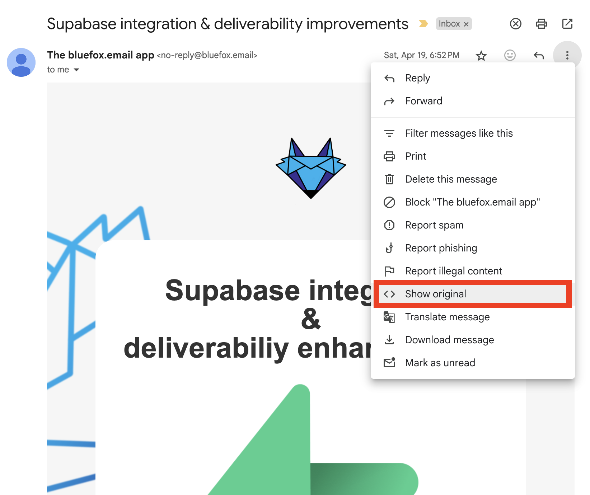
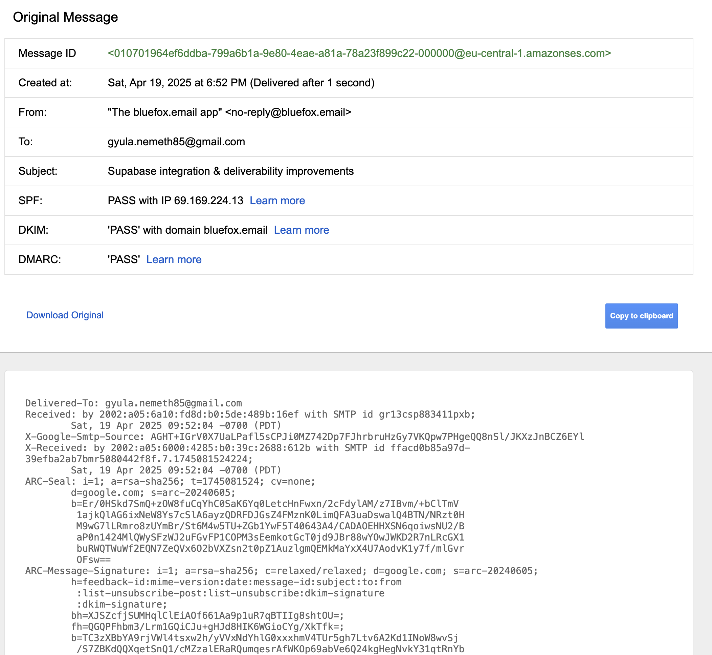
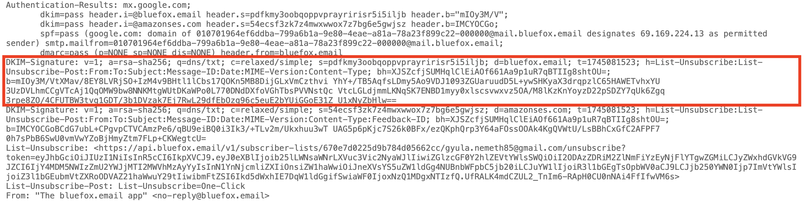

# How SPF, DKIM, and DMARC Actually Work (With Real Examples)

Email authentication is essential if you don't want any random person sending emails in your name. In other words, to prevent email spoofing, it's strongly advised to set up DKIM, SPF, and DMARC.

In this article, we’ll go through how these email authentication methods work, using real-life examples and digging into email headers. The goal is to build a solid understanding of how these methods actually work, and how you can investigate if something’s off.

:::tip TLDR

**SPF (Sender Policy Framework)** checks if an email is sent from a legit IP address (i.e., the sending server is allowed by the domain).

**DKIM (DomainKeys Identified Mail)** checks the validity of your email (i.e., it was not altered).

**DMARC (Domain-based Message Authentication, Reporting and Conformance)** gives domain owners control over what to do with unauthenticated emails. If DKIM or SPF fails, you can choose to just monitor, quarantine (send to spam), or reject unauthenticated emails.

:::

:::warning Who this is for

This guide is for developers, marketers, or product folks who want to understand how email authentication really works. It's not just how to "turn it on." If you're setting up AWS SES, debugging deliverability issues, or just curious about what's in your email headers, you're in the right place.

We’ll use `dig` to inspect DNS records, highlight real email headers, and explain each protocol with examples from BlueFox Email.

:::

## Email Headers

If you want to follow this article step by step, you’ll need to check some email headers. In Gmail, just click on the “Show original” menu item highlighted below:



This is how emails look under the hood. It not only contains the text and HTML versions of the email, but it also starts with quite a few email headers:



`From`, `To`, `Subject`, and `Reply-To` are email headers that most people are familiar with, and their meanings are straightforward.

When it comes to email authentication, the most important headers are the following: `DKIM-Signature` and `Return-Path`.

## SMTP (Simple Mail Transfer Protocol)

Before going into the details of email authentication, let's quickly recap how SMTP works. SMTP is the standard protocol for sending emails through the internet. It handles sending an email from the client to the server, and server-to-server communication. For receiving email, modern systems use IMAP, while older ones use POP3. IMAP synchronizes your emails across your devices, POP3 downloads the email and deletes it from the server.

So, here are the brief steps:

* You write an email in your email client
* It connects to an SMTP server that will send the email
* The SMTP server looks up the MX record (Mail Exchange record) of the domain
* The SMTP sender server connects to the SMTP receiver server and opens an SMTP session. It sends the message, and if everything is accepted, the message is delivered.
* The email is stored and can be downloaded (via IMAP or POP3)

You can manually look up the MX record of a domain, for example with the `dig` command:

```
dig MX bluefox.email
```

The response in this case is the following:
```
; <<>> DiG 9.10.6 <<>> MX bluefox.email
;; global options: +cmd
;; Got answer:
;; ->>HEADER<<- opcode: QUERY, status: NOERROR, id: 9413
;; flags: qr rd ra; QUERY: 1, ANSWER: 1, AUTHORITY: 0, ADDITIONAL: 9

;; OPT PSEUDOSECTION:
; EDNS: version: 0, flags:; udp: 512
;; QUESTION SECTION:
;bluefox.email.			IN	MX

;; ANSWER SECTION:
bluefox.email.		300	IN	MX	1 smtp.google.com.

;; ADDITIONAL SECTION:
smtp.google.com.	135	IN	A	142.250.27.27
smtp.google.com.	135	IN	A	142.250.102.26
smtp.google.com.	135	IN	A	142.250.102.27
smtp.google.com.	135	IN	A	142.250.27.26
smtp.google.com.	219	IN	AAAA	2a00:1450:4025:401::1b
smtp.google.com.	219	IN	AAAA	2a00:1450:4025:402::1b
smtp.google.com.	219	IN	AAAA	2a00:1450:4025:402::1a
smtp.google.com.	219	IN	AAAA	2a00:1450:4025:401::1a

;; Query time: 414 msec
;; SERVER: 192.168.63.227#53(192.168.63.227)
;; WHEN: Mon May 05 19:53:46 CEST 2025
;; MSG SIZE  rcvd: 249
```

As you can see, we use `smtp.google.com`, because we use Google Workspace.

:::tip Looking up DNS records
SPF, DKIM, and DMARC are also based on DNS records. As we saw with the MX record, the `dig` command will be useful to look up those entries as well! The only difference is that we’ll be looking up `TXT` records instead of `MX` records.
:::


## SPF (Sender Policy Framework)

The goal of SPF is to prevent spammers from sending emails on behalf of your domain. It lets domain owners specify which mail servers (IP addresses) are authorized to send email on behalf of their domain.

It uses a `TXT` record in your DNS settings.

For example, you can check the allowed mail servers for BlueFox Email using the `dig` command:

```
dig TXT bluefox.email
```

In the result, you’ll see this string:

```
v=spf1 include:_spf.google.com -all
```

It means we use the first version of SPF (`v=spf1`), every server defined at `_spf.google.com` is allowed to send on behalf of our domain, and the `-all` states that all other servers are prohibited.

It looks simple, but there’s one tricky part: the SMTP receiving server does not check the SPF entry based on the domain name in the `From` header. Instead, it uses the `Return-Path` header. The Return-Path defines where bounce reports should go.

Let’s look at a real-life example:


In the image above, the email is sent from `no-reply@bluefox.email`, and you might notice it was actually sent by Amazon SES.

But how can that be? Only Google addresses are allowed in the TXT record of bluefox.email!

Well, if you look closely at the `Return-Path` header, you’ll see it was actually sent from `mail.bluefox.email`, meaning we set up a custom FROM domain in Amazon SES.

Let’s dig further:

```
dig MX mail.bluefox.email
```

The result contains `feedback-smtp.eu-central-1.amazonses.com`. What you saw in the `Return-Path` maps to this, so bounce feedback ends up at that server.

Now check the corresponding `TXT` record for SPF:

```
dig TXT mail.bluefox.email
```

The response is:
```
v=spf1 include:amazonses.com ~all
```

So Amazon SES IP addresses are allowed to send on behalf of BlueFox Email. This means you can send from custom subdomains that have their own SPF records!


## DKIM (DomainKeys Identified Mail)

The goal of DKIM is to ensure that your email is not altered and comes from an authorized SMTP server. It's a method for digitally signing the email with a private key, which is held by the sending SMTP server.

The corresponding public key is published in a `TXT` record in your DNS settings. The format is:

```
selector._domainkey.yourdomain.com
```

Where:

* `yourdomain.com` is your domain
* `_domainkey` is a fixed subdomain for DKIM
* `selector` is defined in the `DKIM-Signature` field in the email header

Let’s see it in action:



In the `DKIM-Signature`, the `d` parameter is the domain name and the `s` parameter is the selector. In this example:

* `d=bluefox.email`
* `s=pdfkmy3oobqoppvprayririsr5i5iljb`

So, the public key can be found at:

```
pdfkmy3oobqoppvprayririsr5i5iljb._domainkey.bluefox.email
```

Let's dig into this value:

```
dig TXT pdfkmy3oobqoppvprayririsr5i5iljb._domainkey.bluefox.email
```

The result is:

```
; <<>> DiG 9.10.6 <<>> TXT pdfkmy3oobqoppvprayririsr5i5iljb._domainkey.bluefox.email
;; global options: +cmd
;; Got answer:
;; ->>HEADER<<- opcode: QUERY, status: NOERROR, id: 13090
;; flags: qr rd ra; QUERY: 1, ANSWER: 2, AUTHORITY: 0, ADDITIONAL: 1

;; OPT PSEUDOSECTION:
; EDNS: version: 0, flags:; udp: 1232
;; QUESTION SECTION:
;pdfkmy3oobqoppvprayririsr5i5iljb._domainkey.bluefox.email. IN TXT

;; ANSWER SECTION:
pdfkmy3oobqoppvprayririsr5i5iljb._domainkey.bluefox.email. 1800	IN CNAME pdfkmy3oobqoppvprayririsr5i5iljb.dkim.amazonses.com.
pdfkmy3oobqoppvprayririsr5i5iljb.dkim.amazonses.com. 1800 IN TXT "p=MIIBIjANBgkqhkiG9w0BAQEFAAOCAQ8AMIIBCgKCAQEAs8rnLAmwc+1tSLIyXAX3lO3v8KlhGceJW8XqSA5EWme9v9O1feJI1cOJxfDvHW/aOItdsoAA6QoLA2RJDbMjr0MmIx/JF+aiLjBWXHgRVfSALaTzXr9XE+/JzEU6x+QFtw1mBWh/lPHp3CzBT7C2i66G5PGn+r91g1ViYoJ/iTqZ0vpII6FPtalslbH45LcTrGss2xmIGMvgljruN" "7bkDlW0PA1z7ircO/m8Qqij1JO/2o8dbI60l6zWt7iI2FJsLIGC4zTcyzNZEmV6CjrAFvkXnCuNXtx7yfMSw2Er4qYYsMLsYzmNCEjfAcmP84rfQhcXMzPF6+gRUfNO/D15KwIDAQAB"

;; Query time: 87 msec
;; SERVER: 192.168.100.1#53(192.168.100.1)
;; WHEN: Wed May 14 13:13:29 CEST 2025
;; MSG SIZE  rcvd: 559
```

As you can see, it's actually a CNAME record pointing to a `TXT` record. This is how Amazon SES manages public/private DKIM key pairs.

In the `DKIM-Signature`, important parameters include:

* `h=` → headers that are signed
* `b=` → the cryptographic signature based on those headers
* `bh=` → the hash of the body (verifies content integrity)
* `a=` → the algorithm used for the signature

With the public key from DNS and these values, the recipient server can verify the authenticity and integrity of the email.

::: info
If you're interested in how the actual cryptographic verification works step-by-step, let us know and we’ll expand the article.
:::

You may also notice an additional `DKIM-Signature` in the email headers. In this case, it’s Amazon SES signing the email on their own behalf. This acts as a fallback if there's an issue with your domain’s DKIM configuration.


## DMARC (Domain-based Message Authentication, Reporting and Conformance)

DMARC is a protocol that builds on SPF and DKIM. It helps domain owners decide what should happen when an email fails authentication (e.g., mark it as spam or reject it). This is how you protect your domain from spoofing or phishing.

DMARC passes if:

* SPF or DKIM passes
* and the domain used in SPF or DKIM **aligns** with the domain name in the "From:" header

If DMARC fails, receiving SMTP servers will decide what to do with the message based on your DMARC policy. It’s published as a `TXT` record at `_dmarc.yourdomain.com`.

For BlueFox Email, that would be `_dmarc.bluefox.email`. Let’s dig it up:

```
dig TXT _dmarc.bluefox.email
```

At the time of writing, the response is:

```
v=DMARC1;p=quarantine;rua=mailto:gyula@bluefox.email
```

The `p` parameter defines the action:

* `p=none;` → take no action, just monitor
* `p=quarantine;` → treat failed emails as suspicious (send to spam)
* `p=reject;` → reject failed emails completely

### Recommendation:

Start with `p=none;` to monitor how your emails are performing. Set the `rua` (Reporting URI for Aggregate reports) to an address where you want to receive DMARC reports. These reports are XML files that include the IPs sending emails on your domain's behalf, and whether they passed SPF/DKIM/DMARC.

Once everything is verified, gradually move to `quarantine`, and eventually to `reject`. This minimizes the risk of blocking legitimate emails due to configuration errors.


## Summary

DKIM, SPF, and DMARC help you prevent attackers from spoofing your emails.

* **SPF** ensures that the sending IP address is authorized to send on behalf of your domain.
* **DKIM** ensures that the message hasn’t been tampered with and is from a trusted source.
* **DMARC** ties it all together: if either SPF or DKIM passes and the domain aligns with the "From:" address, the email passes DMARC.

If DMARC fails, receiving servers will take action based on your DMARC policy (`p=`):

* `none` → do nothing, just monitor
* `quarantine` → send the message to spam
* `reject` → block the message entirely

Always start with `p=none; rua=mailto:you@yourdomain.com` to receive reports and verify your setup before enforcing stricter policies. This way, you can debug any configuration issues before they impact real email delivery.

