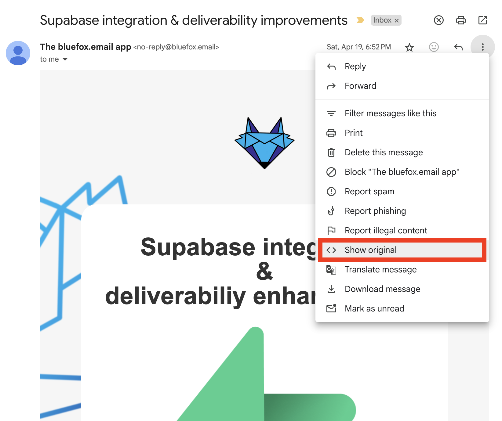
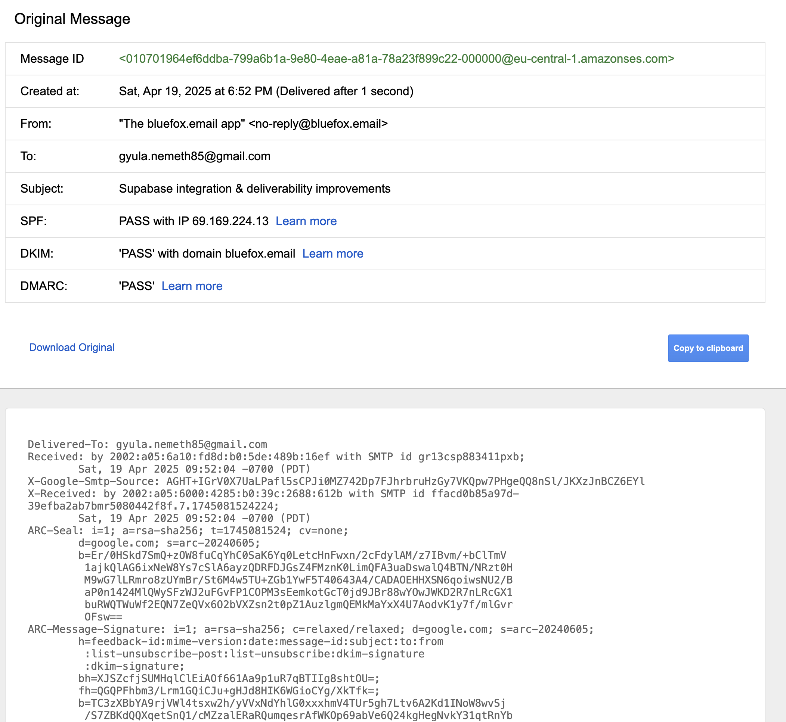
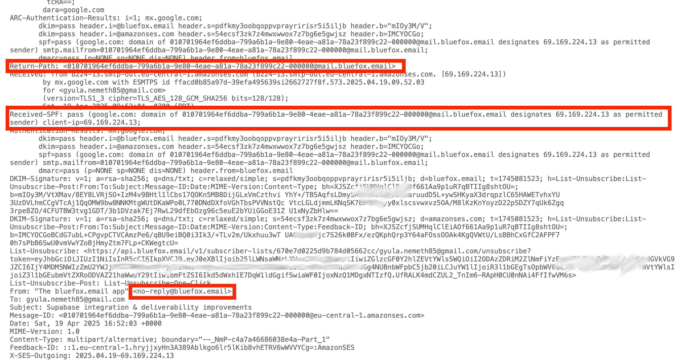
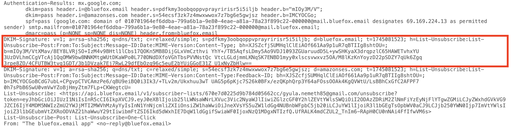

# How SPF, DKIM, and DMARC Work

Email authentication is essential if you don't want any random idiot sending emails in your name. In other words, to prevent email spoofing, it's strongly advised to set up DKIM, SPF, and DMARC.

In this article we will go through how these email authentication methods work, showcasing it with real-life examples, digging into email headers. The aim is to reach to a good understanding how these methods actually work, and how you can investigate if something is off.

::: tip TLDR

**SPF (Sender Policy Framework)** is for checking if an email is sent from a legit IP address (sending server is allowed by the domain)

**DKIM (DomainKeys Identified Mail)** is for checking the validity of your email (was not altered)

**DMARC (Domain-based Message Authentication, Reporting and Conformance)** gives control domain owners over what to do with unauthenticated emails. If DKIM or SPF fails, you can decide to just monitor, quarantine (send to trash/spam), or reject unauthenticated emails.
:::

## Email Headers

If you want to follow this article step-by-step, you will need to check some email headers. In Gmail, just click on the show original menu item highlighted below:



This is how emails look under the hood. It not only contains the text and HTML version of the email, but it starts with quite a few email headers:



`From`, `To`, `Subject`, and `Reply-To` are email headers that most people are quite familiar with, and it's straightforward what's their meaning.

When it comes to email authentication, the most important headers are the following: `DKIM-Signature`, `Return-Path`.

## SMTP (Simple Mail Transfer Protocol)

Before going into the details of email authentication, let's quickly recap how SMTP works. SMTP standard protocol for sending emails through the internet. It handles sending an email from the client to the server, and server-to-server communication. For receiving email, modern systems use IMAP, older ones use POP3. The former synchronizes your emails accross your devices, the latter downloads the email and deletes from the server.

So, here are the brief steps:
 - You write an email in your email client
 - It connects to an SMTP server that will send the email
 - The SMTP server looks up the MX record (Mail Exchange record) of the domain
 - The SMTP sender server connects to the SMTP receiver server and opens an SMTP session. It sends the message, and if everything is accepted, then the message is delivered.
 - The email is stored, and can be downloaded (with IMAP or POP3)

You can manually look up the MX record of a domain, for example with the `dig` command:

```
dig MX bluefox.email
```

The response in this case is the following:
```
; <<>> DiG 9.10.6 <<>> MX bluefox.email
;; global options: +cmd
;; Got answer:
;; ->>HEADER<<- opcode: QUERY, status: NOERROR, id: 9413
;; flags: qr rd ra; QUERY: 1, ANSWER: 1, AUTHORITY: 0, ADDITIONAL: 9

;; OPT PSEUDOSECTION:
; EDNS: version: 0, flags:; udp: 512
;; QUESTION SECTION:
;bluefox.email.			IN	MX

;; ANSWER SECTION:
bluefox.email.		300	IN	MX	1 smtp.google.com.

;; ADDITIONAL SECTION:
smtp.google.com.	135	IN	A	142.250.27.27
smtp.google.com.	135	IN	A	142.250.102.26
smtp.google.com.	135	IN	A	142.250.102.27
smtp.google.com.	135	IN	A	142.250.27.26
smtp.google.com.	219	IN	AAAA	2a00:1450:4025:401::1b
smtp.google.com.	219	IN	AAAA	2a00:1450:4025:402::1b
smtp.google.com.	219	IN	AAAA	2a00:1450:4025:402::1a
smtp.google.com.	219	IN	AAAA	2a00:1450:4025:401::1a

;; Query time: 414 msec
;; SERVER: 192.168.63.227#53(192.168.63.227)
;; WHEN: Mon May 05 19:53:46 CEST 2025
;; MSG SIZE  rcvd: 249
```

As you can see, we use `smtp.google.com`, because we use Google Workspace.

:::tip Looking up DNS records
SPF, DKIM and DMARC are also based on DNS records. As we saw it with the MX record, so the `dig` command will be useful to look up those entries as well! The only difference is, that we are going to look up `TXT` records, not `MX` records.
:::


## SPF (Sender Policy Framework)

The goal of SPF is to prevent spammers to send emails on behalf of your domain. It let's domain owners to specify mail servers (IP addresses) are authorized to send email on behalf of their domain.

It uses a `TXT` record in their DNS settings.

For example, you can check out the allowed mail servers for bluefox email, using the `dig` command:

```
dig TXT bluefox.email
```

In the result, you can see the following string:

```
v=spf1 include:_spf.google.com -all
```

It means, that we use the first version of SPF (`v=spf1`), every server defined at _spf.google.com are allowed to send on behalf of our domain (`_spf.google.com`), and the `-all` states that all other servers are prohibited.

Looks quite simple, but there is one tricky part. The SMPT receiver server does not check the SPF entry based on the domain name in the `From` header, but it uses the `Return-Path` header. The Return-Path defines where bounce reports should go.

Let's see an in-real-life example:

On the picture above, you can see, that the email is sent from `no-reply@bluefox.email`, and you might have observed, that it was actually sent by Amazon SES.

But how can it be? Only Google addresses are allowed in the TXT record of bluefox.email!

Well, if you take a close look at the `Return-Path` header, you can see that it was actually sent from `mail.bluefox.email`, which means, that we set up a custom FROM domain in Amazon SES.

Let's dig around a little. ;)

```
dig MX mail.bluefox.email
```

The result contains `feedback-smtp.eu-central-1.amazonses.com`. What you saw in the `Return-Path` will translate to this URL, so the actual bounce feedback will end up at this server.

Let's check out the corresponding TXT record for the SPF settings:
```
dig TXT mail.bluefox.email
```

The response value is `v=spf1 include:amazonses.com ~all`, so Amazon SES IP addresses are allowed to send on behalf of BlufeFox Email. So, basically, you can send from custom subdomains that have separate SPF records!

## DKIM (DomainKey Identified Email)

The goal of DKIM is to make sure that your email is not altered and comes from an authorized SMTP server. It's a method to digitally sign the email with a private key. The private key is held by the SMTP server.

The corresponding public key is published in a TXT record in the DNS settings of your domain. Its format is the following:

```
selector._domainkey.yourdomain.com
```

Where `yourdomain.com` will actually be your domain, `_domainkey` is a fixed subdomain used by this method, and `selector` is defined in the `DKIM-Signature` field in the emial header.

Now, let's see how it looks like in real life:


In the DKIM-Signature, the `d` parameter is the domain name, and the `s` parameter is the selector. In this example:
 - d=bluefox.email
 - s=pdfkmy3oobqoppvprayririsr5i5iljb

So, the public key can be found at: `pdfkmy3oobqoppvprayririsr5i5iljb._domainkey.bluefox.email`

Let's dig into this value:
```
dig TXT pdfkmy3oobqoppvprayririsr5i5iljb._domainkey.bluefox.email
```

The result is:
```
; <<>> DiG 9.10.6 <<>> TXT pdfkmy3oobqoppvprayririsr5i5iljb._domainkey.bluefox.email
;; global options: +cmd
;; Got answer:
;; ->>HEADER<<- opcode: QUERY, status: NOERROR, id: 13090
;; flags: qr rd ra; QUERY: 1, ANSWER: 2, AUTHORITY: 0, ADDITIONAL: 1

;; OPT PSEUDOSECTION:
; EDNS: version: 0, flags:; udp: 1232
;; QUESTION SECTION:
;pdfkmy3oobqoppvprayririsr5i5iljb._domainkey.bluefox.email. IN TXT

;; ANSWER SECTION:
pdfkmy3oobqoppvprayririsr5i5iljb._domainkey.bluefox.email. 1800	IN CNAME pdfkmy3oobqoppvprayririsr5i5iljb.dkim.amazonses.com.
pdfkmy3oobqoppvprayririsr5i5iljb.dkim.amazonses.com. 1800 IN TXT "p=MIIBIjANBgkqhkiG9w0BAQEFAAOCAQ8AMIIBCgKCAQEAs8rnLAmwc+1tSLIyXAX3lO3v8KlhGceJW8XqSA5EWme9v9O1feJI1cOJxfDvHW/aOItdsoAA6QoLA2RJDbMjr0MmIx/JF+aiLjBWXHgRVfSALaTzXr9XE+/JzEU6x+QFtw1mBWh/lPHp3CzBT7C2i66G5PGn+r91g1ViYoJ/iTqZ0vpII6FPtalslbH45LcTrGss2xmIGMvgljruN" "7bkDlW0PA1z7ircO/m8Qqij1JO/2o8dbI60l6zWt7iI2FJsLIGC4zTcyzNZEmV6CjrAFvkXnCuNXtx7yfMSw2Er4qYYsMLsYzmNCEjfAcmP84rfQhcXMzPF6+gRUfNO/D15KwIDAQAB"

;; Query time: 87 msec
;; SERVER: 192.168.100.1#53(192.168.100.1)
;; WHEN: Wed May 14 13:13:29 CEST 2025
;; MSG SIZE  rcvd: 559
```

As you can see above, it's not even a TXT record, but a CNAME record pointing to a TXT record. This is how Amazon SES manages your private-public key pairs. So in this example, `pdfkmy3oobqoppvprayririsr5i5iljb._domainkey.bluefox.email` is a CNAME record that is pointing to `pdfkmy3oobqoppvprayririsr5i5iljb.dkim.amazonses.com`, which is a TXT record. The `p` value in the TXT record is the public key. Email receivers (such as Gmail) use this value to verify your DKIM signature.

In the DKIM-Signature above, the following values are the interesting ones:
 - h= -> the headers that are signed
 - b= -> the cryptographic signature based on the `h` parameter
 - bh= -> the hash of the body (ensuring that the content was not altered either)
 - a= -> the algorithm used for the signature

So basically, with the public key from the TXT record (the domain key record), and the parameters above, you can verify that the headers and the body of the email are legit and unaltered.

:::info
If you are interested in the exact algorithm for the verification process, let us know and we will extend the article.
:::

You might have observed, that in the email header example above, there is another DKIM-Signature. The sending service in this case was Amazon SES, and the headers are also containing its DKIM-Signature. This is a fallback option at Amazon SES, for the case when there is an issue with your sending domain.


## DMARC (Domain-based Message Authentication, Reporting and Conformance)

DMARC is a protocol that builds on SPF and DKIM. It helps domain owners to decide what should happen when an email is spoofed. (Eg. marking it as spam, or rejecting it.) This is how you can protect your domain from spoofing or phishing.

It passes, if
 - SPF or DKIM is passed
 - and the domain used in SPF/DKIM is aligned with the domain name in the "From:" header.

If DMARC failes, receiving SMTP servers will decide what to do with the message based on your DMARC entry. It's a TXT record at _dmarc.youromain.com.

In our case it's `_dmarc.bluefox.email`, so let's dig into it:
```
dig TXT _dmarc.bluefox.email
```

In our case, the current value (at the time of writing this article) is:

```
v=DMARC1;p=quarantine;rua=mailto:gyula@bluefox.email
```

The SMTP receiver servers can decide what to do with an emial if DMARC based on the value of the `p` parameter:
 - p=none; -> nothing, just monitoring
 - p=quarantine; -> send the failed email to the spam folder
 - p=reject; -> simply reject the emails, it won't even reach the spam folder

When you set up your DMARC, you should always start with `p=none;` and then going to `p=quarantine;` and finally to `p=reject`, because if something is not correctly set up in your system, then your genuine emails may end up in spam (quarantine), or even worse, it won't even be saved by the receiving SMTP server (reject).

You should always set up a `rua` (Reporting URI for Aggregate reports) parameter. With this parameter, you can tell the receiving mail servers where they should send their DMARC reports. These reports are XML files and contain the IP addresses that send in your domain's behalf, and whether emails failed SPF/DKIM/DMARC. 

It's a best practice to start with `p=none;` and `rua`, so you can make sure if everything is good with your setup, before enforcing DMARC (quarantine/reject).

## Summary

DKIM, SPF, and DMARC can help you to prevent attackers to spoof your emails. With SPF you can make sure that the sending IP address is allowed to send in your domains behalf, whereas with DKIM, you can make sure that the message is legit and unaltered.

If SPF or DKIM passes, and the used domain for their verification is aligned with the domain in the `From:` header, then DMARC passes.

If DMARC fails, then receiving SMTP servers will decide what to do, based on the `p=` value in your DMARC entry: none, quarantine, or reject. Always start with `p=none;` with `rua=mailto:xyz@yourdomain.com`, so you can get reports before you quarantine or reject any emails, and you can debug potential configurations issues.
