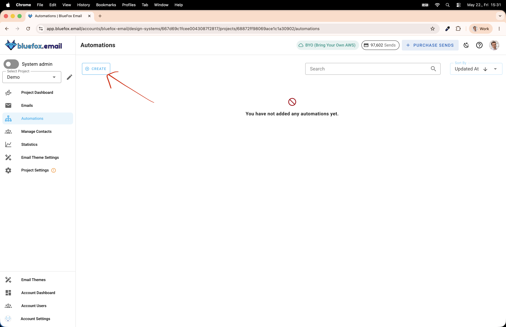
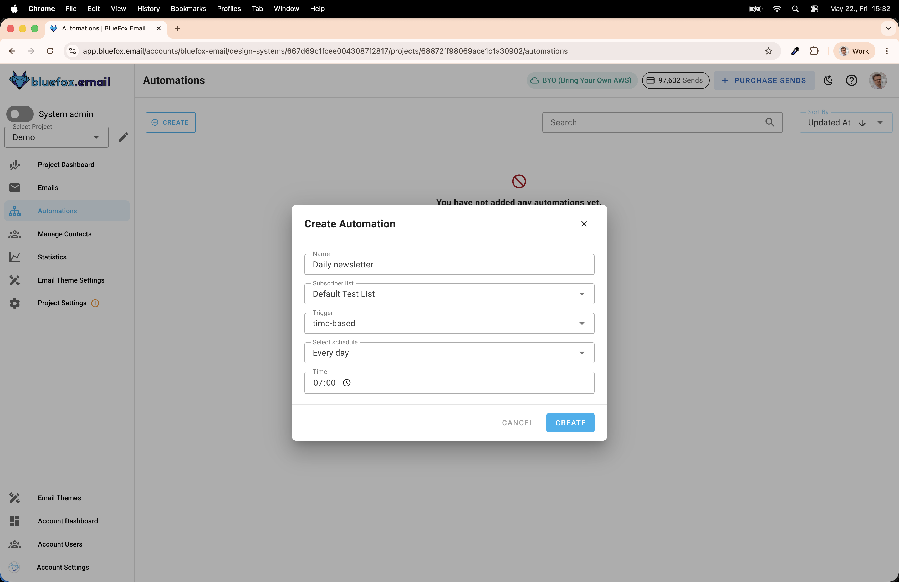
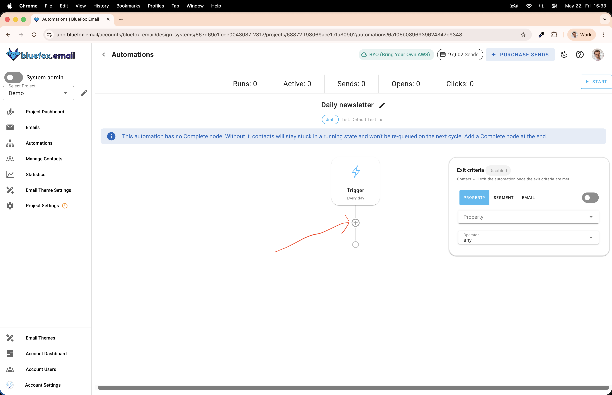
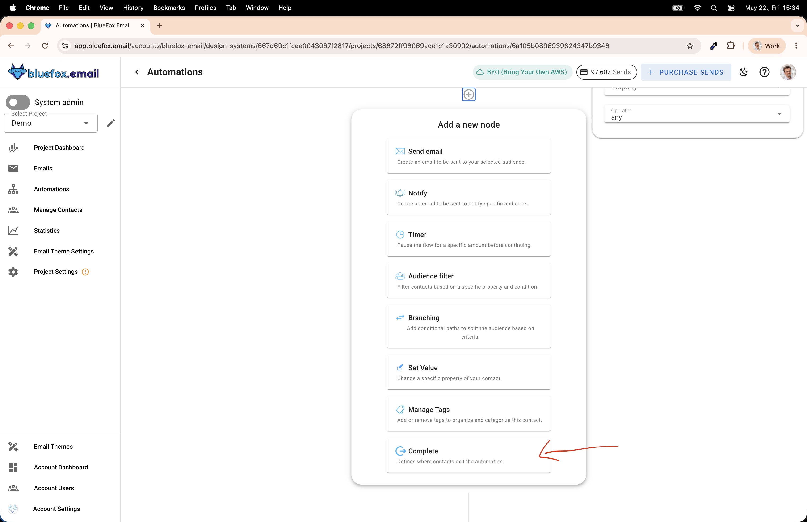
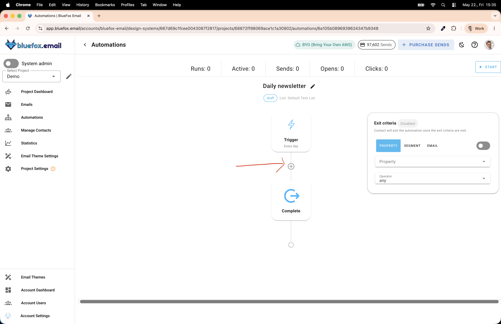
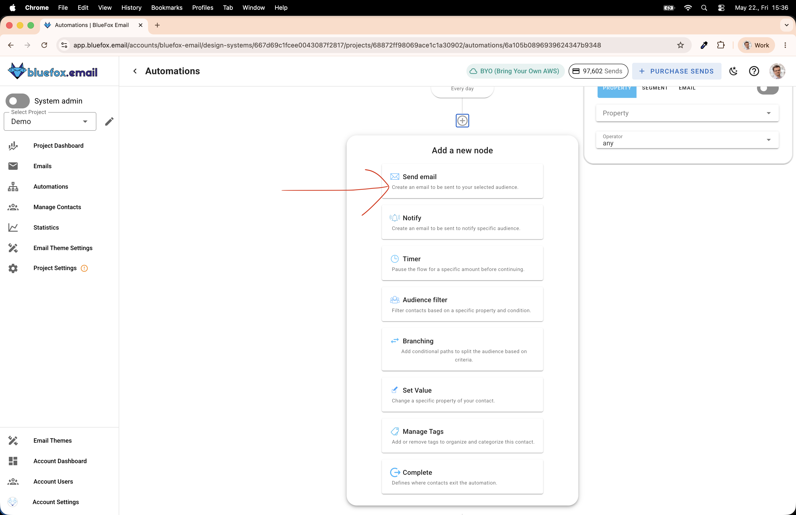
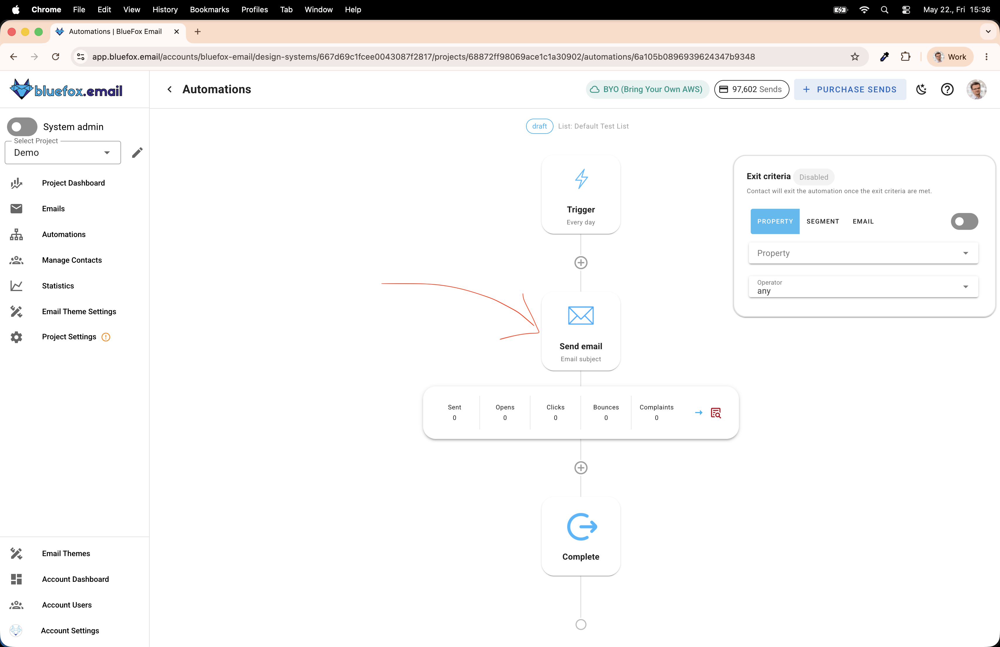
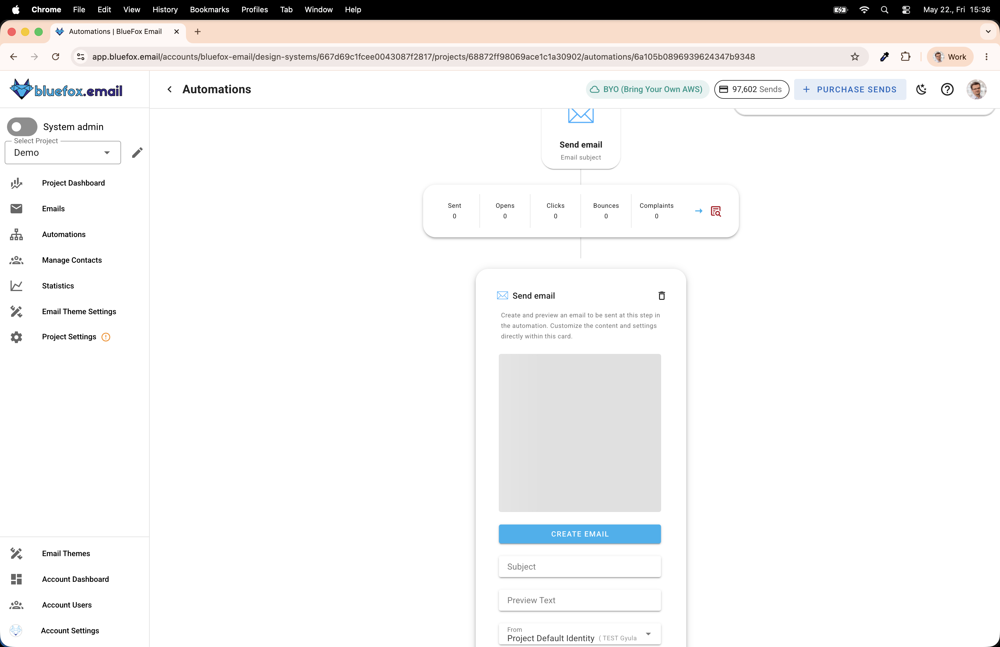
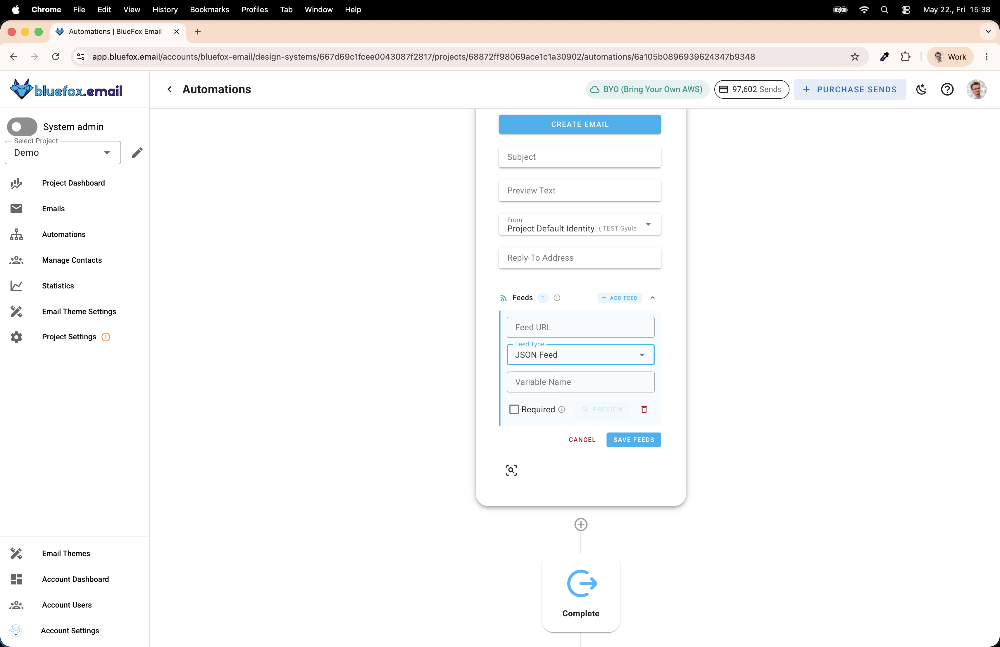

# How to Create a Newsletter with AI and Send It Automatically

I want to write an article with the following structure:
 - intro
   - I write down the idea that I don't feel that I have enough time to keep up with the news, plus that many news titles are click baits... It would be nice to get the most important news in my inbox every morning -> without the clickbait, but with actual news.
   - also, I would write down that it could be used for other types of aggregations... from blog posts, from youtube, etc... Would be quite easy to roll out niche newsletters this way.
 - Implementation overview (I also wanna include an image about how it works.)
   - schedule send every morning
   - ESP calls an api endpoint
   - API fetches the news, selects the most relevant ones
     - Summarizes the news + make it less click-baity, refer original articles
     - for the hero unit (the main news item) it would use the content of multiple resources, and refer 3 resources
     - the API returns a JSON document with a fixed format
   - ESP merges the data into the email template
   - Sends the email to subscribers...
 - How to implement it with BlueFox Email
   - create an automation
     - trigger type: "time-based"
     - schedule: every day (or every weekday, -> but then you might wanna create the same automation for weekends, but with different time)
     - time: 7AM
     - I want to add a few screenshots here - with explaining the steps
       - showing where to find the automations (+ the create button) 
       - the create dialog, with filled out details 
       - the automation is ready... need to add a complete node, click on the plus icon -> because in this case I don't want subscribers to queue up... it would be useful if for example I created a course or something... (coz I could work on the course while a few people already started getting the emails.) 
       - You will find it at the end of the list 
       - Add a send email node. Click ion the plus icon again 
       - Now, click on the first item, the send email one 
       - now, you have a send email node as well... click on the node to expand the details 
       - You can see that you can enter subject line, preheader text (or preview text) ... srcoll a little bit down and click on the add feed button 
       - Show that we can add a feed (RSS or json) to the send email node , we can give it a variable name (this is the base object that we will use in our template... eg news.xyz.title)... The required option prevents sending if the api responds with an error (if the response is not a http 2xx response...)... so now, you might be wondering, how we will refer to the data from the api... that's why we need to define it.
   - Define JSON format (Explain, that defining the json format is very important, coz two systems have to communicate... we have to make sure that the api returns in this format, so we can merge into the template. Here, write an actual description, explaining the hero unit, the articles, etc... and then we can create an example json, showcasing it.)
     - subjectLine
     - hero
       - title
       - description
       - image
         - src
         - alt
       - cta
         - link
         - label
       - sources []
         - label
         - link
       - articles []
        - title
        - description
        - image
          - src
          - alt
        - source
          - label
          - link
   - Create the API with Claude code or any other code generator.
     - provide the JSON definition to it, and the goal...
     - provide a list of RSS feeds, or just tell it to pull from relevant newspapers' rss feeds
     - the api can either just select news from the RSS or summarize with AI (that's what I did) You can use Claude API or ChatGPT api for this...
     - the API should heavily cache, especially if it uses AI. In my example, I cache the responses for an hour.
     - you will need to host it somehwere or use ngrok to proxy the response to your local while testing
   - Create a template in the automation that uses data from the feed. (TODO LATER)
     - We can use the "news" variable in our template, select the json format (screenshot)

