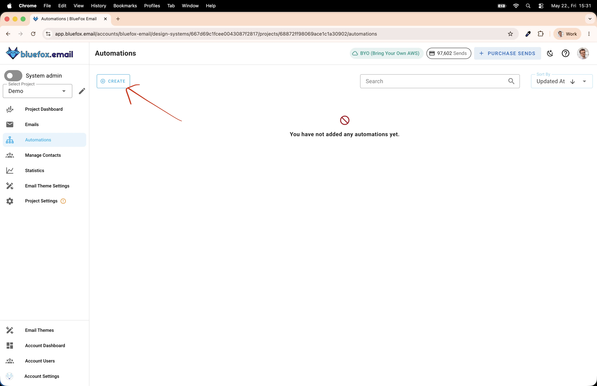
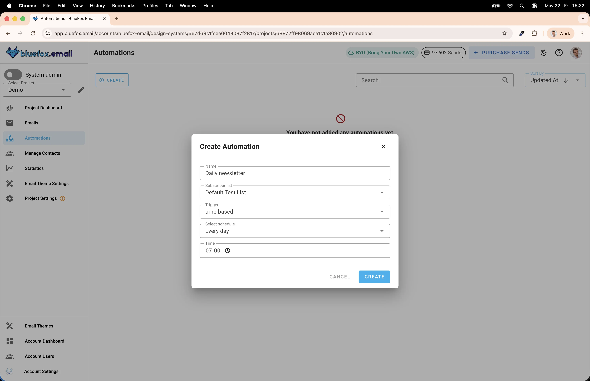
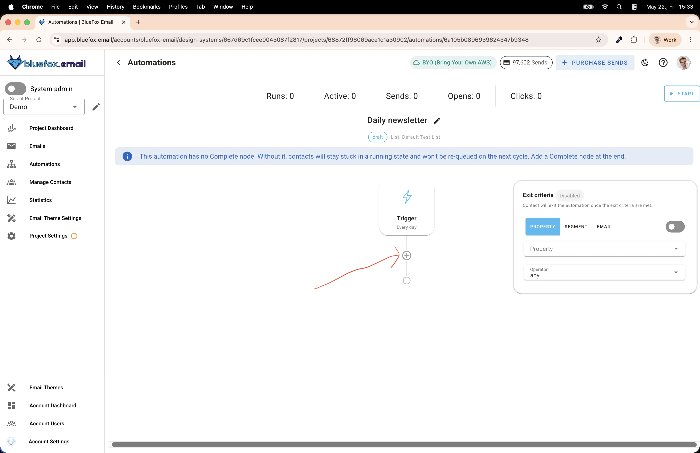
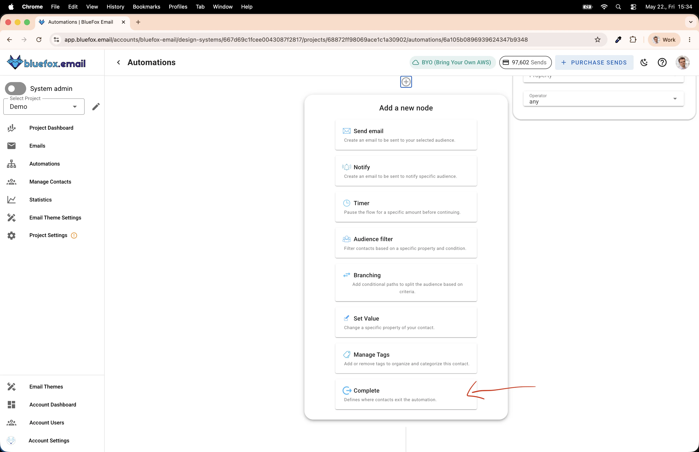
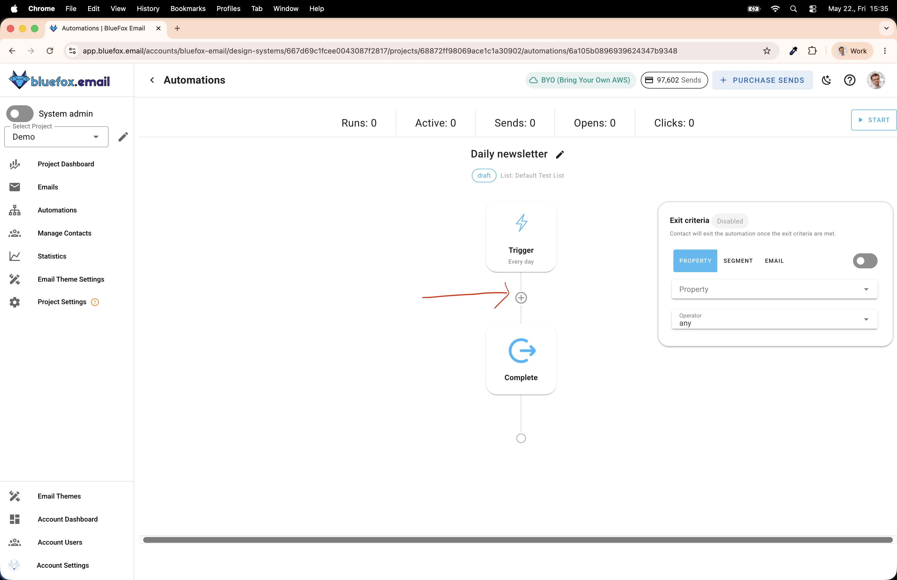
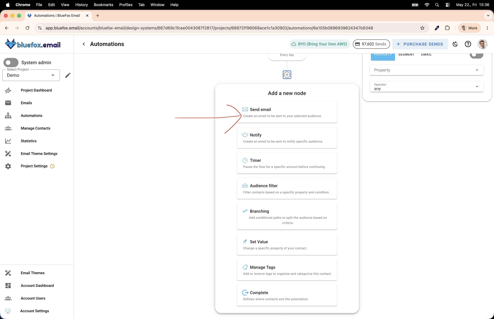
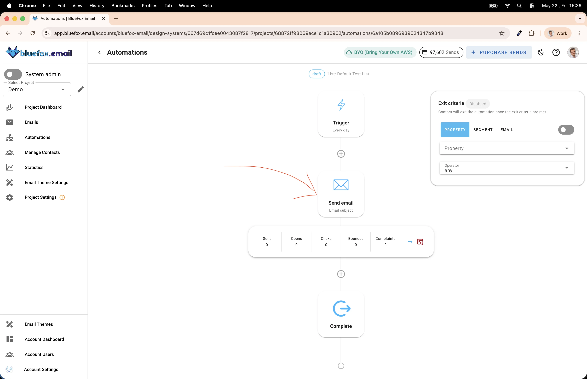
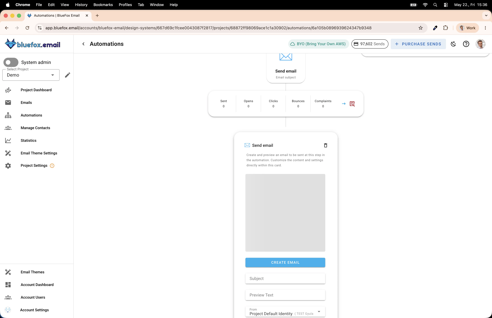
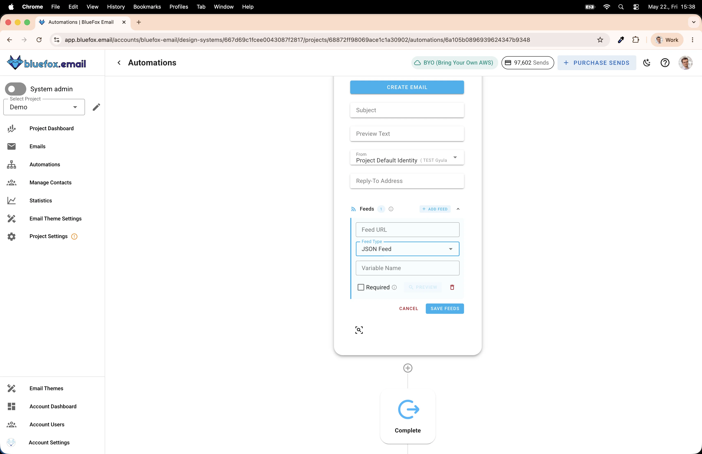

# How to Create a Newsletter with AI and Send It Automatically

I don't always have time to keep up with the news. And honestly, even when I do, half the headlines are clickbait — designed to get me to click, not to actually inform me. What I really want is a short, honest summary of the most important things that happened, delivered to my inbox every morning.

So I built exactly that: an AI-powered newsletter that pulls from RSS feeds, picks the most relevant stories, summarizes them without the clickbait, and sends them out automatically every day.

The best part is that this approach isn't just for news. You could roll out a niche newsletter aggregating blog posts from your industry, new YouTube videos from creators you follow, product releases, or anything else that has an RSS or JSON feed. It's surprisingly easy to customize once the foundation is in place.

:::tip TL;DR

1. Create a time-based automation in BlueFox Email (trigger: every day at 7 AM).
2. Add a Complete node so contacts don't queue up.
3. Add a Send Email node before the Complete node.
4. Define a JSON format that your API will return — this is what gets merged into your template.
5. Build the API (use Claude Code or any code generator) to fetch news from RSS feeds, summarize with AI, and return the JSON.
6. Add the API endpoint as a JSON feed on the Send Email node.
7. Create the email template using the feed data as variables.

:::

## How It Works

Here's the overall flow:

1. Every morning at 7 AM, BlueFox Email triggers the automation.
2. Before sending, it calls your API endpoint to fetch the latest news data.
3. Your API pulls from RSS feeds, selects the most relevant stories, summarizes them with AI, and returns a JSON document.
4. BlueFox Email merges that JSON into your email template.
5. The email goes out to your subscribers.

The key insight here is that BlueFox Email supports **data feeds** on send email nodes. You give it a URL, it fetches the response at send time, and makes the data available as variables in your template. This is what makes the whole thing work without any custom integration code on the sending side.

## Setting Up the Automation in BlueFox Email

### Create the Automation

Navigate to the **Automations** section of your project and click **Create**.



In the Create Automation dialog, fill in the details:

- **Name**: something like "Daily newsletter"
- **Trigger**: time-based
- **Schedule**: Every day (if you want weekday-only delivery, create a separate automation for weekdays and another for weekends with different times)
- **Time**: 07:00



### Add a Complete Node

Once the automation is created, you'll land on the automation canvas. You'll notice a warning: *"This automation has no Complete node. Without it, contacts will stay stuck in a running state and won't be re-queued on the next cycle."*

For a daily newsletter, this matters. You want contacts to go through the automation every day, not queue up forever waiting for it to finish. Click the **+** button to add a node.



Scroll to the bottom of the node list — you'll find **Complete** there.



:::info When would you skip the Complete node?
If you're building something like a drip course — where people sign up and receive emails over several days or weeks — you might intentionally leave out the Complete node at first. That way, new subscribers can start from the beginning while others are still progressing through the sequence. For a daily newsletter though, always add Complete.
:::

After adding it, your automation should look like this — Trigger → Complete, with the + button between them for the next step.



### Add a Send Email Node

Click the **+** button between the Trigger and Complete nodes to add the email step.



Select **Send email**. Your automation now has the right shape: Trigger → Send email → Complete.



### Configure the Send Email Node

Click on the Send Email node to expand it. You'll see fields for Subject, Preview Text, From address, and Reply-To. Scroll down a bit — there's an **Add Feed** button in the Feeds section.



Click **Add Feed** to configure your data source.



Here you can enter:
- **Feed URL**: the URL of your API endpoint
- **Feed Type**: JSON Feed
- **Variable Name**: the base variable you'll use in your template (e.g., `news`)
- **Required**: if checked, the email won't send if the API returns a non-2xx response

The Variable Name is important — it defines how you'll reference the data in your template. If you set it to `news`, then you'd access the hero title as `news.hero.title`, the first article's description as `news.articles[0].description`, and so on.

## Defining the JSON Format

Before building the API, you need to agree on a data format. Two systems have to communicate — your API and the email template — so they both need to speak the same language. Define this first, then implement both sides against it.

Here's the format I used for my daily news newsletter:

```json
{
  "subjectLine": "Today's top stories: AI regulation, climate summit, and more",
  "hero": {
    "title": "EU Reaches Landmark Agreement on AI Regulation",
    "description": "After months of negotiations, European lawmakers have finalized...",
    "image": {
      "src": "https://example.com/images/eu-ai.jpg",
      "alt": "European Parliament building"
    },
    "cta": {
      "link": "https://example.com/eu-ai-regulation",
      "label": "Read more"
    },
    "sources": [
      { "label": "Reuters", "link": "https://reuters.com/..." },
      { "label": "BBC", "link": "https://bbc.com/..." },
      { "label": "The Guardian", "link": "https://theguardian.com/..." }
    ]
  },
  "articles": [
    {
      "title": "Climate Summit Sets New Emissions Targets",
      "description": "World leaders agreed to accelerate carbon reduction timelines...",
      "image": {
        "src": "https://example.com/images/climate.jpg",
        "alt": "Wind turbines at sunset"
      },
      "source": {
        "label": "AP News",
        "link": "https://apnews.com/..."
      }
    }
  ]
}
```

A few things worth noting about the structure:

- **`subjectLine`**: the API generates this too. This way, the subject line reflects what's actually in the email that day.
- **`hero`**: the main story of the day. It's synthesized from multiple sources (up to three), so the description is more comprehensive than a single article could provide. The `sources` array links back to all of them.
- **`articles`**: the secondary stories. Each one has a single source.

This structure maps directly to an email template with a hero unit at the top and a list of article cards below it.

## Building the API

This is where the actual work happens, but it's more approachable than it sounds — especially if you use an AI code generator like Claude Code to scaffold it.

### What to give your code generator

When prompting Claude Code (or any other tool), provide:

1. The JSON format defined above — this is your contract
2. The goal: fetch the top news of the day, summarize each story, remove clickbait, link back to original sources
3. A list of RSS feeds to pull from (or tell it to use well-known newspaper feeds like BBC, Reuters, AP, The Guardian)

### What the API should do

The logic is roughly:
1. Fetch items from several RSS feeds
2. Group or rank them by relevance/recency
3. Pick the top story and pull content from 2-3 sources that cover it
4. Use the Claude or OpenAI API to summarize and de-clickbait each story
5. Build the JSON response

### Caching is essential

If your API calls an AI model on every request, costs add up fast and latency goes up too. Cache the response aggressively — I cache mine for one hour. Since the automation triggers at 7 AM, the email always gets fresh-ish data, but any retries or test calls within that hour hit the cache.

```javascript
// Example: simple in-memory cache
const cache = new Map();
const CACHE_TTL = 60 * 60 * 1000; // 1 hour

async function getCachedNews() {
  const cached = cache.get('daily-news');
  if (cached && Date.now() - cached.timestamp < CACHE_TTL) {
    return cached.data;
  }
  const data = await fetchAndSummarizeNews();
  cache.set('daily-news', { data, timestamp: Date.now() });
  return data;
}
```

### Hosting and local testing

For production, you'll need to host the API somewhere publicly accessible — a VPS, a serverless function, or any cloud provider works fine.

For local development, use **[ngrok](https://ngrok.com/)** to proxy requests from a public URL to your machine:

```bash
ngrok http 3000
```

Ngrok gives you a temporary public URL you can paste into the Feed URL field while testing. Once the automation sends an email, you'll see the request hit your local server.

## Creating the Email Template

The last step is building the email template that uses your feed data. In BlueFox Email, once you've set a Variable Name on your feed (e.g., `news`), you can reference it in your template directly.

This part is coming in a follow-up — the template editor deserves its own walkthrough with examples of how to bind the hero unit, loop through articles, and handle the case where the API might return fewer items than expected.

---

The core setup is actually pretty lightweight once you see how the pieces fit together. The automation handles the scheduling, BlueFox Email handles the sending and data merging, and you only need to write and host the API itself. With a code generator doing most of the scaffolding, the whole thing can come together in a few hours.
