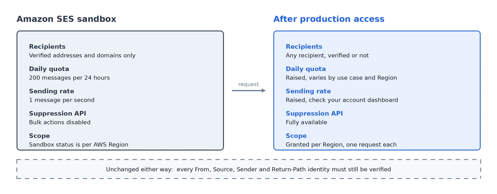
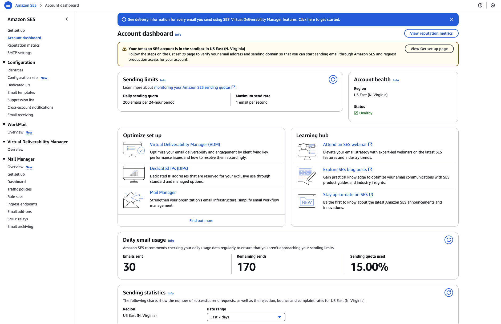
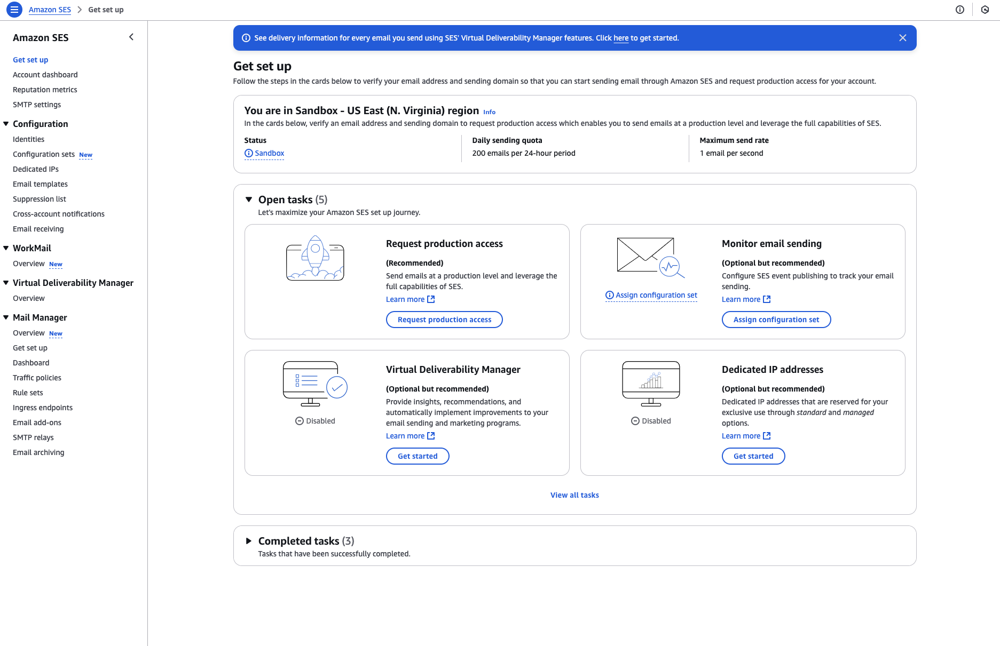
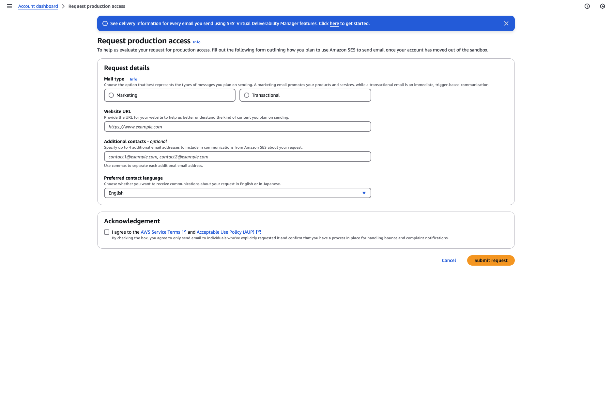
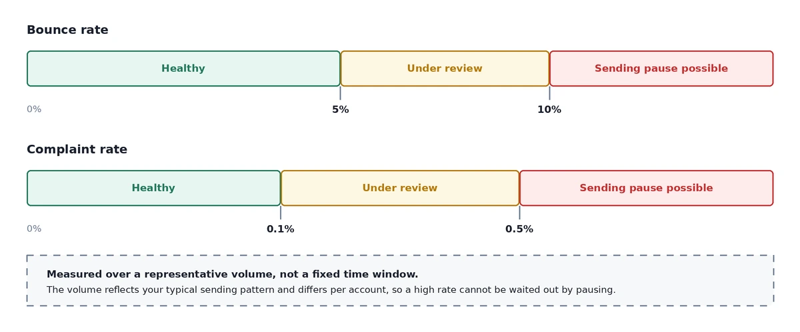

# How to Get and Maintain Production Access to Amazon SES

*Getting out of the sandbox takes a day. Staying out is the part nobody plans for.*

:::tip TL;DR

| Before you apply | What AWS is checking |
|---|---|
| Verified sending domain | That you own what you claim to send from |
| DKIM, SPF, MAIL FROM, DMARC | That your authentication resolves in live DNS |
| A live website with a privacy policy | That there is a real business behind the request |
| A visible signup path | That recipients asked for this |
| Bounce and complaint handling | That failures change what you send next |
| A specific use case description | That you know what you are sending and to whom |

Then keep bounces under 5% and complaints under 0.1%, or AWS puts the account under review.

:::

Every new AWS account starts in the [Amazon SES sandbox](/aws-concepts/ses-sandbox). You can build against the API, but you cannot send to anyone who has not verified themselves first, which means you cannot ship.

Getting out is a form, and a well-prepared application is usually answered within a day.

What surprises people is the second half. [Production access](/aws-concepts/ses-production-access) is not a permanent state, and AWS keeps measuring you after it grants it. The golden rule is the one everybody has heard and fewer people operationalise: **do not send spam.** Being a legitimate sender is not enough on its own. You also have to look like one in DNS, on your website, and in your bounce rate.

## What the sandbox restricts

Sandbox status is **unique per AWS Region**. Clearing it in `eu-west-1` does nothing for `us-east-1`, and this catches people out constantly.

While you are in sandbox mode:

* you can only send to verified email addresses and domains, or to the SES mailbox simulator
* you can send a maximum of 200 messages per 24-hour period
* you can send a maximum of 1 message per second
* for sending authorization, neither you nor a delegate sender can send to unverified addresses
* account-level suppression list management through the API is disabled

Everything else works. Configuration sets, event publishing, templates, [SMTP](/aws-concepts/ses): all of it is available, which is why the sandbox is a perfectly reasonable place to finish your integration before you apply.

One thing does not change when you leave. In production you can send to any recipient, verified or not, but you still have to verify every identity you use as a From, Source, Sender or Return-Path address. That requirement is permanent.

## What your sending limits become after approval

This is the question people actually want answered, and the honest answer is that there is no single number.

Approval raises two separate limits, and both are per Region:

* your [sending quota](/aws-concepts/ses-sending-quota), the maximum you can send in a rolling 24-hour window
* your [sending rate](/aws-concepts/ses-sending-rate), the maximum you can send per second

AWS sets the starting figures based on your stated use case and your Region. Published numbers you find in blog posts are somebody else's account, not a promise about yours. Check the account dashboard for your actual values.

Two details matter more than the numbers themselves.

**Both limits count recipients, not messages.** A single message addressed to 30 people spends 30 of your quota. This surprises people running digests and internal notifications, where one send can quietly consume far more quota than the message count suggests.

**SES does not queue for you.** Exceed the rate and the API returns a `Throttling` error with "Maximum sending rate exceeded"; over SMTP you get `454 Throttling failure` after DATA. The message is not held and not retried. If your application did not write down what it was about to send before it called SES, that email is simply gone and you no longer know who it was for.

That is why the fix for hitting your rate limit is a queue rather than a limit increase. A higher rate just moves where the cliff is.

## What to have in place before you apply

Reviewers check DNS. An application from a domain with no DMARC record is not automatically rejected, but it is a yellow flag on a form where you do not have many to spare.

* **Verify your sending domain**, not individual addresses. This is what AWS recommends before applying.
* **Set up [DKIM](/email-sending-concepts/dkim).**
* **Set up a MAIL FROM domain and [SPF](/email-sending-concepts/spf)**, so your bounce path aligns with your own domain.
* **Publish a [DMARC](/email-sending-concepts/dmarc) record.** `p=none` with a `rua` address is the floor, not the goal: it only collects reports. Once your legitimate mail passes cleanly, move to `p=quarantine`, then `p=reject`.
* **Handle bounces and complaints automatically.** AWS requires every account to have these processes, and the form asks you to confirm it.
* **Use double opt-in** for new subscribers.
* **Make unsubscribing easy.** A visible link, a preferences page, and `List-Unsubscribe` headers per [RFC 8058](https://www.rfc-editor.org/rfc/rfc8058).
* **Put a captcha on your signup forms** to keep bots and spam traps off your list.

Confirm the DNS side actually resolves before you submit, with our free [SPF](/tools/deliverability/spf-checker), [DKIM](/tools/deliverability/dkim-checker), [DMARC](/tools/deliverability/dmarc-checker) and [MX](/tools/deliverability/mx-checker) checkers. Records that exist in your registrar's dashboard and records that resolve publicly are not always the same thing.

## How to request production access

Open **Account dashboard** in the SES console. The sandbox banner tells you which limits currently apply and carries a **View Get set up page** button.

The Get set up page lists your outstanding account tasks, with **Request production access** among them.

That opens the form.

It asks for:

* **Marketing or Transactional**, whichever describes the majority of your mail
* **a website URL**, which a reviewer will actually open
* **your use case**: what you send, how often, and how people got onto your list
* **how you handle bounces and complaints**
* **an acknowledgement** that you will only email people who explicitly requested it, and that you have a process for handling bounce and complaint notifications

The website is where most weak applications fail, and it fails silently. A coming-soon page, no privacy policy, or no visible way to subscribe all read as reasons to say no. Fix that before you fix the wording of your use case.

The use case itself should be specific enough to be checkable. "We send important updates to our users and follow email best practices" could have been written by anybody, including the people the review exists to catch. "Transactional notifications to users who signed up on our platform, roughly 8,000 a month, double opt-in, hard bounces suppressed automatically via SNS webhooks" tells a reviewer what to expect from your account.

You can also submit through the AWS CLI with `put-account-details`, which is worth knowing if you are provisioning several accounts or automating setup.

:::warning You cannot edit after submitting

Once you submit, your account details are locked until the review completes. Read the form back before you send it.

:::

## What happens after you submit

AWS Support provides an initial response within 24 hours, and grants the request inside that window when it can. If they need more information from you, it takes longer.

After that, quota increases work in two ways. AWS may raise your limits automatically once you are sending high-quality production mail, and it often does so before you need it. Qualifying for that means sending real production content to real recipients, regularly sending close to your current daily maximum without exceeding it, and keeping bounces and complaints low.

If the automatic increase does not come and you need more, request it yourself through the **AWS Service Quotas** console rather than the SES page you used to leave the sandbox. Sending quota and sending rate are separate requests, and each takes up to 24 hours.

## If your request is rejected

A rejection is usually about something checkable, not something mysterious. Before you appeal:

* run your domain through the [deliverability tools](/tools/deliverability/) and confirm SPF, DKIM, DMARC and MX all resolve as intended
* open the website you submitted the way a reviewer would, and ask whether it is obvious what the business is and how someone subscribes
* name the mechanism in your bounce handling, not the intention

:::warning Never open a second AWS account

Creating a new account to get around a rejection or a pause is a terms of service violation. AWS links accounts by billing details, IP and domain, and the usual outcome is losing all of them rather than gaining one.

:::

## A note on buying a pre-approved SES account

There is a market for AWS accounts that already have production access, and it exists because the sandbox is annoying. It is worth understanding what you are actually buying.

The reputation attached to that account is somebody else's, and you have no way to audit what it was used for. Sending limits reflect a history you did not create. Account ownership transfers of this kind breach the AWS Customer Agreement, and the linking signals that catch people opening second accounts (billing details, IP, domain) work exactly as well here.

More practically: the sandbox is not the hard part. A first-time application with clean DNS and a real website is usually approved within a day. If your application is being rejected, buying an account does not fix the underlying reason, it just moves the same problem onto infrastructure you cannot appeal for.

## How to maintain production access

Approval is not a permanent state. AWS keeps measuring, and acts at published thresholds:

* **bounce rate at 5% or greater**: your account is automatically placed under review
* **bounce rate at 10% or greater**: AWS might pause your sending until you resolve the cause
* **complaint rate at 0.1% or greater**: automatically placed under review
* **complaint rate at 0.5% or greater**: AWS might pause your sending

There is a detail in how these are calculated that changes what you can do about a bad one. AWS does not measure over a fixed window. It uses a **representative volume**: an amount of mail that reflects your typical sending pattern, which differs per account and shifts as your sending changes. A rate is not something you can pause your way out of. You reduce it by sending good mail, not by sending none.

The **Reputation metrics** page shows the same view the SES team sees when assessing your account. The status field is the one to watch:

* **Healthy**: nothing currently affecting the account
* **Under review**: a metric crossed a maximum rate, and if it is not resolved by the end of the review period, sending may be paused
* **Pending sending pause**: the issues behind the review have not been resolved, and a member of the SES team has to look at your account before anything else happens
* **Sending pause**: you cannot send, and you can request a review of the decision

The console shows those numbers. It will not tell you when they move, which is the actual problem: most teams find out from the review email rather than from their own monitoring.

So set CloudWatch alarms. AWS suggests a bounce alarm at 0.05 and a complaint alarm at 0.001, and recommends earlier warning alarms as well. A second bounce alarm at 0.03 gives you room to act before the review threshold rather than at it.

Beyond monitoring, the maintenance work is unglamorous and mostly about list quality:

* **ramp volume gradually**, because a spike from a domain with no sending history looks exactly like a compromised account
* **never buy a list**, which is the fastest way to lose access you spent weeks getting
* **suppress hard bounces immediately** and stop mailing long-term non-openers

That last one is where the suppression list earns its place. SES maintains an account-level suppression list and records bounces and complaints on it, but it does not check that list against your next campaign for you: that step belongs to whatever sends your mail. A suppression list nobody reads before sending is just a table.

## The rules AWS approval does not cover

Leaving the sandbox gets your mail accepted by AWS. It does not get it into anyone's inbox.

Since February 2024, Gmail and Yahoo have enforced their own requirements on domains sending 5,000 or more messages a day, and Microsoft began enforcing comparable rules for its consumer domains in May 2025. For bulk senders that means SPF, DKIM and DMARC on every sending domain, TLS on connections, alignment between your visible From domain and your authenticated domain, one-click unsubscribe honoured within two days, and a spam complaint rate below 0.3%.

Gmail's spam rate is not a looser version of your SES complaint rate. It is a different measurement, taken by a different party, and your SES metrics can look clean while it climbs. Gmail does not report individual complaints back to your sending infrastructure at all. [Google Postmaster Tools](/posts/gmail-spam-complaints-google-postmaster-tools) is the only way to see that number.

Treat 0.3% as where enforcement starts and below 0.1% as what you actually manage against.

## When you do not need any of this

Production access is worth having if you are running your own AWS account on purpose: you want the reputation, the quotas and the per-send cost to be yours.

If you picked SES because it was the cheapest way to get email out and the AWS application is just an obstacle in front of that, it is worth knowing you can skip it. BlueFox-managed sending is a separate delivery mode with its own review and no AWS account involved. The [Delivery Modes documentation](/docs/projects/delivery-modes) covers how the modes differ.

And if you do want your own SES account, you can have both: [BYO Amazon SES](/byo-amazon-ses-pricing) keeps the account, the reputation and the AWS bill yours, with BlueFox handling suppression, subscription preferences, unsubscribe headers, double opt-in and send queueing on top. The [SES setup walkthrough](/posts/how-to-set-up-aws-ses) and the [SNS bounce and complaint wiring](/posts/how-to-handle-bounces-and-complaints-with-aws-ses-and-sns) are the two guides you would follow.

Either way, the thing to do first is confirm your authentication resolves. It is the cheapest check on this list and the one most rejected applications turn out to have failed.