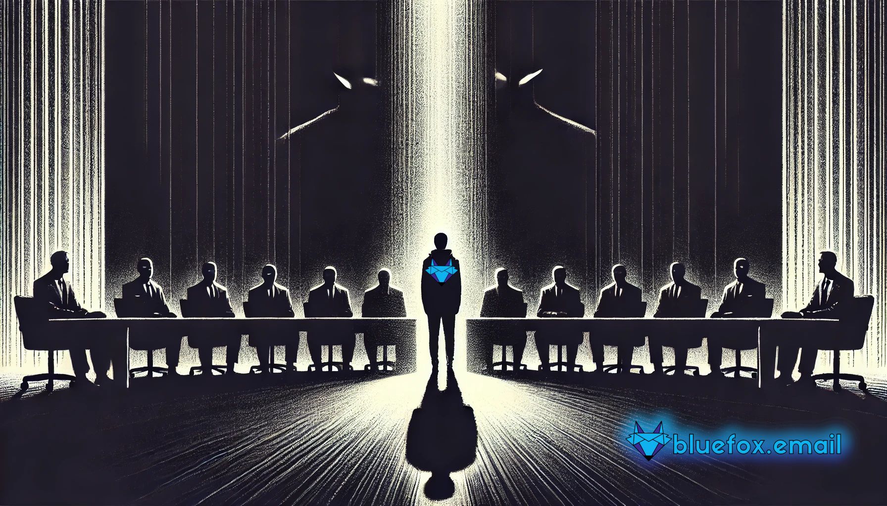

# How to Get and Maintain Production Access to Amazon SES

::: warning WORK IN PROGRESS DOCUMENT
This is a draft document seeking feedback from experts.

Our goal is to provide a checklist for our customers and prospects to ensure they follow best practices for responsible email sending.

Additionally, while this serves as a guide, it will also play a role in our marketing efforts to help businesses optimize their email strategies.
:::

Amazon SES offers excellent email deliverability at a competitive price. However, to protect their reputation, AWS has strict requirements for granting production access. If you’re new to SES, or even if you’ve requested access before, the process can sometimes be challenging.

The **golden rule** is simple: **DO NOT SEND SPAM**. AWS actively enforces policies to maintain its sender reputation. Even if you’re a legitimate sender, failing to meet AWS’s best practices could lead to rejection.

## Technical Requirements to Get Production Access
Before requesting production access, make sure you have the following technical setup in place:

- **Verify your sending domain**
- **Set up DKIM & DMARC** (DMARC should be configured to at least “none” or “reject” for security)
- **Set up a MAIL FROM domain & SPF** (improves email authentication and prevents spoofing)
- **Implement a mechanism to handle bounces and complaints**
  - Remove hard-bounced addresses from your list
  - Maintain an internal suppression list
- **Use double opt-in for new subscribers** (ensures valid emails and reduces spam complaints)
- **Provide an easy unsubscribe option**
  - Implement a **subscription preferences page** where recipients can unsubscribe from individual lists or all emails
  - Include a **visible unsubscribe link** in all marketing emails
  - Implement **One-Click Unsubscribe (RFC 8058)**
- **Use captchas on signup forms** (prevents bot signups and spam traps)
- **Manage your sending volume carefully**
  - Avoid sudden spikes; ramp up email volume gradually
  - Use a message queue (Amazon SQS, RabbitMQ, etc.) to control sending rates

Following these best practices not only helps you get production access but also improves deliverability and protects your sender reputation.

## What bluefox.email Does for You

Bluefox.email is built for legitimate senders. We actively prevent spammers from using our platform by requiring users to bring their own Amazon SES accounts.

We handle many of the deliverability best practices for you:

- **Automatic handling of bounces & complaints**
  - Webhook-based handling of bounces and complaints
  - Internal suppression list management
  - Email notifications for bounces & complaints
- **Subscription preferences management**
  - Users can pause or unsubscribe from specific lists or all emails
  - Unsubscribe links are automatically included in marketing emails
- **Signup forms with optional captchas**
- **Built-in double opt-in mechanism**
- **List-Unsubscribe headers for One-Click Unsubscribe**
- **Send queue management** (delays emails when you exceed your SES quota to prevent deliverability issues)

By using Bluefox.email, you get these email best practices handled for you automatically, ensuring compliance with AWS policies.

## What You Need to Do in Your AWS Account
If you use Bluefox.email, you’ll still need to complete some steps in AWS:

1. **[Set up your SES account](./how-to-set-up-aws-ses)**
   - Verify your sending domain
   - Configure DKIM
   - Set up a MAIL FROM subdomain & SPF records
   - Set up DMARC to “reject” unauthorized senders
2. **[Configure bounce & complaint webhooks with SNS](./how-to-handle-bounces-and-complaints-with-aws-ses-and-sns)**
   - Create SNS topics for bounces & complaints
   - Subscribe Bluefox email’s webhook to these topics
   - Link the topics to your SES sender identity
3. **Request Production Access**
   - You may need to explain your use case to AWS
   - Highlight your **anti-spam and compliance measures** (use our checklist above)
   - If rejected, appeal by emphasizing your commitment to email best practices

## How to Maintain Your Production Access
Once approved, you need to continue following best practices to avoid suspension.

- **[Monitor your bounce & complaint rates](https://docs.aws.amazon.com/pinpoint/latest/userguide/channels-email-deliverability-dashboard-bounce-complaint.html)**
  - **Bounce Rate:** Keep it below **2%**. If it reaches **5%**, AWS may review your account. If it exceeds **10%**, AWS could **temporarily suspend** your sending privileges.
  - **Complaint Rate:** Maintain it below **0.1%**. If it reaches **0.5%**, AWS **may pause** your ability to send emails.
- **Send emails gradually**
  - Avoid sudden volume spikes
  - We’re developing an automation tool to ensure your emails reach the right people at the right time.
- **Never buy email lists**
  - Purchased lists contain invalid addresses and spam traps
  - Build an engaged email list organically

By staying compliant, you ensure your SES account remains in good standing and maintain high deliverability rates.
