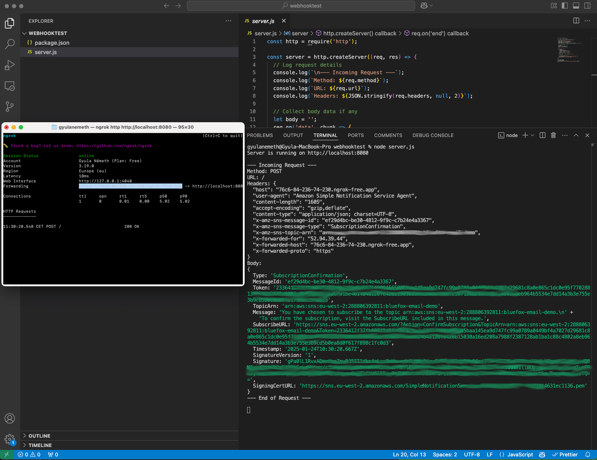
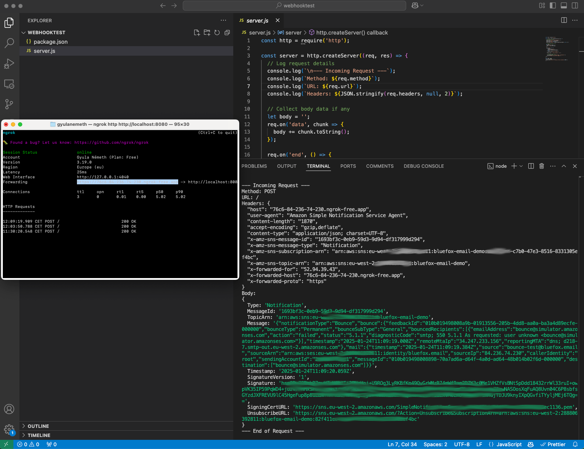

# How to Handle Bounces and Complaints with AWS SES and SNS

Whenever you send an email and it bounces - maybe because the address doesn’t exist - or someone marks it as spam because you were a bit too persistent, you should immediately stop sending emails to that address. If you keep sending emails to those addresses, your sender reputation will take a serious hit.

If you want your emails to land in your customers' inboxes, being a responsible sender is key. A big part of that is properly handling bounces and complaints.

::: info Not familiar with AWS SES (Amazon Simple Email Service)?
AWS SES is an affordable and reliable email-sending service designed to get your emails to your customers’ inboxes. However, they’re extremely cautious about who gets production access, as they aim to protect their sender reputation from spammers.  
If you’re new to AWS SES or still in the sandbox environment, check out our [guide](./how-to-set-up-aws-ses) on setting it up.
:::

The simplest way to handle bounces and complaints is to remove those addresses from your email list—or better yet, add them to a suppression list. Suppression lists have a major advantage: if, for some reason (e.g., bot activity), an email address that previously reported spam sneaks back into your list, a quick check against the suppression list will ensure you never send them an email again. That’s why we strongly recommend using internal suppression lists.

It’s worth noting that handling bounces and complaints isn’t just good practice—it’s a must if you want to secure production access to AWS SES. <!-- TODO: link the article when it's ready -->

This tutorial will guide you step by step through setting up AWS SES and SNS to send notifications to your webhook whenever a bounce or complaint occurs.

::: tip Let us handle bounces and complaints for you  
If you’d rather not deal with the complexities of managing SES directly - like handling bounces, complaints, HTML rendering (yes, I'm talking about Outlook), and more - give bluefox.email a try! You can create a [free account](https://app.bluefox.email/accounts/create-account) anytime.  
:::

## How It Works – In a Nutshell

By the end of this tutorial, you’ll have a system in place to automatically handle bounces and complaints from AWS SES. Here's how it works:

1. **SES Generates Events**  
   Whenever a bounce or complaint occurs, AWS SES will generate an event and send it to an SNS topic.

2. **SNS Topics**  
   These events are routed to specific SNS topics—one for bounces and another for complaints. Having separate topics for each helps keep things organized and simplifies management.

3. **SNS Subscriptions**  
   Each SNS topic has its own subscription that forwards the event to your webhook. The webhook is the endpoint where you’ll process the events (e.g., adding the email to your suppression list).

4. **Your Webhook**  
   Finally, your webhook receives the event and takes action, such as adding the email to a suppression list to ensure it’s never contacted again.

::: warning Why Separate Topics and Subscriptions?
To keep things simple and manageable, we’ll create dedicated SNS topics and subscriptions for bounces and complaints. This way, you can process each type of event independently and maintain clarity in your workflow.
:::

By setting this up for both bounces and complaints, you’ll have a robust mechanism to protect your sender reputation and meet AWS SES’s requirements.

Let’s dive into the steps to get this working!

::: tip TLDR
1) Create a topic for bounces, and one for complaints
2) Create a subscription for both that sends a notif to your webhook (Use ngrok for local development)
3) Set up your SES sender identity (eg. sending domain) to send notifications to those topics
4) Implement your webhook logic (eg. )
:::

## Create a topic

<!--
Volt datacenter, ahol voltak különbségek az öröklődésben... (application/json...) pedig ugyanazok voltak a beállítások... ezért én szeretem explicit mindehol beállítani...
-->
First of all, navigate to Amazon SNS at your AWS console. Your SNS dashboard should look something similar to this:

Then, just go to topics, and click on the "Create topic" button.

Here, you will see quite a few configuration options. We will go through the exact settings you need.

First of all, you don't need a `FIFO` topic, a `Standard` one is perfectly enough for you. Besides that, just give a descriptive name to your topic. I suggest you to use "-bounce" or "-complaint" postfixes, so it's obvious what the topic is for. I think it's also a good idea to explicitly add your environment name to the topic's name (eg. prod or staging).

After that, scroll down, to the "Delivery policy" section.

If you open the accordion, you will see the default settings. As you may see it, the default "Content-Type" is `text/plain`. It's best to change that to `application/json`.

Untick the "Use default delivery policy".

Scroll down to the "Content-Type" input, and change `text/plain` to `application/json`.

You need to scroll down to the bottom of the page, and click the "Create topic" button.

After your topic is created, you should see something like this:

## Create a subscription

mention ngrok!

confirm subscription... //separate message

vagy használj bluefoxot, az majd kiírja neked a cuccot amit be kell copyzni

OR

either way:

## Set up notification at your SES Identity

// bounces / complaints...

## Implement your Webhooks

// first, let's just implement a simple one that prints everything to the console.

## Test the webhook

// ide megy a végső screenshot, és le kell írni, hogy itt mit tudnak csinálni...
// - internal suppression list
// - remove from subscriber list

// Megemlíteni, hogy simán lehet küldeni a bounce@simulator.amazonses.com" email címre is... és akkor a wehbooknak meg kell hívódnia...

## Multiple sending identities

// erről is írni...

