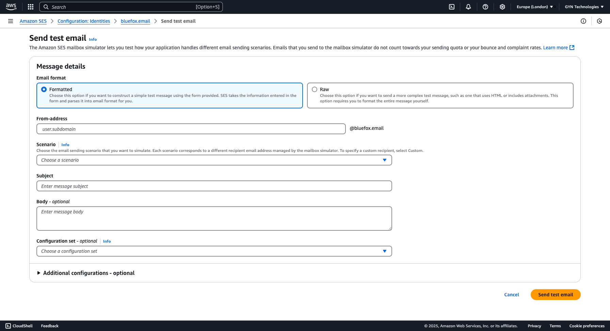

# How to Handle Bounces and Complaints with AWS SES and SNS

Whenever you send an email and it bounces - maybe because the address doesn’t exist - or someone marks it as spam because you were a bit too persistent, you should immediately stop sending emails to that address. If you keep sending emails to those addresses, your sender reputation will take a serious hit.

If you want your emails to land in your customers' inboxes, being a responsible sender is key. A big part of that is properly handling bounces and complaints.

::: info Not familiar with AWS SES (Amazon Simple Email Service)?
AWS SES is an affordable and reliable email-sending service designed to get your emails to your customers’ inboxes. However, they’re extremely cautious about who gets production access, as they aim to protect their sender reputation from spammers.  
If you’re new to AWS SES or still in the sandbox environment, check out our [guide](./how-to-set-up-aws-ses) on setting it up.
:::


The simplest way to handle bounces and complaints is to remove those addresses from your email list—or better yet, add them to a suppression list. Suppression lists have a major advantage: if, for some reason (e.g., bot activity), an email address that previously reported spam sneaks back into your list, a quick check against the suppression list will ensure you never send them an email again. That’s why we strongly recommend using internal suppression lists.

It’s worth noting that handling bounces and complaints isn’t just good practice—it’s a must if you want to secure production access to AWS SES. <!-- TODO: link the article when it's ready -->

This tutorial will guide you step by step through setting up AWS SES and SNS to send notifications to your webhook whenever a bounce or complaint occurs.

::: tip Let us handle bounces and complaints for you  
If you’d rather not deal with the complexities of managing SES directly - like handling bounces, complaints, HTML rendering (yes, I'm talking about Outlook), and more - give bluefox.email a try! You can create a [free account](https://app.bluefox.email/accounts/create-account) anytime.  
:::

## How It Works – In a Nutshell

By the end of this tutorial, you’ll have a system in place to automatically handle bounces and complaints from AWS SES. Here's how it works:


1. **SES Generates Events**  
   Whenever a bounce or complaint occurs, AWS SES will generate an event and send it to an SNS topic.

2. **SNS Topics**  
   These events are routed to specific SNS topics—one for bounces and another for complaints. Having separate topics for each helps keep things organized and simplifies management.

3. **SNS Subscriptions**  
   Each SNS topic has its own subscription that forwards the event to your webhook. The webhook is the endpoint where you’ll process the events (e.g., adding the email to your suppression list).

4. **Your Webhook**  
   Finally, your webhook receives the event and takes action, such as adding the email to a suppression list to ensure it’s never contacted again.

::: warning Why Separate Topics and Subscriptions?
To keep things simple and manageable, we’ll create dedicated SNS topics and subscriptions for bounces and complaints. This way, you can process each type of event independently and maintain clarity in your workflow.
:::

By setting this up for both bounces and complaints, you’ll have a robust mechanism to protect your sender reputation and meet AWS SES’s requirements.

Let’s dive into the steps to get this working!

::: tip TLDR
1) Create a topic for bounces, and one for complaints
2) Create a subscription for both that sends a notif to your webhook (Use ngrok for local development)
3) Set up your SES sender identity (eg. sending domain) to send notifications to those topics
4) Implement your webhook logic (eg. adding the reported addresses to a suppression list)
:::

## Create a topic

<!--
Volt datacenter, ahol voltak különbségek az öröklődésben... (application/json...) pedig ugyanazok voltak a beállítások... ezért én szeretem explicit mindehol beállítani...
-->
First of all, navigate to Amazon SNS at your AWS console. Your SNS dashboard should look something similar to this:


Then, just go to topics, and click on the "Create topic" button.


Here, you will see quite a few configuration options. We will go through the exact settings you need.


First of all, you don't need a `FIFO` topic, a `Standard` one is perfectly enough for you. Besides that, just give a descriptive name to your topic. I suggest you to use "-bounce" or "-complaint" postfixes, so it's obvious what the topic is for. I think it's also a good idea to explicitly add your environment name to the topic's name (eg. prod or staging).


After that, scroll down, to the "Delivery policy" section.


If you open the accordion, you will see the default settings. As you may see it, the default "Content-Type" is `text/plain`. It's best to change that to `application/json`.


Untick the "Use default delivery policy".


Scroll down to the "Content-Type" input, and change `text/plain` to `application/json`.


You need to scroll down to the bottom of the page, and click the "Create topic" button.


After your topic is created, you should see something like this:


## Create a subscription

Now, it's time to create a subscription for your topic, that will send an HTTP request to your webhook, whenever an event is sent to the topic.

In order for a webhook to work, you need a publicly available URL for your webhook. It is quite cumbersome to publish each change while developing your webhook, so for development purposes, we suggest you to use [ngrok](https://ngrok.com/).

It proxies all the requests from a public URL to your local machine.

At first, it's perfectly enough if you create a simple server that just prints the request headers and body to the console. For example, this simple Node.js server is perfectly enough:

```Javascript
const http = require('http');

const server = http.createServer((req, res) => {
  // Log request details
  console.log(`\n--- Incoming Request ---`);
  console.log(`Method: ${req.method}`);
  console.log(`URL: ${req.url}`);
  console.log(`Headers: ${JSON.stringify(req.headers, null, 2)}`);

  // Collect body data if any
  let body = '';
  req.on('data', chunk => {
    body += chunk.toString();
  });

  req.on('end', () => {
    if (body) {
      console.log(`Body:`);
      console.log(JSON.parse(body));
    } else {
      console.log('Body: [No Body]');
    }
    console.log(`--- End of Request ---\n`);

    // Respond to the client
    res.writeHead(200, { 'Content-Type': 'text/plain' });
    res.end('Request received and logged.');
  });
});

const PORT = 8080;
server.listen(PORT, () => {
  console.log(`Server is running on http://localhost:${PORT}`);
});
```

Then, you just start ngrok:

```bash
ngrok http http://localhost:8080
```
It will generate an URL that is proxied to your localhost on the 8080 port. Ngrok prints the URL to your terminal when you start it. You will need to use this URL when you create your subscription, and you will be able to develop your webhook locally.

:::tip We can take care of your webhooks for you
If the implementation feels cumbersome, why not use bluefox.email? We take care of handling bounces and complaints for you. [Grab your free account!](https://app.bluefox.email/accounts/create-account)!

---

If you already use bluefox.email, you will just need to copy the webhook URL from the dialog when you hit the Set up bounces / complaints button in your [project settings](https://bluefox.email/docs/projects/settings#bounce-complaint-webhooks).
:::

Now, let's get back to the previous screen, and click the "Create subscription" button.


Which will lead you to this page, where the "Topic ARN" is already selected. If it is not selected, select it.


In the protocol dropdown, you should select `HTTPS`.


Enter your endpoint, that way generated by your ngrok client. Alternatively, you can enter the URL here that you copied from bluefox.email, from your [project settings](https://bluefox.email/docs/projects/settings#bounce-complaint-webhooks).


Note that, that there is an info box. If you click the link in the info box, a sidebar comes up on the right-hand-side that explains how you can confirm your subscription. It's either opening the link that was sent to your webhook, or copying the link back to the AWS SNS UI. We will get back to it in a bit.


Scroll down to the delivery policy. We will also change the "Content-Type" from `text/plain` to `application/json` here as well. I like to do it on both levels, because it happened to me once that topic settings inherited in one AWS region, but did not inherit in another region.


After you unchecked the "Use default delivery policy" checkbox, you can scroll down, change it to `application/json` and click the "Create subscription" button in the bottom of the page.


After clicking on the "Create subscription" button, your webhook will immediately receive an `HTTP POST` request. As you can see, it received a `JSON` payload, and the "Type" propertiy's value is `SubscriptionConfirmation`.


As mentioned previously, you have to confirm your subscription, by either openint the "SubscribeURL" your received, or by entering it on the UI. Until then your subsciption's status will be `Pending confirmation` as you can see below:


If you open the url direcly, you will see a similar `xml` response:

Of course, you can do it programmatically, or you can use the UI to confirm your subscription.

If you decide to go on the second path, go to your subscriptions, select the pending one, and click the confirm subscription button:


A dialog comes up with a single input. Paste your "SubscribeURL" to the input:


:::tip We chose the UI-based approach
At bluefox.email, we chose the second option, because we want to be 100% transparent about the processes. You have full control over what subscriptions you confirm.
:::

Either way, if you confirmed your subscription, its status should change to `Confirmed`.


## Set up bounce and complaint notifications at your Amazon SES Identity

Now, that your SNS topic and subscritpion is ready, you can set up your sending identity in SES to send notifications to your topic. (So your subscription will send it to your webhook.)

Let's to to your SES dashboard.


Select identities from the "Configuration" part of the menu on the left-hand-side.


Select your sending identity. Hopefully, by this time, you have set up your sending domain. If you haven't and need some guidance, please read our [How to Set Up AWS SES](./how-to-set-up-aws-ses) guide.


In you sending identity, select the "Notifications" tab.


Press the edit button at the "Feedback notifications" section.


Here, you can selet your topics for bounces and complaints. (And also for delivery feedback.)


Just select your previously created topics.


Later, when you will have implemented the webhook, you can turn off "Email feedback forwarding", since it will be not necessary to get it via email, since you will have your webhooks in place.


## Test the notification process

If you reached to this point, your notification system should be in place. Let's test it!

Just scroll up, and press the "Send test email" button.


We have sent a custom email in the [How to Set Up AWS SES tutorial](./how-to-set-up-aws-ses), but now, we will try out the other scenarios. The email can be formatted, and just fill something in for the subject and the body.


In the "Scenario" dropdown, select "Bounce" or "Complaint", depending on which you wanna test. In this case, I selected "Bounce":


Then just hit the "Send test email" button in the bottom-right corner of the page.


Now, you should receive an HTTP request and in the body, the "Type" field is `Notification`. You can get more details from the "Message" property. As you can see it, it's a JSON string, so you will need to parse it. In this case, the "notificationType" is `Bounce`.


As you can see, the notification system works. You can now test every possible notification in your local development environment. Another way to test it is to send an email with your SES directly to their bounce simulator at `bounce@simulator.amazonses.com`. Your webhook should be invoked in that case as well.

## Implement your Webhooks

// TODO: Here, we should write about that they should remove the bounded and complaied email addresses from their subscriber lists. Also, about an internal subscription list and how it's even a better solution.

:::tip We handle bounces and complaints automatically
We automatically remove bounced emails from your lists. We also remove the ones that complained. And we add them to an internal suppression list, so you will never send an email to them accidentally (even if they sneak back to your list due to bot activity.) You don't have to implement any of this, because we already have! [Create a free account now!](https://app.bluefox.email/accounts/create-account)!
:::


## Multiple sending identities

// TODO: write about that they might have mutliple sending identities and it's essential to handle bounces and complaints on all of them.

// TODO: mention, that we handle mutliple identities at bluefox.email, and we automatically test if bounces and complaints webhooks are set up for all of them, as it can be seen on the screenshot below:


