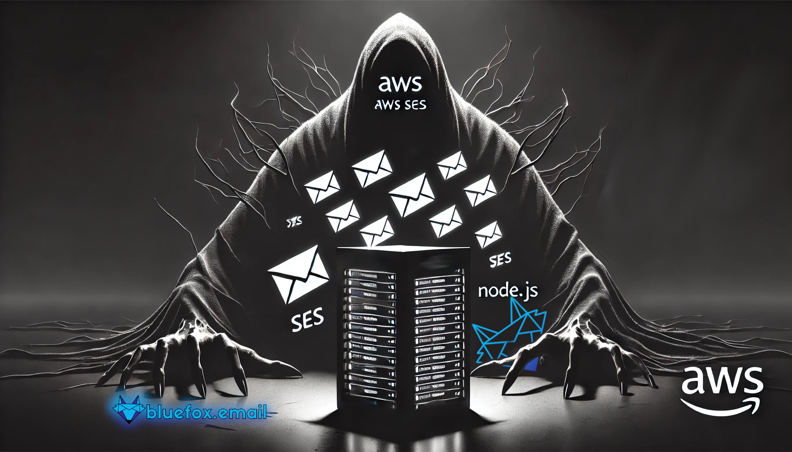
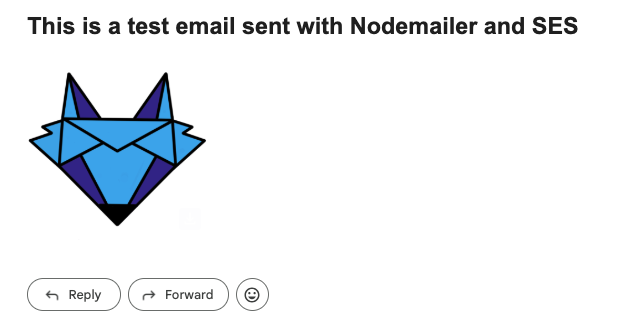

# How to Send an Email in Node.js Using Amazon SES with Nodemailer

Amazon SES is a great choice if you want to send emails that reach your customers' inboxes at a low cost. 

In this tutorial, you will learn how to send emails with Amazon SES in Node.js using Nodemailer. It is very easy!

## Why Nodemailer?
- It's always beneficial to have a generic layer for email sending. This way, whenever you want to change the service you use for sending emails, you only need to update your transport layer.
- More importantly, you can use fake SMTP services, such as `ethereal.email`, to test your email-sending processes. (For example, you can check if your links work correctly in your emails.)

Now, let's create a folder for your project and get started. Shall we?

::: warning
This is an old-school step-by-step tutorial from which you can actually LEARN. You should follow every step to ensure you understand everything, especially if you are a beginner. If you have more experience, you might skip a few steps.
:::


## Prepare Your Credentials

First of all, you will need to create a `.env` file containing your AWS `Access Key ID`, `Secret Access Key`, and the AWS region you are sending from. We will use the format shown below:

```ini
AWS_ACCESS_KEY_ID=your-access-key
AWS_SECRET_ACCESS_KEY=your-secret-key
AWS_REGION=us-east-1
```

If you don't have an AWS account, just [sign up](https://aws.amazon.com/). They offer many services in their free tier!

To send emails with AWS SES, you need to verify your email address (or your domain) beforehand. You can follow our [step-by-step tutorial](https://bluefox.email/posts/how-to-set-up-aws-ses). It might seem like a lot, but it shouldn't take more than 20 minutes.

Finally, create a user in IAM with `AmazonSESFullAccess`, and generate an `Access Key ID` and a `Secret Access Key`, which you should paste into the `.env` file above. Later on, **you should limit the permissions** to the bare minimum, but while you're experimenting with SES, it might be easier to use full access.

## Initialize Your Node.js Project with its Dependencies

Now that you have your credentials prepared, you can initialize your project. Navigate to your project folder and type:

```sh
npm init
```
This will create a `package.json` file that describes your project and its dependencies.

Install the following dependencies:
 - `nodemailer` is the package that we are going to use for sending our emails.
 - `@aws-sdk/client-ses` the Amazon SES client for Node.js
 - `dotenv` to handle your `.env` file

```sh
npm install nodemailer @aws-sdk/client-ses dotenv --save
```
The command above installs all the needed dependencies and saves them to your `package.json`.


## Write the Code - Step-by-step

Let's create an `src` folder, and an `index.js` file within the folder. Now, we are going to load our config values with `dotenv`:

```javascript
import dotenv from 'dotenv'
dotenv.config({ path: '../.env' })

console.log(process.env)
```
Run this script to make sure that your config values are loaded from your `.env` file.

Just enter the `src` folder and run the following command:
```sh
node index.js
```

:::tip
If you want to import files like this, and do it in .js files, you have to add a `"module": true,` property to your `package.json`.

Also, we are going to use top-level **await** in the code, so you at least need to use Node.js 16. We used Node.js 22 while writing this tutorial.
:::

Now, you can import the `SESClient`, `SendRawEmailCommand` and the default credential provider. The last will automatically use the `AWS_ACCESS_KEY_ID` and the `AWS_SECRET_ACCESS_KEY` environment variables defined in your `.env` file. Nodemailer will actually use the `SendRawEmailCommand` in the background. We just need the most basic email-related SES command!

```javascript
import { SESClient, SendRawEmailCommand } from '@aws-sdk/client-ses'
import { defaultProvider } from '@aws-sdk/credential-provider-node'
```
You can actually create the SES client:
```javascript
const sesClient = new SESClient({
  region: process.env.AWS_REGION,
  credentials: defaultProvider()
})
```
As stated at the beginning of the tutorial, we won't directly use the SES client. It will be the transport layer of Nodemailer. This way, if you ever decide to use a different provider, it will be very easy to switch.

Just import `nodemailer`:
```javascript
import nodemailer from 'nodemailer'
```
And create your transport layer:
```javascript
const transportLayer = nodemailer.createTransport({
  SES: {
    ses: sesClient
    aws: { SendRawEmailCommand }
  }
})
```
As you can see, we pass down the `sesClient`, and the `SendRawEmailCommand`. This is how `Nodemailer` will exactly know what method to use with SES.

Now, it's time for sending! Just use the `.sendMail` function of `Nodemailer`. Pass down the following arguments:

```javascript
const response = await transportLayer.sendMail({
  from: 'you@yourdomain.com',
  to: 'someoneelse@someotherdomain.com',
  subject: 'Testing Sending from SES',
  text: 'This is a test email sent with Nodemailer and SES'
})

console.log(response)
```
That's it! Your email is sent!
If you take a look at the console output, you will notice that the response contains a `messageId`. If you build an application that sends out emails, this message id can be extremely useful, especially if you are planning to [handle bounces and complaints](https://bluefox.email/posts/how-to-handle-bounces-and-complaints-with-aws-ses-and-sns).


## The Whole Node.js Project

If you followed the tutorial to this point, your project should look something like the following. Also, you can check out our version of the code on [Github](https://github.com/bluefox-email/how-to-send-an-email-in-nodejs-using-amazon-ses-with-nodemailer)

Your folder structure should look like this:
```
/your-project/
|
| /src/
|  |
|  | index.js
|
| .env
| package.json
```
Your `.env` file should look like this:
```ini
AWS_ACCESS_KEY_ID=your-access-key
AWS_SECRET_ACCESS_KEY=your-secret-key
AWS_REGION=us-east-1
```
Your `package.json` should look like this:
```json
{
  "name": "how-to-send-an-email-in-nodejs-using-amazon-ses-with-nodemailer",
  "version": "0.0.1",
  "type": "module",
  "description": "Code example for the article titled \"How to Send an Email in Node.js Using Amazon SES With Nodemailer\"",
  "main": "index.js",
  "scripts": {
    "test": "echo \"Error: no test specified\" && exit 1"
  },
  "repository": {
    "type": "git",
    "url": "git+https://github.com/bluefox-email/how-to-send-an-email-in-nodejs-using-amazon-ses-with-nodemailer.git"
  },
  "author": "Innovaris Group LLC.",
  "license": "MIT",
  "bugs": {
    "url": "https://github.com/bluefox-email/how-to-send-an-email-in-nodejs-using-amazon-ses-with-nodemailer/issues"
  },
  "homepage": "https://github.com/bluefox-email/how-to-send-an-email-in-nodejs-using-amazon-ses-with-nodemailer#readme",
  "dependencies": {
    "@aws-sdk/client-ses": "^3.750.0",
    "dotenv": "^16.4.7",
    "nodemailer": "^6.10.0"
  }
}
```

Your `src/index.js` should look like this:
```javascript
import dotenv from 'dotenv'
dotenv.config({ path: '../.env' })

import nodemailer from 'nodemailer'
import { SESClient, SendRawEmailCommand } from '@aws-sdk/client-ses'
import { defaultProvider } from '@aws-sdk/credential-provider-node'

const sesClient = new SESClient({
  region: process.env.AWS_REGION,
  credentials: defaultProvider()
})

const transportLayer = nodemailer.createTransport({
  SES: {
    ses: sesClient,
    aws: { SendRawEmailCommand }
  }
})

const response = await transportLayer.sendMail({
  from: 'you@yourdomain.com',
  to: 'someoneelse@someotherdomain.com',
  subject: 'Testing Sending from SES',
  text: 'This is a test email sent with Nodemailer and SES'
})

console.log(response)
```

If you set up everything correctly, you should have received an email after running the script.

## How to Send HTML Emails with Amazon SES with Nodemailer

If you want to send out emails programmatically, I assume you want to send transactional emails or any other email that you send from your backend to your customers. In that case, you most likely want to send `HTML` emails.

Here is how you can do it:
```javascript
const response = await transportLayer.sendMail({
  from: 'you@yourdomain.com',
  to: 'someoneelse@someotherdomain.com',
  subject: 'Testing Sending from SES - HTML',
  text: 'This is a test email sent with Nodemailer and SES',
  html: '<h1>This is a test email sent with Nodemailer and SES</h1>'
})
```

Although you send an HTML email, you might have noticed that we also sent the text version of the email. It is advised to do so.

You should see something like this in your inbox:


:::warning HTML emails are tough
Many people are surprised how hard it is to code HTML emails. You need to support tons of email clients on tons of devices, all of them with their own quirks... (I'm looking at you, Outlook!)

If you don't want to suffer with email HTML coding, and you still want to use AWS SES for sending out emails, then you might LOVE bluefox.email. You can use a nice drag 'n' drop editor to create your emails, and you can maintain consistent-looking emails across your transactional and marketing emails.

On top of that, you get friendly analytics, an intuitive way to automate your email flows, and we handle bounces and complaints for you.

If that's interesting for you, we would love you to [give it a try](https://app.bluefox.email/accounts/create-account).
:::


## How to Send Emails with Attachments with Amazon SES

In many cases, you might want to send attachments with your emails. For example, you may need to send an invoice in PDF format or attach a calendar invite to your email.

Here is how you can do that:
```javascript
const response = await transportLayer.sendMail({
  from: 'you@yourdomain.com',
  to: 'someoneelse@someotherdomain.com',
  subject: 'Testing Sending from SES - HTML with attachments',
  text: 'This is a test email sent with Nodemailer and SES',
  html: '<h1>This is a test email sent with Nodemailer and SES</h1>',
  attachments: [
    {
      'filename': 'example.txt',
      'content': 'Ymx1ZWZveC5lbWFpbCBhdHRhY2htZW50IGV4YW1wbGUh',
      'encoding': 'base64'
    }
  ]
})
```
Note that we set the encoding to `base64`. In the example above, it's not necessary because the attachment is a simple text file. However, when sending PDFs or other binary files, encoding them in base64 is a recommended approach. While you could reference a file from your file system, it's often better to handle everything in memory for flexibility and performance.

:::tip Send attachments with bluefox.email
As you might expect, bluefox.email also supports attachments. We use the very [same interface](https://bluefox.email/docs/api/send-attachments), allowing you to manage all of your emails from a single platform: bluefox.email. You get 3,000 credits per month for a whole year when you [register an account](https://app.bluefox.email/accounts/create-account).
:::


## Additional Considerations

Whether you send transactional or marketing emails, [subject lines](https://bluefox.email/posts/mastering-subject-lines-how-to-get-people-to-actually-open-your-emails), [pre-header texts](https://bluefox.email/posts/preheader-text-the-secret-weapon-for-boosting-open-rates), and the [sender name](https://bluefox.email/posts/sender-name-and-email-address-build-trust-before-the-open) are extremely important. When used effectively, these elements help your emails stand out in your customers' inboxes, increasing the open rate.

Additionally, you must provide a way for users to unsubscribe from your emails (except for transactional emails, which are essential for fulfilling a functionality). You should also implement double opt-in to confirm new subscribers.

If you want to get production access to Amazon SES, you should also implement "One-click unsubscribe" (bluefox.email does this automatically for you) and handle [bounces and complaints](https://bluefox.email/posts/how-to-handle-bounces-and-complaints-with-aws-ses-and-sns).

I know this may seem overwhelming, but it's crucial to take all necessary steps to be a responsible sender. No one likes spammers—send responsibly!

