# How to Set Up AWS SES

AWS SES is one of the best options out there if you want great deliverability on a budget! Pair it with bluefox.email, and your emails will look professional, on-brand, and super cost-effective.

If this is your first time working with SES, your account will start in "sandbox" mode.

::: warning Sandbox limitations

- In sandbox mode, you can only **send** emails **to** verified email addresses.
- You can only **send** emails **from** verified email addresses or domains.
- Your sending limit is **1 email per second** and **200 emails per day**.

:::

You’ll need to take a few steps to start using SES, even in sandbox mode:

These steps are:
- Verify (at least) one email address.
- Send a test email (optional).
- Verify a sending domain.

Once you complete these steps, you can create a user with access to SES and generate an Access Key ID and Secret Access Key. Then you can use these credentials with the AWS SDK or configure them in your bluefox.email project.

AWS can feel intimidating at first, so let's go through the whole process step-by-step:

**1) Go to SES in your AWS console.** Click on the hamburger menu on the left-hand side.

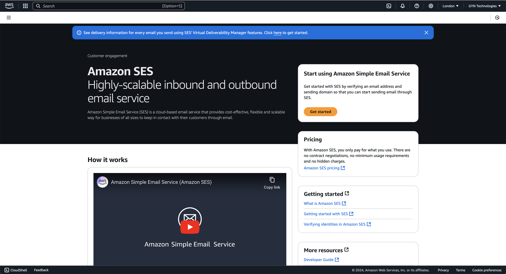

If you don't know how to navigate here, just type "SES" in the search bar at the top of the page.

**2) Open up the menu on the left-hand side.** In this menu, you’ll see a lot of options. For now, the two items that matter are "Account dashboard" and "Get set up."

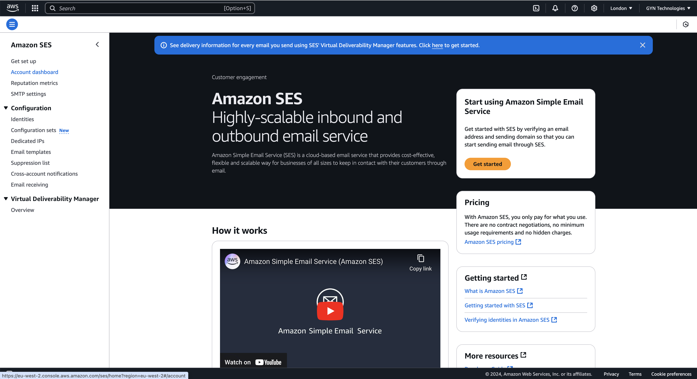

**3) Go to the dashboard.** This is a great starting point to explore SES, so feel free to look around. As you’ll see, by default, your SES access is in "sandbox" mode.

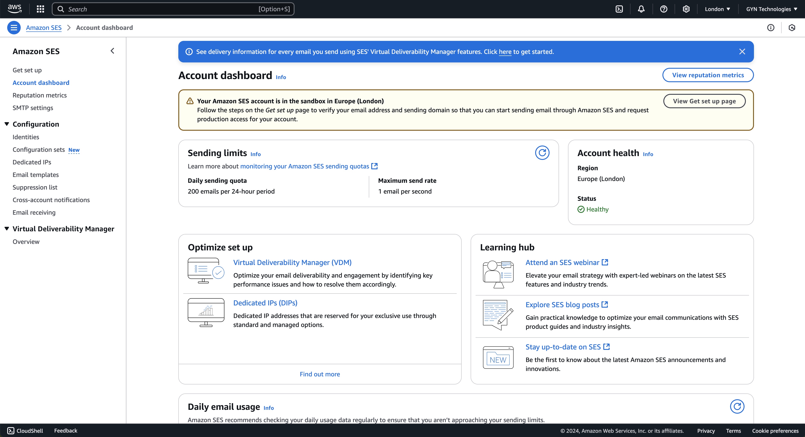

## Get Set Up

First, you need to go through the steps in the "Get set up" wizard. Here, you’ll add an email address to verify and fill out some details about your sending domain. Think of this as the prep work before we dive into the real steps.

**4) Fill in your email address.** Once you verify this email address, you’ll be able to send emails to and from this address in sandbox mode. (AWS will send you a verification email to confirm.)

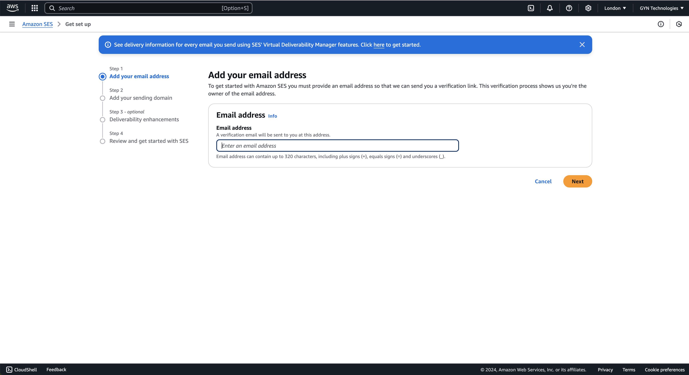

**5) Fill in your sending domain's info.** The info you provide here generates DNS records that SES will use to verify your ownership of the domain. Keep in mind that this step just generates the DNS records—you’ll need to set them up separately later.

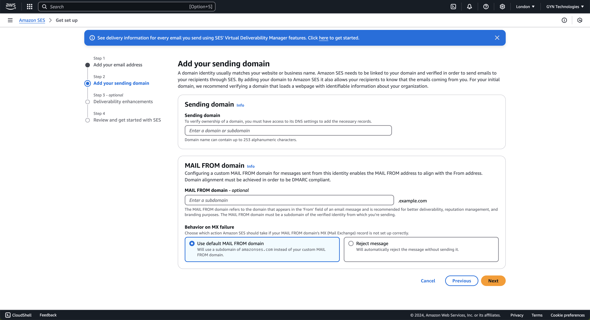

**5/a) Fill in the sender domain.** Use your primary domain here. This lets you send emails from any address within that domain. If needed, you can later restrict access to specific addresses (like `xyz@bluefox.email` or `joe.doe@bluefox.email`) using IAM.

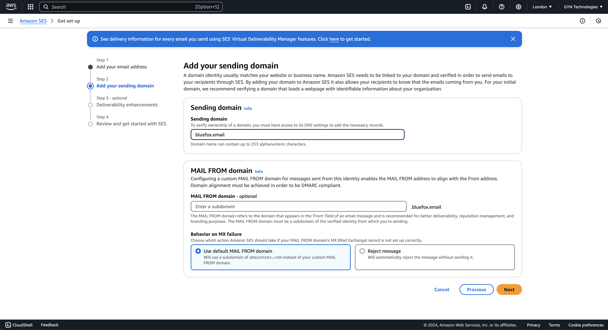

**5/b) Fill in the mail-from subdomain (optional).** Without this, the "mailed-by" value in your email header will show an amazonses.com subdomain (depending on your region). If you don’t configure this, you’ll need to select "Use the default MAIL FROM domain." If you choose the "Reject message" option, emails won’t send unless the MAIL FROM value is set up. Setting this up involves adding MX records provided by AWS to your domain's DNS settings.

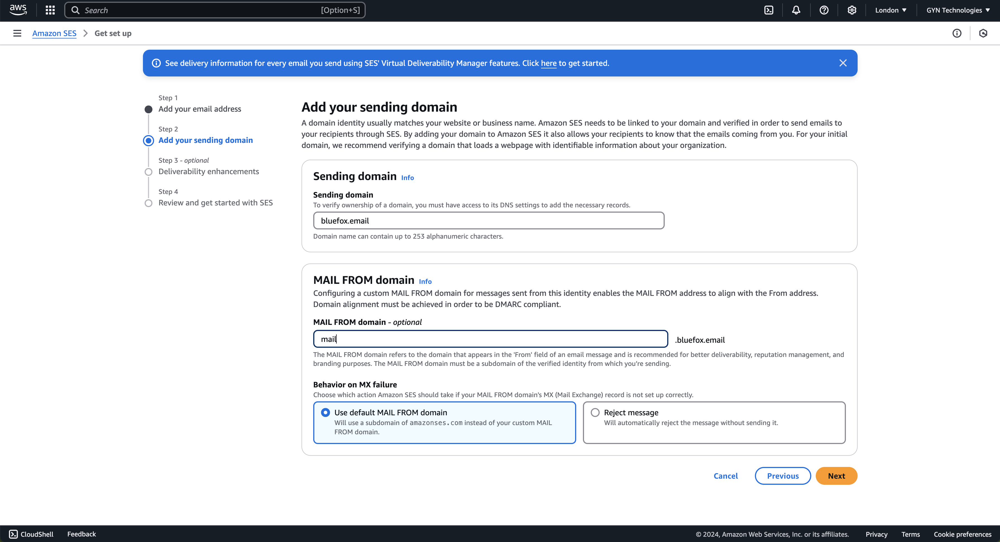

::: tip Multiple MAIL FROM domains
If you plan to send emails from multiple AWS regions, consider including the region in your domain name, like `mail-eu-2.bluefox.email` instead of a generic `mail.bluefox.email`.
:::

**6) Skip this step if you use bluefox.email (do **NOT** enable it).** If you’re not using bluefox.email, you can enable the Virtual Deliverability Manager, but bluefox.email already gives you everything it offers and more.

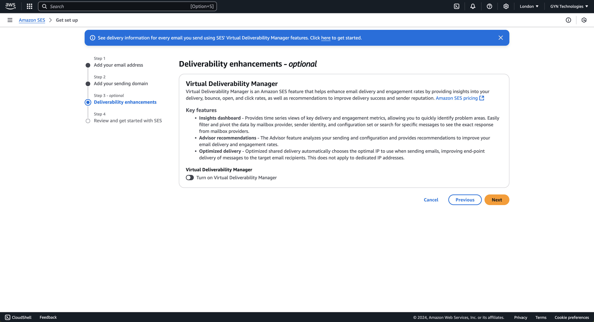

**7) Review and GO!** This is a summary page. If everything looks good, click "Get started." The real steps begin after this.

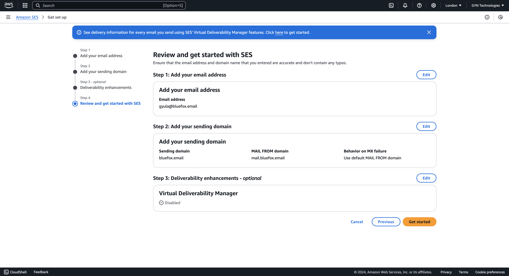

## Verify Your Email Address

By verifying your email address, you can send emails to and from this address. This step is mainly for testing purposes. Once your domain is verified, you can send from any address within it, but you’ll still need verified email addresses to send to while in sandbox mode.

**8) Verify your email address** by clicking the link in the email AWS sends you.

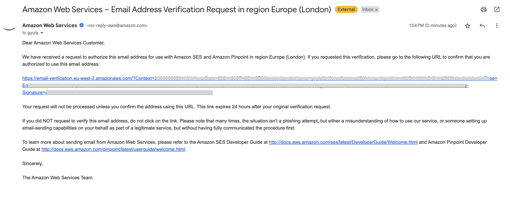

**9) Congratulations, you have successfully verified an email address.** You should see this confirmation message after clicking the link.

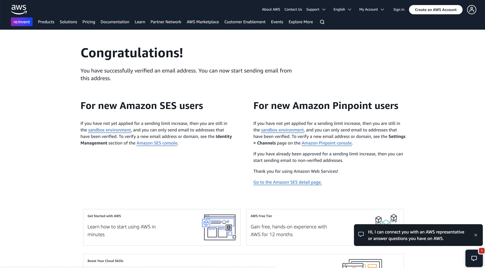

**10) Confirm on the "Get set up" page that your email address is verified.** Head back to the "Get set up" page and check the "Completed tasks" section.

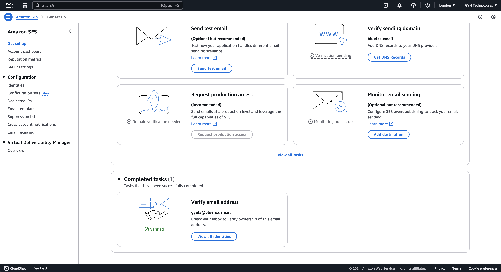

## Send a Test Email (optional)

To ensure everything’s working, it’s a good idea to send a test email.

**11) Click on the "Send test email" button** in the "Open tasks" section of the "Get set up" page.

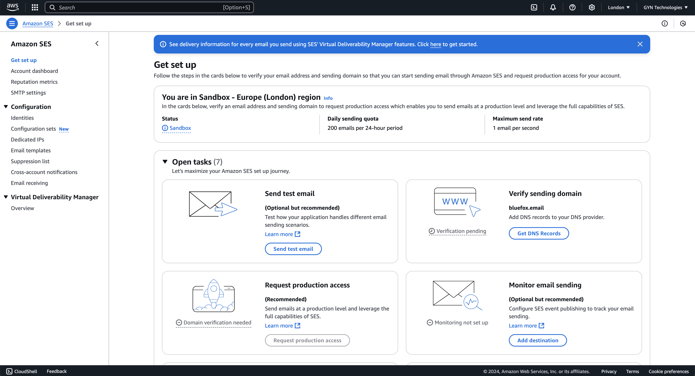

**12) Fill out the send test email form.** The most important part is selecting "Custom" from the `Scenario` dropdown. Keep the `Email format` as "Formatted" and complete the subject and body fields.

You’ll find "Custom" at the end of the dropdown.

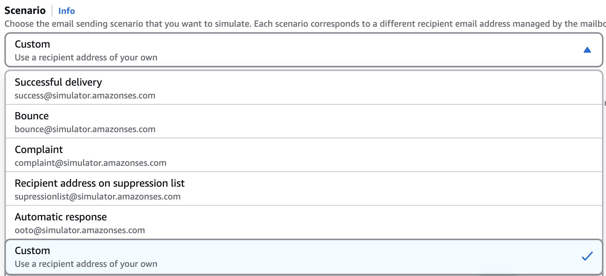

**13) Verify that you received the test email.** Here’s how mine looks:

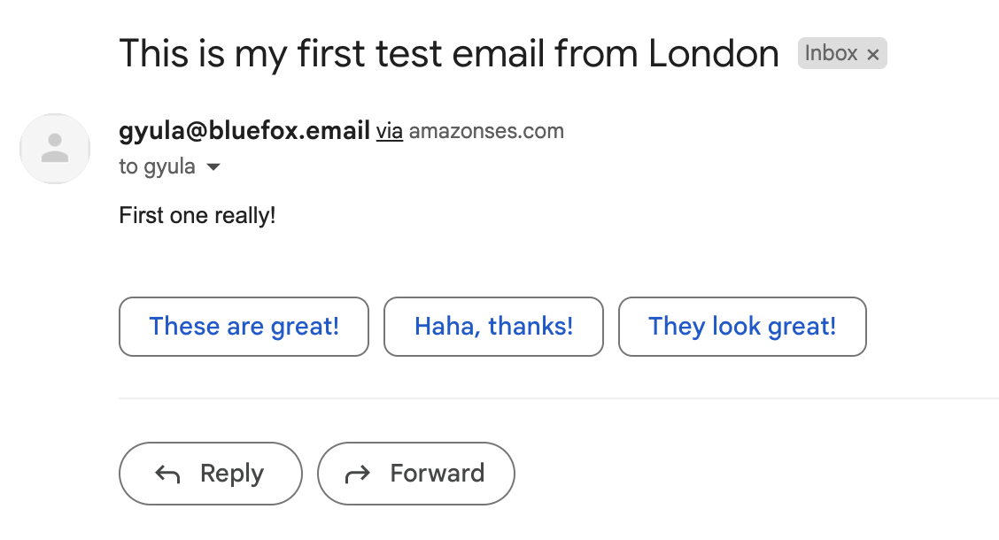

In the email headers (see the screenshot below), there are two fields to pay attention to: the `signed-by` and `mailed-by` fields. In my test email, the values are:

- `signed-by`: **"amazonses.com"**
- `mailed-by`: **"eu-west-2.amazonses.com"**

Once you verify your domain, the `signed-by` field will show your domain, and if you set up a `MAIL FROM` domain, the `mailed-by` field will reflect your subdomain instead of the amazonses.com default.

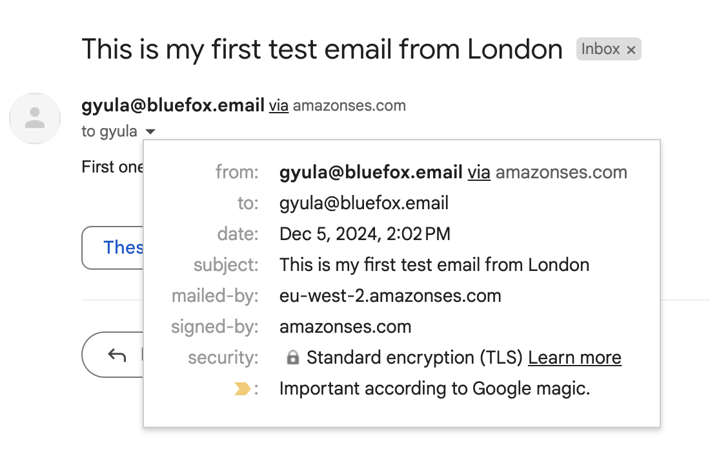

## Verify Sending Domain

To send from any email address within your domain, you’ll need to verify your sending domain. However, keep in mind that you can still only send emails to verified addresses while in sandbox mode.

**14) Click the "Get DNS records" button** in the "Verify sending domain" task under the "Open tasks" section.

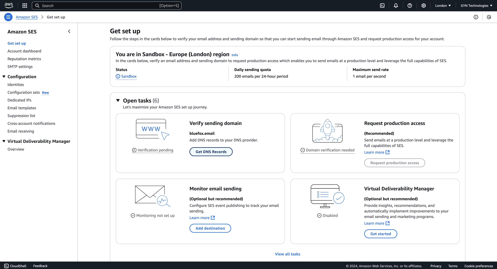

**15) Set up the provided DNS records at your DNS provider.** These include **DKIM**, **DMARC**, and optional **MAIL FROM** records.

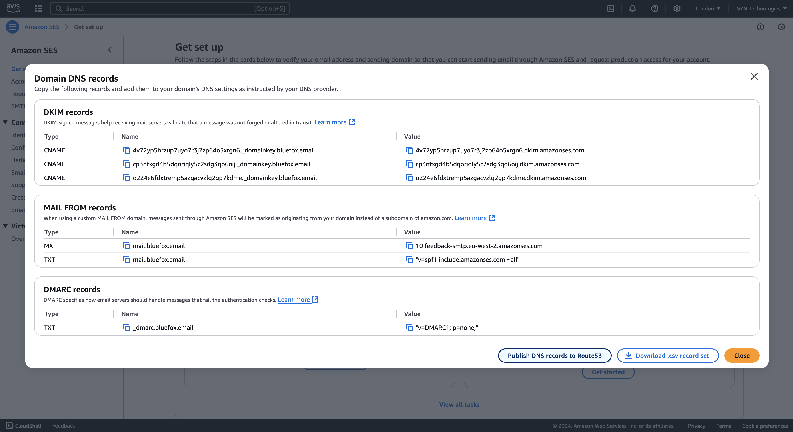

::: tip Route53 users can set up the records with a click of a button!
If you use AWS Route53, you might see a "Publish records to Route53" button. Clicking this automates the process. If the button doesn’t appear, you’ll need to copy the records manually.
:::

**16) Wait for AWS to complete verification.** This usually doesn’t take long. If it takes longer than expected, double-check your DNS settings. AWS will notify you via email if they’re unable to verify your domain after a few days.

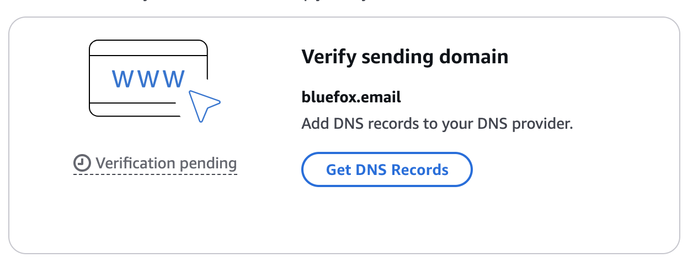

Once verified, you’ll see the "Verify sending domain" task move to the "Completed tasks" section.

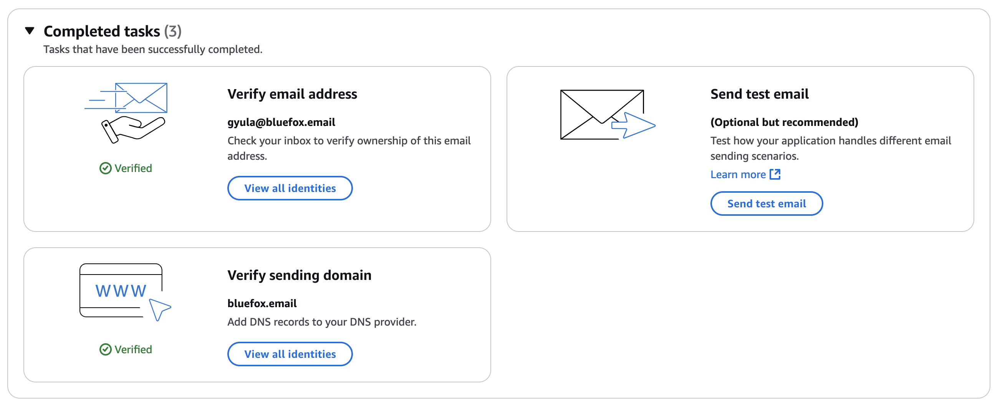

---

Congratulations! You’ve set up AWS SES. You can now test the service in **sandbox** mode. You’ll be able to send emails from any address within your verified domain to verified email addresses.

The next step is to request production access, allowing you to send emails to any address. This process can be tricky, as AWS is very strict to maintain SES’s excellent deliverability rates. Stay tuned for our next article, where we’ll share tips for working with AWS support to get production access.

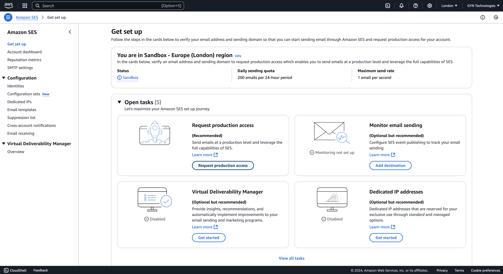
