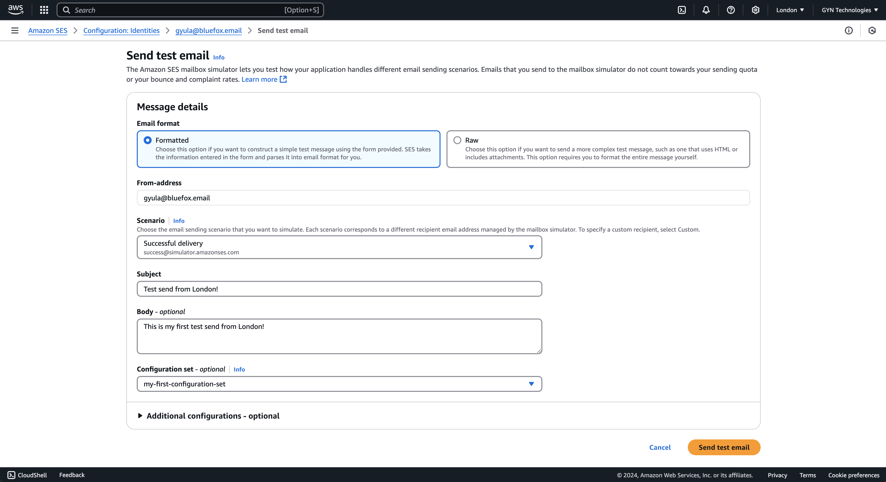

# How to Set Up AWS SES

AWS SES is one of the best options out there if you wanna reach great deliverability on budget! If you combine it with bluefox.email, then your emails will look professional and on-brand, and you don't have to spend a lot at all.

If this is your first time working with SES, your account will start in "sandbox" mode.

::: warning Sandbox limitations

- When in sandbox, you can only **send** emails **to** verified email addresses
- You can only **send** emails **from** those verified email addresses or verified domains
- Sending limit is **1 per second** and **200 per day**.
:::

You’ll need to take a few steps to start using SES, even in sandbox mode:

These steps are:
 - Verify (at least) one email address.
 - Send test email (optional)
 - Verify a sending domain

Once you complete these steps, you can create a user with access to SES and generate an Access Key ID and a Secret Access Key. You can then use these credentials with the AWS SDK or configure them in your bluefox.email project.

AWS can feel intimidating at first, so let's go through the whole process step-by-step:

**1) Go to SES in your AWS console.** Click on the hamburger menu on the left-hand-side.

If you don't know how to navigate here, just type "SES" in the search bar on the top of the page.

**2) Open up the menu on the left hand side.** In this menu you can see a lot of things. For now, there are two menu items that are interesting to us: "Account dashboard" and "Get set up".

**3) Go to the dashboard.** This is a great starting point to explore SES, feel free to explore! As you can see, by default, your SES access is in "sandbox". 

## Get Set Up
First, you will need to go through the steps in the "Get set up" wizard, in which you will add an email address to verify, and fill out some details about your sending domain. This is basically the 0th step, the real steps will happen after you finished with this wizard.

**4) Fill in your email address**. After verifying this email address, you will be able to send emails from your sendbox SES to this email address. You will also able to send from this email address. (You will receive a verification email when you finished filling out everything in this wizard.)

**5) Fill in your sending domain's info**. The info you enter here will be used to generate DNS records, that SES will use to verify that you own the sender domain. Keep in mind, that filling it out will only create some ids based on which the system will generate the DSN records.

**5/a) Fill in the sender domain.** It should be your main domain. You will be able to send from any email address from this domain, but you can restrict it later in IAM to specific email addresses, for example xyz@bluefox.email or joe.doe@bluefox.email.

**5/b) Fill in the mail from subdomain. (Optional.)** If you don't set it up, then the "mailed by" value in your email header will remain to show an amazonses.com subdomain (depends on the region you send from). It will only do so if you select the "Use the default MAIL FROM domain" option at the bottom of the form. If you select the other options ("Reject message"), you won't be able to send out emails if your MAIL FROM value is not set up. Setting it up will actually mean setting up MX records. AWS SES will generate the proper values that you will need to set up at your domain's DNS settings.

::: tip Multiple MAIL FROM domains
If you are planning to send from multiple AWS regions, it might be a good idea not to set up very generic domains, for example mail.bluefox.email. You might wanna identicate the region in your domain as well, for example mail-eu-2.bluefox.email.
:::

**6) Skip this step** if you use bluefox.email (do **NOT** enable it). If you don't, you can enable the Virtual Deliverability Manager, but you get everything it does from bluefox.email and much, much more.

**7) Review and GO!**
This is just a quick summary page. If everything seems alright, just click the "Get started" button. The real steps will come afterwards.

## Verify Your Email Address

By verifying your email address, you will be able to send to this address and also send from this address. Verifying an email address is solely for testing purposes. (After you verify your domain, you will be able to send from any email address from that domain, but you will still need to keep the verified email addresses to send emails to. Whenever you get production access, you will be able to send to any email address.)

**8) Verify your email address** by clicking on the link in the email you received from AWS.

**9) Congratulations, you have successfully verified an email address** message should appear after clicking on the link in the email.

**10) Verify on the "Get set up" page that your email address is verified.** Go to the "Get set up" page and scroll down. There should be a completed tasks section, in which you should see that you completed the "Verify email address" task.

## Send a Test Email (optional)

Just to make sure everything is good so far, I recommend you to send a test email.

**11) Click on the send test email button in the "Open tasks" section on the "Get set up" page.** You just need to scroll up to the "Open tasks" section and simply click on the button.

**12) Fill out the send test email form.** The most important thing is to **select "Custom" from the `Scenario` dropdown.** Keep the `Email format` "Formatted"; fill out subject and body.

You can find the "Custom" value at the end of the dropdown.

**13) Verify that you received the test email.** Here is how mine looks like:

On the screenshot below, you can see some details about my test email. There are two interesting fields here I want you to pay attention to: the `signed-by` and the `mailed-by` fields. In my test email, their values are: "amazonses.com" and "eu-west-2.amazonses.com".

Whenever you verify your domain, the `signed-by` value will be your domain, and whenever you set up your `MAIL FROM domain`, the `mailed-by` field's value will be your subdomain.

If you have finished with all of this, there should be two completed tasks in the "Completed tasks" section on the "Get set up" page.

## Verify Sending Domain

In order to be able to send from any email address from your domain, you will need to verify your sending domain. Keep in mind, that you still will not be able to send to any email address, only to the verified email addresses.

**14) Click on the "Get DNS records" button** in the "Verify sending domain" task under the "Open tasks" section on the "Get set up" page.

**15) Set up all of the listed DNS records at your DNS provider.** These are **DKIM** and **DMARC** records and the optional **MAIL FROM** records.

::: tip Route53 users can set up the records with a click of a button!
If you use AWS Route53 as your DNS provider, then a **"Publish records to Route53"** button might appear. If it does, then you don't need to manually set up these records, you just need to click that button and AWS does everything for your. Unfortunately, in my experience, this button does not always appear, so sometimes I need to copy the values regardless the fact that I'm using Route53.
:::

**16) Wait until AWS finishes with the verification.** It should not take long, so if it takes a long time, you might wanna recheck your settings. Also, if AWS can't finish the verification in a few days, you will receive emails about the issues.

Whenever the **verification is finished**, you will see the "Verify sending domain" in the "Completed taks" section on the "Get set up" page.

---

Congratulations, you've set up your AWS SES account! From now on, you will be able to test the service in **sandbox**. You will be able to send emails from any email address from your domain, and you will be able to send to the verified email addresses.

The next step on the "Get set up" page is to request a production access, that will allow you to send emails to any email address.

This can be quite challenging. AWS is very strict, because they want to keep SES' deliverability rates very high. That is why it might happen that AWS support denies your request even if you are sending totally legit emails to people who actually want to recieve those emails. In an upcoming article, we are going to provide you guidelines about how (and what) to communicate with AWS support in order to get production access.
