# How to Set Up Email for a New SaaS Product with an AI Agent

To launch a SaaS product, you only need a couple of emails: one that confirms new accounts, and one that resets forgotten passwords, because someone will forget their password within the first hour.

The rest can wait. A welcome series, a weekly summary, a feature announcement, or your own subscription preferences page are nice to have, not must-haves for launch day. But with an AI agent connected to BlueFox Email through MCP, each of them takes a few minutes, so there's not much reason to put them off.

In this guide, we set up both the essentials and the extras by talking to that agent. Everything you see here was done in a real BlueFox Email project, and every screenshot is from that session.

::: info What you'll need
- A BlueFox Email account with a project
- An AI client that supports MCP, like Claude Desktop, Claude Code, or Cursor
- Node.js 20 or newer, for the MCP server and for the code examples in this guide (all code examples use Node.js)
:::

## What Is an MCP Server, and Why Use One for Email?

MCP (Model Context Protocol) is an open standard that lets AI agents use outside tools. An MCP server gives the agent a set of actions it can take, so instead of you copying things between a chat window and a dashboard, the agent does the work directly.

The [BlueFox Email MCP server](/mcp) gives your agent tools for almost everything you'd normally do in the app: sending setup, subscriber lists, contacts, transactional and triggered emails, campaigns, automations, and more. A few things make it a good fit for email work in particular:

- **It runs on your computer.** The MCP server is a small Node.js program your AI client starts. It's the only thing that talks to BlueFox Email, using your API key, so the key never reaches the AI model.
- **You see every action.** Each change is a separate tool call, and your AI client shows you what the agent did and what came back.
- **Nothing goes out by accident.** Creating an email only saves it. Sending is always a separate request, and a campaign is only scheduled if you give it an exact send time.
- **It knows BlueFox's templating.** The tool descriptions tell the agent how [merge tags](/email-marketing-concepts/personalization/merge-tags) work (BlueFox uses [Handlebars](https://handlebarsjs.com/)), so you don't need to explain tags like <code>&#123;&#123;contact.firstName&#125;&#125;</code> yourself. None of the prompts in this guide mention Handlebars, and the agent used it correctly every time, including <code>&#123;&#123;#if&#125;&#125;</code> fallbacks for missing values.

## Connecting Claude to BlueFox Email

Install the server once:

```bash
git clone https://github.com/bluefox-email/bluefox.email-mcp.git
cd bluefox.email-mcp
npm install
npm link
```

Then register it with your AI client. For Claude Code, that's one command. Your project settings (**Project Settings > Integrations > MCP Server**) show it with your project ID already filled in:

```bash
claude mcp add bluefox-email \
  --env BLUEFOX_BASE_URL=https://api.bluefox.email \
  --env BLUEFOX_PROJECT_ID=YOUR_PROJECT_ID \
  --env BLUEFOX_API_KEY=YOUR_API_KEY \
  -- bluefox.email-mcp
```

Setup for Claude Desktop, Cursor, Windsurf, Cline, Codex, and the ChatGPT desktop app is in the [MCP server documentation](/docs/integrations/mcp-server).

### Meet SparksPro Crew, our demo SaaS

To keep things concrete, we use a demo brand throughout this guide: **SparksPro Crew**, a made-up app that helps cleaning teams manage their jobs and schedules. It's a side product of **SparksPro Cleaning**, another demo brand we use across BlueFox Email guides. Both share the sparksprocleaning.com domain and website.

A good first message is a simple read-only one, just to make sure the agent is connected to the right project:

> Can you get my project info please. and see if its connected to the project SparksPro Crew is not?

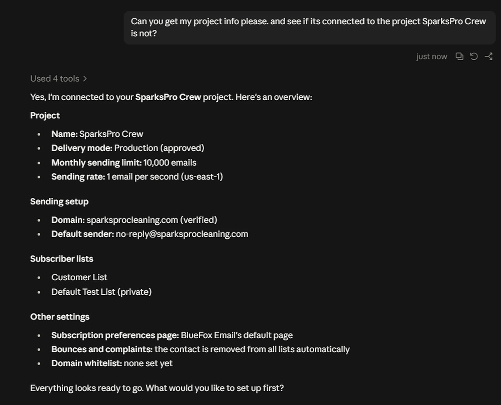{.screenshot}

The agent pulled the project's delivery mode, sending limit, domain, sender, lists, and settings in one go. If you ever set up more than one project, this is how you avoid creating emails in the wrong one.

## Checking Your Sending Domain and Sender Identity

Before anything gets sent, two things need to be in place: a verified domain to send from, and a sender identity, which is the name and address people see in their inbox.

In our case, sparksprocleaning.com was already verified in the dashboard, and the project already had a `no-reply@` sender for it, but without a display name. So we asked the agent to check the domain and give the sender a proper name:

> Check that my domain is set up correctly, then create a new sender identity called "SparksPro Crew" with the address no-reply@sparksprocleaning.com and make it the default.

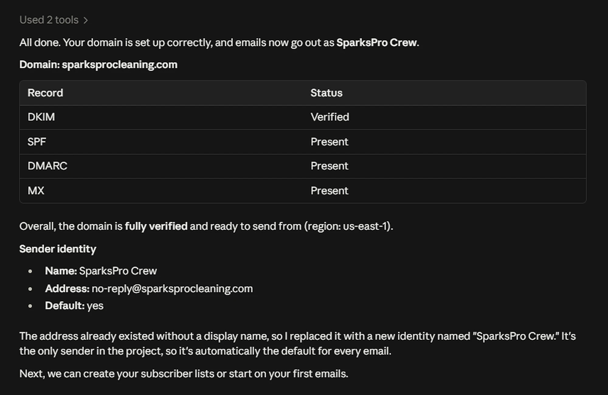{.screenshot}

The MCP can't rename a sender identity, so the agent explained that it would replace the existing one, waited for a yes, and then did it. Now every email arrives from **SparksPro Crew** instead of a bare address, and a [sender name people recognize](/posts/sender-name-and-email-address-build-trust-before-the-open) is one of the first things they check before opening an email.

If you're starting with a brand-new domain, the agent can add it for you, save the DNS records you need to a CSV file for whoever manages your DNS, and re-check them once they're in place. New projects start in [sandbox mode](/docs/projects/delivery-modes), and when you're ready for real volume, the agent can also submit your production access request.

## Creating a Subscriber List for Your App's Users

Next, a home for your users. A [subscriber list](/docs/projects/contacts) is what welcome emails, digests, and product announcements get sent to, so it's worth creating one just for people who sign up for your app.

> Create a subscriber list called "SparksPro Crew Users" for everyone who signs up for our app, and add all my existing contacts to it.

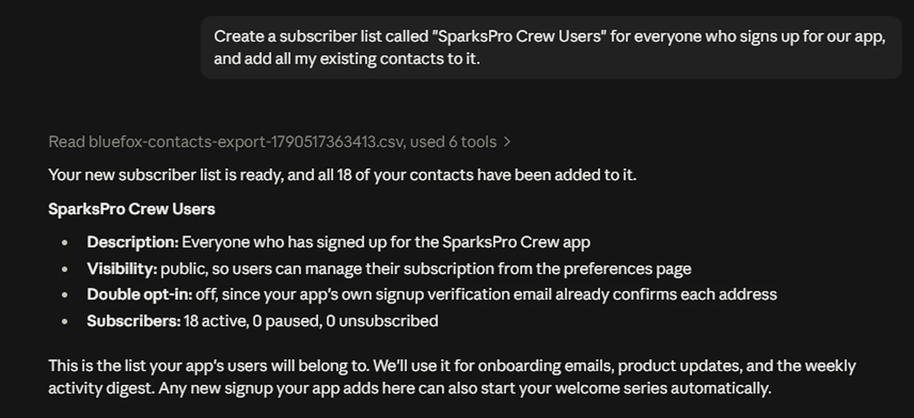{.screenshot}

One detail worth pointing out: the agent exported the full contact list before subscribing anyone, so contacts that weren't on any list yet still got added. Our 18 contacts are demo contacts, so adding them all was fine here. In a real project, only add people who actually use your app. Putting existing customers on a list they never signed up for means sending them emails they never asked for.

The list also has [double opt-in](/email-best-practices-for-saas/double-opt-in) off, which is how new lists start, and for app users that's what you want. Double opt-in sends a confirmation link before someone becomes an active subscriber. That matters on a public signup form, where anyone can type in any address. Your app users confirm their address through the app's own verification email, which we build below, so a second confirmation email would just be annoying. If you later add a newsletter signup form to your website, give it its own list with double opt-in turned on.

## Giving the Agent Your Brand: An Email Design Guide

Here's a trick that makes every email after this one better. Instead of describing your colors and fonts each time, have the agent read your website once and write a design guide it can reuse:

> SparksPro Crew is a new app from SparksPro Cleaning, our cleaning company. It helps cleaning teams manage their jobs and schedules. Look at our website sparksprocleaning.com and write a short email design guide for SparksPro Crew: brand colors, fonts, logo, button style, and tone of voice. Save it as brand-guide.md so you can use it for every email we create.

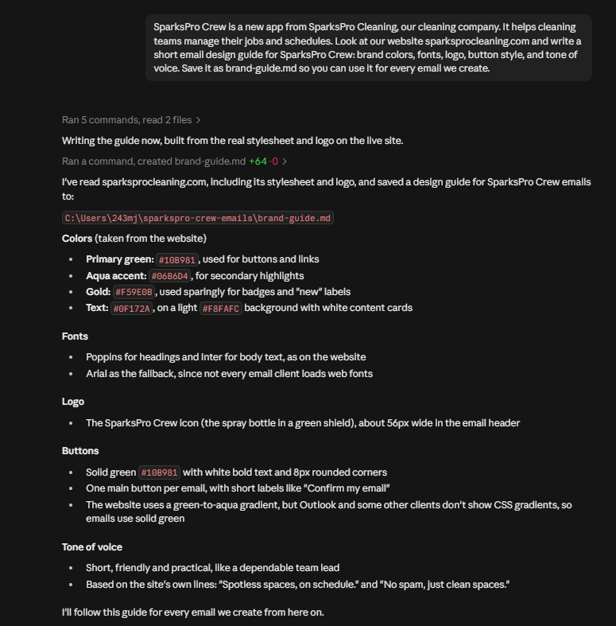{.screenshot}

The agent read the site's actual stylesheet and logo instead of guessing, so the colors are the real hex values. It also adapted a few things for email. The website uses a green-to-aqua gradient, for example, but desktop Outlook on Windows doesn't show CSS gradients, so the guide says to use solid green buttons in emails.

The result is a plain Markdown file saved next to your other email files, and every email in the rest of this guide follows it.

## Adding Contact Fields for Personalization

Contact fields are the extra details you store about each contact, beyond their name and email. They let you write things like "Hi Oliver, here's what your team of 8 did this week."

Our contacts still had fields from the cleaning business (home, office, deep clean, and so on), which don't mean much for a crew management app. So:

> Our contacts still have fields from the cleaning business. Add the fields SparksPro Crew needs so we can personalize our emails: company name, plan, and team size.

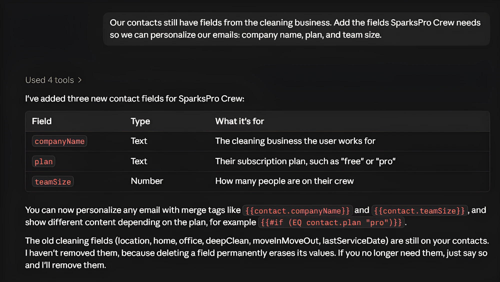{.screenshot}

The old cleaning fields are still there. The agent offered to remove them but left that call to us, since removing a field permanently deletes its values on every contact.

## Creating a Signup Verification Email

Now the first real email. When someone creates an account in your app, you want to confirm their email address is real before letting them in. That's a **transactional email**: an essential message sent by your app to one person, with no unsubscribe link, because nobody should be able to opt out of confirming their own account. (Not sure which email type to use when? Our guide to [transactional, triggered, campaign and automation emails](/posts/transactional-triggered-campaign-or-automation-understanding-email-types) sorts it out.)

> Create a transactional email that verifies new SparksPro Crew signups. Follow brand-guide.md, write it in MJML, and compile it to HTML. Our app will pass the user's first name and a verification link when it sends the email.

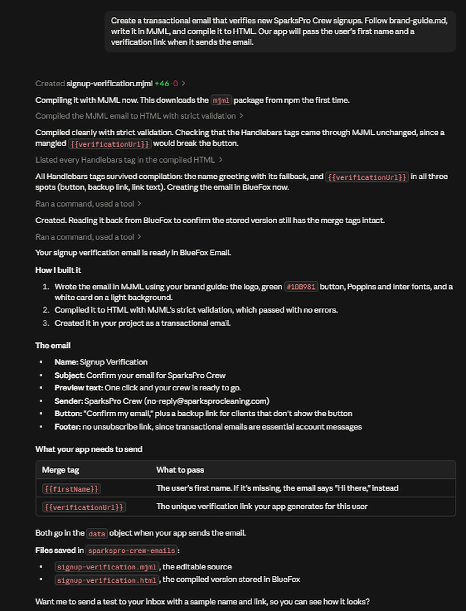{.screenshot}

A few things happened here that are worth copying for your own emails:

- **MJML instead of raw HTML.** [MJML](https://mjml.io/) is a simpler markup language that compiles into email HTML that works across email clients, including Outlook. It's a much easier target for an AI to get right than hand-written table layouts.
- **Strict validation.** The agent compiled the MJML with strict validation, so any mistake in the markup would have stopped it right there.
- **Checking the merge tags survived.** After compiling, the agent checked that <code>&#123;&#123;verificationUrl&#125;&#125;</code> was still intact in all three places it's used. A broken link tag would mean a verification email that verifies nothing.

The email uses two merge tags that your app fills in when it sends the email:

| Merge tag | What your app passes |
|---|---|
| <code>&#123;&#123;firstName&#125;&#125;</code> | The user's first name. If it's missing, the email says "Hi there," instead |
| <code>&#123;&#123;verificationUrl&#125;&#125;</code> | The unique verification link your app creates for this user |

These don't come from the contact record. Your app sends them along with each email, in a `data` object.

::: tip Don't confuse this with double opt-in
BlueFox Email also has a <code>&#123;&#123;verifyLink&#125;&#125;</code> merge tag, but that one is for [double opt-in](/docs/projects/forms-and-pages), when someone joins a subscriber list through a signup form. For your app's own account verification, your app creates the link and passes it in, like we do here.
:::

To see how it looks with real values, we had the agent send a real copy to one of our own addresses with a sample name and link. (Test sends don't fill in the data your app passes, so they'd show the "Hi there," fallback and an empty link. More on that when we get to campaigns.)

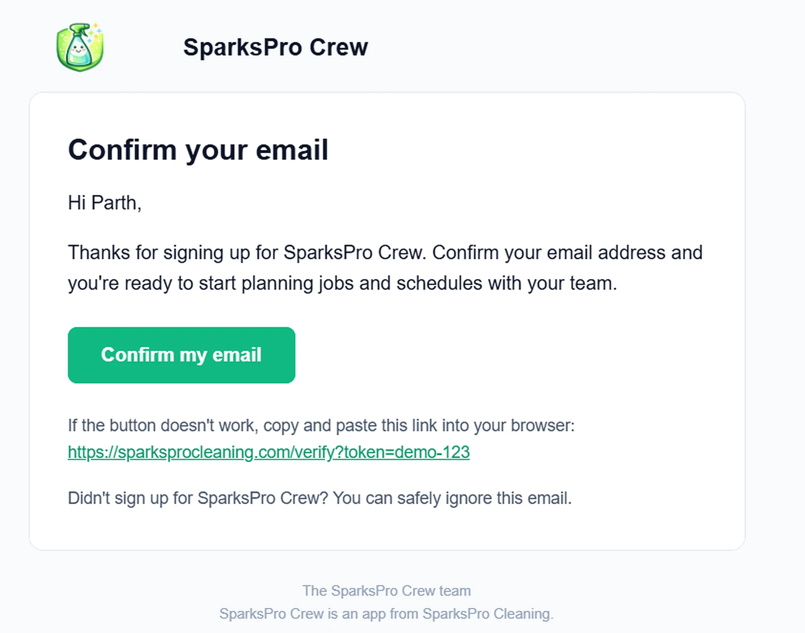{.screenshot .email}

The logo, the brand green button, the fonts, and the footer all come straight from the design guide.

### Sending it from your app

The email lives in BlueFox Email, but your app decides when to send it. When a user signs up, your backend creates a verification token, saves it with the user, and asks BlueFox Email to send the email with the link.

You don't have to write this code yourself. Ask the agent to add it to your signup handler, in whatever language your backend uses. It already knows from the MCP tools how merge tags and the `data` your app sends fit together, and for the API call itself it can use our [API docs](/docs/api/). The **AI Agents** section under **Project Settings > Integrations** also has a ready-made prompt that points an agent at the API and its OpenAPI spec. Here's the Node.js version we tested:

```javascript
import { randomBytes } from 'node:crypto'

const { BLUEFOX_API_KEY, BLUEFOX_PROJECT_ID } = process.env
const SIGNUP_VERIFICATION_EMAIL_ID = 'YOUR_TRANSACTIONAL_EMAIL_ID'
const APP_URL = 'https://your-app.com'

async function sendVerificationEmail ({ email, firstName }) {
  // In a real app, save this token with the new user so /verify can check it.
  const token = randomBytes(32).toString('hex')
  const verificationUrl = `${APP_URL}/verify?token=${token}`

  const res = await fetch(`https://api.bluefox.email/v1/projectId/${BLUEFOX_PROJECT_ID}/send-transactional`, {
    method: 'POST',
    headers: {
      'Content-Type': 'application/json',
      Authorization: `Bearer ${BLUEFOX_API_KEY}`
    },
    body: JSON.stringify({
      email,
      transactionalId: SIGNUP_VERIFICATION_EMAIL_ID,
      data: { firstName, verificationUrl }
    })
  })

  const body = await res.json()
  if (!res.ok) throw new Error(`BlueFox Email error ${res.status}: ${body.error?.message}`)
  return body.result
}
```

You can find the email's ID with the **Code Guide** button on the email in the dashboard, or just ask the agent. Keep your API key on the server. It should never end up in frontend code.

In your app, you'd call `sendVerificationEmail()` from your signup handler. To try it on its own, we saved the code above as `signup.js`, added three lines at the end so it reads the email and name from the command line, and ran it for real with our demo user:

```javascript
const [email, firstName] = process.argv.slice(2)
const result = await sendVerificationEmail({ email, firstName })
console.log(`Verification email sent to ${email}`, result)
```

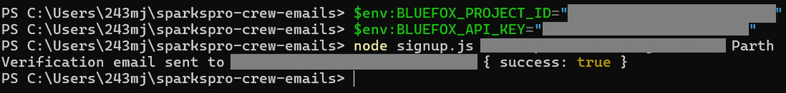{.screenshot}

And here's what arrived, this time with a real random token in the link:

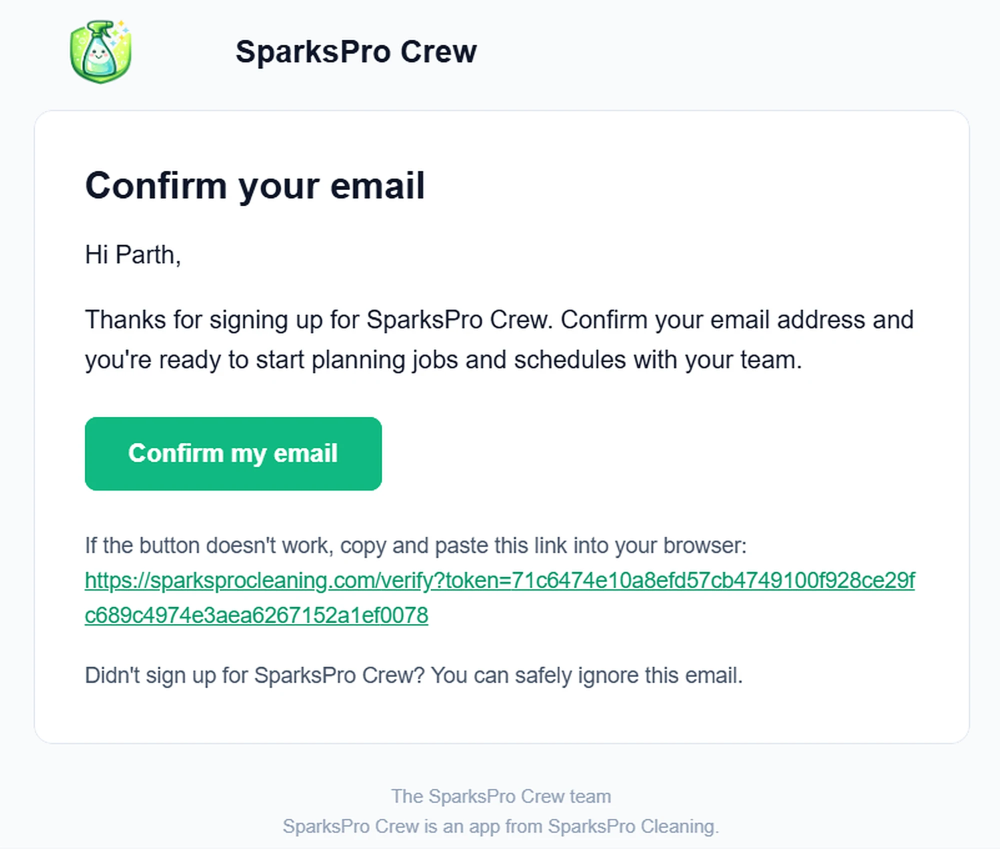{.screenshot .email}

In our demo, the link points to a page that doesn't exist, since there's no real SparksPro Crew app behind it. In your app, it goes to your own verification page, which checks the token and activates the account.

## Creating a Password Reset Email

The password reset email works exactly the same way, just with a different link. Since the design guide and the verification email already exist, one sentence is enough:

> Now create a password reset email the same way: follow brand-guide.md, write it in MJML, and compile it to HTML. Our app will pass the user's first name and a reset link.

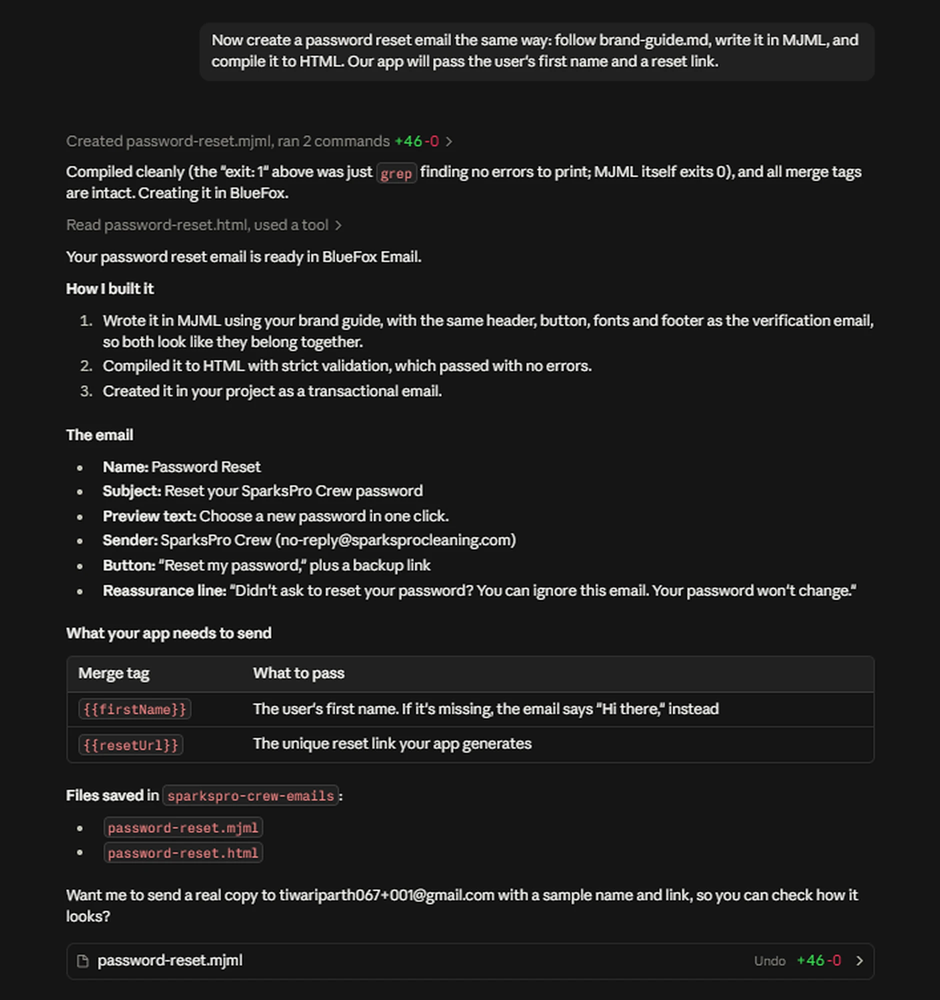{.screenshot}

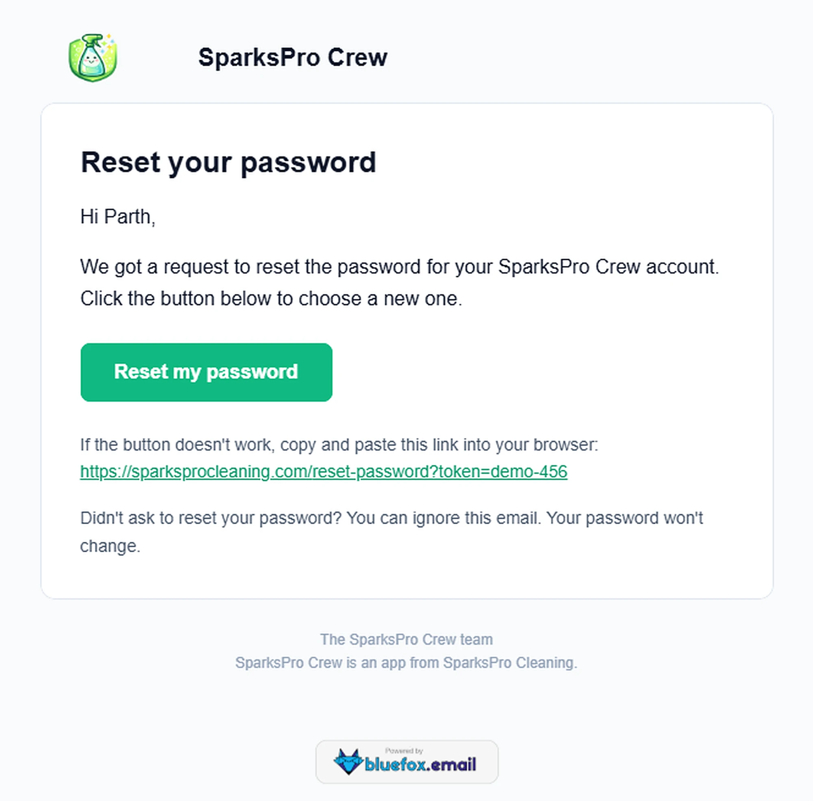{.screenshot .email}

::: tip Save your instructions once
We repeat "follow brand-guide.md, write it in MJML" in every prompt here so you can see exactly what we asked for. In your own project, you can ask the agent to save these as standing instructions, for example in a CLAUDE.md file if you use Claude Code, so you don't have to repeat them.
:::

Same header, same button, same footer, so the two emails clearly belong together. Your app sends it with the same code as above, using the password reset email's ID and passing `resetUrl` instead of `verificationUrl`.

## Other Transactional Emails Your SaaS Will Need

Verification and password reset cover launch day, but most SaaS products need a few more essential emails soon after. They all follow the same pattern: create the email with the agent, then send it from your app with the data it needs.

- **Email address change:** confirms a new address before switching the account over.
- **Magic link sign-in:** a one-click login link, if you offer passwordless sign-in.
- **Billing emails:** receipts, invoices, failed payments, and plan changes. The email side is simple. The real work is getting the details from your payment provider (amounts, dates, invoice links) into the `data` your app sends.

::: tip Using Supabase Auth?
Supabase sends its own signup confirmation, password reset, magic link, and email change emails. Our [Supabase integration guide](/docs/integrations/supabase) shows how to send them through BlueFox Email instead, with your own templates.
:::

## Building a Welcome Series with an Automation

You can launch without a welcome series, and a single welcome email is fine. But a short series spread over the first week, sometimes called a [drip campaign](/email-marketing-concepts/automation/drip-campaigns), does a much better job of getting new users to actually use your product instead of forgetting they signed up.

In BlueFox Email, a multi-step series with waits in between is an [automation](/docs/projects/automations): a trigger, then a series of nodes, such as a Send Email node or a Timer node that waits 2 days. The agent can build the whole thing:

> Create a welcome series for new SparksPro Crew users as an automation. When someone is added to the SparksPro Crew Users list, send a welcome email right away, an "invite your crew" email two days later, and a quick tips email three days after that. Follow brand-guide.md and write the emails in MJML.

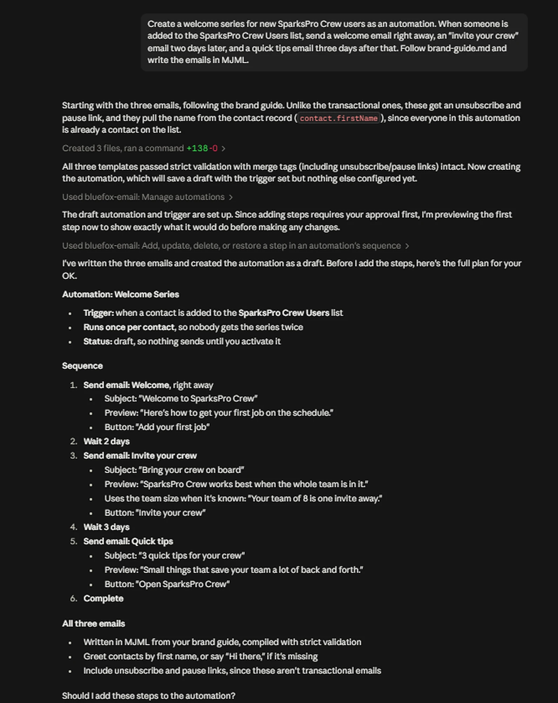{.screenshot}

Before changing anything, the agent showed the full plan and asked for a yes. That's not just good manners, the automation tools are built for it. They tell the agent to show you the automation's current state first, and they only apply a change once you've confirmed it. That goes for adding, changing, or deleting steps, editing an automation email, and turning an automation on.

Once approved, it added the steps and filled in all three emails:

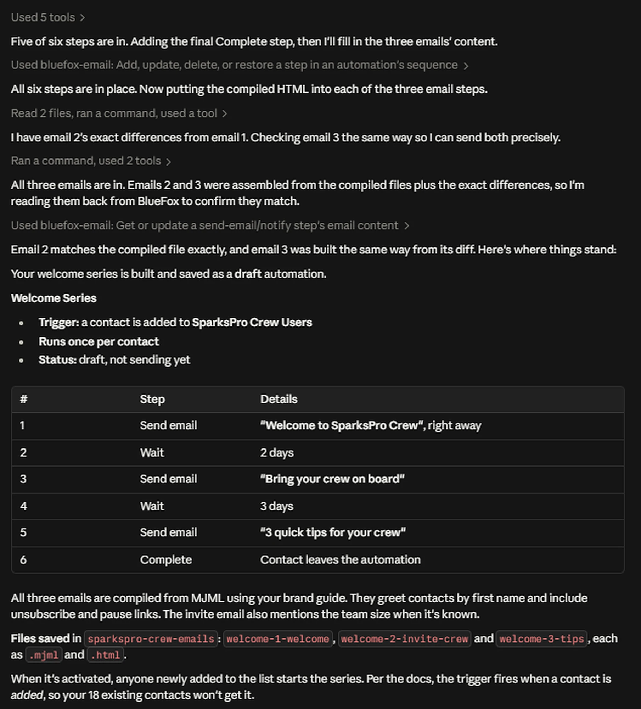{.screenshot}

And it's a normal BlueFox Email automation, so you can open it in the dashboard and change it by hand whenever you like. Here's the whole flow, top to bottom:

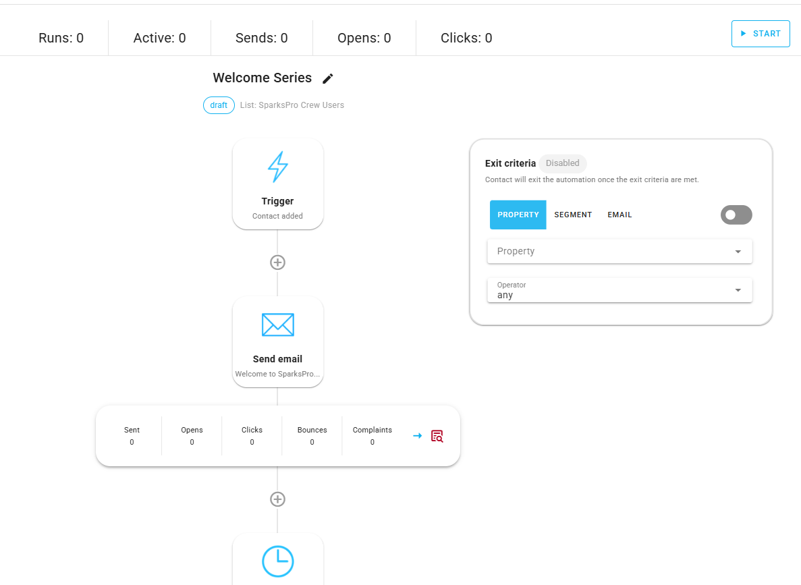{.screenshot}

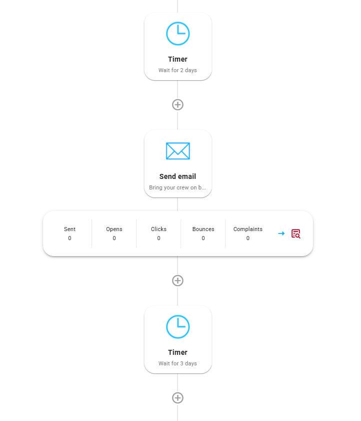{.screenshot}

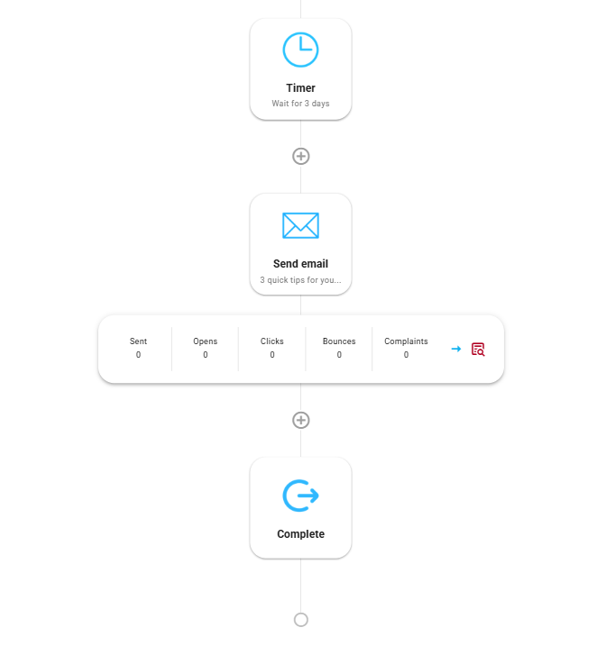{.screenshot}

### Testing an automation before it goes live

The agent's test email tool covers campaigns, transactional emails, and triggered emails, but not automation emails, so the way to see them is to run the automation for real. Waiting a full week for email three isn't much fun, so we had the agent make a copy of the automation with 2 and 3 **minute** waits instead of days, turn on just the copy, and add a test contact to the list. We named her Maya and gave her a team size of 8.

All three emails arrived within a few minutes:

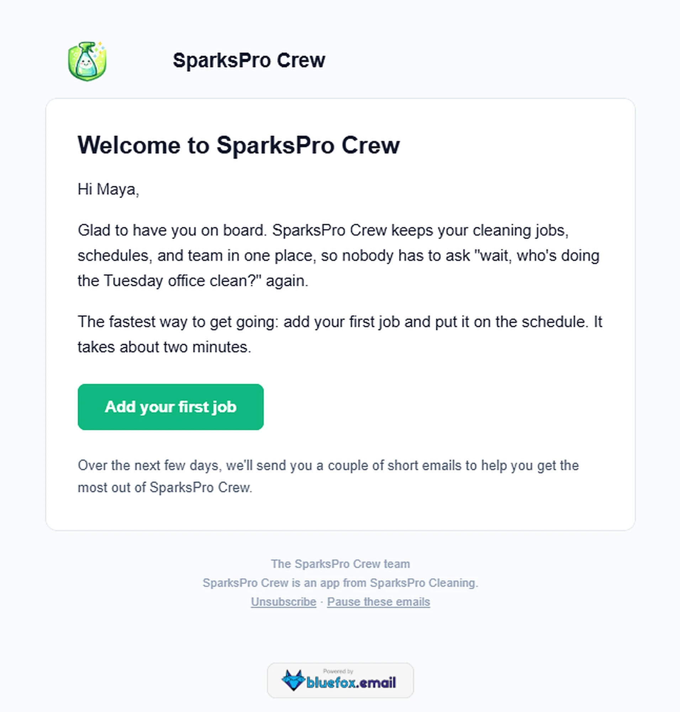{.screenshot .email}

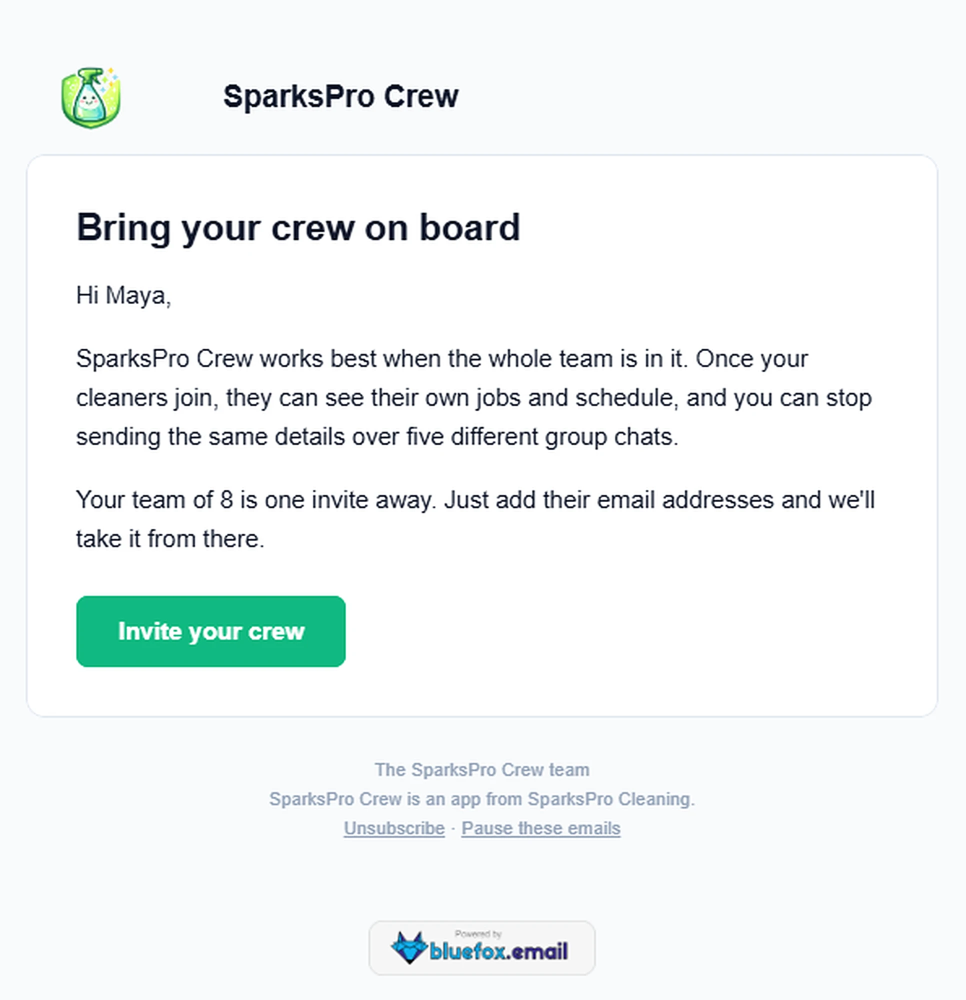{.screenshot .email}

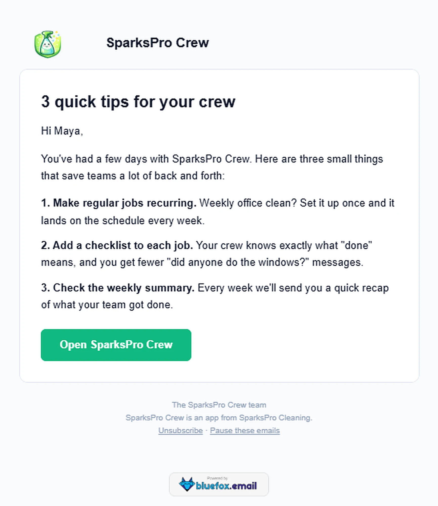{.screenshot .email}

Notice the second email: "Your team of 8" comes from the `teamSize` contact field we added earlier. If a contact doesn't have one, it just says "Your team is one invite away."

After that, the agent deleted the test copy (asking first, since deleting can't be undone). The real Welcome Series, with its day-long waits, stays in draft until you're ready to turn it on.

Once it's on, anyone your app adds to the SparksPro Crew Users list gets the series. Once a new user has verified their email, your app adds them to the list with one API call (see [subscribing a contact to a list](/docs/api/subscriptions#subscribe-a-contact-to-a-list)), and BlueFox Email takes it from there. Add them after verification, not at signup, so people who never confirm their address don't get a welcome series. Contacts who were already on the list before you turned it on won't get it, since the trigger only fires when someone is added.

## Sending a Weekly Summary with a Triggered Email

A weekly summary is another extra you can add any time after launch. Plenty of SaaS products send a weekly recap of what each user got done. Duolingo's weekly progress report emails are a well-known example, and they work because people actually want to see their numbers.

This is a job for a [triggered email](/docs/projects/triggered-emails): a single email your app asks BlueFox Email to send, addressed through a subscriber list, with the details your app passes in. People can unsubscribe from it, which is what you want for something that isn't essential.

> Create a weekly summary email for SparksPro Crew users as a triggered email on the SparksPro Crew Users list. It should show how many jobs their team finished this week, how many hours were scheduled, and their top crew member. Our app will send the numbers. Follow brand-guide.md and write it in MJML.

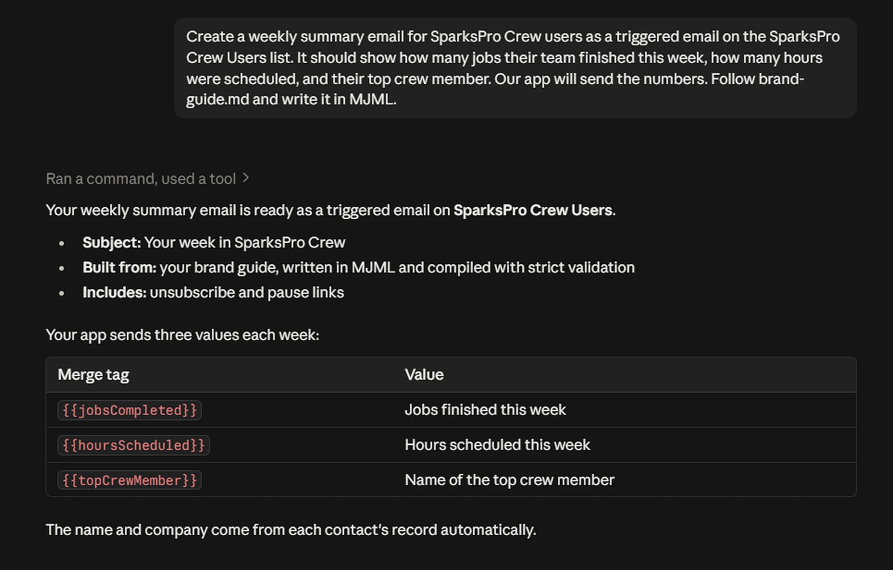{.screenshot}

This one had a slightly fancier layout, with colored boxes for the numbers, and MJML's strict validation earned its keep: it caught a style that isn't allowed on text blocks, and the agent fixed it before saving. The agent also previewed the email at phone width and noticed the two number boxes didn't line up when they stacked, so it kept them side by side on mobile instead.

### Sending everyone their own numbers

Here's the nice part. You don't need one API call per user. A single call can send every user their own numbers: list the recipients in `emails`, and put each person's values in `data` under their email address. And just like with the signup email, you can ask the agent to write this code for your backend.

```javascript
const { BLUEFOX_API_KEY, BLUEFOX_PROJECT_ID } = process.env
const WEEKLY_SUMMARY_EMAIL_ID = 'YOUR_TRIGGERED_EMAIL_ID'

// In a real app, this comes from your database: one row per account owner.
async function getWeeklyStats () {
  return [
    { email: 'maya@example.com', jobsCompleted: 42, hoursScheduled: 126, topCrewMember: 'Luis' },
    { email: 'oliver@example.com', jobsCompleted: 17, hoursScheduled: 51, topCrewMember: '' }
  ]
}

async function sendWeeklySummaries () {
  const stats = await getWeeklyStats()

  // Each recipient's numbers go under their own email address in `data`.
  const data = {}
  for (const { email, ...numbers } of stats) data[email] = numbers

  const res = await fetch(`https://api.bluefox.email/v1/projectId/${BLUEFOX_PROJECT_ID}/send-triggered`, {
    method: 'POST',
    headers: {
      'Content-Type': 'application/json',
      Authorization: `Bearer ${BLUEFOX_API_KEY}`
    },
    body: JSON.stringify({
      triggeredId: WEEKLY_SUMMARY_EMAIL_ID,
      emails: stats.map(s => s.email),
      data
    })
  })

  const body = await res.json()
  if (!res.ok) throw new Error(`BlueFox Email error ${res.status}: ${body.error?.message}`)
  return { recipients: stats.length, ...body.result }
}

console.log('Weekly summaries sent:', await sendWeeklySummaries())
```

Only people who are active on the list receive it. Anyone who unsubscribed or paused is skipped automatically.

We saved this as `weekly-digest.js` and ran it with two of our test contacts:

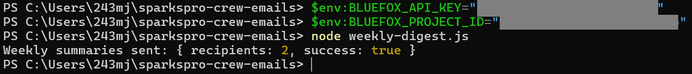{.screenshot}

One call, two different emails:

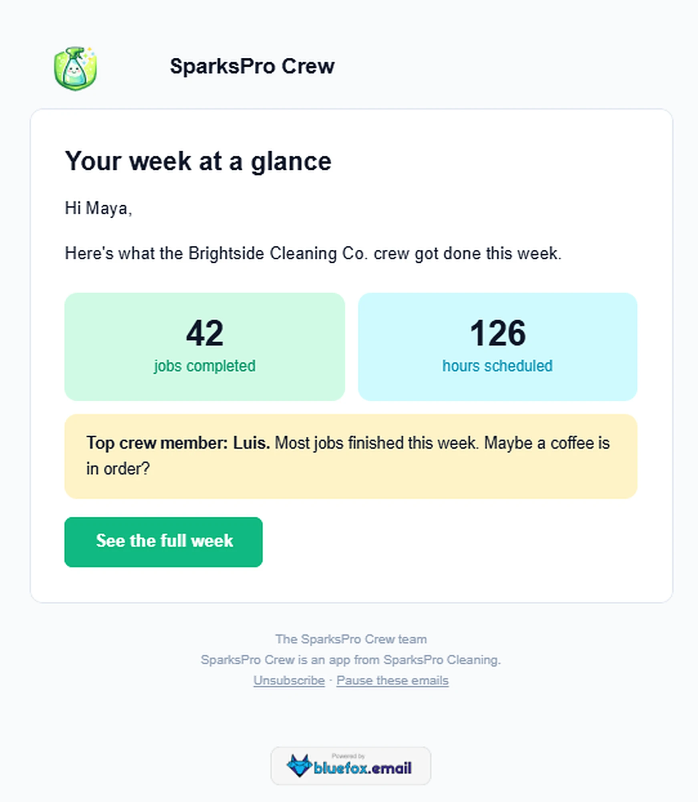{.screenshot .email}

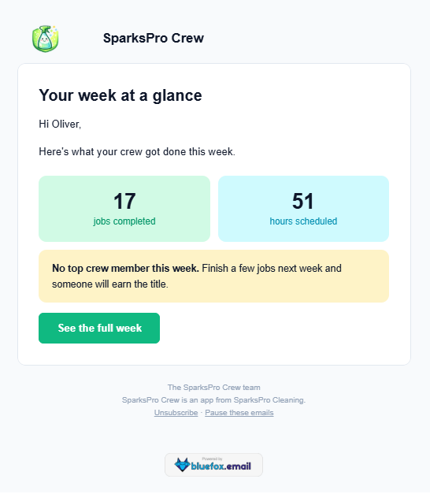{.screenshot .email}

Maya's contact has a company name, so her email says "the Brightside Cleaning Co. crew." Oliver's doesn't, so his says "your crew," and since his top crew member was empty, he got the friendly fallback line instead.

To send it every week, run the script on a schedule. With cron, for example, this runs it every Monday at 8:00 AM:

```bash
0 8 * * 1 node /path/to/weekly-digest.js
```

Any scheduler you already use for background jobs works just as well.

## Announcing a New Feature with a Campaign

Last email type: the [campaign](/docs/projects/campaigns), a one-off email to a list, or just a segment of it. Perfect for "hey, we shipped something."

> Create a campaign for the SparksPro Crew Users list announcing our new shift swaps feature: crew members can now swap shifts with each other, and the owner approves with one tap. Follow brand-guide.md, write it in MJML, and save it as a draft.

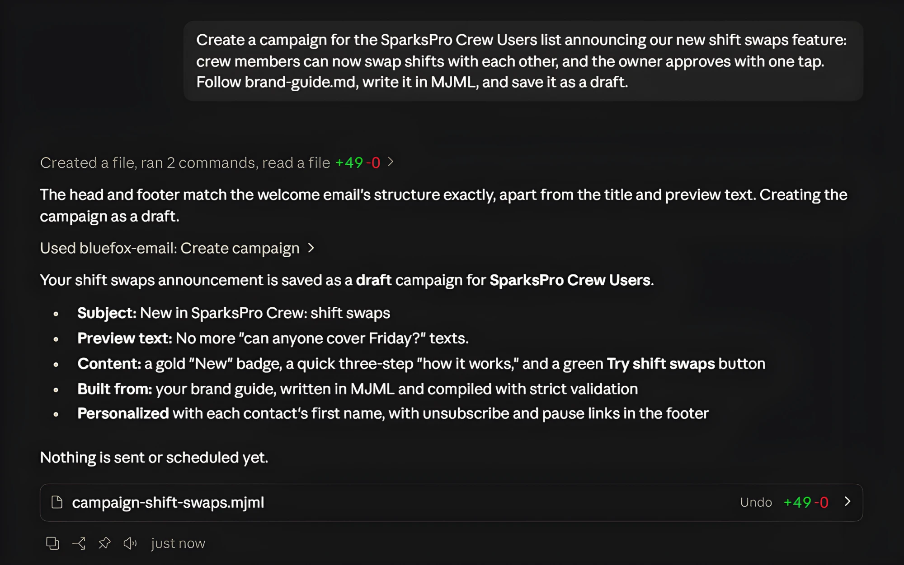{.screenshot}

Always look at a campaign before thousands of people do. One sentence:

> Send me a test of the campaign at tiwariparth067@gmail.com

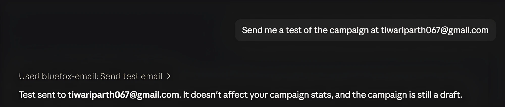{.screenshot}

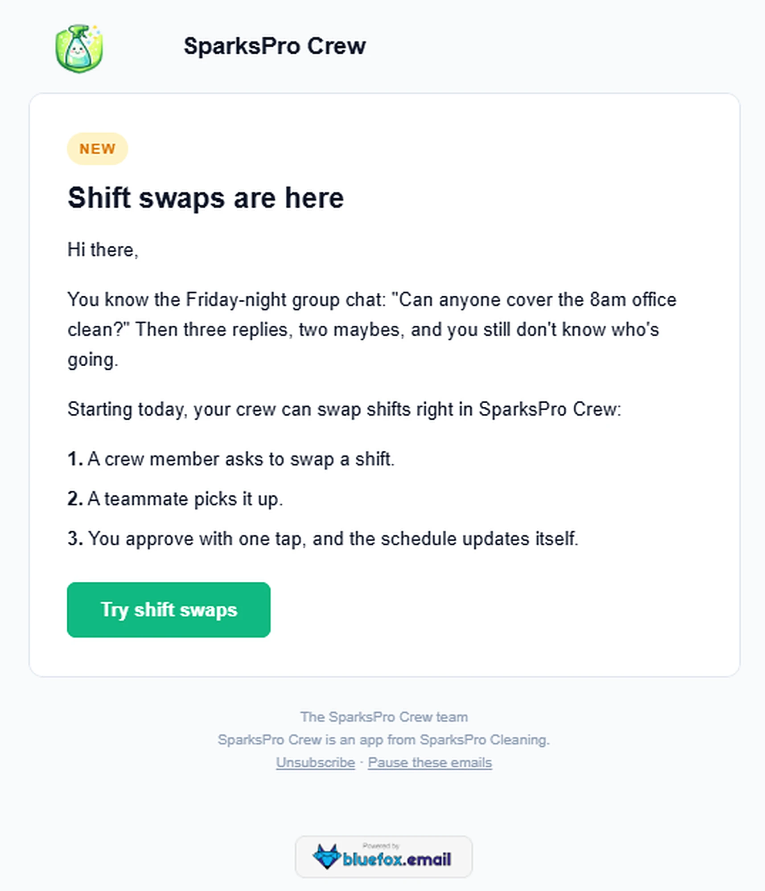{.screenshot .email}

See the "Hi there,"? That's on purpose. A test sent to a single address doesn't fill in contact details or data from your app, so you see the fallback text. That makes it a handy way to check your fallbacks read well. If you send the test to a [private test list](/docs/projects/send-test-email) instead, contact details like first names come from the contacts on that list. Data your app would pass is still left out, since a test has nothing to pass it.

Happy with it? Schedule it in plain English:

> Schedule it for next Monday at 9:00 AM Central European time.

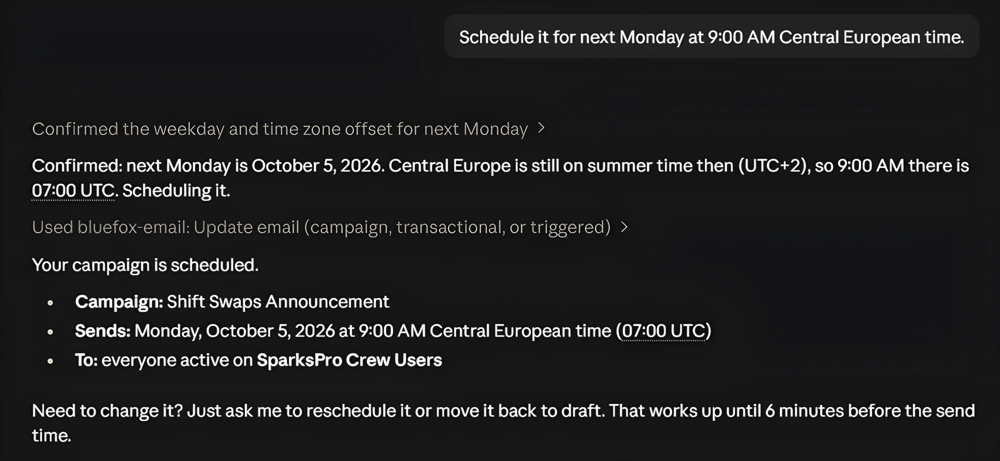{.screenshot}

The scheduling tool needs an exact date and time, so the agent worked it out first: which date "next Monday" is, and that Central Europe is still on summer time then, so 9:00 AM there is 07:00 UTC. In the dashboard, the campaign now shows as scheduled:

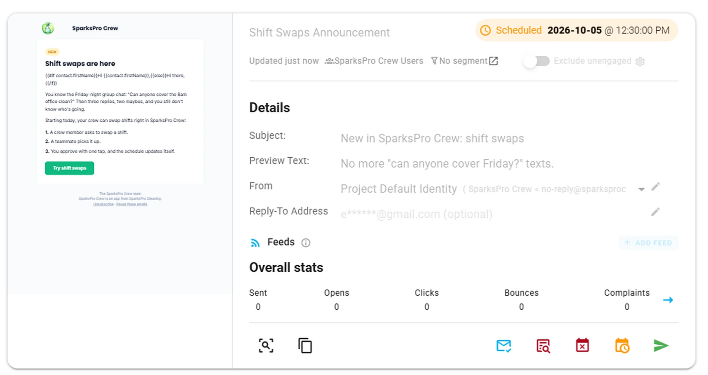{.screenshot}

Two things worth knowing about that screenshot. The dashboard shows the time in your own time zone, which for us was 12:30 PM (the same moment as 9:00 AM in Central Europe). And the little preview on the left shows merge tags as they are. They get filled in when the email is sent.

Changed your mind? Ask the agent to reschedule it or move it back to draft, which works up until 6 minutes before the send time. That's what we did, so our demo list didn't get the announcement.

## Using Your Own Subscription Preferences Page

This last one is optional too, but it takes one sentence. Every campaign, triggered email, and automation email has an unsubscribe link, and optionally a [pause link](/email-best-practices-for-saas/unsubscribe-and-pause-subscription), which lets people take a break instead of leaving for good. By default they open a preferences page hosted by BlueFox Email. It works, but it doesn't look like your product, and it's the last thing an unhappy user sees.

If you have your own page, one sentence switches over:

> We already host our own subscription preferences page at sparksprocleaning.com/preferences. Point our unsubscribe and pause links there instead of the default page.

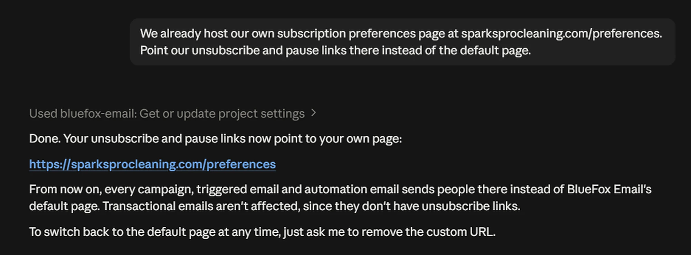{.screenshot}

To check it, we sent Maya a real weekly summary and clicked Unsubscribe:

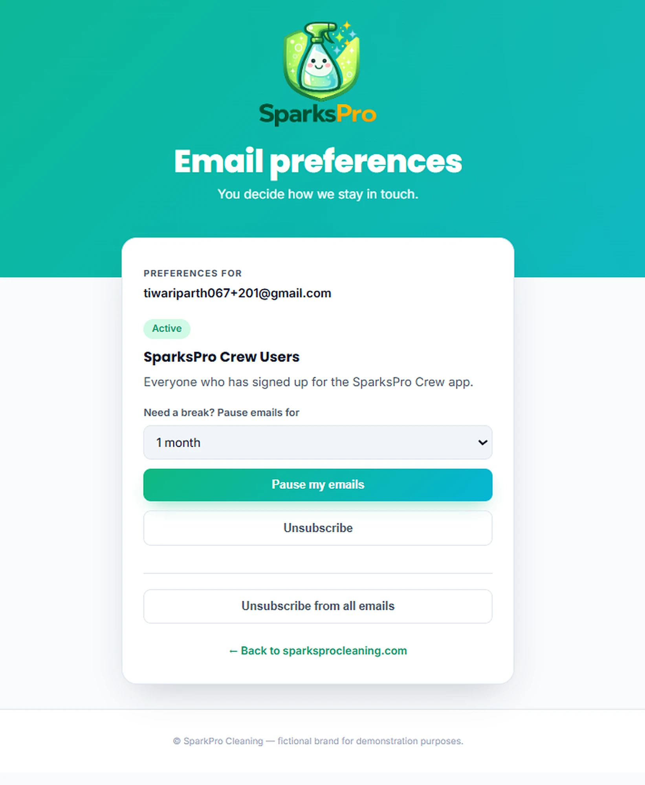{.screenshot}

It opened our own branded page, with Maya's subscription ready to pause or unsubscribe. The page shows every public list in the project, so if you have lists you don't want people to see there, make them private.

Don't have a page like this yet? You can ask the agent to build one. The MCP tool for this setting comes with instructions for how such a page works, so the agent has everything it needs.

## What Stays in Your Hands

After doing all of this for real, here's how the work actually split up.

**The agent asked before anything risky.** It asked before replacing the sender identity, offered to remove the old contact fields but left the decision to us, showed the full plan before building the automation, and asked again before deleting the test copy. For automations, the tools themselves tell the agent to work this way.

**Nothing went out without a direct request.** Every email was saved first. Test emails, real sends, and scheduling only happened when we asked for them.

**Some things are still your job:**

- **Your app's code.** Verification links, reset links, and weekly numbers come from your app. The agent can write that code, but it runs in your backend.
- **DNS.** The agent can add your domain and give you the records, but someone has to put them in your DNS settings. That someone can be the agent too, if it also has access to your DNS provider, for example through an MCP server for Cloudflare DNS.
- **Turning automations on.** The welcome series stays a draft until you decide it's ready.
- **A final read.** The agent writes good first drafts, but you know your product and your users best.

And one limit, for now: the agent writes emails as HTML (via MJML) or plain text. It can't create or change the design of emails made in BlueFox Email's drag-and-drop editor yet.

## Conclusion

Mostly by talking to an AI agent, SparksPro Crew went from a nearly empty project to a full email setup: a branded sender, a list for app users, a design guide, signup and password reset emails ready for an app to send, a three-part welcome series, a weekly summary with each user's own numbers, a feature announcement, and a branded preferences page. That's most of what a new [SaaS product](/for/saas-companies) needs before its first users show up. For the bigger picture, see our [email best practices for SaaS companies](/email-best-practices-for-saas/).

A few things worth keeping in mind as you set up your own:

- **Pick the right email type.** Essential account emails are transactional, multi-step flows are automations, app-driven updates are triggered emails, and one-off announcements are campaigns. Our guide to [transactional, triggered, campaign and automation emails](/posts/transactional-triggered-campaign-or-automation-understanding-email-types) goes deeper.
- **Give the agent your brand first.** A design guide from your website makes every email after it consistent.
- **Let MJML do the hard part.** It gives you email HTML that holds up across email clients, and strict validation catches mistakes early.
- **Test before it counts.** Send test emails to check layout and fallbacks, and real copies to your own address to check personalization.

Ready to try it with your own product? [Set up the BlueFox Email MCP server](/docs/integrations/mcp-server) and start with a simple "get my project info."
