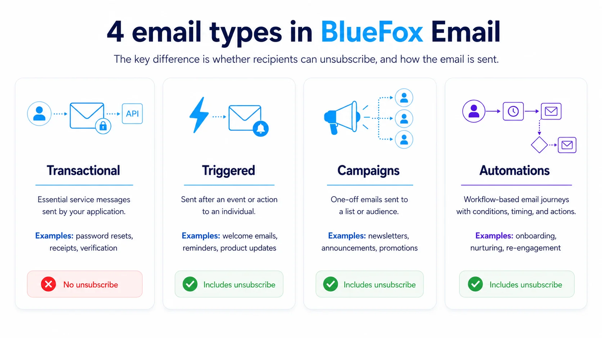
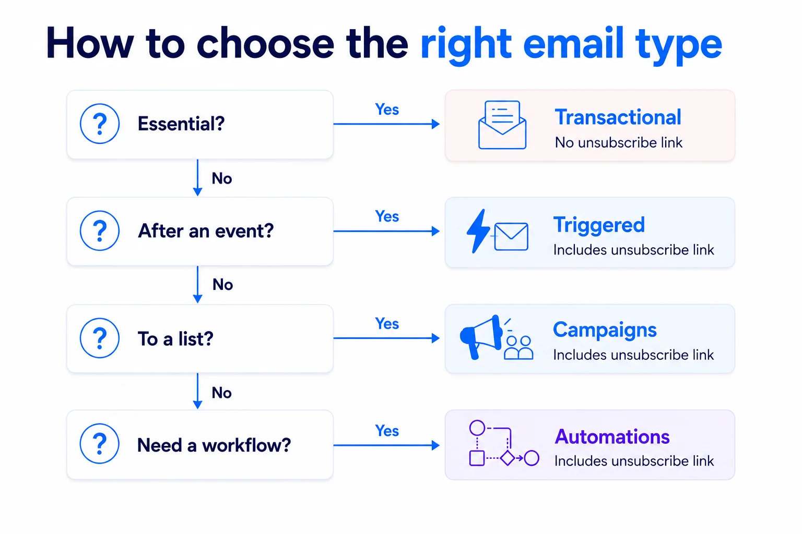

# Transactional, Triggered, Campaign or Automation? Understanding Email Types

Email terminology can be confusing. A welcome email might be described as a product email, a marketing email, a triggered email, or an automated email. These labels are not necessarily contradictory. They often describe different aspects of the same message.

In BlueFox Email, we group emails into four practical categories: transactional emails, triggered emails, campaigns, and automations. The right choice depends on the purpose of the email, whether recipients can unsubscribe, and how the email is sent.

## The most important distinction: can recipients unsubscribe?

The clearest difference between transactional emails and other email types is whether the recipient can opt out.

Transactional emails are essential messages that someone needs in order to complete an action, access their account, or safely use a service. They do not include an unsubscribe link.

Examples include:

* Password reset emails
* Account verification emails
* Receipts and invoices
* Security notifications
* Booking or order confirmations

Triggered emails, campaigns, and emails sent through automations are different. Recipients should be able to unsubscribe from these messages, and BlueFox Email includes unsubscribe handling for them.

This is closely tied to the principle of [permission-based marketing](/email-marketing-concepts/list-management/permission-based-marketing): recipients who can opt out should always be able to.

This gives you a useful starting point:

> If recipients must receive the message, it may be transactional. If they should be able to stop receiving it, it is not transactional.

An email should not be classified as transactional simply because you would prefer recipients not to unsubscribe. Its purpose must genuinely be essential to the service or action requested by the recipient.

## The four types in BlueFox Email

Each of these categories describes how an email is sent and how BlueFox Email handles it. They are not strict content categories: the same welcome email, product update, or reminder could be sent in different ways depending on your workflow.

| Category | Unsubscribe link | Typical trigger | Sent to |
|---|---|---|---|
| Transactional | No | A user action (e.g. password reset, receipt) | One recipient, via API |
| Triggered | Yes | An event or action | One recipient, a group, or a list |
| Campaigns | Yes | Sent manually, one-off | A list or audience |
| Automations | Yes | Trigger plus workflow (conditions, schedule, delay) | Contacts entering the workflow |

### Transactional emails

Transactional emails are essential messages usually sent by an application through an API.

They are often caused by a particular event, such as a purchase, a login attempt, or a password reset request. In the general sense of the word, many transactional emails are also “triggered.”

However, in BlueFox Email, **[Transactional](/docs/projects/transactional-emails)** is a specific sending category. It is intended for messages that do not need an unsubscribe link.

Typical examples include receipts, verification emails, login codes, password resets, and important account alerts.

### Triggered emails

[Triggered emails](/docs/projects/triggered-emails) are emails sent after a specific event or action, while still allowing recipients to unsubscribe.

A triggered email does not have to be sent to only one person. It can be sent to one recipient, a group of recipients, or even an entire list.

For example, you might send a triggered email when:

* A user creates an account
* A customer starts a free trial
* A feature is used for the first time
* A usage limit is reached
* A workspace reaches an important milestone
* A SaaS product generates statistics that should be shared with all users in a workspace

Triggered emails are useful when your application knows that something happened and wants to send a specific message as a result. They are  sent from your backend when an event occurs, but they can also be used for messages that target multiple recipients.

The important distinction is not whether an event caused the email. Both transactional and triggered emails can be event-based. The distinction is whether the message is essential and whether recipients can unsubscribe.

For a deeper look at how triggered emails work in general, see our guide to [triggered emails](/email-marketing-concepts/automation/triggered-emails).

### Campaigns

[Campaigns](/docs/projects/campaigns) are one-off emails sent to a subscriber list or audience.

Newsletters are perhaps the most familiar example, but campaigns can also include:

* Product announcements
* Special offers
* Company updates
* Event invitations
* Educational content
* Customer surveys

A campaign usually sends the same core message to multiple recipients, although the content can still be personalized.

The word “campaign” describes how the email is organized and sent. It does not necessarily describe its content. A campaign might be promotional, educational, product-related, or a mixture of several types.

Unlike a [drip campaign](/email-marketing-concepts/automation/drip-campaigns), a campaign is a one-off send rather than a pre-scheduled sequence.

### Automations

[Automations](/docs/projects/automations) are email flows that run based on triggers, conditions, schedules, delays, or subscriber information.

An automation can contain multiple emails, but it can also contain just a single email if that is what your workflow requires.

Automations can start in different ways, including:

* A contact being added
* A contact being updated
* A specific date or time being reached
* A recurring schedule, such as every Monday at 7 AM
* Other conditions or events defined in your workflow

For example, a welcome automation might include:

1. An introduction immediately after signup
2. A setup guide one day later
3. A feature recommendation after several days
4. A reminder if the user has not completed an important step

Automations are useful for onboarding, lead nurturing, retention, re-engagement, post-purchase follow-ups, scheduled reports, and other lifecycle journeys.

Because automations are based on triggers, automation emails are also triggered in the general sense of the word. The difference is that an automation provides a workflow builder for managing when and how emails are sent, while a triggered email is often used when your application directly decides to send a message.

An email inside an automation may still be described as a welcome email, a product email, a promotional email, or a lifecycle email. Automation simply describes the system responsible for sending it.

Read more about [email automation](/email-marketing-concepts/automation/) as a broader marketing concept.

## Examples of overlap

Email categories overlap because they often describe different characteristics.

A label might tell you:

* Why the email is being sent
* What the email is about
* What caused it to be sent
* Whether it is part of a sequence
* How many recipients receive it
* How the sending process is managed

Here are a few common examples.

### A password reset email

A password reset is caused by an event, so it is triggered in the ordinary sense of the word. However, it is essential and should not contain an unsubscribe link.

In BlueFox Email, it should therefore be sent as a **transactional email**.

### A welcome email

A welcome email might be sent immediately after someone signs up. In that case, it can be sent as a **triggered email**.

If the welcome email is part of a longer onboarding journey with multiple steps and delays, it may instead be part of an **automation**.

Either way, it may also be described as a marketing email, product email, onboarding email, or lifecycle email.

### A product newsletter

A product newsletter might contain feature announcements, educational content, customer stories, and promotional offers.

It is a newsletter because of its recurring format. It is also a product email because of its subject and a marketing email because of its purpose.

In BlueFox Email, it would usually be sent as a **campaign**.

### A trial expiration reminder

A trial expiration reminder may be product-related, promotional, triggered by a date, and part of the customer lifecycle.

It could be sent as a **triggered email** if your application decides when to send it. It could also be sent through an **automation** if it belongs to a larger trial onboarding sequence or a scheduled workflow.

## How to choose

You do not need to find the one perfect label for your email. Instead, choose the BlueFox Email feature that matches how the message should behave.

Ask these questions:

**Is the message essential, with no option to unsubscribe?**
Use a transactional email.

**Do you want to send a specific message after an event, while allowing recipients to unsubscribe?**
Use a triggered email.

**Are you sending a one-off message to a list or audience?**
Use a campaign.

**Do you need a workflow with triggers, schedules, delays, conditions, or multiple steps?**
Use an automation.

The content of these emails may overlap. A product email can be sent as a campaign, a triggered email, or through an automation. A message caused by an event can be either transactional or triggered. An automation email is also triggered, but it uses an automation workflow to control when and how it is sent.

The important thing is not what the email is called in general conversation. It is whether recipients can unsubscribe, what caused the email to be sent, and which BlueFox Email feature best fits your workflow.

If you're building your list before sending your first campaign or triggered email, see our guide on [building a high-quality email list](/posts/how-to-build-a-high-quality-email-list-in-bluefox-email).
