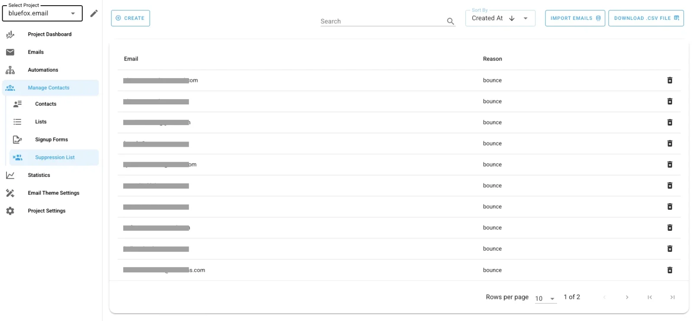
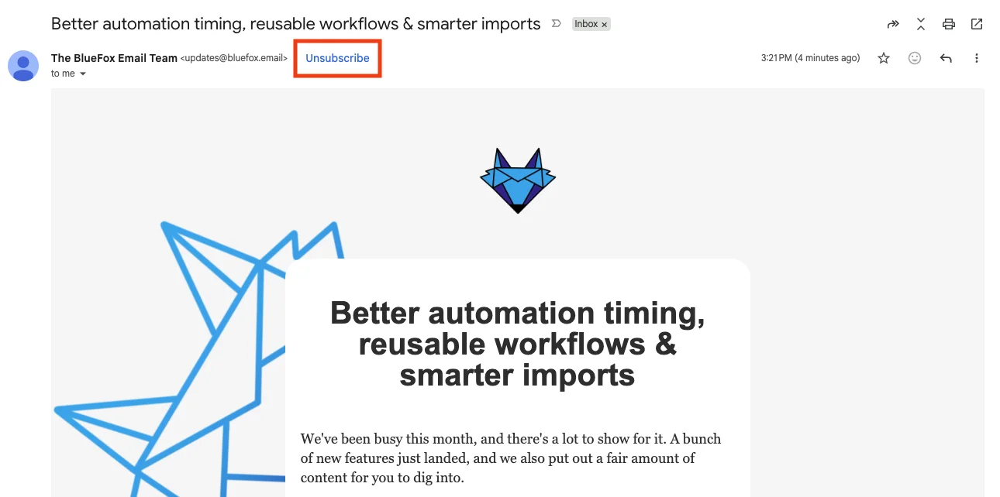
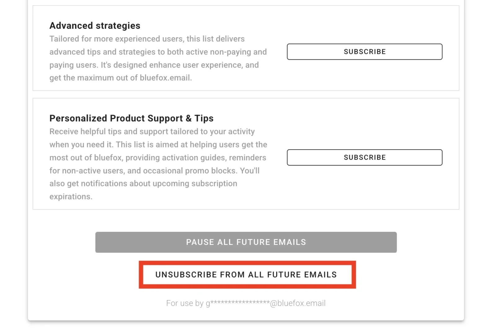
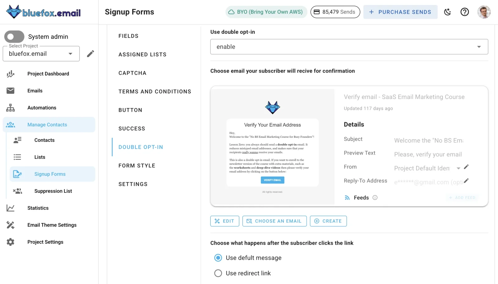
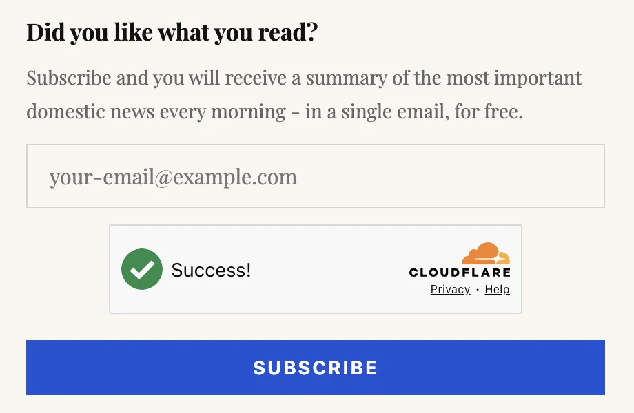
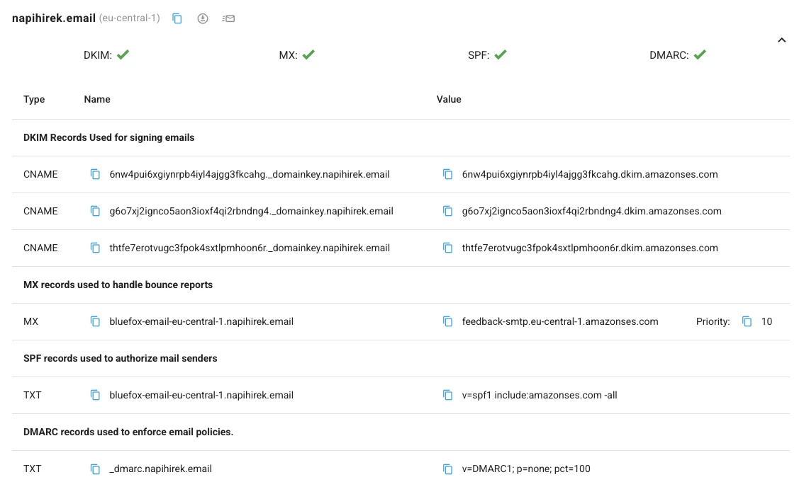
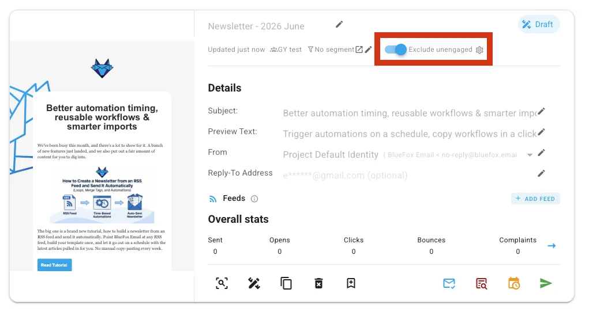
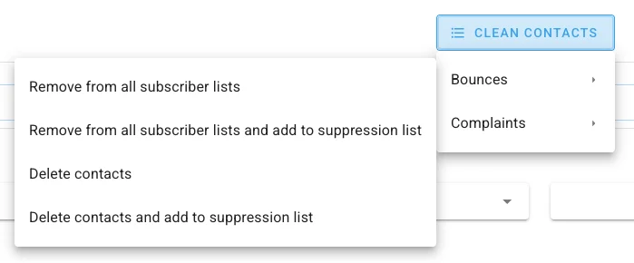
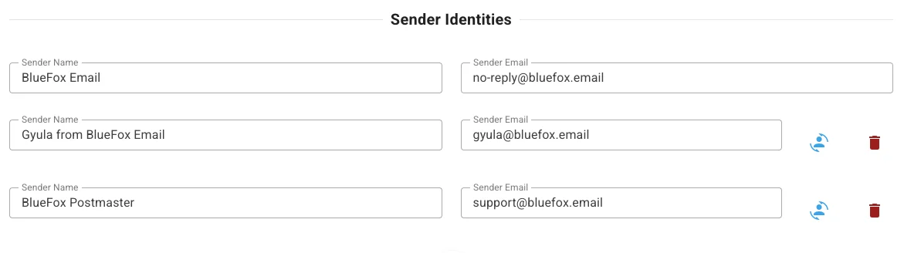

# What BlueFox Email Does for Deliverability, and What You Need to Do

Choosing a reliable email platform is an important part of deliverability. But it is only one part.

An email platform can provide dependable sending infrastructure, process bounces and complaints, handle unsubscribes and help you configure your sending domain correctly. It cannot, however, make recipients want emails they did not ask for.

It also cannot guarantee that every message will reach the inbox.

Email deliverability is a **shared responsibility**. BlueFox Email provides the technical foundation and safeguards for responsible sending. You are responsible for your recipients, your content and the sending behaviour that gradually builds your reputation.

Understanding where that responsibility is divided can help you avoid deliverability problems before they become difficult to fix.

:::tip TL;DR

| BlueFox Email handles | You are responsible for |
|---|---|
| Sending infrastructure, queueing and retries | Who you email, and whether they expect it |
| Bounce and complaint processing, suppression | Content, frequency and targeting |
| DNS record generation for SPF, DKIM, DMARC | Publishing those records with your DNS provider |
| Unsubscribe and subscription-preference handling | Making unsubscribing easy to find and use |
| Signup form protection (double opt-in, CAPTCHA/Turnstile) | Growing your list without purchased or scraped addresses |
| Analytics on sends, bounces, complaints, opens and clicks | Acting on those signals and controlling sending volume |

No platform, including BlueFox, can guarantee inbox placement. It can only provide the technical foundation and refuse to get in your way.

:::

## Delivery and deliverability are not the same

The terms *email delivery* and *email deliverability* are often used interchangeably, but they describe different things.

**Delivery** means that the recipient’s email server accepted the message. The email did not produce a permanent bounce, and the receiving server agreed to process it.

[**Deliverability**](/email-sending-concepts/deliverability) describes what happens after that. The message might be placed in:

* the primary inbox
* a promotions or updates tab
* the spam folder
* another filtered folder.

A successfully delivered email has therefore not necessarily reached the inbox.

BlueFox can report whether a message was accepted, bounced or associated with a complaint. Like every other email platform, it cannot see the exact placement of every email in every recipient’s mailbox.

Inbox placement is determined by the receiving provider. Gmail, Outlook, Yahoo, corporate mail servers and smaller providers all operate their own filtering systems, and they do not publish the complete logic behind them.

They may consider factors such as:

* [domain](/email-sending-concepts/domain-reputation) and [IP reputation](/email-sending-concepts/ip-reputation)
* email [authentication](/email-sending-concepts/email-authentication)
* spam [complaints](/email-sending-concepts/complaints)
* previous interactions with the sender
* sending volume and consistency
* recipient engagement
* message content.

Some of these factors are influenced by BlueFox. Many are controlled by the sender.

## What BlueFox Email does for deliverability

BlueFox provides the application and technical safeguards needed to send email responsibly. Our role is not to promise inbox placement, but to help ensure that avoidable technical and operational problems do not damage your sending reputation.

### Reliable email processing and queueing

When you send a [transactional email, triggered email, campaign or automation email](/posts/transactional-triggered-campaign-or-automation-understanding-email-types), BlueFox processes the request and submits the message through the configured sending infrastructure.

The queue helps manage sending reliably instead of requiring your application to deliver every message directly and immediately. It also handles transient failures and automatically retries delivery when a message cannot be sent on the first attempt.

This is particularly important for transactional email. Your application should not need to manage temporary sending failures, provider response times or bursts of email traffic itself.

### Bounce and complaint processing

Some emails cannot be delivered, and some recipients mark a message as spam instead of unsubscribing.

A [**hard bounce**](/email-sending-concepts/hard-bounce) usually indicates a permanent problem, such as an address that does not exist. A [**complaint**](/email-sending-concepts/complaints) is generated when a recipient reports a message as spam, and is one of the clearest negative signals a sender can produce. Continuing to send to addresses that repeatedly bounce, or that have complained, can damage your reputation and make your list appear poorly maintained.

BlueFox processes both bounce and complaint events from the sending infrastructure and records them in your email analytics. We may also include this activity in **digest emails**, so you can stay informed about delivery issues without needing to monitor events in real time.

Bounced and complained addresses are always added to your project's [**suppression list**](/docs/projects/suppression-list) automatically, regardless of any other setting, so BlueFox will not send to them again.

On top of that, you can configure what else happens to the contact under **Project Settings → Bounces & Complaints setup**:

* **Off** – leave the contact on its subscriber lists
* **Remove from all subscriber lists** – the default
* **Delete contacts** – remove the contact from the project entirely.

This mainly matters if you sync contacts to another system, such as a CRM, so they are not emailed from there by mistake, or if you ever migrate away from BlueFox, since your exported list will already be clean.

This protects both the recipient and your sending reputation, but it happens after the fact. The better approach is to avoid bounces and complaints in the first place, by collecting addresses carefully and sending relevant emails only to people who expect them.

### Suppression handling

A suppression list prevents messages from being sent to addresses that should no longer be contacted. You can find it under your project's **Manage Contacts → Suppression List**.

This commonly includes recipients who:

* produced a permanent bounce
* submitted a spam complaint

Suppression handling helps prevent repeated delivery attempts to problematic addresses. Without it, an automated system might continue sending to the same invalid or complaining recipient every time a campaign or workflow runs.

BlueFox performs this check as part of the sending process.

You can also **import** and **export** your suppression list directly from this screen. Importing is useful when you're migrating from another platform and already have a list of addresses that bounced or complained there, so BlueFox never sends to them in the first place. Exporting matters for the same reason in reverse: if you move away from BlueFox, or need to keep another system (a CRM, a second ESP) in sync, you can carry your suppression history with you instead of rebuilding it from scratch and risking a bad first send.

### Unsubscribe support

Marketing and other non-transactional emails should give recipients a clear way to stop receiving them.

BlueFox supports unsubscribe handling for campaigns, triggered emails and automations. We also support [**one-click unsubscribe**](/email-sending-concepts/one-click-unsubscribe) mechanisms that compatible mailbox providers can expose directly in their interface, which unsubscribes the recipient from the specific list or sending stream they are currently receiving emails from.

One-click unsubscribe is a button that mailbox providers such as Gmail and Outlook display directly next to the sender, outside the email itself, so the recipient never has to open the message to leave a list. It relies on the `List-Unsubscribe` and `List-Unsubscribe-Post` headers defined in [RFC 8058](https://www.rfc-editor.org/rfc/rfc8058), which BlueFox adds to eligible emails automatically.

In addition, we provide an **“unsubscribe from all lists”** option, allowing recipients to fully opt out of all future marketing communications in a single action. For users who may not want to leave permanently, we also offer a **“pause subscription”** option, which lets recipients temporarily stop receiving emails and resume at a later time without fully unsubscribing.

This is our built-in **subscription preferences page**, which opens automatically when a recipient clicks the unsubscribe link in an email we sent. Recipients can resubscribe to a specific list, pause all future emails, or unsubscribe from everything in one click, without needing to contact you directly.

Making unsubscribing easy is not merely a legal or user-experience concern. It also protects deliverability.

When someone no longer wants your emails, a visible unsubscribe option gives them a safe way to leave. When the option is hidden, confusing or unreliable, the recipient may use the spam button instead.

A spam complaint is considerably more harmful to your reputation than an unsubscribe.

Transactional messages are treated differently because they are required to complete or document an action, such as resetting a password, confirming a purchase or delivering a receipt. They should not be used to bypass unsubscribe requirements for promotional content.

### Protecting your signup forms

BlueFox provides **double opt-in** support for email signups. You can require subscribers to confirm their email address before being added to your list, helping ensure that only valid and intentional signups are collected.

To further protect your forms from bots and low-quality submissions, you can enable **CAPTCHA** or **Cloudflare Turnstile** on your signup forms. Turnstile is the recommended option, as it provides a frictionless experience for real users while effectively blocking automated abuse.

You don't have to pick one. Double opt-in and CAPTCHA/Turnstile are separate tabs under the same [**Signup Forms**](/docs/projects/forms-and-pages) settings, so you can turn both on for the same form, confirming that a signup is submitted by a real human and that they genuinely want to be on your list.

### Sender identity and authentication setup

BlueFox allows you to configure the **sender identities** used by your projects.

Email authentication normally requires DNS records to be added to the domain. BlueFox can provide the records and verify the configuration, but only the domain owner or DNS administrator can publish them. You can find these records under **Project Settings → Verified Domains**.

Authentication helps receiving providers determine whether a message was genuinely authorised by the domain it claims to represent.

The main mechanisms involved are:

* [**SPF**](/email-sending-concepts/spf), which identifies servers authorised to send for a domain
* [**DKIM**](/email-sending-concepts/dkim), which adds a cryptographic signature to the message
* [**DMARC**](/email-sending-concepts/dmarc), which connects domain authentication with reporting and domain-level policy.

For a deeper walkthrough of how these three work together, with real examples, see [How SPF, DKIM, and DMARC Actually Work](/posts/how-spf-dkim-and-dmarc-actually-work-with-real-examples).

Authentication does not guarantee inbox placement. It establishes a trustworthy technical identity on which reputation can be built.

A perfectly authenticated sender can still reach spam if recipients consistently reject or ignore the emails.

### Analytics and visibility

BlueFox provides [analytics](/docs/projects/dashboard) for important email events, including sends, bounces, complaints, opens and clicks.

<AgencyAnalytics
  default-tab="hourly"
  :show-header="false"
  :show-cta="false"
/>

These signals can help you identify problems, but they need to be interpreted carefully.

For example:

* a sudden increase in bounces may indicate poor list quality
* complaints may indicate unclear consent or irrelevant content
* falling clicks may indicate declining interest
* an unusual drop in double opt-in confirmations may indicate delivery problems
* open tracking may be affected by privacy features and automatic image loading.

No single metric provides a complete view of deliverability. Trends across several signals are usually more useful than one isolated number.

### Dedicated IP addresses

BlueFox also supports the use of dedicated IP addresses for sending email.

A **dedicated IP** means that your email traffic is sent from an IP address used only by your account. This can be useful in specific situations, but it is not automatically better for deliverability.

Dedicated IPs are often most appropriate for **higher sending volumes**, where you generate enough consistent traffic to build and maintain a stable sending reputation on your own. In these cases, a dedicated IP can help avoid the effects of “noisy neighbours” on shared infrastructure, where other senders’ behaviour might indirectly influence reputation signals.

However, for **smaller lists or lower-volume senders**, a shared IP environment is often the better choice. Shared IPs benefit from pooled reputation across many senders, which can provide more stable performance when individual sending volumes are not yet large enough to establish a strong standalone reputation.

Dedicated IPs can also be useful in **enterprise or regulated environments**, where receiving systems apply strict filtering rules. In some cases, organisations may require traffic to come from specific, known IP addresses so they can explicitly allowlist them within internal security or email filtering systems.

It is important to note that dedicated IPs also introduce additional responsibility. Because reputation is no longer shared, your sending behaviour directly determines the [IP reputation](/email-sending-concepts/ip-reputation) of that address. This typically requires:

* a careful warm-up process
* consistent sending patterns
* ongoing monitoring of engagement and complaint rates.

BlueFox can support assigning and configuring dedicated IPs where appropriate, but the same deliverability principles still apply: recipient quality, consent and engagement remain the primary drivers of inbox placement.

## What you need to do

BlueFox can provide a strong technical foundation, but the sender creates most of the signals that determine long-term reputation.

BlueFox can reliably process the message you give us. It cannot make an unwanted email wanted.

### Only email people who expect to hear from you

The quality of a recipient list starts with how the addresses were collected.

People should understand:

* who will email them
* what kind of content they will receive
* approximately how often they will receive it
* why they are receiving it.

Purchased, scraped or indirectly acquired lists are especially dangerous. Even when the addresses are technically valid, the recipients may not recognise the sender or remember giving permission.

This leads to low engagement, unsubscribes and complaints.

Double opt-in can be particularly useful because it requires recipients to confirm that they control the address and genuinely want the emails. It can also provide an early indication of whether confirmation emails are reaching recipients successfully.

For a practical walkthrough of collecting addresses the right way, see [How to Build a High-Quality Email List in BlueFox Email](/posts/how-to-build-a-high-quality-email-list-in-bluefox-email).

### Configure your domain authentication

BlueFox can generate or display the required configuration, but you still need to add the records to your DNS provider.

It is a must in BlueFox Email, not an option. It is required to obtain [production access](/posts/how-to-get-and-maintain-production-access-to-amazon-ses) and to send emails from your own domain.

After publishing the records, ensure they are correctly set up and remain valid when making DNS or infrastructure changes.

BlueFox also provides [free deliverability tools](https://bluefox.email/tools/deliverability/) you can use to verify your setup.

### Protect your list quality

A list becomes less useful over time if it is not maintained.

Addresses may be abandoned, mistyped or converted into recycled accounts. Recipients who were interested two years ago may no longer recognise your brand.

You should monitor:

* bounce trends
* complaints
* unsubscribes
* clicks and other meaningful interactions
* subscribers who have shown no activity for a long period.

Do not continue sending indefinitely simply because an address has not bounced.

For many businesses, activity outside email can also be relevant. A customer who regularly uses your application may still be interested even when open tracking shows no activity.

Before importing older or previously collected lists into BlueFox Email, it is strongly recommended to clean and validate them first using an email verification service (such as ZeroBounce or similar). This is especially important for legacy lists that may contain a high proportion of business email addresses, where turnover and address changes are more common. Cleaning your list beforehand helps remove invalid, risky or inactive addresses and reduces the likelihood of bounces and reputation issues from the very first send.

BlueFox also provides an **“exclude unengaged contacts”** feature, which allows you to exclude recipients who have not interacted with your emails over a defined period. This helps reduce unnecessary sending to inactive users and can improve overall engagement and deliverability signals over time.

This is a per-email toggle, available on campaigns, triggered emails and automations. It is not available for transactional emails, since those are tied to a specific action the recipient just took, such as a password reset or a receipt, and need to reach them regardless of how engaged they've been with your other emails.

In addition to this, BlueFox includes list cleaning capabilities that allow you to **mass-remove bounced and complained addresses directly from your contact lists**. While these addresses are already added to your suppression list (so they will not be emailed again through BlueFox), removing them from your active lists is still important for long-term list hygiene.

You'll find this **Clean Contacts** action in two places: on the analytics page of any email (transactional, triggered, campaign or automation), scoped to that email's own bounces and complaints, and directly on your [**Contacts**](/docs/projects/contacts) tab, where it applies across the whole project.

This is a manual, on-demand action, unlike the automatic list-removal behaviour for bounces and complaints [described earlier](#bounce-and-complaint-processing). If you already have that set to **Remove from all subscriber lists** or **Delete contacts**, new bounces and complaints are handled automatically going forward, and you may not need to run Clean Contacts at all. It is mainly useful for cleaning up contacts that bounced or complained before you turned that setting on, or while it was set to **Off**.

Actively removing bounced and complained contacts from your lists, rather than relying on suppression alone, is especially useful if you:

* sync contacts across multiple systems
* maintain the same audience in external CRMs or marketing tools
* or eventually decide to switch to another email provider.

A synced CRM, another marketing tool, or a future ESP has no knowledge of BlueFox's suppression list, and may happily email these addresses anyway. Removing them from your lists keeps your contact data clean everywhere they're used, not just inside BlueFox.

### Control your sending volume

A new domain does not have an established sending history.

Sending a very large campaign immediately from a new domain can appear unusual to receiving providers. It is generally better to begin with smaller volumes and your most engaged recipients, then increase sending gradually as positive history develops.

The same principle applies to established senders.

A sudden and unexplained increase in volume can attract additional filtering, especially if the new volume comes from an older or lower-quality segment of the list.

This is closely related to [segmentation](/docs/projects/segments). Instead of treating your entire list as a single audience, it is often better to group recipients based on engagement, recency, or intent. Highly engaged users can safely receive emails earlier in a warm-up or reactivation phase, while less active or older segments may require more careful reintroduction or different messaging altogether.

There is no universal warm-up schedule that guarantees success. Recipient quality, engagement, and how well your segments reflect real user behaviour matter more than blindly following a table of daily sending limits.

### Send relevant content at a sensible frequency

Subscribers usually join a list with a particular expectation.

A person who requested a product update may not expect daily promotional messages. Someone who registered for an account may not have agreed to receive a general newsletter.

Your content, frequency and targeting should match the reason the person subscribed.

Segmenting recipients can often improve results more effectively than trying to optimise every message for the entire list.

Sending fewer, more relevant emails is usually better than increasing frequency simply to generate more impressions.

### Make the sender recognisable

Recipients should be able to identify the sender immediately.

You can configure the sender name and sending email address in **Project settings → Sending setup**.

Use a sender name and address that are:

* consistent
* connected to the brand or product
* appropriate for the type of message
* able to receive replies where replies are expected.

Frequent, unexplained changes to sender names or domains can make legitimate emails look suspicious.

See [Sender Name & Email Address: Building Trust Before the Open](/posts/sender-name-and-email-address-build-trust-before-the-open) for more on how this affects engagement.

### Make unsubscribing easy

Do not hide the unsubscribe link, reduce its contrast or make recipients complete a complicated process.

An unsubscribe is a normal part of maintaining a healthy list. It is preferable to a spam complaint and usually preferable to repeatedly emailing someone who has lost interest.

You can also offer options such as reducing frequency, pausing emails or selecting specific topics. These options should complement a straightforward unsubscribe process, not replace it.

In addition, make use of list names and descriptions on your subscription preferences page. Clear, recognisable list names help recipients understand what they are subscribed to, while short descriptions can remind them why they signed up and what kind of content they can expect. This context often reduces confusion and helps users make informed choices instead of unsubscribing entirely.

### Use transactional email responsibly

[Transactional emails](/docs/projects/transactional-emails) are associated with an action or an existing relationship. Examples include password resets, receipts, account notifications and service messages.

They should not be used as a way to send promotional content to people who unsubscribed from marketing.

Mixing unexpected promotions into essential service messages can reduce trust and may damage the reputation of a stream that your users depend on.

In some cases, separating transactional and marketing traffic by subdomain or sending configuration can reduce the risk of one type affecting the other.

## BlueFox-managed infrastructure and BYO Amazon SES

BlueFox supports two approaches to sending infrastructure:

* sending through **BlueFox-managed infrastructure**
* connecting your own Amazon SES account (**BYO Amazon SES**).

The BlueFox application experience remains similar, but the responsibility for the underlying sending environment is different.

### Sending with BlueFox-managed infrastructure

When you use BlueFox-managed sending, BlueFox operates and maintains more of the underlying email-delivery environment.

You do not need to create and manage your own Amazon SES account for the project. BlueFox handles the connection between the application and the sending infrastructure, as well as the processing of delivery events.

You are still responsible for:

* your sending domain
* the DNS records required for authentication
* your recipient lists and consent
* your content
* your sending frequency
* the reputation created by your activity.

Managed infrastructure does not mean that every customer automatically receives the same deliverability.

Mailbox providers can evaluate the sending domain, content and recipient response in addition to the underlying infrastructure. A sender who generates complaints or sends to poor-quality lists can still develop deliverability problems.

::: warning
Every new project starts in **Sandbox mode**, limited to **1 email per second** and **100 emails per day**. You'll need to request production access before sending at real volume.

To keep production access on BlueFox-managed infrastructure, you need to keep your bounce rate below **2.5%** and your complaint rate below **0.05%**. BlueFox monitors both continuously and alerts you if you are approaching these thresholds.

You may also start with a lower sending rate and a lower monthly sending limit, especially on a new domain. This is not a restriction to work around. It is part of the warm-up process that lets mailbox providers build up trust in your domain gradually, and limits are increased as you establish a positive sending history.
:::

### Bringing your own Amazon SES account

With BYO Amazon SES, BlueFox connects to an SES account that you own and manage.

[BlueFox continues to provide the application layer](/posts/bluefox-email-is-an-amazon-ses-wrapper), including:

* email creation
* [transactional](/docs/projects/transactional-emails) and [triggered](/docs/projects/triggered-emails) sending
* [campaigns](/docs/projects/campaigns)
* subscriber management
* queueing and orchestration
* analytics
* bounce and complaint processing
* unsubscribe handling.

You have more direct control over the sending infrastructure, but also more responsibility for it.

This includes:

* requesting and maintaining [SES production access](/posts/how-to-get-and-maintain-production-access-to-amazon-ses)
* monitoring account-level reputation
* managing sending quotas
* selecting AWS regions
* handling AWS account or enforcement issues
* deciding whether dedicated IP infrastructure is appropriate
* maintaining the necessary SES configuration
* setting up AWS SNS so bounce and complaint notifications are reported back to BlueFox (a **CloudFormation script** is provided to automate this). See [How to Handle Bounces and Complaints with AWS SES and SNS](/posts/how-to-handle-bounces-and-complaints-with-aws-ses-and-sns) for the full walkthrough.

BYO Amazon SES is not automatically a deliverability upgrade.

Its main advantages are ownership, visibility and control. Whether it produces good deliverability still depends heavily on authentication, recipient quality and sending behaviour.

Pricing is significantly better for those who are comfortable managing their own Amazon SES account. [See BYO pricing](https://bluefox.email/byo-amazon-ses-pricing)

## What neither BlueFox nor any email provider can guarantee

No responsible email provider can guarantee that every message will reach the inbox.

An email platform cannot guarantee:

* inbox placement for every recipient
* a particular open or click rate
* identical placement across mailbox providers
* protection from filtering after sending unwanted email
* a good reputation for a purchased or poorly maintained list
* immediate recovery after a serious deliverability problem.

Mailbox providers make their own placement decisions, often at the individual-recipient level.

Two people using the same mailbox provider may see the same campaign placed differently because their previous interactions with the sender are different.

Promises such as “100% inbox placement” should therefore be treated with caution.

The objective is not to find a platform that can bypass filtering. It is to establish a legitimate technical identity, send emails people expect and consistently generate positive recipient signals.

## Get independent visibility with Gmail Postmaster Tools

BlueFox Email and Amazon SES can tell you whether a message bounced or generated a complaint through the sending platform itself. What they cannot see is how Gmail privately scores your domain, or how many recipients hit "Report spam."

This matters more for Gmail than for most mailbox providers. Many ISPs run a traditional **feedback loop (FBL)** that reports individual spam complaints back to the sender in something close to real time. Gmail does not work this way. It has a feedback loop of sorts, but it only shares aggregate spam-rate percentages, only for identifiers with enough volume, only for `@gmail.com` recipients, and only once you have verified your domain in Postmaster Tools and signed it with DKIM or published it in your SPF record. There is no per-recipient complaint data, and for a lot of senders sending below Gmail's volume threshold, there is no complaint feedback from Gmail at all.

[Gmail Postmaster Tools](https://postmaster.google.com) is the practical way to close that gap. Once you verify your sending domain, it reports data directly from Gmail, including:

* domain and IP reputation
* spam rate, as seen by Gmail rather than inferred from complaints
* authentication status for SPF, DKIM and DMARC
* encryption and delivery error trends.

This is optional, and it does not change how BlueFox Email sends your email. Its value is that it gives you independent, third-party confirmation of what a major mailbox provider actually thinks of your sending, rather than relying solely on the bounce and complaint data your platform reports back to you. If a large share of your audience is on Gmail, it is worth the few minutes it takes to set up.

For a deeper look at why this creates a real blind spot in your own analytics, see [Zero Spam Complaints? Gmail May Tell a Different Story](/posts/gmail-spam-complaints-google-postmaster-tools).

## A practical deliverability checklist

Before increasing your sending volume, check that you are doing the following:

* Authenticate your sending domain with SPF, DKIM and DMARC.
* Send only to recipients who expect your emails.
* Consider double opt-in for new lists and sending domains.
* Begin new sending streams with smaller, engaged audiences.
* Avoid sudden volume increases.
* Monitor bounces and complaints.
* Investigate declining clicks and other engagement signals.
* Remove or reduce sending to persistently inactive recipients.
* Make unsubscribing easy.
* Keep transactional and marketing purposes clearly separated.
* Use a recognisable sender name and address.
* Protect your forms from bots and invalid submissions.
* Never purchase or scrape recipient lists.

These practices cannot guarantee inbox placement, but they create the conditions in which a healthy reputation can develop.

## Deliverability is a shared responsibility

BlueFox handles the technical side: processing, authentication, bounces, complaints and unsubscribes. You handle the human side: who you email, why, and whether they actually want to hear from you.

A reliable platform cannot compensate for an unwanted email programme, and good content and consent cannot compensate for broken authentication or poor technical handling. When both sides hold up their end, you have the best possible foundation for reaching the people who genuinely want to hear from you.

