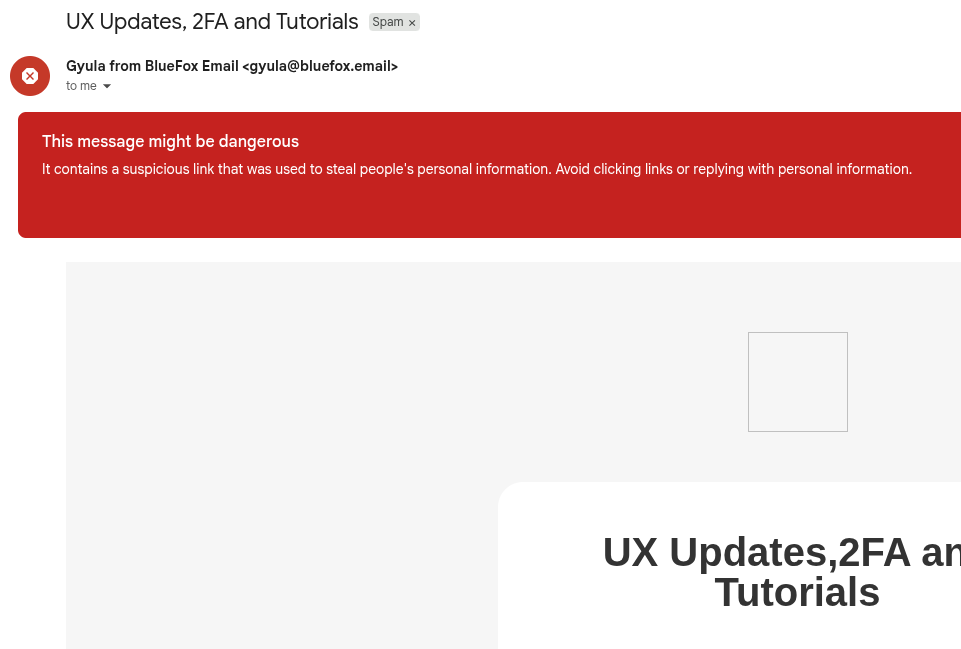

# Why Shortened Links Send Your Emails to Spam

**Our emails are landing in spam, why?**

So, something very interesting happened recently. One of our team members was writing a monthly newsletter email, and now, since we are publishing content to YouTube regularly, he decided to share it in our newsletter. So he copied the link from YouTube and pasted it into the email and sent the draft. Guess what happened? The email went to spam.

This was surprising because we definitely have a good sender reputation and we have been sending emails for a while now (if you are a user of BlueFox Email you would know, signup for interesting content). So we started investigating, and since that was the only link in the email, we were even more shocked. After some digging, we found out that the link was in the format of `youtu.be` instead of `youtube.com`. Turns out, that team member who wrote the email wasn't aware that link shorteners are a no-go for Gmail. We immediately realized the issue, shortened links are treated as high-risk by Gmail's spam filters. In this article, we'll explore why Gmail flags shortened links and how using full, canonical URLs can improve email deliverability.

## Why Shortened Links Look Suspicious to Gmail

Link shorteners allow users to create compact URLs that redirect to longer, original links. While convenient for sharing, they can be abused by spammers and phishers to hide malicious destinations. Gmail's spam filters are designed to identify and flag potentially risky content, and shortened links often raise red flags because they obscure the final destination, making it harder for Gmail to assess the trustworthiness of the link.

### The Double Redirect Problem

Here's something important to understand: one redirect is usually acceptable. Most ESPs (Email Service Providers) use a single redirect to track link clicks, when you click a link, it redirects through their tracking system before sending you to the final destination. This is standard practice and generally not flagged.

However, a **double redirect** is a red flag. When you use a link shortener in your email, you're adding a second redirect on top of your ESP's tracking redirect. This creates a suspicious pattern that spam filters don't like. Double redirects are often associated with phishing attempts and malicious campaigns.

### The Security Risk: Links Can Be Changed

Shortened links are generally suspicious for another critical reason, what would prevent an attacker from changing the URL behind the shortened link later on? Here's how this attack could work:

1. An attacker sends an email with a shortened link
2. Spam filters check the link and find that the original URL is legitimate
3. The email passes through to the inbox
4. **After** the spam checking happens, the attacker changes the destination URL to a malicious site

This means recipients could click on what appeared to be a safe link during scanning, but actually get redirected to a phishing site or malware. This is a real security concern, and it's one of the main reasons why Gmail and other email providers treat shortened links with extra scrutiny.

This is especially true for lesser-known or frequently abused shortener domains, which may have a history of being used in spam campaigns. Even reputable shorteners can be flagged if they are associated with a high volume of spammy activity.

## What Should You Do Instead?

The solution is pretty straightforward, always use full, canonical URLs in your emails. 

Instead of copying links directly from mobile apps or using shortened versions, take a moment to get the full URL. For YouTube videos, that means using `youtube.com/watch?v=...` instead of `youtu.be/...`. For other content, avoid services like `bit.ly`, `tinyurl.com`, or any other URL shortener.

Yes, full URLs are longer and might look less "clean" in your email, but that's exactly the point. Clear, direct links help Gmail evaluate your emails more confidently. The transparency is what builds trust with spam filters and ultimately supports better inbox placement.

So next time you're drafting a newsletter, double-check your links. A few extra characters in your URL could be the difference between landing in the inbox and ending up in spam.
